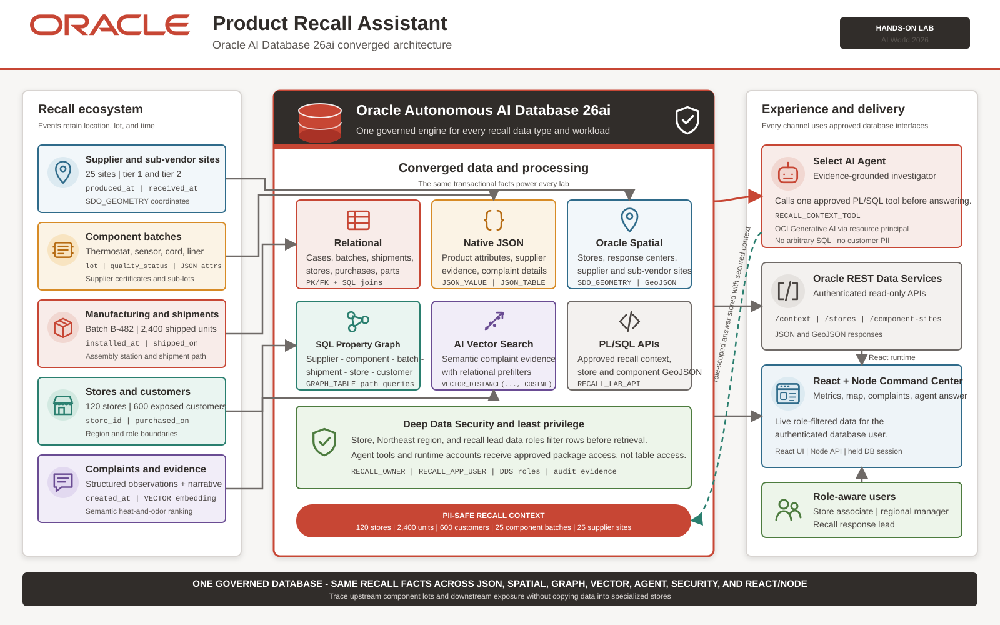

# Product Recall Assistant: Identify Exposure Fast

## Introduction

Product recalls demand fast answers from trusted data. A quality report has flagged HeatPro Countertop Cooker batch `B-482` for overheating, electrical odor, and early shutoff. The team must act while the records sit across component lots, supplier sites, stores, purchases, and customer complaints.

Eight people handle this recall, and each has a different job. One decides whether to open the case. Another plans the field response. Others trace suppliers, sort complaints, build the assistant, publish the data, set access rules, and bring the work into one application. Each lab starts with one person’s problem and connects it to a feature in Oracle AI Database 26ai.

### Eight Professionals, Eight Challenges

| Professional | Challenge | Outcome to achieve | Oracle AI Database feature |
|---|---|---|---|
| Maya Chen, Product Safety Investigator | A report is still marked `REPORTED`, but three warning signs need review before the team changes its status. | Open a traceable case and measure the full extent of the B-482 recall. | Native JSON, `JSON_TRANSFORM`, `JSON_TABLE`, and `JSON_VALUE` |
| Elena Ruiz, Field Operations Planner | Field teams must reach 120 stores, but raw coordinates do not show which response center should handle each one. | Find nearby centers, assign each store, and prepare location data for the field team. | Oracle Spatial, indexed `SDO_GEOMETRY`, and GeoJSON |
| Jordan Okafor, Supplier Quality Manager | A batch number does not show whether the problem follows a component lot or a sub-vendor, or how it can reach customers. | Trace suspect lots to suppliers and connect them to downstream exposure. | SQL Property Graph and `GRAPH_TABLE` |
| Priya Nair, Customer Signals Analyst | Customers describe the same thermal problem in different words, while other complaints concern packaging or unrelated products. | Rank the strongest B-482 complaints and read their structured details together. | AI Vector Search with native JSON |
| Marcus Lee, Recall Desk Coordinator | The desk gets urgent questions faster than people can open separate reports, and a language model might guess. | Give investigators quick answers based only on approved recall tools. | Select AI Agent and PL/SQL tools |
| Sofia Alvarez, Integration Engineer | Other applications need store and supplier-site data, but table credentials could expose too much. | Publish a stable, read-only interface without sharing the database schema. | ORDS and an approved database package |
| Daniel Brooks, Data Governance Lead | A store associate, regional manager, and recall lead need different levels of detail. | Make one retrieval return only the rows each role may see. | Deep Data Security and role-based data grants |
| Aisha Rahman, Recall Response Product Owner | The response team needs product, location, supplier, complaint, and assistant data in one place without losing user access rules. | Bring the work into one command center that follows the database session. | Oracle AI Database data services and database-session security |

This workshop uses relational data, native JSON, Oracle Spatial, SQL property graph queries, AI Vector Search, Select AI Agent, ORDS, and database access controls. Each feature solves a different part of the recall: case review, location planning, relationship tracing, complaint matching, trusted answers, data sharing, access control, and application delivery.

### The Business User’s Outcome

When this work reaches the application, a business user should not need to know which query produced an answer. The user signs in, sees the part of the recall that belongs to the job, and can act from the same set of current data.

- The store associate sees Store 101, its units and exposed-customer count, the complaints that relate to that store, and the first action to take.
- The Northeast manager sees the regional store footprint, response-center coverage, regional complaint patterns, supplier paths, and the priorities for the field team.
- The recall response lead sees the full 120-store, 2,400-unit, and 600-customer scope, the component and supplier relationships, and the questions that need an enterprise-wide answer.

The answer changes with the signed-in person because the database applies that person’s access rules before the application retrieves data. Oracle AI Database 26ai turns the work from separate SQL tasks into a recall application that helps each role decide what to do next.

### Solution Architecture

The database stores recall facts in one Oracle AI Database 26ai environment. It exposes approved interfaces and applies the signed-in user’s access rules.

The database keeps admin work, data ownership, application calls, and business-user access separate. `ADMIN` creates the accounts and platform grants. `RECALL_OWNER` owns the application objects. `RECALL_APP_USER` can call only approved interfaces. Later, Deep Data Security gives store, regional, and recall-lead users different data grants. The final application agent receives one document assembled from product JSON, complaint and vector data, spatial results, and graph paths that the signed-in user may see. The same agent answers differently because each user session supplies different data.

Estimated Workshop Time: 120 minutes

### Objectives

By the end of this workshop, you can:

- Use JSON, Spatial, Graph, Vector Search, Select AI Agent, security controls, and a React/Node application to investigate a product recall in one database.
- Track component lots, supplier sites, affected stores, customer exposure, and complaints through the same recall scenario.
- Give an AI agent approved JSON, vector, spatial, and graph data without granting it SQL access.
- Publish and test the workflow through authenticated ORDS APIs.
- Compare answers for different roles and inspect the audit record.
- Deploy the React/Node command center that brings the workflow together.

### Workshop Flow

| Segment | Time |
|---|---:|
| Scenario and architecture | 10 minutes |
| Lab 1: Decide whether to open the case with JSON | 10 minutes |
| Lab 2: Put help where it is needed with Oracle Spatial | 10 minutes |
| Lab 3: Find the source and the reach with SQL Property Graph | 10 minutes |
| Lab 4: Hear the signal in the noise with AI Vector Search | 10 minutes |
| Lab 5: Answer from approved data using Select AI Agent | 18 minutes |
| Lab 6: Put trusted facts in reach with ORDS | 10 minutes |
| Lab 7: Show each role only what it needs with Deep Data Security | 12 minutes |
| Lab 8: Turn recall data into coordinated action with the React command center | 22 minutes |
| Discussion and questions | 14 minutes |

### Before You Start

The workshop environment is prepared before you begin. The B-482 data and the database capabilities used in the labs are available from the start. Use the identity named in each lab when you run its SQL or application step.

Bring basic familiarity with SQL and REST concepts. Lab 8 also uses a React/Node application and a workstation that can connect to the database.

## Acknowledgements

- **Author:** Oracle AI World 2026 Product Recall Assistant workshop team
- **Last updated:** July 2026
