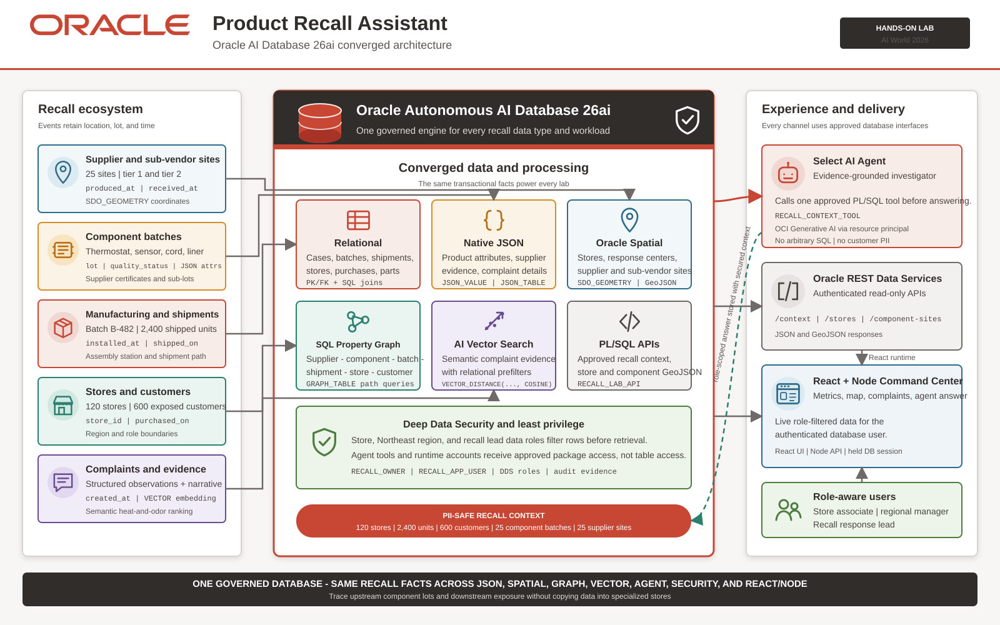

# Product Recall Assistant: Automate Secure Returns Decisions

## Introduction

Kevin runs the business side of the HeatPro returns process. The current process is slow and complex. Teams must assemble evidence, decide who should act, and make sure each person sees only the information they need. Customers wait while those handoffs happen, and Kevin knows the process is not good enough.

When batch `B-482` is linked to overheating, electrical odor, and early shutoff, Kevin has had enough. The new issue makes the cost of delay clear: the team needs a secure, repeatable way to decide what to do, route returns and response work, and answer questions from the application they use. Kevin does not need to become a database specialist. He needs the process to work.

Kevin brings in David, the solution architect, and Tim, the Oracle AI Database developer. David proposes one connected Oracle AI Database workflow instead of a chain of exports, point services, and manual handoffs. The same database keeps the recall report, operational records, locations, supplier relationships, complaint evidence, governed agent tools, APIs, and access rules connected. Each component has a clear job, and the database applies authorization before information reaches a person or an agent.

Tim builds David's design in eight steps. He starts with the reported evidence, then adds location planning, relationship tracing, semantic complaint matching, a governed assistant, APIs, database-enforced access, and the role-aware application. Lab 8 brings the application and governed customer-response campaign together. The SQL in each lab is Tim's implementation of David's design and the evidence Kevin needs to automate the returns response safely.

### Kevin's Business Outcome

Kevin wants a returns-response application that answers practical questions without exposing customer data or relying on someone to assemble evidence by hand:

- Should the team open the B-482 case, and what is its scope?
- Which stores need help, and which response center should support each one?
- Which component lot and supplier path need investigation?
- Which complaints indicate the same thermal risk?
- What can a store user, regional manager, or recall lead see and act on?
- How can the recall lead approve a customer response and prepare auditable refund intents?

At the end of the workshop, Kevin can use one command center to work with current, role-appropriate evidence. A store user sees Store 101 and its next action. A Northeast manager sees the regional footprint and response coverage. A recall lead sees the full 120-store, 2,400-unit, 600-customer scope. The application does not choose that scope. Oracle AI Database applies it from the signed-in identity.

In Lab 8, the recall lead uses that same role-aware application to authorize customer contact, review a reusable notice draft, and approve auditable refund intents. The workshop prepares these actions for downstream review; it does not send notices or move money.

### David's Architecture

David maps Kevin's questions to one connected design:

| Kevin needs | David's design | Tim implements with |
|---|---|---|
| A traceable decision to open the case | Keep the source report with stable operational records | Native JSON and SQL |
| A field-ready return response | Calculate proximity and assignments where the data lives | Oracle Spatial and GeoJSON |
| Supplier-to-customer traceability | Model connected paths over current relational data | SQL Property Graph |
| Complaint evidence beyond exact keywords | Rank meaning, then retain structured evidence | AI Vector Search and JSON |
| Trusted answers | Limit the assistant to approved database tools | Select AI Agent and PL/SQL |
| Reusable delivery to applications | Publish a narrow read-only contract | ORDS and package APIs |
| Different answers for different jobs | Enforce scope in the database | Deep Data Security |
| One usable experience | Assemble authorized evidence in an application | React/Node and database-session security |
| A governed customer response | Draft a reusable notice, then require explicit approval | Select AI Agent, approved packages, and audit records |

Tim keeps the technical boundary explicit. `ADMIN` creates accounts and platform grants. `RECALL_OWNER` owns application objects. `RECALL_APP_USER` calls approved interfaces instead of tables. Deep Data Security later limits store, regional, and recall-lead sessions. The final agent receives only the already-authorized JSON, vector, spatial, and graph evidence.

### How the Workshop Works

Kevin's question starts each lab. David explains the architectural choice. Tim then uses the SQL to implement and verify it. The workshop preserves the same B-482 scenario, data model, and checkpoints throughout.

Estimated Workshop Time: 160 minutes

### Objectives

By the end of this workshop, you can:

- Use JSON, Spatial, Graph, Vector Search, Select AI Agent, security controls, and a React/Node application to investigate a product recall in one database.
- Track component lots, supplier sites, affected stores, customer exposure, and complaints through the same recall scenario.
- Give an AI agent approved JSON, vector, spatial, and graph data without granting it SQL access.
- Publish and test the workflow through authenticated ORDS APIs.
- Compare answers for different roles and inspect the audit record.
- Deploy the React/Node command center that brings the workflow together.
- Prepare and approve a customer response campaign with auditable refund intents.

### Workshop Flow

| Segment | Time |
|---|---:|
| Scenario and architecture | 10 minutes |
| Lab 1: Decide whether to open the case with JSON | 10 minutes |
| Lab 2: Put help where it is needed with Oracle Spatial | 10 minutes |
| Lab 3: Find the source and the reach with SQL Property Graph | 10 minutes |
| Lab 4: Hear the signal in the noise with AI Vector Search | 15 minutes |
| Lab 5: Answer from approved data using Select AI Agent | 20 minutes |
| Lab 6: Put trusted facts in reach with ORDS | 10 minutes |
| Lab 7: Show each role only what it needs with Deep Data Security | 15 minutes |
| Lab 8: Deploy and explore the React command center and governed response campaign | 45 minutes |
| Discussion and questions | 15 minutes |

### Before You Start

Before you start, check that you have the accounts and connection details below. Use the account named in each task.

- **Labs 1–5:** sign in to SQL Developer Web as `RECALL_OWNER` and use the prepared B-482 data and database services.
- **Lab 6:** use `RECALL_OWNER` to build the map function, then `ADMIN` to publish and protect its ORDS route. Have the `RECALL_APP_USER` credentials and a terminal with `curl` and `jq` ready for the HTTP tests.
- **Lab 7:** define data roles as `RECALL_OWNER`, assign them as `ADMIN`, and test them in separate end-user sessions. Have your database connect string, any required wallet, and the three end-user credentials ready. Use SQLcl or SQL Developer desktop for these direct connections.
- **Lab 8:** connect to the database as `ADMIN` to install the application and campaign packages through the provided setup block. Then run the application on a Node.js/npm workstation that can reach your database. Reuse your Lab 7 end-user connection details to compare role-filtered evidence and campaign audiences.

If an account or connection detail is missing, use **Need Help?** to resolve it before starting the tasks that depend on it. A SQL Developer Web URL is not a direct database connect string.

Bring basic familiarity with SQL and REST concepts. Lab 8 uses the React/Node application and a workstation that can connect to the database.

### Support for this workshop

When using **Need Help?**, include **Product Recall Assistant: Automate Secure Returns Decisions** in the email subject yourself if the generated subject shows `undefined`. Include the lab, task, step, expected result, actual error, and retry outcome. Exclude credentials and sensitive connection details from screenshots and messages.

Use the database credentials provided with your workshop environment. If you cannot sign in, use **Need Help?** to describe the login error without including your password. The shared help page's password link currently describes Oracle Responsys and does not apply to this database.

## Acknowledgements

- **Author:** Tim Cline, Product Management Architect
- Contributors: David Start, Director and Kevin Lazarz, Senior Manager
- **Last updated:** October 2026
