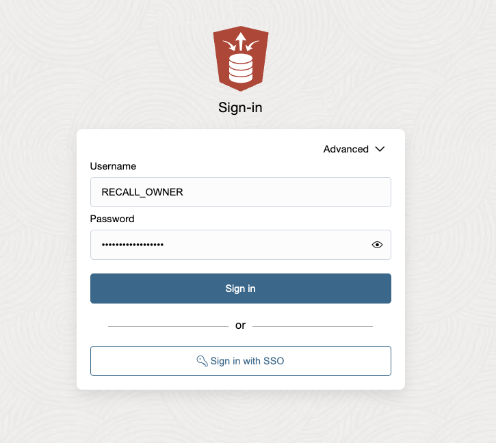
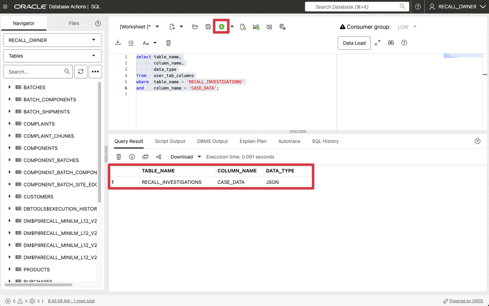
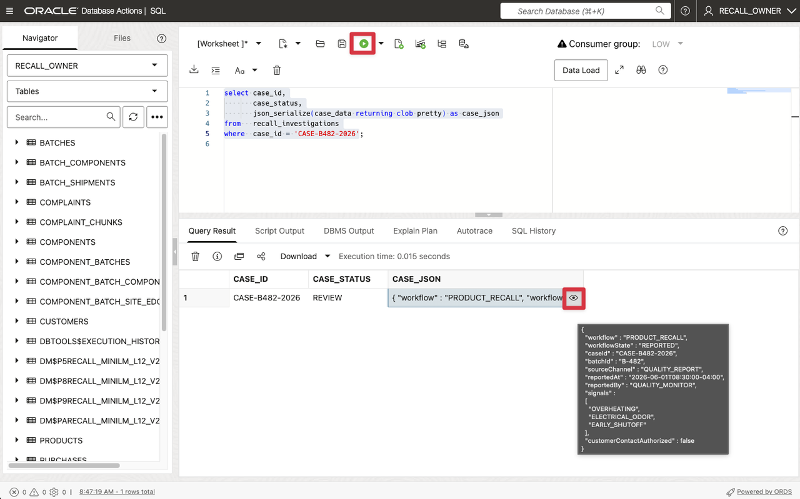
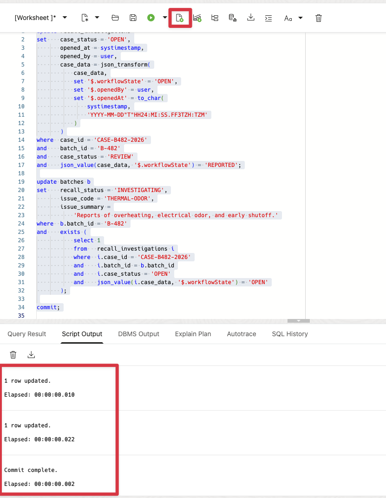
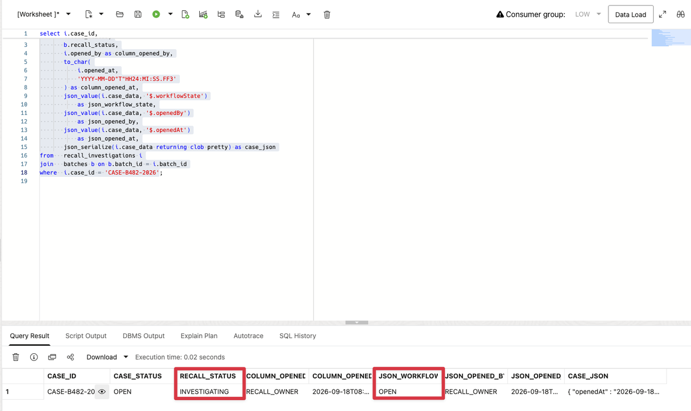
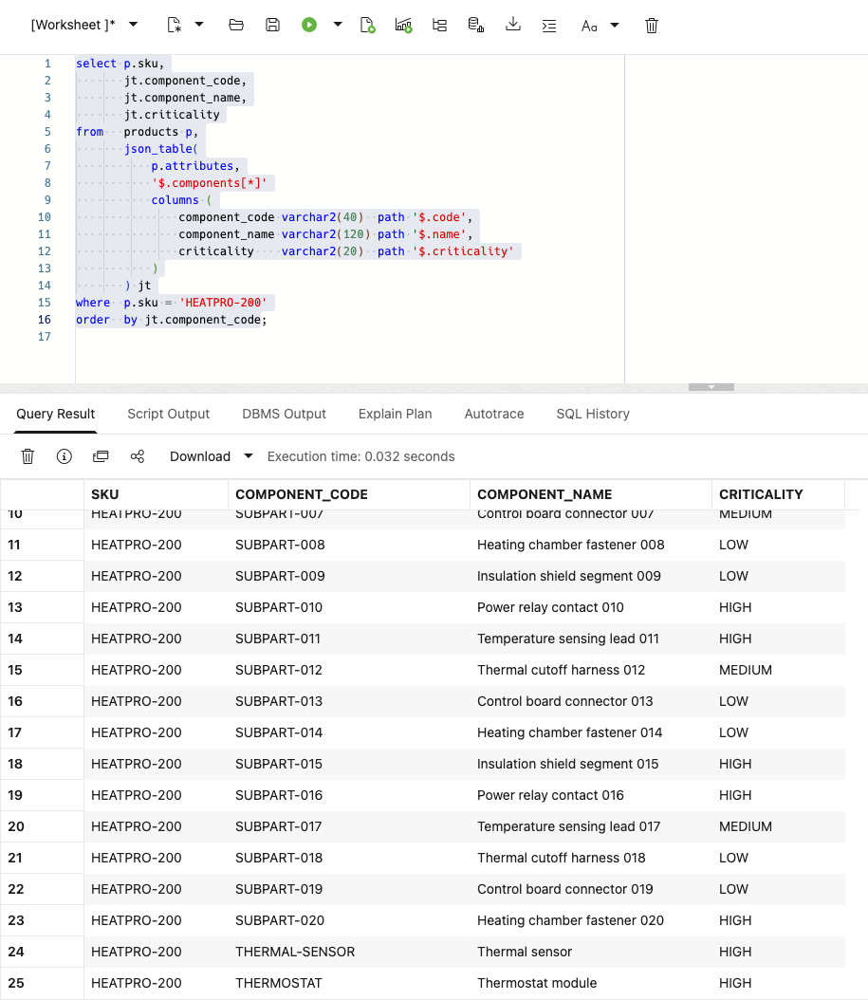
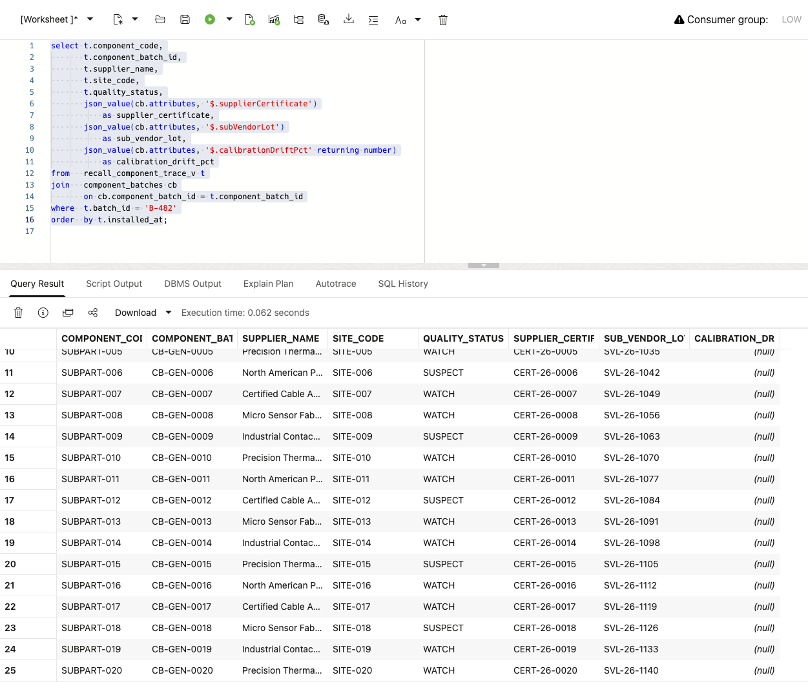
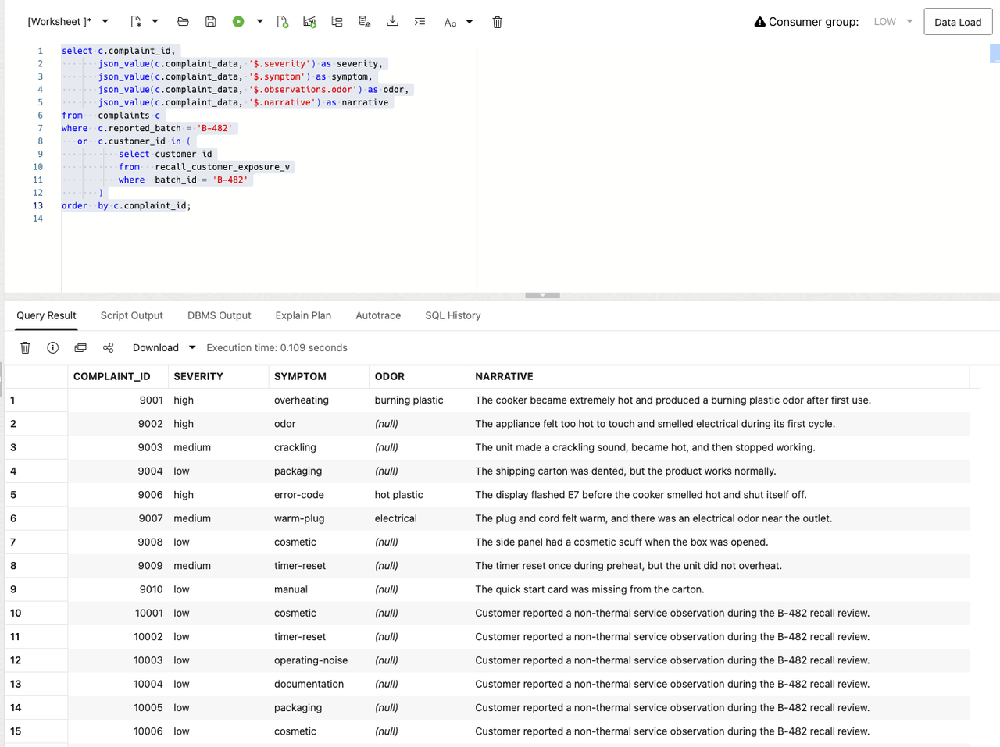

# Lab 1: Keep Recall Reports and Case Decisions Together with JSON

## Introduction

Kevin's first question is simple: “Do we have enough information to open the B-482 case, and what could this mean for returns?” The HeatPro quality-monitoring application sent the case report as JSON. It contains the batch, reported symptoms, and workflow state. Kevin needs to record the decision in the same system before the team starts acting.

David keeps the application report as native JSON alongside the records the recall team already uses, such as product, component-lot, store, shipment, and customer-exposure records. Oracle AI Database keeps the original report. The team can pull the details it needs from that report and connect them to those records.

JSON also handles details that vary from one report or complaint to the next. One may include an odor observation, another an early-shutoff note or a supplier certificate. A fixed relational table would need a new column whenever the application adds a new kind of detail. The investigation can start without first converting the report into a spreadsheet or separate document.

This is why the lab starts with JSON. Tim shows Kevin how Oracle AI Database stores application JSON, queries it with SQL, and updates only the workflow fields that change. He uses `JSON_VALUE` and `JSON_TABLE` to read the report, and `JSON_TRANSFORM` to open the case without rebuilding the document. The tasks then check the scope in the same database.

By the end of the lab, Kevin has an open case record for `B-482` with:

- 120 affected stores
- 2,400 units
- 600 potentially exposed customers
- 25 component batches
- 25 supplier sites

That decision gives David the data for the next design step.

Estimated Time: 10 minutes

### Objectives

In this lab, you will:

- Inspect a reported case stored in a native `JSON` column.
- Open the case by updating its JSON workflow state and relational status.
- Confirm the expanded recall scope across stores, units, customers, components, and supplier sites.
- Use `JSON_TABLE` to project product components from a JSON array.
- Use `JSON_VALUE` to read component-batch and complaint observations.
- Keep the learner workflow on `RECALL_OWNER`, not `ADMIN`.

## Task 1: Inspect the Reported Case JSON

Kevin needs to see the report before he authorizes work. David keeps the original JSON as the source record. Tim starts by inspecting it.

1. Sign in to **Database Actions** as `RECALL_OWNER` and select **SQL**. Open a new worksheet.



2. Confirm that `CASE_DATA` uses the Oracle native `JSON` data type.

    ```sql
    <copy>
    select table_name,
           column_name,
           data_type
    from   user_tab_columns
    where  table_name = 'RECALL_INVESTIGATIONS'
    and    column_name = 'CASE_DATA';
    </copy>
    ```

    The result identifies `CASE_DATA` as `JSON`, not a text column containing JSON-looking data.

    

3. Display the JSON document that arrived from the quality-monitoring workflow.

    ```sql
    <copy>
    select case_id,
           case_status,
           json_serialize(case_data returning clob pretty) as case_json
    from   recall_investigations
    where  case_id = 'CASE-B482-2026';
    </copy>
    ```

    The relational case status is `REVIEW`. Inside the document, `workflowState` is `REPORTED`. The JSON also contains the batch, source, and reported time. Its three quality signals describe the incident. Customer contact is not authorized.

    

## Task 2: Open the Investigation by Updating JSON

Kevin needs a recorded decision, not an informal status change. David needs the JSON report and the case status in the database to agree. Tim updates both in one transaction.

For example, the case could show `OPEN` in the recall application while the JSON report still says `REPORTED`. One team could begin return work while another treats the case as unreviewed. Updating both values in one transaction prevents that split view.

1. Update the case row. `JSON_TRANSFORM` changes the workflow state and adds audit fields. It preserves the rest of the document.

    ```sql
    <copy>
    update recall_investigations
    set    case_status = 'OPEN',
           opened_at = systimestamp,
           opened_by = user,
           case_data = json_transform(
               case_data,
               set '$.workflowState' = 'OPEN',
               set '$.openedBy' = user,
               set '$.openedAt' = to_char(
                   systimestamp,
                   'YYYY-MM-DD"T"HH24:MI:SS.FF3TZH:TZM'
               )
           )
    where  case_id = 'CASE-B482-2026'
    and    batch_id = 'B-482'
    and    case_status = 'REVIEW'
    and    json_value(case_data, '$.workflowState') = 'REPORTED';

    update batches b
    set    recall_status = 'INVESTIGATING',
           issue_code = 'THERMAL-ODOR',
           issue_summary =
               'Reports of overheating, electrical odor, and early shutoff.'
    where  b.batch_id = 'B-482'
    and    exists (
               select 1
               from   recall_investigations i
               where  i.case_id = 'CASE-B482-2026'
               and    i.batch_id = b.batch_id
               and    i.case_status = 'OPEN'
               and    json_value(i.case_data, '$.workflowState') = 'OPEN'
           );

    commit;
    </copy>
    ```

    Run the complete block before continuing. SQL Developer Web should report `1 row updated` for each update, followed by `Commit complete.` If either update reports `0 rows updated`, stop and check the case state before running the verification query.
    
    

    The first update changes the JSON workflow details and the approved case columns. The second makes the batch status available to later labs.

2. Verify the result. This query only checks the case; it does not open it. Run Step 1 first.

    ```sql
    <copy>
    select i.case_id,
           i.case_status,
           b.recall_status,
           i.opened_by as column_opened_by,
           to_char(
               i.opened_at,
               'YYYY-MM-DD"T"HH24:MI:SS.FF3'
           ) as column_opened_at,
           json_value(i.case_data, '$.workflowState')
               as json_workflow_state,
           json_value(i.case_data, '$.openedBy')
               as json_opened_by,
           json_value(i.case_data, '$.openedAt')
               as json_opened_at,
           json_serialize(i.case_data returning clob pretty) as case_json
    from   recall_investigations i
    join   batches b on b.batch_id = i.batch_id
    where  i.case_id = 'CASE-B482-2026';
    </copy>
    ```

    The case is `OPEN`, the batch is `INVESTIGATING`, and the JSON workflow state is `OPEN`. Both opening-user columns show `RECALL_OWNER`. The relational timestamp shows the local time stored in the case row; the JSON timestamp also includes its time-zone offset.

     

## Task 3: Confirm the Larger Recall Scope

Kevin asks what the decision means for the returns operation. David defines scope as stores, units, customers, components, and suppliers; Tim verifies each figure.

1. Count the affected stores, shipped units, exposed customers, component batches, and supplier sites.

    ```sql
    <copy>
    select count(*) as affected_store_count,
           sum(units_sent) as units_sent
    from   recall_affected_stores_v
    where  batch_id = 'B-482';

    select count(distinct customer_id) as exposed_customer_count
    from   recall_customer_exposure_v
    where  batch_id = 'B-482';

    select count(*) as component_batch_count,
           count(distinct supplier_site_id) as supplier_site_count
    from   recall_component_trace_v
    where  batch_id = 'B-482';
    </copy>
    ```

    Your result should show:
    
    | Measure           | Expected value |
    | -------------------| ---------------:|
    | Affected stores   | 120            |
    | Units sent        | 2,400         |
    | Exposed customers | 600            |
    | Component batches | 25             |
    | Supplier sites    | 25             |
    {: title="Expected result"}

2. The three results above form the Lab 1 checkpoint.

## Task 4: Project Product Components from JSON

Kevin needs product detail without a new data pipeline. David keeps flexible components in JSON; Tim projects only the fields the investigation needs.

1. Use `JSON_TABLE` to turn the product component array into relational rows.

    ```sql
    <copy>
    select p.sku,
           jt.component_code,
           jt.component_name,
           jt.criticality
    from   products p,
           json_table(
               p.attributes,
               '$.components[*]'
               columns (
                   component_code varchar2(40)  path '$.code',
                   component_name varchar2(120) path '$.name',
                   criticality    varchar2(20)  path '$.criticality'
               )
           ) jt
    where  p.sku = 'HEATPRO-200'
    order  by jt.component_code;
    </copy>
    ```

    The query returns 25 major components and their sub-parts. These include the thermostat, liner, power cord, thermal sensor, and contact set.

    

2. Explain why JSON fits this part of the model:

    - Product component attributes can vary by product family.
    - The recall still joins component batches through relational keys.
    - JSON keeps flexible product and complaint data close to the records that use it.

## Task 5: Read Component and Complaint JSON

Kevin needs the supporting details beside the scope. David links JSON details to the records that show which component lots were installed in `B-482` and which supplier site provided them. For example, a supplier certificate in the JSON for a suspect thermostat lot matters only when the team can confirm that the lot was installed in `B-482` and identify its supplier site. Tim reads those details together.

1. Inspect component-batch JSON attributes, including supplier certificate and sub-vendor lot details.

    ```sql
    <copy>
    select t.component_code,
           t.component_batch_id,
           t.supplier_name,
           t.site_code,
           t.quality_status,
           json_value(cb.attributes, '$.supplierCertificate')
               as supplier_certificate,
           json_value(cb.attributes, '$.subVendorLot')
               as sub_vendor_lot,
           json_value(cb.attributes, '$.calibrationDriftPct' returning number)
               as calibration_drift_pct
    from   recall_component_trace_v t
    join   component_batches cb
           on cb.component_batch_id = t.component_batch_id
    where  t.batch_id = 'B-482'
    order  by t.installed_at;
    </copy>
    ```

    The result contains 25 installed lots. The curated thermostat and thermal-sensor lots show `SUSPECT`. Generated sub-parts add `WATCH` and `SUSPECT` data with certificates, sub-vendor lots, and timestamps.

    

2. Read structured complaint observations and narrative text.

    ```sql
    <copy>
    select c.complaint_id,
           json_value(c.complaint_data, '$.severity') as severity,
           json_value(c.complaint_data, '$.symptom') as symptom,
           json_value(c.complaint_data, '$.observations.odor') as odor,
           json_value(c.complaint_data, '$.narrative') as narrative
    from   complaints c
    where  c.reported_batch = 'B-482'
       or  c.customer_id in (
               select customer_id
               from   recall_customer_exposure_v
               where  batch_id = 'B-482'
           )
    order  by c.complaint_id;
    </copy>
    ```

    Complaint `9005` is absent because it belongs to batch `B-900`. Complaints `9002` and `9007` came from customers who bought `B-482`. Those complaints did not name the batch.

    

You have completed Lab 1. Lab 2 uses Oracle Spatial to map the same stores and supplier sites.


## Conclusion

Kevin can now open the B-482 case from the same report that started the investigation. The returns application can show the original report, the case decision, and the affected scope without asking a user to copy details between a spreadsheet, a document, and separate operational systems.

That is why the SQL in this lab matters. It keeps the application report, the case status, and the related recall records connected in one database. The application can read the details it needs, and a single transaction keeps the JSON workflow state and the operational case status in step.

Oracle AI Database is the differentiator because it stores application JSON alongside relational recall data and lets the team work with both through SQL. Kevin gets a case record that shows who opened it, when it was opened, and the current scope in the application. Tim does not need to build a separate JSON store, data-conversion process, or synchronization job to make that possible.

## Learn More

- [JSON in Oracle AI Database](https://docs.oracle.com/en/database/oracle/oracle-database/26/adjsn/overview-json-oracle-ai-database.html)
- [JSON_TABLE SQL function](https://docs.oracle.com/en/database/oracle/oracle-database/26/adjsn/columns-clause-sql-json-function-json_table.html)

## Acknowledgements

- **Author:** Tim Cline, Product Management Architect
- Contributors: David Start, Director and Kevin Lazarz, Senior Manager
- **Last updated:** October 2026
