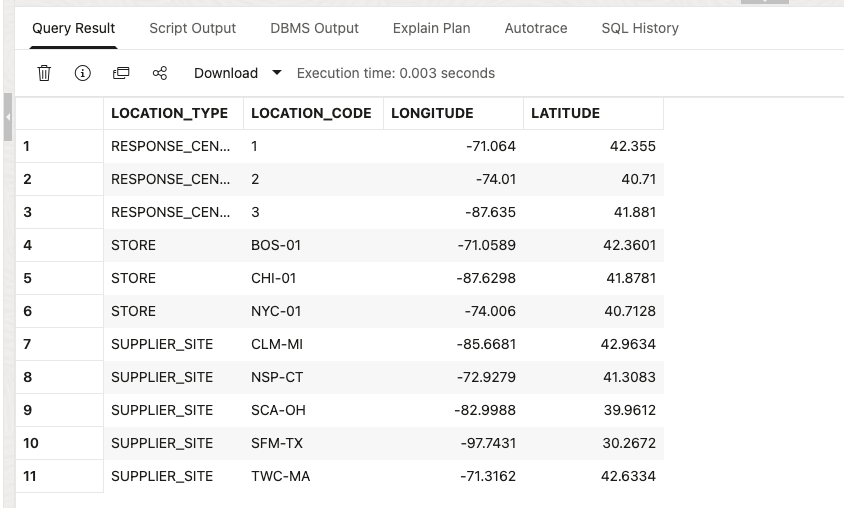
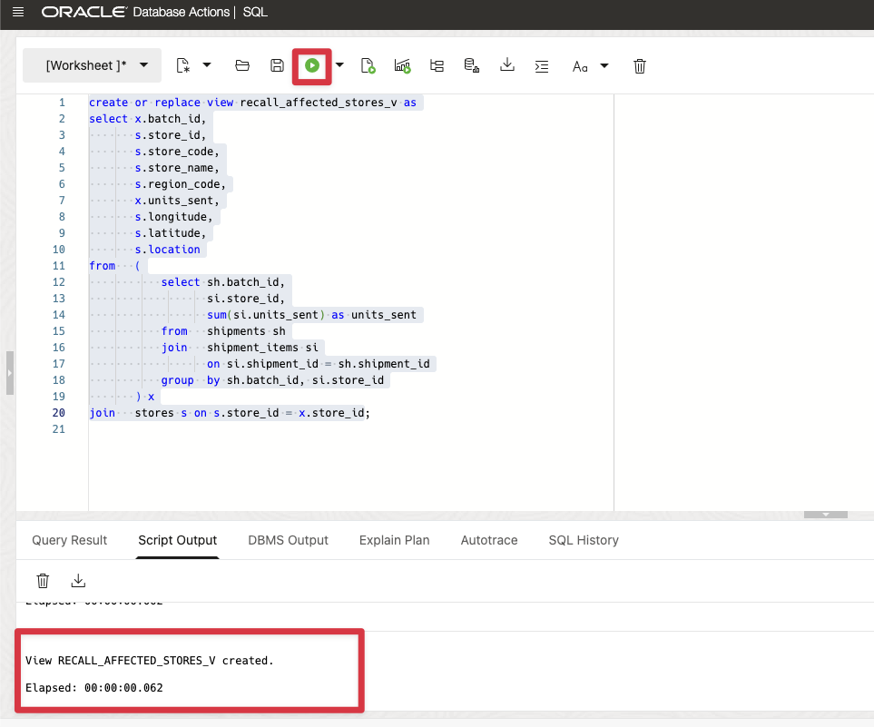
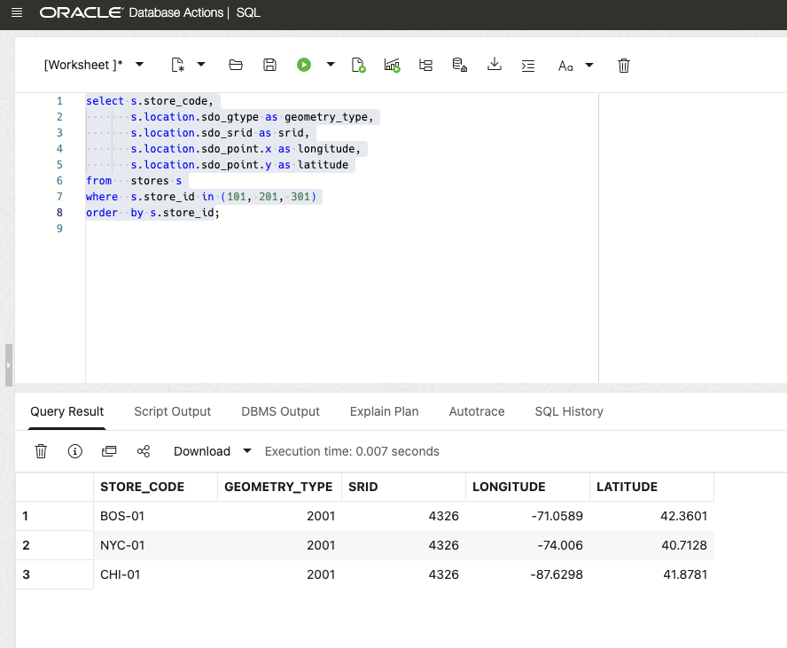
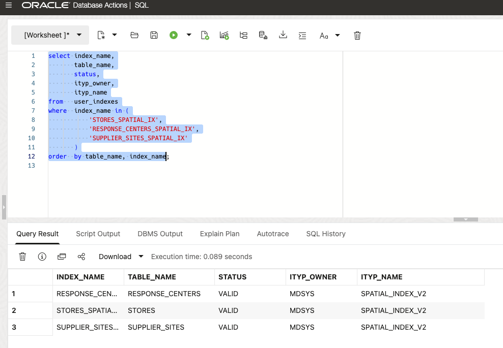
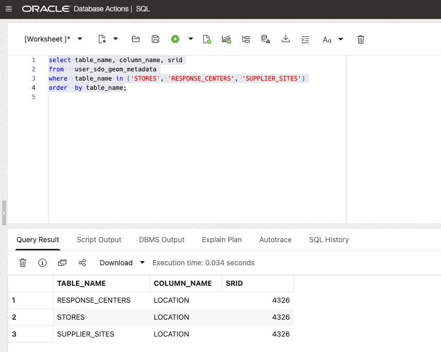
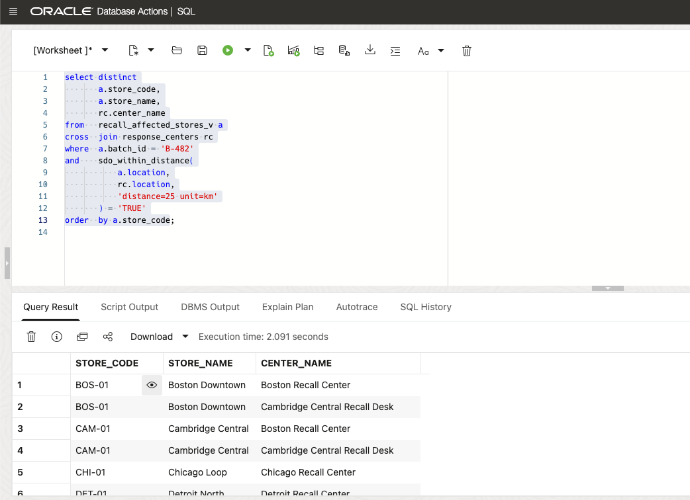
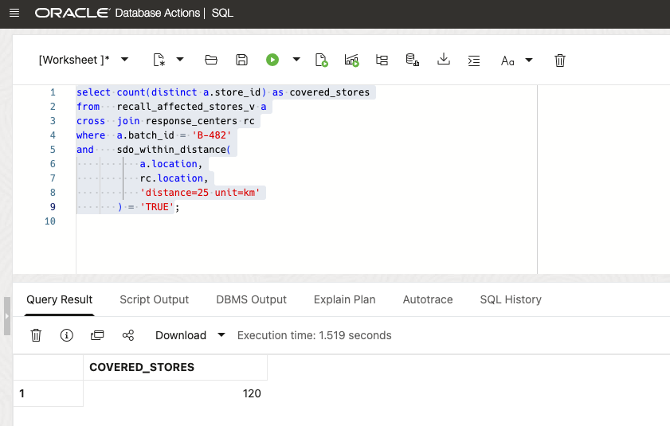
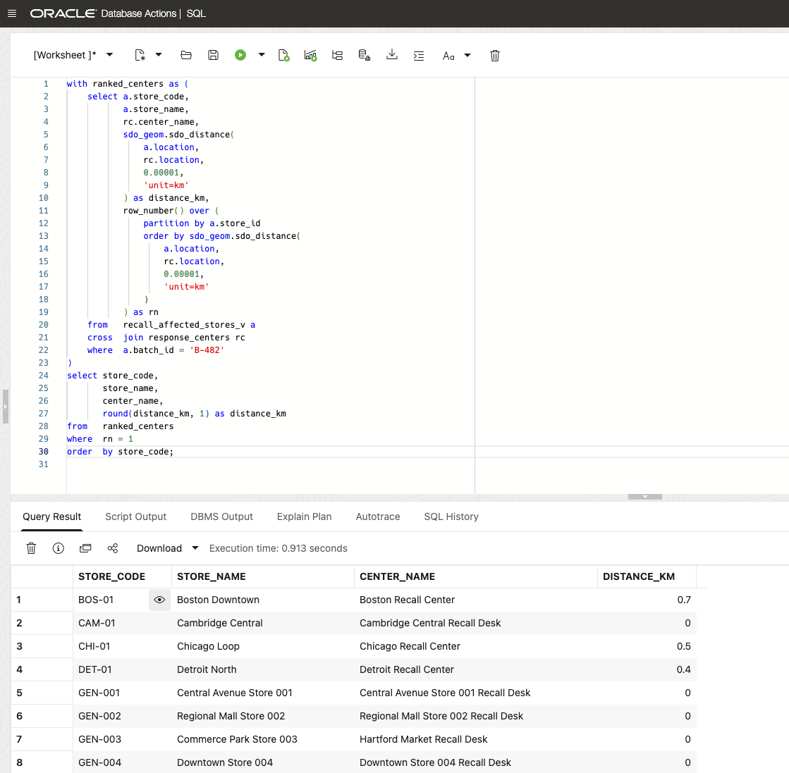

# Lab 2: Put Help Where It Is Needed: Map Recall Impact with Oracle Spatial

## Introduction

Kevin now asks, “Where do we need to support returns, and who should respond?” A list of 120 stores is not a field plan. Before store teams call for help, Kevin needs to know which response center will support each store.

David keeps store, response-center, and supplier-site locations in the same database as the recall records. The database can check whether a store is within 25 kilometers of a response center, choose the closest center, and send the result to the application as map data. The team does not need to export coordinates to a separate mapping system and combine the results by hand.

Oracle AI Database keeps application JSON, recall records, and location points in one database. Lab 1 kept the application report beside the recall records. Lab 2 adds locations to those same records. Tim can use one SQL workflow to connect the case report, affected stores, and response locations instead of moving data between separate systems.

Tim turns the existing longitude and latitude values into Oracle Spatial `SDO_GEOMETRY` points. He adds the indexes that make location searches fast, then uses SQL to find nearby response centers and calculate the closest one. He also produces GeoJSON for later APIs and the command center.

By the end of the lab, every affected store has a response-center assignment. The application can show store teams who should support them and where that support is located.

Estimated Time: 10 minutes

### Objectives

In this lab, you will:

- Convert longitude and latitude values to `SDO_GEOMETRY`.
- Create `SPATIAL_INDEX_V2` indexes without manually inserting spatial metadata.
- Use `SDO_WITHIN_DISTANCE` for indexed proximity filtering.
- Use `SDO_GEOM.SDO_DISTANCE` to assign nearest response centers.
- Create GeoJSON for affected stores and component supplier sites.

## Task 1: Promote Coordinates to Oracle Spatial

Kevin needs a field plan, not raw coordinates. David adds locations to the database records; Tim creates the points and indexes.

1. Inspect the relational longitude and latitude values before adding spatial columns.

    ```sql
    <copy>
    select 'STORE' as location_type,
           store_code as location_code,
           longitude,
           latitude
    from   stores
    where  store_id in (101, 201, 301)
    union all
    select 'RESPONSE_CENTER',
           to_char(center_id),
           longitude,
           latitude
    from   response_centers
    where  center_id in (1, 2, 3)
    union all
    select 'SUPPLIER_SITE',
           site_code,
           longitude,
           latitude
    from   supplier_sites
    where  supplier_site_id between 401 and 405
    order  by location_type, location_code;
    </copy>
    ```

    

2. Ensure and populate the `SDO_GEOMETRY` columns, then create the V2 spatial indexes.

    ```sql
    <copy>
 
    alter table stores add (location mdsys.sdo_geometry);
    
    alter table response_centers add (location mdsys.sdo_geometry);
    
    alter table supplier_sites add (location mdsys.sdo_geometry);
    
    update stores
    set location = mdsys.sdo_geometry(longitude, latitude);
    
    update response_centers
    set location = mdsys.sdo_geometry(longitude, latitude);
    
    update supplier_sites
    set location = mdsys.sdo_geometry(longitude, latitude);
    
    alter table stores modify (location not null);
    
    alter table response_centers modify (location not null);
    
    alter table supplier_sites modify (location not null);
    
    create index if not EXISTS stores_spatial_ix on stores(location) indextype is mdsys.spatial_index_v2;
    
    create index if not EXISTS response_centers_spatial_ix on response_centers(location) indextype is mdsys.spatial_index_v2;
    
    create index if not EXISTS supplier_sites_spatial_ix on supplier_sites(location) indextype is mdsys.spatial_index_v2;
    
    commit;

    </copy>
    ```

    

    In the updates above, `MDSYS.SDO_GEOMETRY(longitude, latitude)` converts each pair of coordinates into a geographic point that Oracle AI Database can use to calculate distances and find nearby locations. This function is called a constructor because it creates an `SDO_GEOMETRY` value. It uses WGS84 (World Geodetic System 1984), the coordinate system used by GPS, with longitude first and latitude second. Each `SPATIAL_INDEX_V2` index automatically creates the spatial metadata needed to describe its location column.

3. Update the affected-store view to use the store locations you just populated. The initial view contains a null placeholder because the spatial columns do not exist until this lab. Run this replacement before Task 2 so the distance queries receive the actual store locations.

    ```sql
    <copy>
    create or replace view recall_affected_stores_v as
    select x.batch_id,
           s.store_id,
           s.store_code,
           s.store_name,
           s.region_code,
           x.units_sent,
           s.longitude,
           s.latitude,
           s.location
    from   (
               select sh.batch_id,
                      si.store_id,
                      sum(si.units_sent) as units_sent
               from   shipments sh
               join   shipment_items si
                      on si.shipment_id = sh.shipment_id
               group  by sh.batch_id, si.store_id
           ) x
    join   stores s on s.store_id = x.store_id;
    </copy>
    ```

     

4. Inspect the promoted geometry values.

    ```sql
    <copy>
    select s.store_code,
           s.location.sdo_gtype as geometry_type,
           s.location.sdo_srid as srid,
           s.location.sdo_point.x as longitude,
           s.location.sdo_point.y as latitude
    from   stores s
    where  s.store_id in (101, 201, 301)
    order  by s.store_id;
    </copy>
    ```

    Each row is a two-dimensional point with geometry type `2001` and SRID `4326`.

    

5. Confirm the V2 indexes and their generated metadata.

    ```sql
    <copy>
    select index_name,
           table_name,
           status,
           ityp_owner,
           ityp_name
    from   user_indexes
    where  index_name in (
               'STORES_SPATIAL_IX',
               'RESPONSE_CENTERS_SPATIAL_IX',
               'SUPPLIER_SITES_SPATIAL_IX'
           )
    order  by table_name, index_name;
    </copy>
    ```
    Each index reports `VALID` and uses the `MDSYS` V2 index type.

    

    Here we check the metadata:

    ```sql
    <copy>
    select table_name, column_name, srid
    from   user_sdo_geom_metadata
    where  table_name in ('STORES', 'RESPONSE_CENTERS', 'SUPPLIER_SITES')
    order  by table_name;
    </copy>
    ```

     

## Task 2: Find Stores Within Response Radius

Kevin asks whether every store has nearby help. David defines a response-radius rule; Tim applies it inside the database.

1. Find affected stores within 25 kilometers of any recall response center.

    ```sql
    <copy>
    select distinct
           a.store_code,
           a.store_name,
           rc.center_name
    from   recall_affected_stores_v a
    cross  join response_centers rc
    where  a.batch_id = 'B-482'
    and    sdo_within_distance(
               a.location,
               rc.location,
               'distance=25 unit=km'
           ) = 'TRUE'
    order  by a.store_code;
    </copy>
    ```

    Each row pairs a store with a response center within 25 kilometers. A store appears more than once when several centers are nearby. For example, 552 rows can represent 120 unique stores; the row count is not the store count.

    

2. Count the unique stores with at least one response center within 25 kilometers.

    ```sql
    <copy>
    select count(distinct a.store_id) as covered_stores
    from   recall_affected_stores_v a
    cross  join response_centers rc
    where  a.batch_id = 'B-482'
    and    sdo_within_distance(
               a.location,
               rc.location,
               'distance=25 unit=km'
           ) = 'TRUE';
    </copy>
    ```

    Expected result: `COVERED_STORES = 120`.

    

3. Note the operational result:

    - The recall data includes 120 affected stores.
    - Every affected store has a nearby authorized response location.
    - The next task ranks the nearest center when service areas overlap.

## Task 3: Assign the Nearest Response Center

Kevin needs one center accountable for each location. David chooses a repeatable nearest-center rule; Tim calculates it.

1. Rank response centers by distance for every affected store.

    ```sql
    <copy>
    with ranked_centers as (
        select a.store_code,
               a.store_name,
               rc.center_name,
               sdo_geom.sdo_distance(
                   a.location,
                   rc.location,
                   0.00001,
                   'unit=km'
               ) as distance_km,
               row_number() over (
                   partition by a.store_id
                   order by sdo_geom.sdo_distance(
                       a.location,
                       rc.location,
                       0.00001,
                       'unit=km'
                   )
               ) as rn
        from   recall_affected_stores_v a
        cross  join response_centers rc
        where  a.batch_id = 'B-482'
    )
    select store_code,
           store_name,
           center_name,
           round(distance_km, 1) as distance_km
    from   ranked_centers
    where  rn = 1
    order  by store_code;
    </copy>
    ```

    All 120 affected stores now have a response-center assignment.

    

## Task 4: Map Stores and Supplier Sites

Kevin needs store and supplier locations in the returns application. David uses GeoJSON, a common map-data format; Tim prepares the location results.

1. Use the queries in this task to return:

    - stores within the 25-kilometer response radius,
    - nearest-center assignments for all affected stores,
    - component supplier and sub-vendor locations,
    - a store GeoJSON `FeatureCollection` with 120 features,
    - a supplier-site GeoJSON `FeatureCollection` with 25 features.

2. Explain why spatial belongs in the database for this workflow:

    - Store and supplier-site locations join directly to recall facts.
    - Spatial operators can use spatial indexes.
    - SQL produces GeoJSON from the recall data used by later labs.

You have completed Lab 2. Lab 3 traces upstream component lots and downstream customer exposure with SQL property graph.

## Conclusion

Kevin's business requirements can now be delivered directly from the database: find the response center for each affected store, check whether each store is within the response area, and return map data to the returns application.

David keeps recall records and location points in Oracle AI Database together. The team does not need a separate Spatial database, a process to copy data between systems, or an integration to keep recall and map information aligned. Tim can use SQL to produce the assignments and GeoJSON that the application needs.

## Learn More

- [Oracle AI Database Spatial Developer Guide](https://docs.oracle.com/en/database/oracle/oracle-database/26/spatl/index.html)
- [Spatial changes in Oracle AI Database 26ai](https://docs.oracle.com/en/database/oracle/oracle-database/26/spatl/changes-this-release-oracle-spatial-developers-guide.html)
- [Oracle Spatial GeoJSON support](https://docs.oracle.com/en/database/oracle/oracle-database/26/spatl/)

## Acknowledgements

- **Author:** Tim Cline, Product Management Architect
- Contributors: David Start, Director and Kevin Lazarz, Senior Manager
- **Last updated:** October 2026
