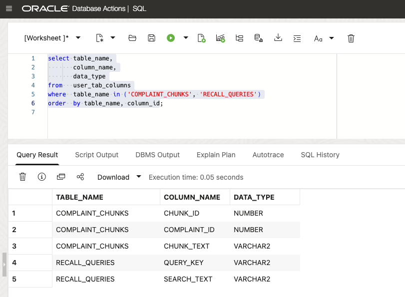
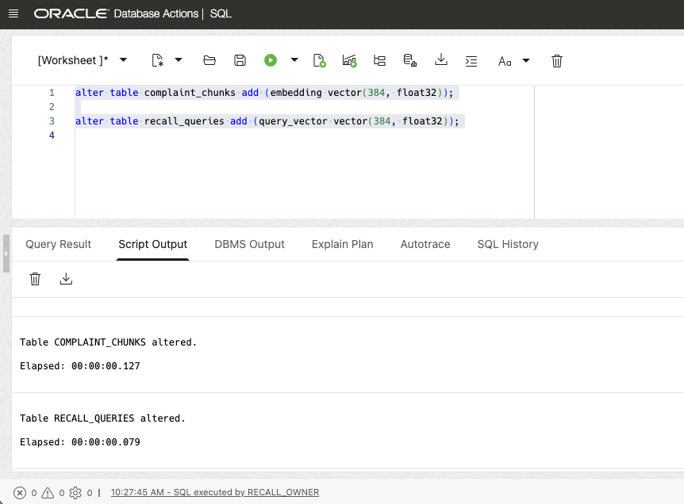
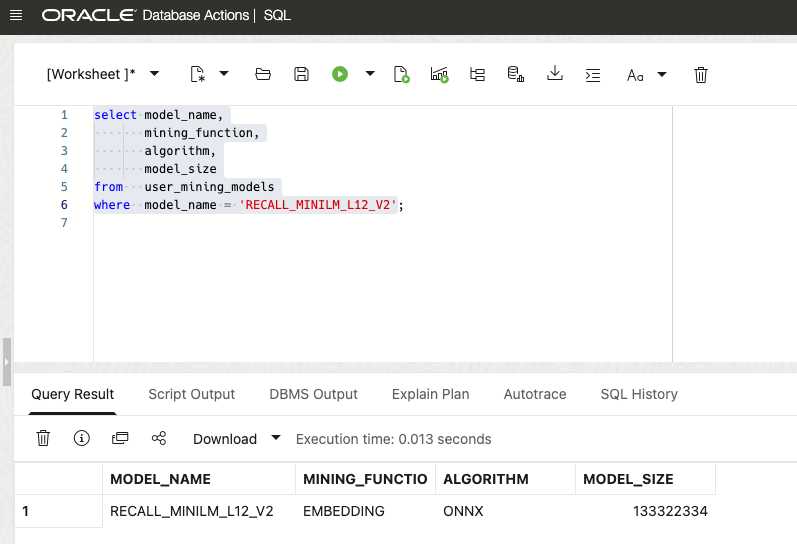
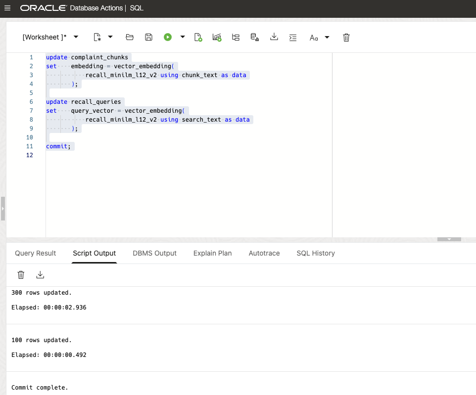
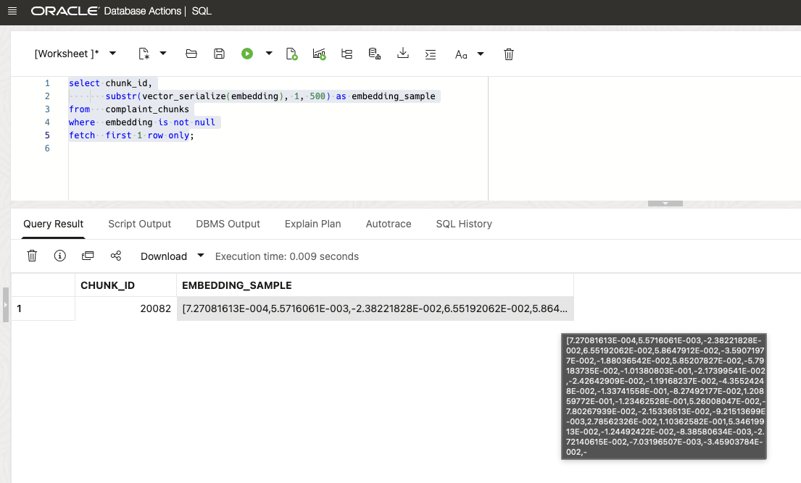
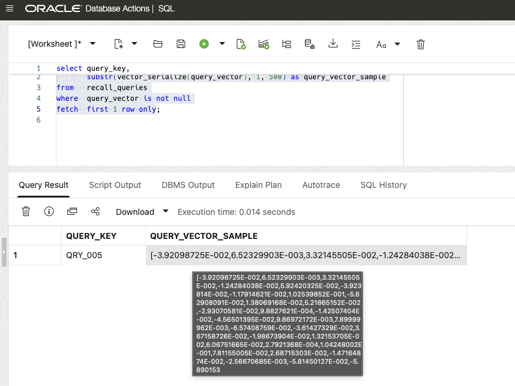
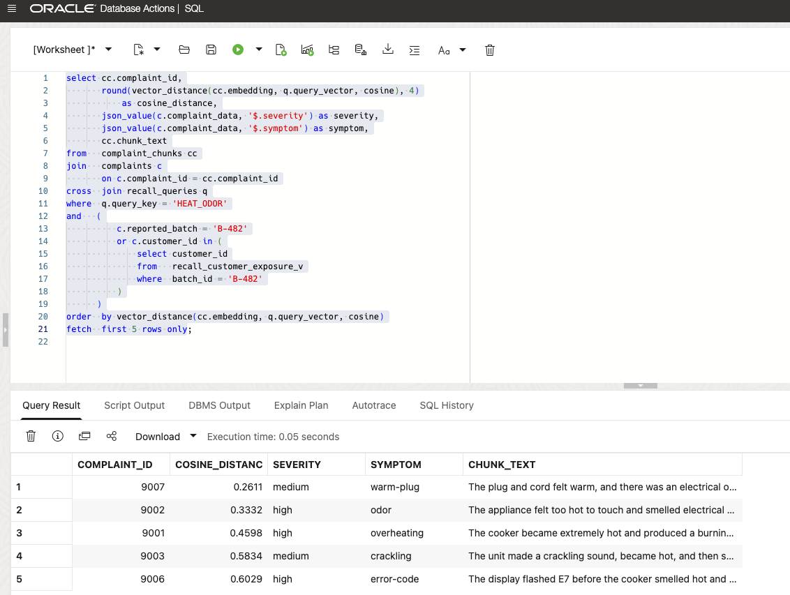
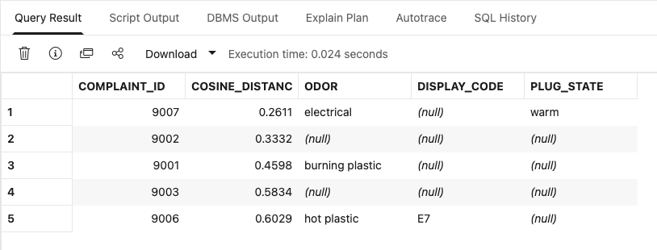

# Lab 4: Find Related Complaints: Use AI Vector Search for B-482

## Introduction

Kevin needs to find complaints that may describe the B-482 heat and odor issue. Customers use different words for the same problem. An exact keyword search can miss an electrical smell, an E7 code, or a cooker that is too hot to touch.

David keeps complaint text, JSON observations, and the B-482 customer and batch records together. Vector search compares complaints by meaning, but the database still limits the result to complaints connected to B-482. A similar phrase from an unrelated batch does not enter the result.

Tim uses the loaded ONNX model to turn complaint text into vectors, which are numeric representations of meaning. He ranks complaint text with `VECTOR_DISTANCE`, then adds the JSON observations that explain each complaint. Vector search finds similar language; the B-482 filters and JSON data confirm whether the complaint belongs in this recall.

By the end of the lab, the database returns complaints `9001`, `9002`, `9006`, `9003`, and `9007` first, while excluding unrelated batch B-900 complaints. Lab 5 uses this database result in the assistant.

Estimated Time: 15 minutes

### Objectives

In this lab, you will:

- Ensure `VECTOR(384, FLOAT32)` columns on the existing relational tables.
- Use the loaded ONNX embedding model in the database.
- Populate stored and query embeddings with `VECTOR_EMBEDDING`.
- Run `VECTOR_DISTANCE` against complaint chunks.
- Filter semantic search to complaints tied to the B-482 recall.
- Combine vector results with JSON complaint observations.
- Produce the recall context used by the Select AI Agent lab.

## Task 1: Ensure Vector Data and Use the Loaded Model

Kevin needs to find complaints that describe the same issue, even when they use different words. David keeps the vectors beside the original complaint data; Tim prepares the data for the model.

1. Inspect the complaint text and query text that will become the embedding inputs.

    ```sql
    <copy>
    select table_name,
           column_name,
           data_type
    from   user_tab_columns
    where  table_name in ('COMPLAINT_CHUNKS', 'RECALL_QUERIES')
    order  by table_name, column_id;
    </copy>
    ```

    These relational text columns are the source for the stored complaint and query embeddings.

    

2. Add native vector columns to the existing relational tables.

    ```sql
    <copy>
    alter table complaint_chunks add (embedding vector(384, float32));

    alter table recall_queries add (query_vector vector(384, float32));
    </copy>
    ```

    We are using the `all_MiniLM_L12_v2` embeddingmodel. It produces 384-dimensional text embeddings. The query vector uses the same model so both sides share one semantic space.
    
    

3. Confirm that the embedding model is available in Oracle AI Database 26ai.

    ```sql
    <copy>
    select model_name,
           mining_function,
           algorithm,
           model_size
    from   user_mining_models
    where  model_name = 'RECALL_MINILM_L12_V2';
    </copy>
    ```

    The query should return one row for `RECALL_MINILM_L12_V2` with `MINING_FUNCTION` set to `EMBEDDING` and `ALGORITHM` set to `ONNX`. The backend deployment loaded `all_MiniLM_L12_v2.onnx` from Oracle Object Storage. Inference runs locally in the database through the imported ONNX model; no external embedding API is called.

     

4. Populate both tables with in-database model inference.

    ```sql
    <copy>
    update complaint_chunks
    set    embedding = vector_embedding(
               recall_minilm_l12_v2 using chunk_text as data
           );

    update recall_queries
    set    query_vector = vector_embedding(
               recall_minilm_l12_v2 using search_text as data
           );

    commit;
    </copy>
    ```

    

5. Inspect a generated complaint vector.

    ```sql
    <copy>
    select chunk_id,
           substr(vector_serialize(embedding), 1, 500) as embedding_sample
    from   complaint_chunks
    where  embedding is not null
    fetch  first 1 row only;
    </copy>
    ```

    The query returns one populated complaint vector. `VECTOR_SERIALIZE` converts it to readable text, and `SUBSTR` keeps the result compact.
    
    

6. Inspect a generated search-query vector.

    ```sql
    <copy>
    select query_key,
           substr(vector_serialize(query_vector), 1, 500) as query_vector_sample
    from   recall_queries
    where  query_vector is not null
    fetch  first 1 row only;
    </copy>
    ```

    The query returns one populated search-query vector. Both tables now have vectors for comparing the search text with complaint text.

    

## Task 2: Find Related Complaints

Kevin needs to find the complaints most similar to the heat and odor issue. David limits the search to B-482; Tim runs the vector search.

1. Find the five complaint chunks closest to the workshop query vector.

    ```sql
    <copy>
    select cc.complaint_id,
           round(vector_distance(cc.embedding, q.query_vector, cosine), 4)
               as cosine_distance,
           json_value(c.complaint_data, '$.severity') as severity,
           json_value(c.complaint_data, '$.symptom') as symptom,
           cc.chunk_text
    from   complaint_chunks cc
    join   complaints c
           on c.complaint_id = cc.complaint_id
    cross  join recall_queries q
    where  q.query_key = 'HEAT_ODOR'
    and   (
              c.reported_batch = 'B-482'
              or c.customer_id in (
                  select customer_id
                  from   recall_customer_exposure_v
                  where  batch_id = 'B-482'
              )
          )
    order  by vector_distance(cc.embedding, q.query_vector, cosine)
    fetch  first 5 rows only;
    </copy>
    ```

    The top five should be the heat-and-odor complaints `9001`, `9002`, `9006`, `9003`, and `9007`; exact ordering can vary slightly by model revision. Lower cosine distance means stronger similarity.

    

2. Explain why complaint `9005` is absent:

    - It belongs to batch `B-900`.
    - Its customer did not buy batch `B-482`.
    - The query filters semantic search to the current B-482 recall.

## Task 3: Combine Vector Results and JSON Details

Kevin needs the details that explain why a complaint ranked highly. David joins the similar-language results to the JSON observations; Tim combines them in one query.

1. Join the ranked vector results back to JSON observations.

    ```sql
    <copy>
    with ranked as (
        select cc.complaint_id,
               vector_distance(cc.embedding, q.query_vector, cosine) as distance
        from   complaint_chunks cc
        join   complaints c
               on c.complaint_id = cc.complaint_id
        cross  join recall_queries q
        where  q.query_key = 'HEAT_ODOR'
        and   (
                  c.reported_batch = 'B-482'
                  or c.customer_id in (
                      select customer_id
                      from   recall_customer_exposure_v
                      where  batch_id = 'B-482'
                  )
              )
        order  by distance
        fetch  first 5 rows only
    )
    select r.complaint_id,
           round(r.distance, 4) as cosine_distance,
           json_value(c.complaint_data, '$.observations.odor') as odor,
           json_value(c.complaint_data, '$.observations.display') as display_code,
           json_value(c.complaint_data, '$.observations.plug') as plug_state
    from   ranked r
    join   complaints c
           on c.complaint_id = r.complaint_id
    order  by r.distance;
    </copy>
    ```

    This query returns the similarity ranking and the JSON observations in one result.

    **Interpret the `NULL` values:** The complaint documents use a flexible JSON shape, so an observation column is `NULL` when that complaint does not contain the requested JSON key. For example, `odor` appears for complaints such as `9001`, `9006`, and `9007`; `display_code` appears for `9006`; and `plug_state` appears for `9007`. The missing values are expected. They show that the ranking can be combined with JSON details that appear only when a complaint records them.

    

## Task 4: Produce Recall Context for the Assistant

Kevin needs one database response for the recall desk. David defines the fields the assistant may use; Tim produces that response.

1. Call the package that gathers the recall details for the assistant.

    ```sql
    <copy>
    select recall_lab_api.get_recall_context('B-482') as recall_context;
    </copy>
    ```

2. Compare the output with this checkpoint.

    ```json
    {
      "batchId": "B-482",
      "status": "INVESTIGATING",
      "product": "HeatPro Countertop Cooker",
      "investigationCaseId": "CASE-B482-2026",
      "affectedStoreCount": 120,
      "unitsSent": 2400,
      "customerExposureCount": 600,
      "componentBatchCount": 25,
      "supplierSiteCount": 25,
      "complaintIds": [9001, 9002, 9006, 9003, 9007],
      "firstAction": "Quarantine remaining B-482 inventory and stop sales at affected stores."
    }
    ```

3. This query returns the recall details that the assistant will use.

You have completed Lab 4. Lab 5 registers the approved context function as a Select AI Agent tool.

## Conclusion

The database can now find complaints that describe the B-482 issue in different words, then check each result against the batch, customer, and JSON complaint data. The recall application can show both the matching complaint and the details that explain why it is part of the case.

David keeps complaint text, vectors, JSON observations, and recall records in Oracle AI Database. The team does not need a separate vector database or an integration that copies complaint data between systems. Tim uses SQL to combine similarity search with the checks that keep the result limited to B-482.

## Learn More

- [Oracle AI Vector Search User Guide](https://docs.oracle.com/en/database/oracle/oracle-database/26/vecse/)
- [VECTOR_DISTANCE SQL function](https://docs.oracle.com/en/database/oracle/oracle-database/26/sqlrf/vector_distance.html)

## Acknowledgements

- **Author:** Tim Cline, Product Management Architect
- Contributors: David Start, Director and Kevin Lazarz, Senior Manager
- **Last updated:** October 2026
