# Lab 7: Give Each User the Right Recall Scope with Deep Data Security

## Introduction

Kevin wants store staff, regional managers, and the recall lead to use the same returns application. But a store employee should not see another store's customers or complaints. A regional manager needs a wider view, and the recall lead needs the company-wide picture.

David keeps those access rules in Oracle AI Database, alongside the records and complaint vectors. The same rules limit ordinary queries and vector searches before information reaches the assistant. The application does not need a separate set of filters for each search method.

Tim has prepared the code that gathers recall facts and sends them to the assistant. You will build the access rules, assign them to three users, and compare their results. The assistant does not decide what a user may see; it receives only the evidence the database permits.

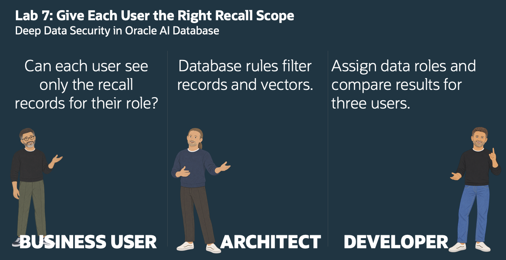

Estimated Time: 25 minutes

### Objectives

- Define store, regional, and company-wide access with data roles.
- Apply those rules to related customers, shipments, complaints, and vectors.
- Run identical queries as three users and compare the results.
- Give the assistant each user's permitted evidence and check its answer.

### Access and Prerequisites

Use `RECALL_OWNER` for Task 1 and Task 2 Steps 1–8. Then connect as `ADMIN` to assign and verify the roles in Task 2 Steps 9–10.

Tasks 3–4 are optional exercises for learners with SQL Developer desktop, the Oracle SQL Developer extension for VS Code, or SQLcl. Connect separately as each end user using your database connect string, any required wallet, and each user's credentials. A SQL Developer Web URL is not a direct database connect string.

If you do not have one of these clients or the required connection details, complete Tasks 1–2 and continue to Lab 8. You will sign in as the three end users and compare their permitted data and assistant answers in the Recall Command Center app.

## Task 1: Define Who Can See Which Stores

Kevin describes three responsibilities. David turns them into three data roles. Tim starts with the stores each role may see.

Check that your workshop environment includes the local end users STORE\_101\_USER, REGION\_NE\_USER, and RECALL\_LEAD\_USER and that you have their credentials. You will assign their data roles after defining the rules. They are database end users, not additional application schemas.

1. Connect as **RECALL\_OWNER**. Create the Store 101 data role.

    ```sql
    <copy>
    create or replace data role recall_store_101_data_role;
    </copy>
    ```

2. Create the Northeast data role.

    ```sql
    <copy>
    create or replace data role recall_region_ne_data_role;
    </copy>
    ```

3. Create the recall lead data role.

    ```sql
    <copy>
    create or replace data role recall_lead_data_role;
    </copy>
    ```

    After running Steps 1–3, Script Output confirms that the three data roles were created.

    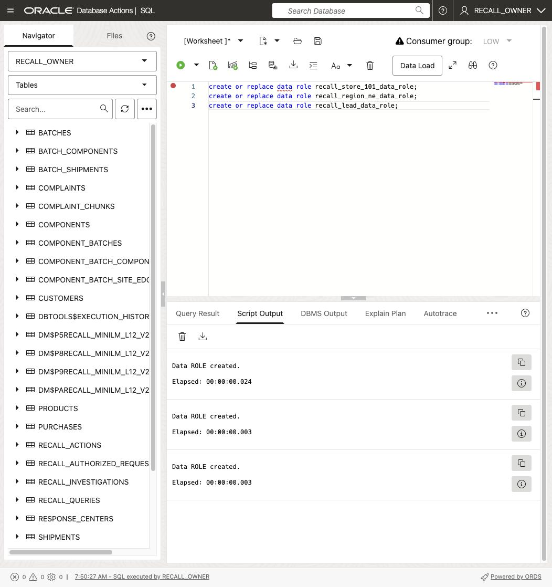

4. Give each data role the prepared login role. It provides connection and approved package privileges, not unrestricted table access.

    ```sql
    <copy>
    grant recall_end_user_login to recall_store_101_data_role;
    grant recall_end_user_login to recall_region_ne_data_role;
    grant recall_end_user_login to recall_lead_data_role;
    </copy>
    ```

5. Allow only Store 101.

    ```sql
    <copy>
    create or replace data grant recall_owner.dg_store_101_stores
    as select on recall_owner.stores
    where store_id = 101
    to recall_store_101_data_role;
    </copy>
    ```

6. Allow stores marked NORTHEAST in this workshop dataset.

    ```sql
    <copy>
    create or replace data grant recall_owner.dg_region_ne_stores
    as select on recall_owner.stores
    where region_code = 'NORTHEAST'
    to recall_region_ne_data_role;
    </copy>
    ```

7. Allow all stores for the recall lead. This grant has no row filter.

    ```sql
    <copy>
    create or replace data grant recall_owner.dg_lead_stores
    as select on recall_owner.stores
    to recall_lead_data_role;
    </copy>
    ```

    The three store grants define the local, regional, and company-wide scopes. Script Output confirms each grant was created.

    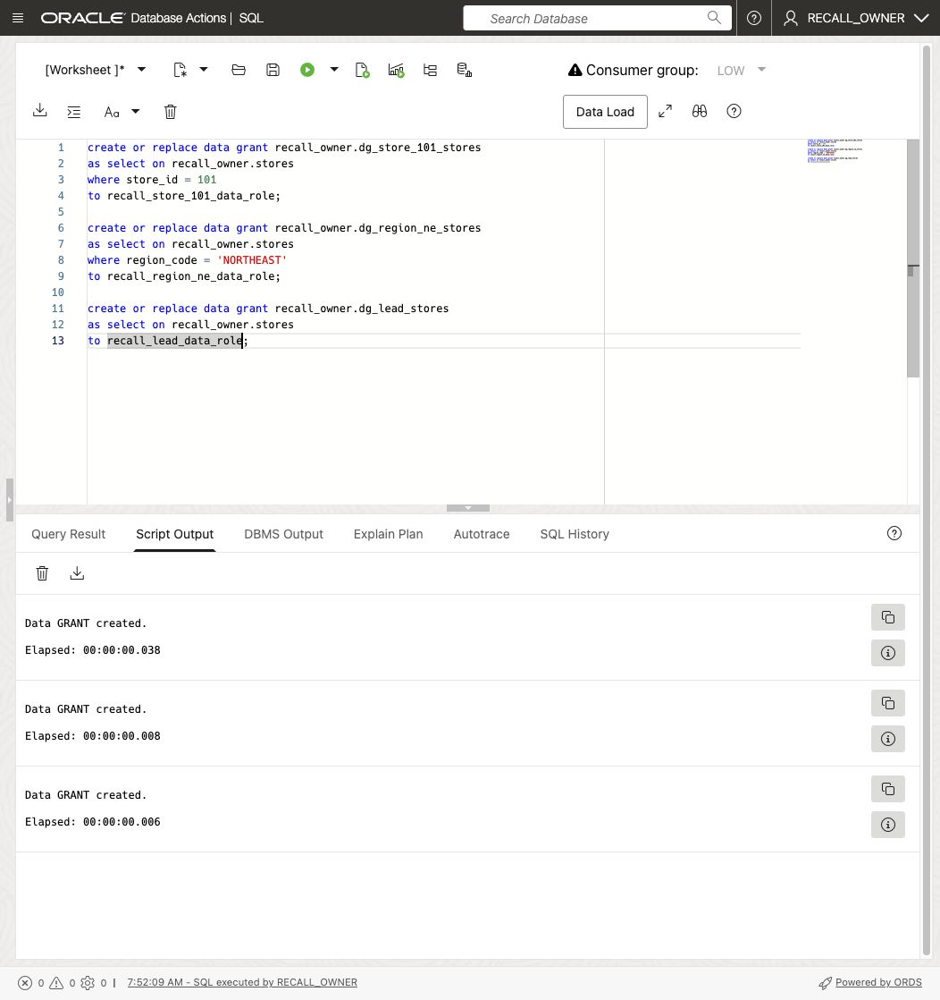

## Task 2: Apply the Rules to Related Records

Hiding a store is not enough if its customers or complaints remain visible. David follows the relationships between the records. Tim makes the permitted stores determine the related records each user can read.

Stay connected as **RECALL\_OWNER**. Run each block separately.

1. Limit customers to those whose home store is visible.

    ```sql
    <copy>
    create or replace data grant recall_owner.dg_store_customers
    as select on recall_owner.customers
    where home_store_id in (select store_id from recall_owner.stores)
    to recall_store_101_data_role, recall_region_ne_data_role, recall_lead_data_role;
    </copy>
    ```

2. Limit purchases to visible stores.

    ```sql
    <copy>
    create or replace data grant recall_owner.dg_store_purchases
    as select on recall_owner.purchases
    where store_id in (select store_id from recall_owner.stores)
    to recall_store_101_data_role, recall_region_ne_data_role, recall_lead_data_role;
    </copy>
    ```

3. Limit shipment items to visible stores. This also limits the units counted for each user.

    ```sql
    <copy>
    create or replace data grant recall_owner.dg_store_shipment_items
    as select on recall_owner.shipment_items
    where store_id in (select store_id from recall_owner.stores)
    to recall_store_101_data_role, recall_region_ne_data_role, recall_lead_data_role;
    </copy>
    ```

4. Allow shipment headers only when a related shipment item is visible.

    ```sql
    <copy>
    create or replace data grant recall_owner.dg_store_shipments
    as select on recall_owner.shipments
    where shipment_id in (
        select shipment_id from recall_owner.shipment_items
    )
    to recall_store_101_data_role, recall_region_ne_data_role, recall_lead_data_role;
    </copy>
    ```

5. Limit complaints to visible customers.

    ```sql
    <copy>
    create or replace data grant recall_owner.dg_customer_complaints
    as select on recall_owner.complaints
    where customer_id in (select customer_id from recall_owner.customers)
    to recall_store_101_data_role, recall_region_ne_data_role, recall_lead_data_role;
    </copy>
    ```

6. Limit searchable chunks to visible complaints. A hidden complaint must not reappear through vector search.

    ```sql
    <copy>
    create or replace data grant recall_owner.dg_complaint_chunks
    as select on recall_owner.complaint_chunks
    where complaint_id in (select complaint_id from recall_owner.complaints)
    to recall_store_101_data_role, recall_region_ne_data_role, recall_lead_data_role;
    </copy>
    ```

    Confirm that Script Output reports `Data GRANT created.` for the complaint-chunk rule.

    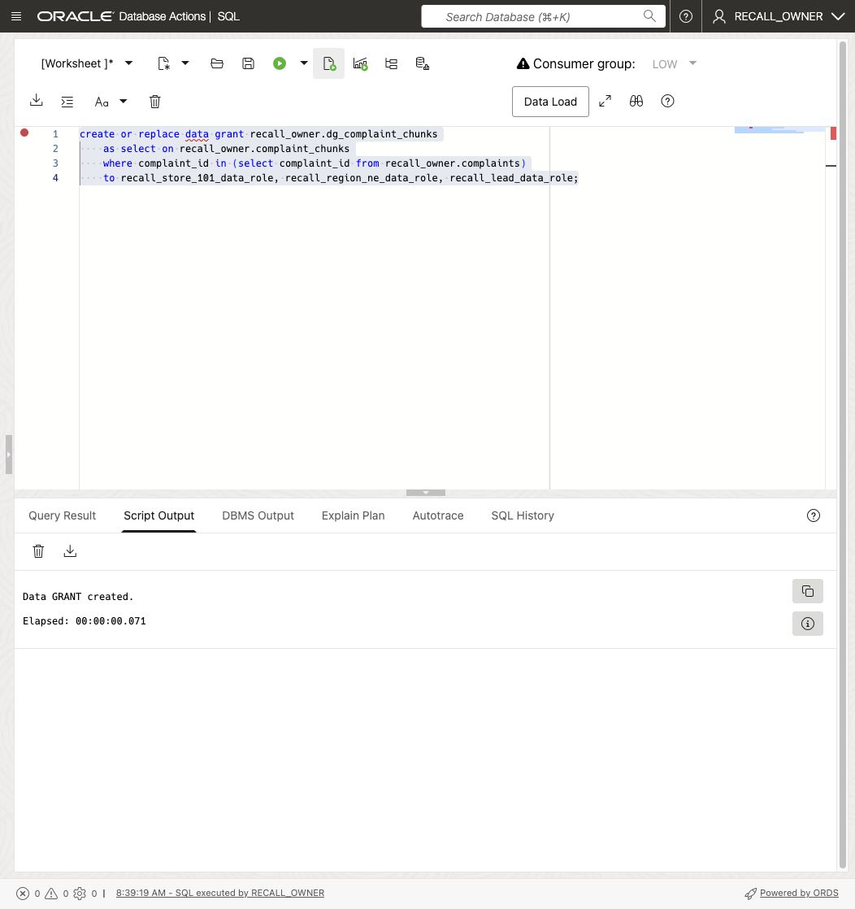

7. Share product, batch, response instructions, search question, and response-center reference records. These facts help every role understand the recall without granting customer access.

    ```sql
    <copy>
    create or replace data grant recall_owner.dg_products_read
    as select on recall_owner.products
    to recall_store_101_data_role, recall_region_ne_data_role, recall_lead_data_role;

    create or replace data grant recall_owner.dg_batches_read
    as select on recall_owner.batches
    to recall_store_101_data_role, recall_region_ne_data_role, recall_lead_data_role;

    create or replace data grant recall_owner.dg_actions_read
    as select on recall_owner.recall_actions
    to recall_store_101_data_role, recall_region_ne_data_role, recall_lead_data_role;

    create or replace data grant recall_owner.dg_queries_read
    as select on recall_owner.recall_queries
    to recall_store_101_data_role, recall_region_ne_data_role, recall_lead_data_role;

    create or replace data grant recall_owner.dg_response_centers_read
    as select on recall_owner.response_centers
    to recall_store_101_data_role, recall_region_ne_data_role, recall_lead_data_role;
    </copy>
    ```

8. Share component and supplier reference records. These describe the recalled product and support Lab 8 supply-chain queries.

    ```sql
    <copy>
    create or replace data grant recall_owner.dg_suppliers_read
    as select on recall_owner.suppliers
    to recall_store_101_data_role, recall_region_ne_data_role, recall_lead_data_role;

    create or replace data grant recall_owner.dg_supplier_sites_read
    as select on recall_owner.supplier_sites
    to recall_store_101_data_role, recall_region_ne_data_role, recall_lead_data_role;

    create or replace data grant recall_owner.dg_components_read
    as select on recall_owner.components
    to recall_store_101_data_role, recall_region_ne_data_role, recall_lead_data_role;

    create or replace data grant recall_owner.dg_component_batches_read
    as select on recall_owner.component_batches
    to recall_store_101_data_role, recall_region_ne_data_role, recall_lead_data_role;

    create or replace data grant recall_owner.dg_batch_components_read
    as select on recall_owner.batch_components
    to recall_store_101_data_role, recall_region_ne_data_role, recall_lead_data_role;

    create or replace data grant recall_owner.dg_component_site_edges_read
    as select on recall_owner.component_batch_site_edges
    to recall_store_101_data_role, recall_region_ne_data_role, recall_lead_data_role;

    create or replace data grant recall_owner.dg_component_type_edges_read
    as select on recall_owner.component_batch_component_edges
    to recall_store_101_data_role, recall_region_ne_data_role, recall_lead_data_role;

    create or replace data grant recall_owner.dg_supplier_site_edges_read
    as select on recall_owner.supplier_site_edges
    to recall_store_101_data_role, recall_region_ne_data_role, recall_lead_data_role;
    </copy>
    ```

9. Switch to **ADMIN** and assign one data role to each end user.

    ```sql
    <copy>
    grant data role recall_store_101_data_role to store_101_user;
    grant data role recall_region_ne_data_role to region_ne_user;
    grant data role recall_lead_data_role to recall_lead_user;
    </copy>
    ```

10. Stay connected as **ADMIN** and verify the assignments. Expect three rows, one matching role per user.

    ```sql
    <copy>
    select grantee, data_role
    from   dba_data_role_grants
    where  grantee in ('STORE_101_USER', 'REGION_NE_USER', 'RECALL_LEAD_USER')
    order  by grantee;
    </copy>
    ```

    Confirm that each user has exactly the intended data role.

    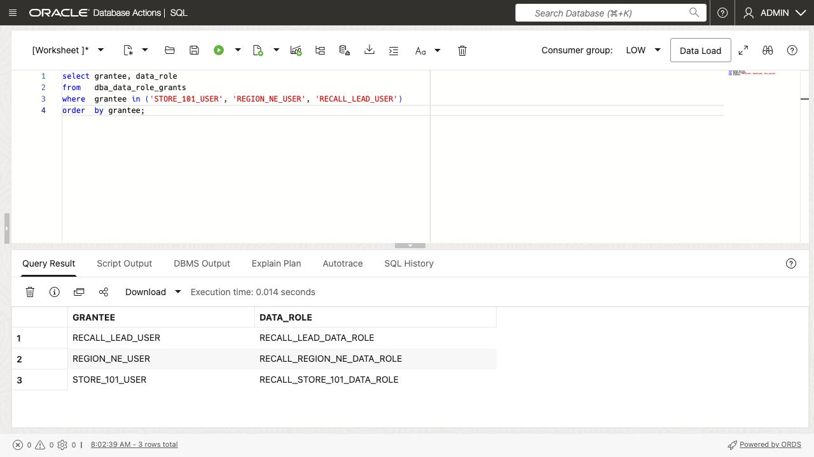

## Task 3: Test the Same Queries as Three Users (Optional)

If you do not have SQL Developer desktop, the Oracle SQL Developer extension for VS Code, or SQLcl, skip Tasks 3–4 and continue to Lab 8 to test the user scopes in the app. The data roles and grants you completed in Tasks 1–2 are used by the app.

Kevin wants proof that changing the signed-in user changes the result without changing the application query. Tim tests database results before asking the assistant anything.

Open a direct database connection in SQL Developer desktop, the Oracle SQL Developer extension for VS Code, or SQLcl. Use your workshop database connect string and the credentials for the end user named in each step. Check Step 1 after every login. Do not use an ADMIN session or change only the current schema.

The examples below and in Task 4 are SQLcl transcript reference output, not SQL Developer Web screenshots. They illustrate result content rather than the appearance of your worksheet. Red outlines identify the counts and successful no-row security checks.

1. Connect as **STORE\_101\_USER** and confirm the end-user identity.

    ```sql
    <copy>
    select json_value(ora_end_user_context, '$.USERNAME'
                      returning varchar2(128)) as end_user;
    </copy>
    ```

    Expect STORE\_101\_USER. If it is null or different, correct the connection before continuing.

2. Check the active data role.

    ```sql
    <copy>
    select role_name
    from   v$end_user_data_role
    order  by role_name;
    </copy>
    ```

    Expect RECALL\_STORE\_101\_DATA\_ROLE.

3. Count the affected stores and units visible to this user.

    ```sql
    <copy>
    select count(distinct si.store_id) as affected_stores,
           coalesce(sum(si.units_sent), 0) as units_sent
    from   shipments sh
    join   shipment_items si on si.shipment_id = sh.shipment_id
    where  sh.batch_id = 'B-482';
    </copy>
    ```

    Expect **1 store and 12 units**.

4. Count the potentially exposed customers visible to this user.

    ```sql
    <copy>
    select count(distinct customer_id) as customers
    from   purchases
    where  batch_id = 'B-482';
    </copy>
    ```

    Expect **5 customers**.

    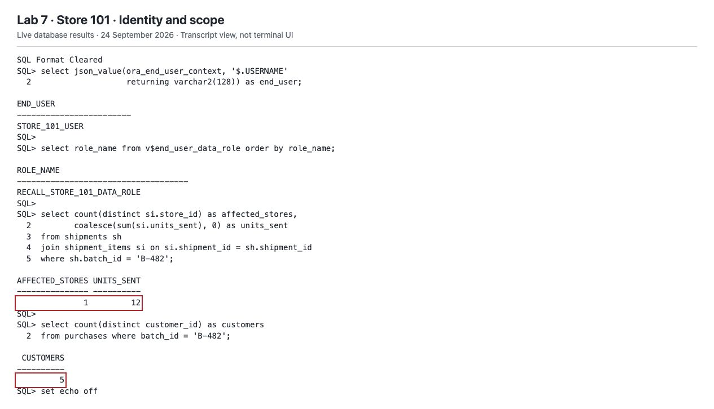

5. Search for the strongest permitted complaint matches. The search uses the vector from Lab 4; access rules determine which complaint chunks are available to search.

    ```sql
    <copy>
    select cc.complaint_id,
           round(vector_distance(cc.embedding, q.query_vector, cosine), 4) as distance,
           cc.chunk_text
    from   complaint_chunks cc
    cross  join recall_queries q
    where  q.query_key = 'HEAT_ODOR'
    and    vector_distance(cc.embedding, q.query_vector, cosine) < 0.70
    order  by distance
    fetch first 5 rows only;
    </copy>
    ```

    Expect complaint 9001. The distance ceiling excludes weak matches.

6. Test a specific complaint outside Store 101's scope.

    ```sql
    <copy>
    select complaint_id, chunk_text
    from   complaint_chunks
    where  complaint_id = 9003;
    </copy>
    ```

    Expect **no rows**. This is a successful security check, not missing seed data.

    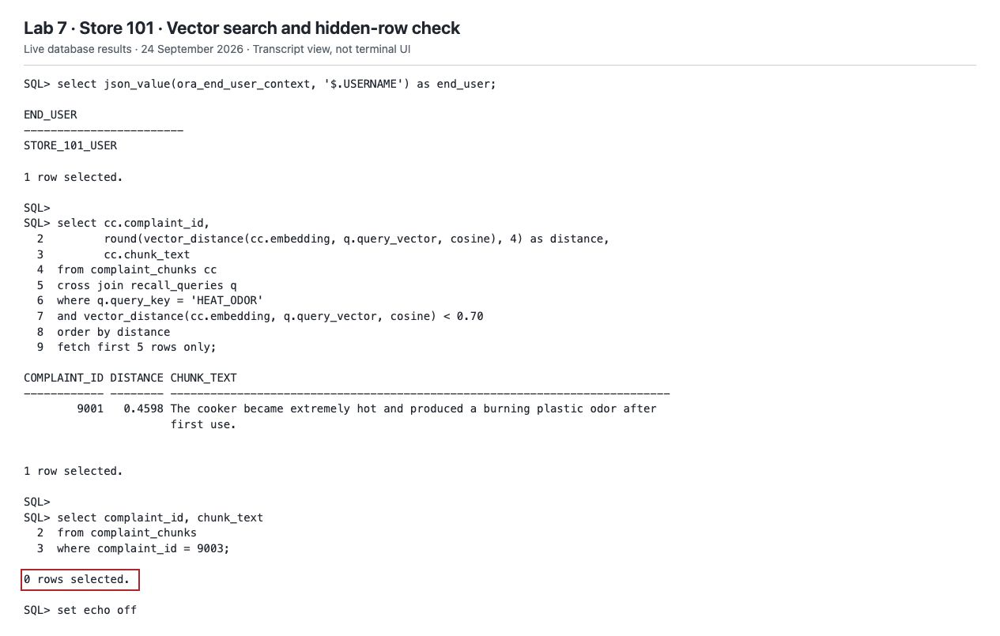

7. Reconnect as **REGION\_NE\_USER** and repeat Steps 1–6 without changing the SQL. Expect the Northeast data role, **24 stores, 453 units, and 120 customers**, with semantic matches 9001, 9002, and 9006. Complaint 9003 remains outside this workshop region's scope.

    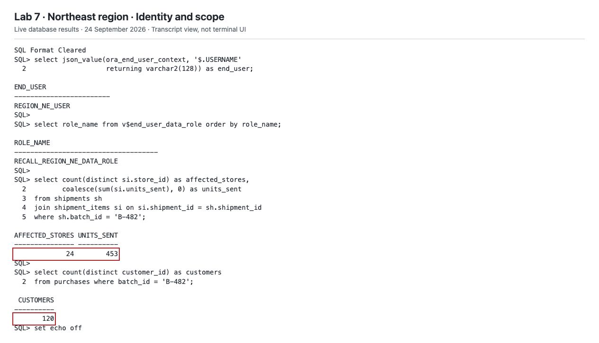

    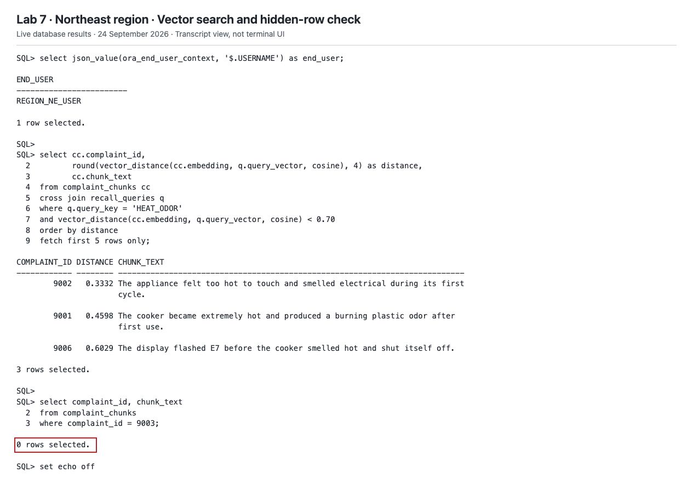

8. Reconnect as **RECALL\_LEAD\_USER** and repeat Steps 1–6. Expect the lead data role, **120 stores, 2,400 units, and 600 customers**. Semantic matches include 9001, 9002, 9006, 9003, and 9007. Step 6 now returns complaint 9003.

    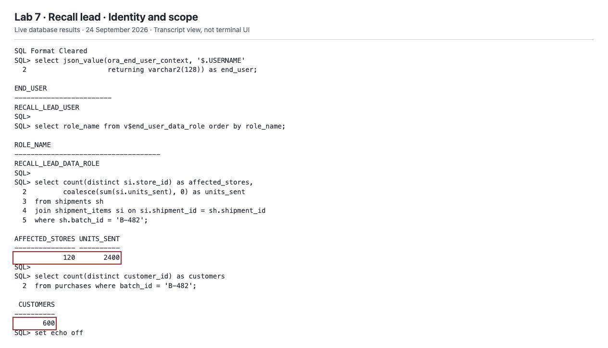

    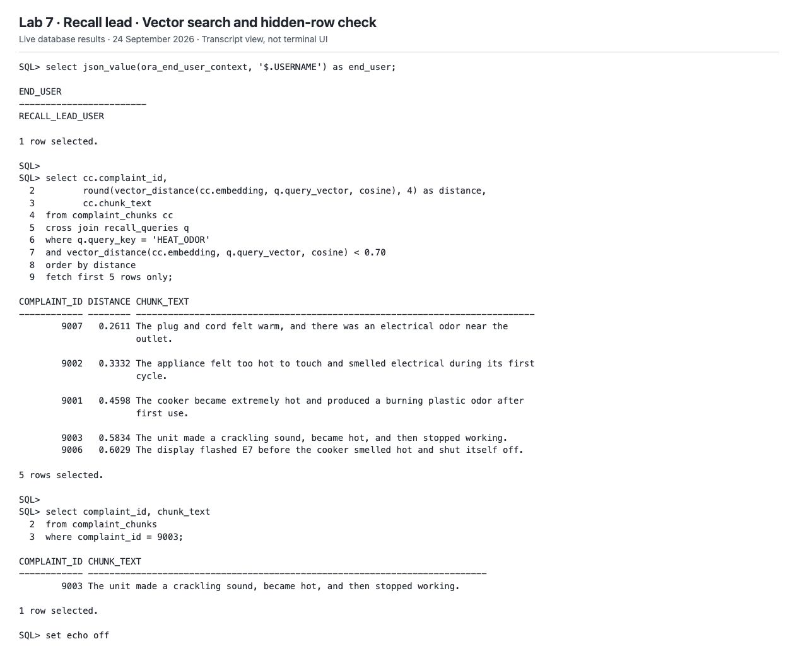

## Task 4: Give the Assistant Only Permitted Evidence (Optional)

This task is also optional and requires the same direct end-user connections as Task 3. If you skipped Task 3 because you do not have a supported client or connection details, continue to Lab 8 to test the assistant through the app.

Kevin wants the assistant to explain those same results. The prepared RECALL\_SECURE\_API package gathers facts using the caller's data roles. Its capture function stores that filtered document for an owner-side service to summarize. The service does not repeat the queries with wider access.

RECALL\_AGENT\_BRIDGE and RECALL\_SECURED\_TEAM already exist. The team has no retrieval tools: it summarizes the supplied evidence. These prepared components also support the application in Lab 8.

1. Connect as **STORE\_101\_USER**. Preview the document the assistant will receive.

    ```sql
    <copy>
    select json_serialize(
               recall_secure_api.get_secured_context('B-482')
               returning clob pretty
           ) as authorized_evidence;
    </copy>
    ```

    Open the CLOB value to read the full JSON. Compare endUser, affectedStoreCount, unitsSent, customerExposureCount, and semanticComplaints with Task 3. Customer names and email fields are excluded; complaint text still needs the same access protection as its source records.

    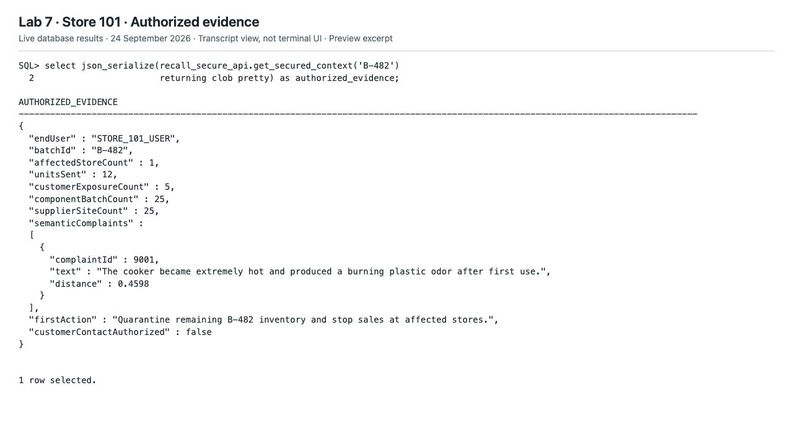

2. Capture this user's evidence. Run this block as a script. Enable DBMS Output for the connection to see the request ID.

    ```sql
    <copy>
    declare
        l_request_id number;
    begin
        l_request_id := recall_secure_api.capture_secured_context('B-482');
        dbms_output.put_line('Captured request ID: ' || l_request_id);
    end;
    /
    </copy>
    ```

    This stores and commits a snapshot; it does not change the recall case. Run capture as the end user, not RECALL\_OWNER.

3. Repeat Steps 1–2 as **REGION\_NE\_USER**, then as **RECALL\_LEAD\_USER**. Each login produces a separate snapshot with its own permitted counts and complaints.

4. Reconnect as **RECALL\_OWNER** and confirm that all three users captured evidence.

    ```sql
    <copy>
    select end_user_name, max(request_id) as latest_request_id
    from   recall_authorized_requests
    where  batch_id = 'B-482'
    and    end_user_name in ('STORE_101_USER', 'REGION_NE_USER', 'RECALL_LEAD_USER')
    group  by end_user_name
    order  by end_user_name;
    </copy>
    ```

    Expect three rows. Capture any missing user's evidence before continuing.

    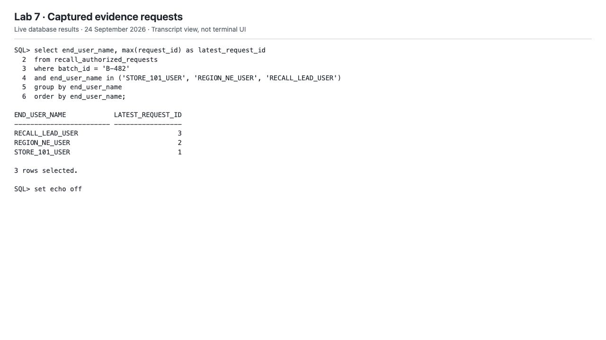

5. Ask the assistant to summarize the latest Store 101 snapshot.

    ```sql
    <copy>
    select recall_agent_bridge.summarize_context(
               json_serialize(context_json returning clob)
           ) as agent_answer
    from   recall_authorized_requests
    where  request_id = (
               select max(request_id)
               from   recall_authorized_requests
               where  batch_id = 'B-482'
               and    end_user_name = 'STORE_101_USER'
           );
    </copy>
    ```

    The response appears in **AGENT\_ANSWER**. Open the CLOB cell for the full answer. This sends the captured evidence to the configured OCI Generative AI service.

6. Run Step 5 twice more, changing only STORE\_101\_USER to REGION\_NE\_USER, then RECALL\_LEAD\_USER. Compare the answers with these database checkpoints, not an exact sentence.

| End user           | Stores | Units  | Customers | Semantic complaint IDs       |
| --------------------| -------:| -------:| ----------:| ------------------------------|
| STORE\_101\_USER   | 1      | 12     | 5         | 9001                         |
| REGION\_NE\_USER   | 24     | 453    | 120       | 9001, 9002, 9006             |
| RECALL\_LEAD\_USER | 120    | 2,400 | 600       | 9001, 9002, 9006, 9003, 9007 |
    {: title="Expected results"}

    All roles share 25 component batches and 25 supplier sites. The first response remains quarantine and stop sales; customer contact is not yet authorized. Reject answers that invent facts or expand beyond the supplied evidence. Access filtering does not eliminate model errors.

    The following image is a prior scripted transcript combining three answers. Its PL/SQL completion message does not represent the `SELECT` in Step 5. For the current steps, verify the `AGENT_ANSWER` CLOB returned separately for each user; use the image only as a reference for answer content.

    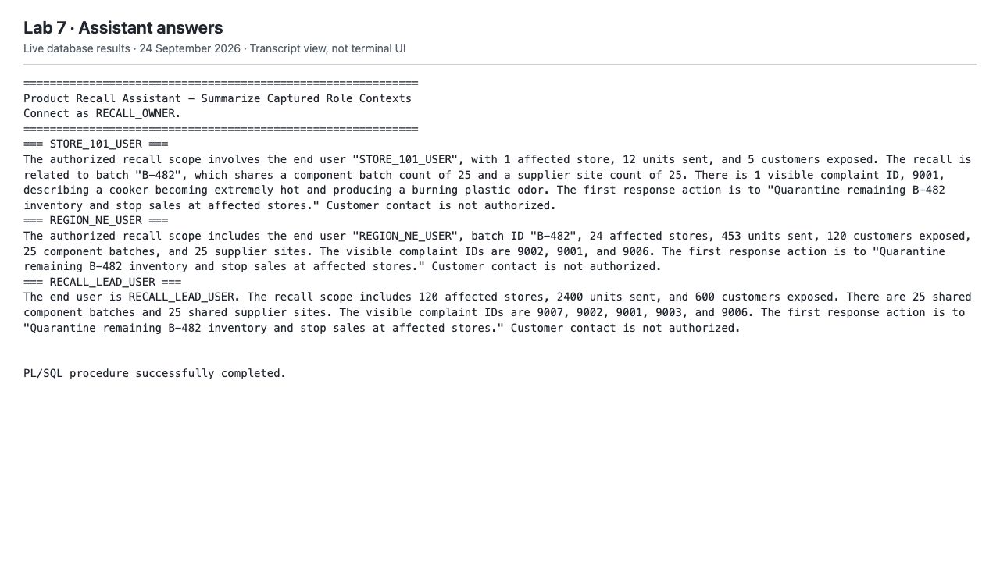

## Conclusion

You built the rules that let one returns application serve three responsibilities. If you completed the optional exercises, you verified that the same SQL returned different store, unit, customer, and complaint results because the signed-in users had different data roles. Otherwise, you will compare those scopes in the Lab 8 app.

For Kevin, the application can answer local, regional, and company-wide questions without exposing every record to every user. For David, Oracle AI Database keeps access rules with both business records and complaint vectors. There is no separate vector store requiring another copy of those rules. Tim retrieves permitted evidence before passing it to the assistant; a prompt is not a substitute for database authorization.

Lab 8 uses these packages and data roles in the Recall Command Center.

## Next Steps

Continue to Lab 8 to use the Recall Command Center with the three end-user accounts.

### Shortcut

If an earlier lab is incomplete, use this shortcut to apply the database changes from the SQL examples in Labs 1–7. It uses your existing workshop setup: RECALL\_OWNER, the other accounts and their passwords, the prepared packages, the embedding model, and the GenAI profile and credentials stay in place. You do not need to enter a GenAI region or compartment OCID.

The shortcut reapplies the lab's named views, graph, assistant tools, team, map endpoint, and access rules. It also populates the lab's spatial and vector columns. It can replace changes you made to those lab objects, but it does not reload the sample data or rebuild the provisioned environment. Missing or incompatible prerequisites are reported as errors.

1. Close any running workshop queries and the Recall Command Center. Open **SQL Developer Web** for your workshop database and sign in as **ADMIN**.

2. Run the following block with **Run Script**. `DBMS_CLOUD.GET_OBJECT` downloads [shortcut.sql](https://c4u04.objectstorage.us-ashburn-1.oci.customer-oci.com/p/EcTjWk2IuZPZeNnD_fYMcgUhdNDIDA6rt9gaFj_WZMiL7VvxPBNMY60837hu5hga/n/c4u04/b/livelabsfiles/o/database/shortcut.sql) from Object Storage, and `DBMS_CLOUD_REPO.INSTALL_SQL` executes its contents. The version check prevents an older, incompatible shortcut from running.

    ```sql
    <copy>
    declare
        l_script clob;
    begin
        l_script := to_clob(dbms_cloud.get_object(
            credential_name => null,
            object_uri => 'https://c4u04.objectstorage.us-ashburn-1.oci.customer-oci.com/p/EcTjWk2IuZPZeNnD_fYMcgUhdNDIDA6rt9gaFj_WZMiL7VvxPBNMY60837hu5hga/n/c4u04/b/livelabsfiles/o/database/shortcut.sql'
        ));

        if dbms_lob.substr(l_script, 58, 1) !=
           '-- Product Recall Assistant - Labs 1-7 learner shortcut v3' then
            raise_application_error(-20001,
                'The hosted shortcut is not the current Labs 1-7 version. Replace the hosted file before retrying.');
        end if;

        dbms_cloud_repo.install_sql(
            content => l_script,
            stop_on_error => true
        );
    end;
    /
    </copy>
    ```

3. The script submits the lab work to database Scheduler jobs. **Submission does not mean setup has finished.** Run this query as ADMIN to check its progress. Rerun only the query while it is running, not the installation block.

    ```sql
    <copy>
    select run_id, state, phase, detail, submitted_at, updated_at, finished_at
    from admin.recall_shortcut_status
    where id = 1;
    </copy>
    ```

    - **SUBMITTED** or **RUNNING**: the work has not finished. Check again later.
    - **SUCCEEDED**: the lab changes and included database checks completed. Continue to Lab 8 with your existing account passwords.
    - **FAILED**: read **PHASE** and **DETAIL**, correct the reported issue, and then rerun the installation block. Changes completed before an error may already be committed.

    If the installation block reports an error before submission, correct that error first. A status row from a previous run does not confirm that a new submission succeeded.

4. In Lab 8, check the results for all three end-user accounts. This shortcut applies the lab setup statements; it does not perform the interactive questions, real end-user login and data-filtering checks, or browser and HTTP authentication checks. It does not create captured evidence requests on behalf of users.

## Learn More

- [Securing Vector Search with Deep Data Security in Oracle AI Database](https://medium.com/@thomas.minne/securing-vector-search-with-deep-data-security-in-oracle-ai-database-c2fe0c4dd736)
- [Configure direct logon with local end users](https://docs.oracle.com/en/database/oracle/oracle-database/26/ddscg/configure-oracle-deep-data-security-direct-logon-local-end-users.html)
- [Create Deep Data Security data grants](https://docs.oracle.com/en/database/oracle/oracle-database/26/ddscg/create-data-grants.html)
- [End-user security context](https://docs.oracle.com/en/database/oracle/oracle-database/26/ddscg/end-user-security-context.html)

## Acknowledgements

- **Author:** Tim Cline, Product Management Architect
- Contributors: David Start, Director and Kevin Lazarz, Senior Manager
- **Last updated:** October 2026
