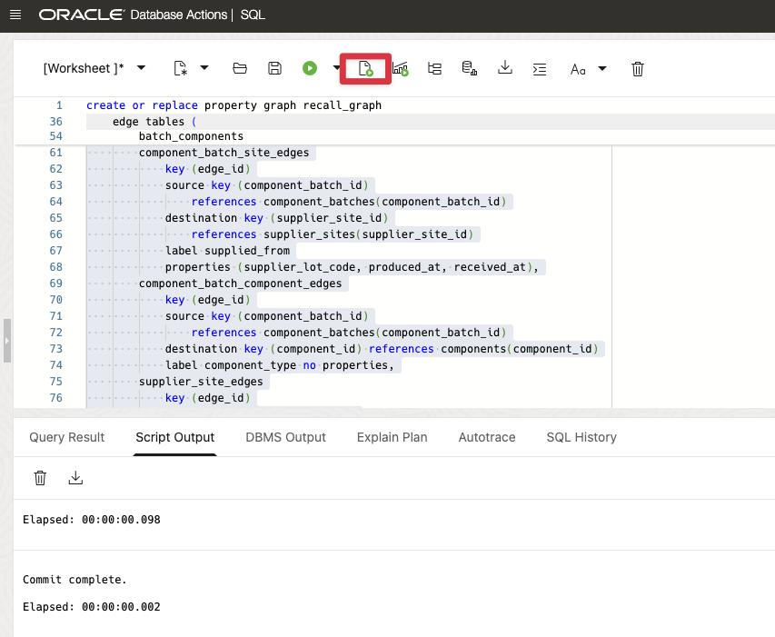
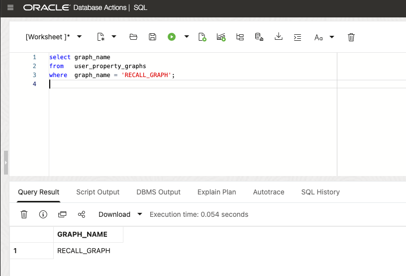
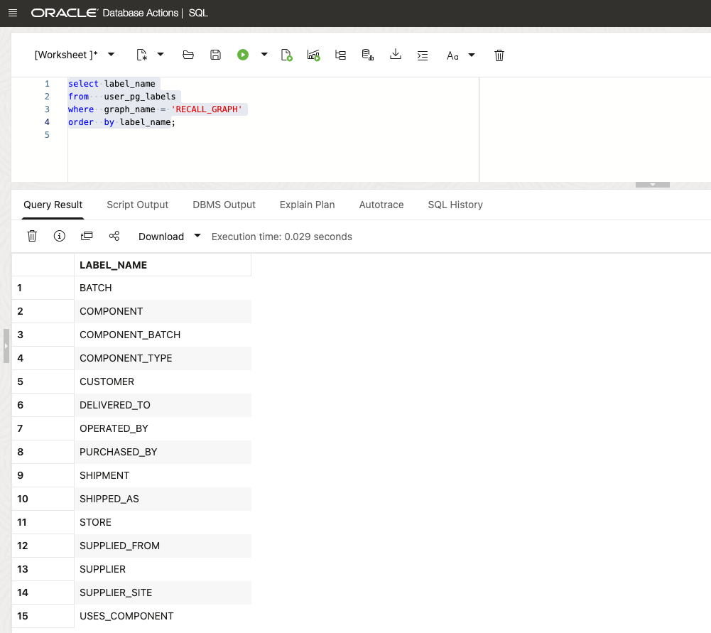
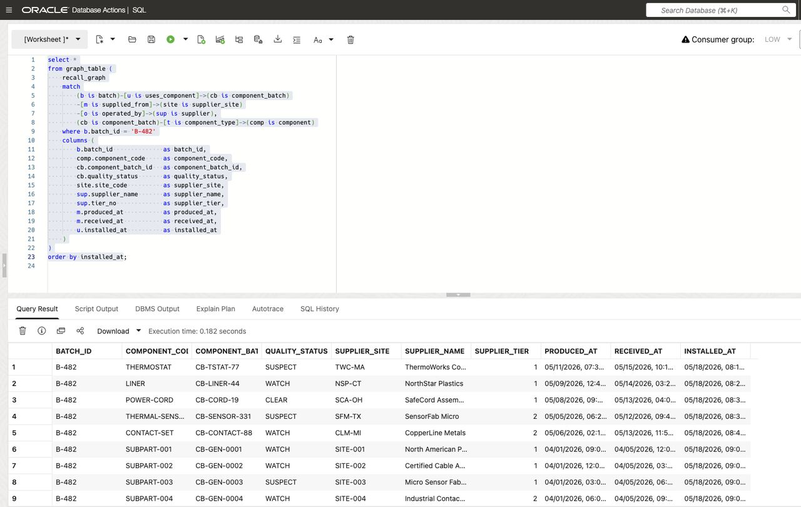
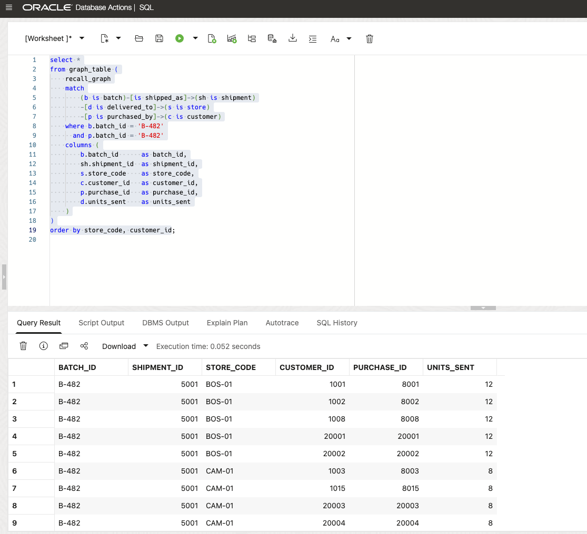
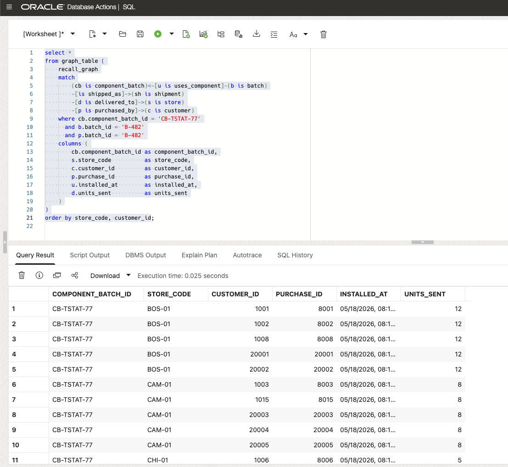

# Lab 3: Find the Source and the Reach: Trace Recall Paths with SQL Property Graph

## Introduction

With stores assigned to response centers, Kevin now asks a different question: if a customer returns a HeatPro unit, where did its components come from, and which customers may have received units from the same batch? The answer spans component lots, supplier sites, store deliveries, and purchases. A list of separate tables makes that hard to follow.

David defines those existing recall tables as a graph. The graph is not a separate copy of the data. It gives the team a direct way to follow a route upstream from B-482 to components and suppliers, or downstream through shipments, stores, purchases, and customers.

Tim creates `RECALL_GRAPH` and uses `GRAPH_TABLE` to query those routes. The graph definition describes how the existing relational rows connect. Tim can answer Kevin's questions with SQL instead of building long manual joins or moving data to another system.

By the end of the lab, the database can show the 25 component lots used in B-482, their suppliers, and the 600 customer records connected to 120 affected stores. David can use those results in the returns workflow.

Estimated Time: 10 minutes

### Objectives

In this lab, you will:

- Create `RECALL_GRAPH` over the recall relational tables.
- Inspect the property graph definition.
- Trace `B-482` to component batches, supplier sites, and suppliers.
- Trace `B-482` to shipments, stores, purchases, and customers.
- Connect a suspect component lot to downstream customer links.

## Task 1: Create the Recall Property Graph

Kevin needs to follow one connected route, rather than compare separate lists of batch, supplier, store, and customer identifiers. David defines the graph over the current tables; Tim creates and verifies it.

1. Create the property graph over the relational tables.

    ```sql
    <copy>
    create or replace property graph recall_graph
        vertex tables (
            batches
                key (batch_id)
                label batch
                properties (batch_id, recall_status, issue_code),
            shipments
                key (shipment_id)
                label shipment
                properties (shipment_id, batch_id, shipped_on),
            stores
                key (store_id)
                label store
                properties (store_id, store_code, store_name, region_code),
            customers
                key (customer_id)
                label customer
                properties (customer_id, full_name, home_store_id),
            components
                key (component_id)
                label component
                properties (component_id, component_code, component_name, criticality),
            component_batches
                key (component_batch_id)
                label component_batch
                properties (component_batch_id, quality_status, supplier_lot_code),
            supplier_sites
                key (supplier_site_id)
                label supplier_site
                properties (supplier_site_id, site_code, site_name, city, state_code),
            suppliers
                key (supplier_id)
                label supplier
                properties (supplier_id, supplier_name, tier_no, supplier_type)
        )
        edge tables (
            batch_shipments
                key (batch_shipment_id)
                source key (batch_id) references batches(batch_id)
                destination key (shipment_id) references shipments(shipment_id)
                label shipped_as no properties,
            shipment_items
                key (shipment_item_id)
                source key (shipment_id) references shipments(shipment_id)
                destination key (store_id) references stores(store_id)
                label delivered_to
                properties (shipment_item_id, units_sent),
            purchases as store_to_customer
                key (purchase_id)
                source key (store_id) references stores(store_id)
                destination key (customer_id) references customers(customer_id)
                label purchased_by
                properties (purchase_id, batch_id, purchased_on, quantity),
            batch_components
                key (batch_component_id)
                source key (batch_id) references batches(batch_id)
                destination key (component_batch_id)
                    references component_batches(component_batch_id)
                label uses_component
                properties (quantity_per_unit, installed_at, assembly_station),
            component_batch_site_edges
                key (edge_id)
                source key (component_batch_id)
                    references component_batches(component_batch_id)
                destination key (supplier_site_id)
                    references supplier_sites(supplier_site_id)
                label supplied_from
                properties (supplier_lot_code, produced_at, received_at),
            component_batch_component_edges
                key (edge_id)
                source key (component_batch_id)
                    references component_batches(component_batch_id)
                destination key (component_id) references components(component_id)
                label component_type no properties,
            supplier_site_edges
                key (edge_id)
                source key (supplier_site_id)
                    references supplier_sites(supplier_site_id)
                destination key (supplier_id) references suppliers(supplier_id)
                label operated_by no properties
        )
        options (enforced mode);

    commit;
    </copy>
    ```
    

    The graph stores metadata over the existing relational tables. It does not copy the recall data into a separate graph store. `OPTIONS (ENFORCED MODE)` validates the graph keys and references when Oracle creates the graph.

    The block above is the complete rerunnable graph definition.

2. Verify that the graph was created.

    ```sql
    <copy>
    select graph_name
    from   user_property_graphs
    where  graph_name = 'RECALL_GRAPH';
    </copy>
    ```

    

3. Inspect the graph labels.

    ```sql
    <copy>
    select label_name
    from   user_pg_labels
    where  graph_name = 'RECALL_GRAPH'
    order  by label_name;
    </copy>
    ```

    The graph includes batches, shipments, stores, customers, components, component batches, supplier sites, and suppliers. The relational tables and their graph-supporting indexes were prepared during Lab 1. The existing `BATCH_COMPONENTS_UQ` key supports the batch-component edge.

    

## Task 2: Trace Upstream Component Lots

Kevin needs to identify the suppliers behind the component lots used in B-482. David follows the graph upstream; Tim queries the supplier and component routes.

1. Traverse from batch `B-482` to component batches, supplier sites, and suppliers.

    ```sql
    <copy>
    select *
    from graph_table (
        recall_graph
        match
            (b is batch)-[u is uses_component]->(cb is component_batch)
            -[m is supplied_from]->(site is supplier_site)
            -[o is operated_by]->(sup is supplier),
            (cb is component_batch)-[t is component_type]->(comp is component)
        where b.batch_id = 'B-482'
        columns (
            b.batch_id              as batch_id,
            comp.component_code     as component_code,
            cb.component_batch_id   as component_batch_id,
            cb.quality_status       as quality_status,
            site.site_code          as supplier_site,
            sup.supplier_name       as supplier_name,
            sup.tier_no             as supplier_tier,
            m.produced_at           as produced_at,
            m.received_at           as received_at,
            u.installed_at          as installed_at
        )
    )
    order by installed_at;
    </copy>
    ```

    The result returns 25 component paths. It includes the curated thermal sensor and contact-set suppliers plus generated tier-1 and tier-2 sub-vendor lots.

    

## Task 3: Find Customers Connected to the Batch

Kevin needs to identify the customer records connected to affected units. David follows the same graph downstream; Tim traces shipments, stores, and purchases.

1. Traverse from batch `B-482` to shipments, stores, purchases, and customers.

    ```sql
    <copy>
    select *
    from graph_table (
        recall_graph
        match
            (b is batch)-[is shipped_as]->(sh is shipment)
            -[d is delivered_to]->(s is store)
            -[p is purchased_by]->(c is customer)
        where b.batch_id = 'B-482'
          and p.batch_id = 'B-482'
        columns (
            b.batch_id      as batch_id,
            sh.shipment_id  as shipment_id,
            s.store_code    as store_code,
            c.customer_id   as customer_id,
            p.purchase_id   as purchase_id,
            d.units_sent    as units_sent
        )
    )
    order by store_code, customer_id;
    </copy>
    ```

    The graph returns 600 customer links across 120 affected stores.

    

2. Note the modeling choice:

    - Graph paths make relationship questions easier to ask.
    - The source tables keep their existing relational rules.
    - The graph definition does not copy data into a separate store.

## Task 4: Connect a Component Lot to Customers

Kevin needs to connect a suspect component lot to the customers who may need a return notice. David connects both directions; Tim returns the full route.

1. Trace the suspect thermostat lot to downstream customers.

    ```sql
    <copy>
    select *
    from graph_table (
        recall_graph
        match
            (cb is component_batch)<-[u is uses_component]-(b is batch)
            -[is shipped_as]->(sh is shipment)
            -[d is delivered_to]->(s is store)
            -[p is purchased_by]->(c is customer)
        where cb.component_batch_id = 'CB-TSTAT-77'
          and b.batch_id = 'B-482'
          and p.batch_id = 'B-482'
        columns (
            cb.component_batch_id as component_batch_id,
            s.store_code          as store_code,
            c.customer_id         as customer_id,
            p.purchase_id         as purchase_id,
            u.installed_at        as installed_at,
            d.units_sent          as units_sent
        )
    )
    order by store_code, customer_id;
    </copy>
    ```

    The suspect thermostat lot reaches all 600 exposed customers because batch `B-482` used that lot.

    

2. This query connects the component lot, batch, store, and customer records in one result.

You have completed Lab 3. Lab 4 uses AI Vector Search to find complaints about heat and odor.

## Conclusion

The database can now answer Kevin's returns questions directly: which suppliers provided the lots used in B-482, which stores received the batch, and which customer records connect to those stores. The returns application can use these results to explain why a unit is included in the process.

David keeps the relational tables and the graph in Oracle AI Database. The team does not need a separate graph database, duplicate recall data, or an integration to keep two systems aligned. Tim uses SQL to follow the relationships already stored in the database.

## Learn More

- [Create a SQL property graph](https://docs.oracle.com/en/database/oracle/oracle-database/26/sqlrf/create-property-graph.html)
- [Oracle Property Graph Developer Guide](https://docs.oracle.com/en/database/oracle/property-graph/26.1/spgdg/)

## Acknowledgements

- **Author:** Tim Cline, Product Management Architect
- Contributors: David Start, Director and Kevin Lazarz, Senior Manager
- **Last updated:** October 2026
