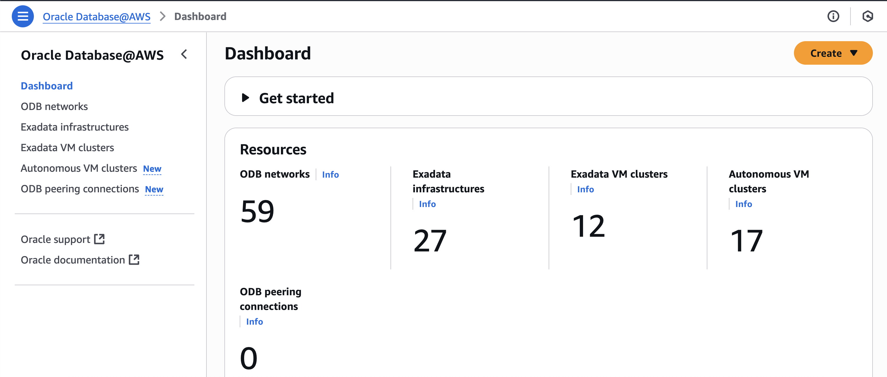

# Get started - ODB networks

## Introduction

Oracle Database@AWS is a cloud service that enables you to run Oracle Database workloads within your AWS environment, while leveraging Oracle Cloud Infrastructure (OCI) for management and control.

When using this solution, resources are deployed across two cloud platforms: the database itself runs in AWS, while the administrative control plane remains in OCI. This setup allows you to operate Oracle databases directly in AWS while benefiting from OCI’s robust management capabilities.

This lab walks you through the prerequisites to get started with Oracle Database@AWS - Autonomous Database. This involves creating a ODB network, ODB peering connections with VPC.

## Onboarding to Oracle Database@AWS

Before getting started with Oracle Database@AWS, ensure you have an active AWS account and have created the required user roles. Once set up, you can subscribe to Oracle Database@AWS through the AWS Marketplace by accepting a private offer from Oracle.

You can find more information about onboarding [here](https://docs.aws.amazon.com/odb/latest/UserGuide/setting-up.html).

## Architecture

- Oracle Database@AWS brings Oracle Database functionality to AWS Availability Zones as a native service. The architecture diagram below illustrates the core topology, with application resources deployed in a VPC within an AWS region.

    

Oracle Exadata Infrastructure runs within an OCI-managed child site inside the ODB network (a specialized AWS VPC), which is dedicated to Oracle Database@AWS. The Oracle Exadata dedicated infrastructure can simultaneously host VM Clusters for both Exadata Database Service and Autonomous Database Service.  Customer applications hosted in an AWS application VPC connect to Oracle Database@AWS using supported database connection methods. This tutorial will focus on Autonomous Database Service.

Estimated Time: 15 minutes

### Objectives

As a database user, network architect, or application developer:

1. Create an ODB network and peer with VPC in AWS portal.

## Task 1: Create an ODB network

- Login to AWS Portal (portal.aws.amazom.com) and navigate to All services. Then click on the **Oracle Database@AWS**.

    

- The dashboard provides a summary view of the resources in your tenancy, including ODB networks, Exadata infrastructures, Exadata VM clusters, Autonomous VM clusters, and ODB peering connections.

    

- On the Oracle Database@AWS’ dashboard page, click on the ‘ODB networks’.

    

- You can view existing ODB networks and also create a new ODB network directly from the details page. Click on 'Create ODB network'.

    

- Enter your 'ODB network name', select 'Availability Zone', enter the IP address range for the 'client network', and optionally enter the IP address range for the 'backup network'.

    

    When selecting a network topology, consider the following Oracle Exadata Database Service VM cluster networking:
    - Locate Application VPCs in the same Availability Zone as the ODB network and Exadata infrastructure hosting the VM cluster or Autonomous VM Cluster.
    - Carve out two non-overlapping CIDR ranges.
    - Define one CIDR range for the 'Client subnet' with a minimum /27. Oracle recommends that you use /24 for the Client subnet CIDR to accommodate future expansion.
    - Define one CIDR for the 'Backup subnet' with a minimum of /28.
    - IPs are automatically assigned to Autonomous VM clusters from the CIDR range in the Client subnet.

- Oracle Database@AWS automatically configures DNS for the ODB network using the pre-configured domain oraclevcn.com. Optionally, you can also specify a custom domain prefix during ODB network provisioning.

    

- Optionally, you can configure network access for Amazon S3 (Database backups) and Zero-ETL and click on 'Create ODB network'. NOTE: Oracle Database@AWS pre-configures your network access for Oracle managed automatic backups to Amazon S3.

    

- Once created, you can view your ODB network on the 'ODB networks' details page.

    

## Task 2:  ODB peering connections
- From 'Oracle Database@AWS' dashboard, click on 'ODB peering connections'.

    

- Click on 'Create ODB peering connection' to create a peer between ODB network and VPC. 

    

- Enter the 'ODB peering name', choose the 'ODB network' that contains you Autonomous VM Cluster, and finally choose the VPC 'Peer network' where your applications exists.

    

- Optionally, Add Tags and click on 'Create ODB peering connection'.

    

You may now **proceed to the next lab** to provision Exadata infrastructure.

## Acknowledgements

*All Done! You have successfully created ODB network and ODB peering connection.*

- **Author** - Tejus Subrahmanya, Principal Product Manager, Autonomous Database 

- **Last Updated By/Date** - Tejus Subrahmanya, June 2025