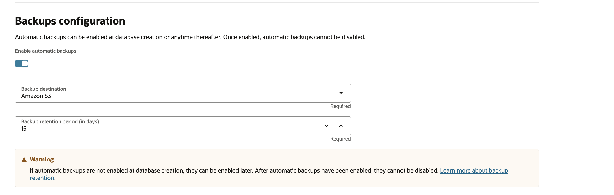

# Create and Manage Autonomous Container Database

## Introduction
Autonomous Container Database (ACD) is one of the four components of the four-level database architecture model, which is the foundation for an Autonomous Database on Dedicated Exadata Infrastructure. ACDs are provisioned inside an Autonomous Exadata VM Cluster (AVMC) and serve as containers for one or more Autonomous Databases.

You can create multiple ACD resources in a single AVMC resource, but you must create at least one before you can create any Autonomous Databases. Click [here](https://docs.oracle.com/en/cloud/paas/autonomous-database/dedicated/adbaa/index.html#GUID-268B36E1-87D8-4649-A370-226E2AE3FC5C) to gain a comprehensive understanding of the four-layer architecture used with the an Autonomous Database on Dedicated Exadata Infrastructure and to understand the positioning of ACD within this architecture.

In this lab, you will learn how to Create and Manage Autonomous VM Cluster.

Estimated Time: 30 minutes

### Objectives

1. Create Autonomous Container Databases
2. Manage Autonomous Container Databases

### Prerequisites
- A pre-provisioned ODB Network
- A pre-provisioned Oracle Exadata Infrastructure
- A pre-provisioned Autonomous VM Cluster

## Task 1: Create Autonomous Container Database

- Autonomous Container Database creation is managed from the OCI Console. From your AVMC details page in AWS, click “Manage in OCI” and log in to your OCI tenancy.

  

- Click on Oracle Database from the OCI Menu, and select Autonomous Database on Dedicated infrastructure.

  

  - Expand the Menu and select Autonomous Container Database.

  

  - ACD Details page lists all the available Autonomous Container Databases in the selected Compartment.

  

  - To Create an ACD, Click on Create Autonomous Container Database. Enter a Display Name, Select a Compartment, enter ACD name, and choose the Exadata infrastructure and AVMC you want the ACD to be in. 

  

- In the Basic Information, select the Oracle Database version from a Base image or Custom image you have created. Learn more about Base images and Customer image [here](https://docs.oracle.com/en/cloud/paas/autonomous-database/dedicated/adbaz/).

  

- Automatic maintenance configuration allows you to configure Maintenance method, ACD maintenance version, and Maintenance schedule.

  

- Click on Modify maintenance schedule to Edit automatic maintenance. Click [here](https://docs.oracle.com/en/cloud/paas/autonomous-database/dedicated/uzzru/index.html) to learn more Maintenance Preferences and best practices.

  

- In the Configure database backups section, configure database backups by specifying the settings for backing up the database.

  Enable automatic backup: Select to enable automatic backups for this database.
  
  NOTE: Automatic backups are stored in Amazon S3 by default, but you can choose to change the backup destination to Oracle Object Storage if preferred.

  

- Enter Customer Contact to receive notifications and announcements.

  

- Advanced options: Autonomous Database resource management 
  
    Resource management attributes affect how resources are managed to either consolidate more databases or have the highest database availability.
    
    Database split threshold (CPU): The CPU value beyond which an Autonomous Database will be opened across multiple nodes.
    
    Node failover reservation (%): Determines the percentage of CPUs reserved across nodes to support node failover.
    
    Distribution affinity: Determines whether an Autonomous Database must be opened across a minimum or maximum of nodes.

  

- Advanced options: Net services architecture

    Optionally, you can enable Shared Server architecture which enables a database server to allow many client processes to share very few server processes. 

  

- Advanced options: Encryption key

    In the Encryption section, to manage your database keys select Encrypt using an Oracle-managed key or Encrypt using a customer-managed key in this tenancy.  For more information about the options to manage your database keys, see [Master Encryption Keys in Autonomous Database](https://docs.oracle.com/en/cloud/paas/autonomous-database/dedicated/adbcz/index.html#articletitle)

  

- Optionally, you can add Tags to the ACD. 

  

## Task 2: Manage Autonomous Container Database

  The Autonomous Data Guard (AuDG) feature of Autonomous Database on Dedicated Exadata Infrastructure enables you to keep your critical production databases available to mission critical applications despite failures, disasters, human error, or data corruption. This kind of capability is often called disaster recovery.
  Autonomous Container Databases (ACDs) can enable Autonomous Data Guard from their Details page and create up to two standby ACDs. Click [here](https://docs.oracle.com/en/cloud/paas/autonomous-database/dedicated/adbau/index.html#articletitle) to learn more about AuDG.

- To enable AuDG, navigate to the ACD details page in OCI console, and click on Autonomous Data Guard associations.

  

  - Click on Add Standby and pick the Region, Exadata infrastructure, Autonomous VM Cluster and Protection mode. 

    

- To create a Custom Database Software image, click on Actions in ACD details page and Select Create image from database. 

    

- Select a compartment, and type in a Display name and click Create. 

    

- To view the existing Autonomous Database Software images, click on Autonomous Database Software from the side Menu under Resources. 

    

- To Rotate Encryption Keys for your database, click on Actions in the ADC Details Page and select Rotate Encryption Key.

    

- To View Resource usage within the ACD, click on View details under Resource Usage. This view displays a Chart or Table view for the Provisioned CPUs, Reserved and Reclaimable. Click [Compute Management in Autonomous Database](https://docs.oracle.com/en/cloud/paas/autonomous-database/dedicated/cmatt/index.html#articletitle) to learn more about CPU management in Autonomous Database.

    

    

- To modify the Backup setting for your Autonomous database, click on Actions under ACD details page, and select Edit backup settings. This will allow you to modify Backup retention period. 

    
    
    

You may now **proceed to the next lab** to provision Autonomous Database.

## Acknowledgements

*All Done! You have successfully created Autonomous Container Database.*

- **Author** - Tejus Subrahmanya, Principal Product Manager, Autonomous Database 

- **Last Updated By/Date** - Tejus Subrahmanya, June 2025