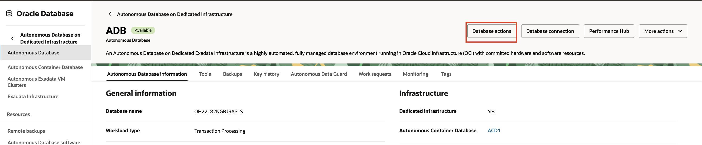

# Create and Manage Autonomous Database

## Introduction

An Autonomous Database (ADB) resource is a user database. You can create many Autonomous Databases in a single Autonomous Container Database resource. For an overview of Autonomous Databases, their features, and how to use them, see [About Autonomous Database](https://docs.oracle.com/en/cloud/paas/autonomous-database/dedicated/aadvv/index.html).

This lab walks you through the steps to provision and manage Autonomous Database. 

Estimated Time: 30 minutes

### Objectives

As a database user, DBA or application developer:

1. Rapidly deploy an Autonomous databases.

### Required Artifacts

- A pre-provisioned ODB Network
- A pre-provisioned Oracle Exadata Infrastructure
- A pre-provisioned Autonomous VM Cluster
- A pre-provisioned Autonomous Container Database

## Task 1: Create Autonomous Database

In this section, you will be provisioning an Autonomous database using the Azure portal.

- Autonomous Database creation is managed from the OCI Console. From your AVMC details page in AWS, click “Manage in OCI” and log in to your OCI tenancy.

  

- Click on Oracle Database from the OCI Menu, and select Autonomous Database on Dedicated infrastructure.

  

- Expand the Menu and select Autonomous Database.

  

- ADB Details page lists all the available Autonomous Databases in the selected Compartment.

  

- Click Create Autonomous Database to provision a new ADB. Enter a Display Name, Database name, Select a Compartment,and the Workload type. You can configure your database in two different modes based on the workload type, as: Autonomous Data Warehouse and Autonomous Transaction Processing. Click [here](https://docs.oracle.com/en/cloud/paas/autonomous-database/dedicated/adbaa/index.html#articletitle) to learn more about Workload types supported in Autonomous Database.

  

- Select the Autonomous Container Database (ACD) in which you want to provision ADB. You can also filter Autonomous Data Guard-enabled ACDs. 

  

- Under the Database configuration, enter the number of CPUs and amount of Storage you require for the database. 
    
    Autonomous Database for Developers instances are free Autonomous Databases that developers can use to build and test new applications.
    With Autonomous Database for Developers instances, you can try new Autonomous Database features for free and apply them to ongoing or new development projects. Developer database comes with limited resources and is, therefore, not suitable for large-scale testing and production deployments. When you need more compute or storage resources, you can transition to a paid database licensing by cloning your developer database into a regular Autonomous Database. Learn more about [Autonomous Database for Developers](https://docs.oracle.com/en/cloud/paas/autonomous-database/dedicated/eddjo/).

    Auto scaling enables a database to use up to three times more CPU and IO resources than its specified CPU count. When auto scaling is enabled, if your workload requires additional CPU and IO resources the database automatically uses the resources without any manual intervention required. Learn more about [Enable or Disable Auto Scaling](https://docs.oracle.com/en/cloud/paas/autonomous-database/dedicated/adban/index.html).

    

- Optionally, you can also Enable Elastic Pool for the ADB. 
   
    Use an elastic pool to consolidate your Autonomous Database instances, in terms of their allocation of compute resources, and to provide up to 87% cost savings. 
    Elastic pools help you improve operating efficiency and reduce costs by bringing all of your databases to the Cloud. This also supports consolidating resources and simplifying administration and operations by using Autonomous Database. When you need a large number of databases, that can scale up and down elastically without downtime, you can benefit by creating and using elastic pools. Learn more about [Elastic Pools](https://docs.oracle.com/en/cloud/paas/autonomous-database/dedicated/catiu/index.html#articletitle).

  

- Enter the Administrator credentials. Username for all Autonomous database will be ADMIN. Specify the password for the instance. 

  

- You can Configure Database-level network access by clicking Modify Access Control button.

    

    

- Enter customer contact information to receive operational notifications and announcements.
    
    

- Click on Advanced Options to view Encryption Key used, select Character set and National character set, to Enable Database In-Memory and add Tags.

    

- Click Create Autonomous Database to start provisioning the instance.

    

- Your autonomous database instance should be up and running in a few minutes.

- Once provisioned, you can click on the instance name to see instance details.

    

## Task 2: Manage Autonomous Database

- You can monitor the health, capacity, and performance of your Autonomous Databases using metrics, alarms, and notifications. These insights are available through the Oracle Cloud Infrastructure Console or observability APIs. Learn more about [Observability and Monitoring](https://docs.oracle.com/en/cloud/paas/autonomous-database/dedicated/lbdmm/index.html#GUID-85502CAA-6315-44E9-86D6-70AE09812FEB).

- Click on Monitoring under ADB details page. 

    

    

- Performance Hub allows you to monitor your databases over specific time periods and download detailed statistical reports. It provides both real-time and historical performance insights for Autonomous Databases.

- Click on Performance Hub from your ADB details page. 

    

    

- To download AWR Reports for your ADB, click on Reports and select Automatic Workload Repository and pick the Start and End Snapshot time and click Download. 

    

    

- Oracle Database Actions, a browser-based application that provides many database development, management and monitoring features, is built into Autonomous Database on Dedicated Exadata Infrastructure. Therefore, you can use it without downloading or installing additional software on your system. Learn more about [Manage and Observe Autonomous Database with Database Actions](https://docs.oracle.com/en/cloud/paas/autonomous-database/dedicated/adbch/index.html).

- Click on Database actions from the ADB details page, copy the URL. NOTE: To access Database Actions, the system you are using must have network access to the Autonomous Database.

    

    

- Autonomous Database on Dedicated Exadata Infrastructure supports application development with Oracle Application Express (APEX). Oracle APEX on Autonomous Database provides a pre-configured, fully managed, and secured environment to build and deploy world-class data-centric applications. Learn more about [Build an APEX Application](https://docs.oracle.com/en/cloud/paas/autonomous-database/dedicated/adbcd/index.html#articletitle).

- Click on Tools from ADB details page, and click on Open APEX to copy the URL and start building applications. Note: To access Oracle Applications Express, the system you are using must have network access to the Autonomous Database.

    

    

- To create a Clone of your ADB, click on More Actions, and select Create Clone.

    

- Select the Clone Type: Full Clone or Metadata Clone; and the Clone source: Database instance or backup.

    

- Select a Compartment, enter the Display name, Database name, Region, Exadata infrastructure and the AVMC. 

    

- Select the ACD you want to clone this ADB to, and enter the CPU and Storage details.

    

- Optionally you can add the ADB to an existing or a new Elastic Pool. Specify the password for ADMIN.

    

- Optionally specify the Network access configuration and enter a customer contact details for notification and click on Clone. 

    

- You can manage start, stop, and restart an Autonomous Database from its Details page. Click on Start/Stop, Restart under More Actions from the ADB details page. 

    

- To ensure a secure connection, certificate authentication uses an encrypted key stored in a wallet on both the client (where the application runs) and the server (where the Autonomous Database resides). The client’s key must match the server’s key to establish a connection. The wallet contains the key and other necessary files for database connectivity, and all communication between client and server is encrypted. Learn more about [Connect to Autonomous Database](https://docs.oracle.com/en/cloud/paas/autonomous-database/dedicated/adbbd/index.html#articletitle).

- To download a secure wallet, click on Database connections from the ADB details page, click on Download wallet, enter a password for your wallet and click download.

    

    

    

- Autonomous Database on Dedicated Exadata Infrastructure provides multiple sets of database services to use when connecting to your database. A connection string is created for each of the above database connection services. Learn more about [Predefined Database Service Names for Autonomous Databases](https://docs.oracle.com/en/cloud/paas/autonomous-database/dedicated/adbbd/index.html#GUID-07401C82-6A01-4CDF-AAE5-54B78B50CA0A).

- To view the TCP and TLS connect strings, click on Database connections from the ADB details page. 

    
    
    

- To view backups for your ADB, click on Backups in the ADB details page. NOTE: You can Restore or Create a Clone from the backups. 

    

*You have now successfully provisioned and managed ODB networks, Exadata infrastructure, Autonomous VM Cluster, Autonomous Container Database, and Autonomous Database. You learned how to create ADB resources in AWS, monitor the performance, explore advanced tools like APEX, Database actions, and how to connect your applications to ADB. By completing this lab, you are now equipped with practical skills to deploy, observe, manage Autonomous Database in AWS.*

## Acknowledgements

*All Done! You have successfully created Autonomous Database.*

- **Author** - Tejus Subrahmanya, Principal Product Manager, Autonomous Database 

- **Last Updated By/Date** - Tejus Subrahmanya, June 2025