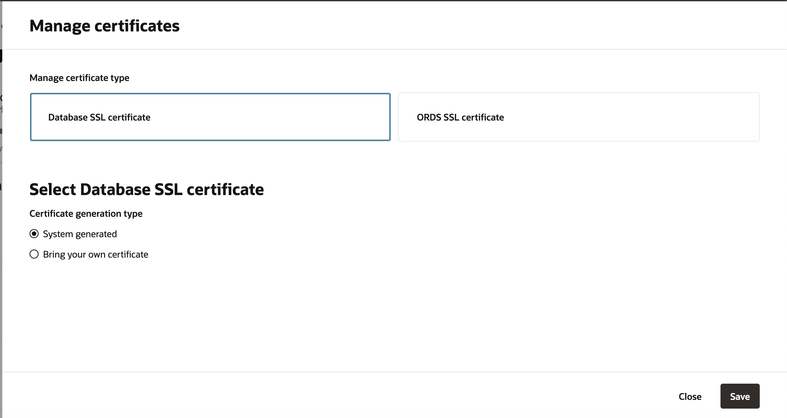

# Create and Manage Autonomous VM Cluster

## Introduction

Autonomous VM Clusters (AVMCs) allow a physical Exadata Cluster (Machine) to be partitioned into multiple virtual clusters. They can be used to isolate environments for different database workloads through separate access rules, network configurations, as well as customizable compute memory, and storage resources.

The AVMC is one of the infrastructure components of the four-level database architecture model on which an Autonomous Container Database is built. One or more AVMCs are provisioned inside an Exadata Infrastructure resource (EI), providing the link between the EI and the Autonomous Container Database resources in your deployment.

In this lab, you will learn how to Create and Manage Autonomous VM Cluster.

Estimated Time: 30 minutes

### Objectives

1. Create Autonomous VM Cluster in AWS

### Required Artifacts

- Pre-provisioned Oracle Exadata Infrastructure
- Pre-provisioned ODB Network

## Task 1: Create Autonomous VM Cluster

1.	From the Oracle Database@AWS dashboard, select the Autonomous VM Clusters link.

    

-  Autonomous VM clusters details page lists all provisioned AVMCs in your Tenancy.

    

- Click on Create Autonomous VM cluster to configure general settings which allows you to enter a 'VM cluster name', select the 'Time Zone' for your Autonomous VM Cluster, and 'License options' to Bring Your Own License (BYOL) or License included.
    
    

- Configure infrastructure settings allows you to allows you to select an existing 'Exadata Infrastructure' for your Autonomous VM Cluster, select 'Database servers' (at a minimum, you must select 2). 

    

- Enter the details for ECPU core count per VM, Database memory per ECPU, Database storage, Maximum number of Autonomous Container Databases (The minimum and maximum values depend upon resources available in your Exadata Infrastructure). 

- NOTE: The resources you specify will be reserved from the underlying infrastructure, so it’s important to allocate only what your expected workload requires, this helps ensure availability for other AVMC creations. You can scale your AVMC later if additional resources are needed.
    
    

- Configure connectivity allows you to select the ODB network, and modify the Scan listener port settings. An Oracle SCAN listener (Single Client Access Name listener) is a component of Oracle Real Application Clusters (RAC) that provides a single, stable client entry point to the entire cluster—regardless of which node hosts the database service. The default for Port (non-TLS) is set to 1521 and he default for Port (TLS) is set to 2484. Optionally, you can Enable mutual TLS (mTLS) authentication.

    

- Under the Maintenance configuration section, you can select the Oracle-managed schedule option, the system automatically assigns a date and start time for AVMC maintenance or Customer-managed to pick a specific date and start time.

    

- Review and Create your Autonomous VM Cluster. This step can take several hours.

    

- Once the AVMC is provisioned you can click on your AVMC to view the details.

    

    

## Task 2: Manage Autonomous VM Cluster

- AVMC is managed from the OCI Console. With the tight integration between OCI and AWS, a direct link is available from the AWS Management Console. Click 'Manage in OCI' in your Autonomous VM Cluster details page.

    

- You’ll be redirected to the OCI Console, where you’ll need your OCI credentials to sign in to the tenancy.

    

- Once logged in, click on 'Menu', 'Oracle Database' and 'Autonomous Database on Dedicated Infrastructure'.

    

- Expand the Menu and click on 'Autonomous Exadata VM Cluster'.

    

- Autonomous Exadata VM clusters details page lists all the available AVMCs in your Tenancy.

    

- Click on your AVMC to view the details of the resource. 

    

- To Scale AVMC, click on 'Actions' and select 'Scale Autonomous VM Cluster'.

    

- This allows you to Scale up or Scale down, based on your requirement. Change the values for ECPU count per VM, Number of ACDs that can be provisioned within the AVMC, and Database Storage and click on Save. 

    
    
- Manage certificate allows you to rotate the SSL security certificates for Oracle REST Data Services (ORDS) and Oracle Autonomous Database listener. Choose the security certificate type that you want to manage:

    Database SSL certificate: Choose this option to manage SSL certificate for Database client connections.

    ORDS SSL certificate: Choose this option to manage ORDS SSL certificate for Application Express (APEX) applications 

    For more information can be found [here](https://docs.oracle.com/en/cloud/paas/autonomous-database/dedicated/adbcj/index.html#GUID-BEDC90F5-702C-4DE6-9300-343F646BE41E) on Managing certificates.

    

- Click on 'Maintenance' to Manage AVMC quarterly maintenance. Oracle schedules and performs all patching and other maintenance operations on all the infrastructure resources of an Autonomous Database. At the same time, it also provides you with various options to customize, view, and reschedule maintenance events for the different resources.

    

- To Edit a scheduled maintenance, click on Edit and choose a suitable date and time. 

    

- To view 'Resource allocation', click on 'View details' under General information. 

    

- The resource allocation details provide a comprehensive overview of CPU usage in the AVMC, per-VM CPU usage, ACD utilization, and storage consumption.

    

    

    

    

You may now **proceed to the next lab** to provision Autonomous Container Database.

## Acknowledgements

*All Done! You have successfully created Autonomous VM Cluster.*

- **Author** - Tejus Subrahmanya, Principal Product Manager, Autonomous Database 

- **Last Updated By/Date** - Tejus Subrahmanya, June 2025