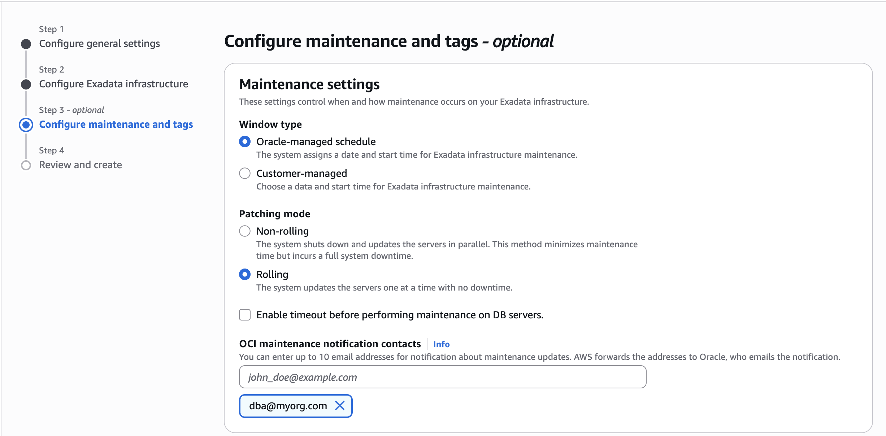

# Create Exadata Infrastructure

## Introduction

Provisioning Oracle Exadata Infrastructure is a required first step before creating Oracle Exadata VM Clusters, Autonomous Exadata VM Clusters, or any Oracle Exadata Databases.

This Lab walks you through on how to Create Exadata Infrastructure in AWS. 

Estimated Time: 15 minutes

### Objectives

As a database user, DBA or application developer,
1. Create Exadata Infrastructure

## Task 1: Create Exadata Infrastructure

- Log in to the AWS portal and navigate to 'Oracle Database@AWS'.

- Click **Exadata infrastructures** from the dashboard
    
    

- Exadata infrastructures details page lists all the provisioned infrastructures in your Tenancy.

    
    

- Click on Create Exadata infrastructure and Configure general settings. Enter the Exadata infrastructure name, and select an AZ (The list is limited by your subscription) where your infrastructure will reside. Select the Next button to continue the creation process.

    

- Next, configure the Exadata infrastructure. The Exadata system model dropdown is dynamically populated based on your selected Availability Zone. Choose your preferred system model, then specify the number of database servers and storage servers needed.

    
    

- Configure maintenance and tags.
    
    The Window type offers two maintenance options: Oracle-managed and Customer-managed. Oracle-managed automatically sets the maintenance schedule, while Customer-managed lets you choose the date and start time.
    
    Patching mode offers two options: Non-rolling (default) and Rolling. Choose based on your patching preference.

    Select the checkbox to enable a maintenance timeout on DB servers, and set a wait time between 15 and 120 minutes.

    Enter up to 10 email addresses to receive OCI maintenance notifications.

    
    

- Click Next, Review and Create Exadata Infrastructure.

    

You may now **proceed to the next lab** to provision Autonomous VM Cluster.

## Acknowledgements

*All Done! You have successfully created Exadata infrastructure.*

- **Author** - Tejus Subrahmanya, Principal Product Manager, Autonomous Database 

- **Last Updated By/Date** - Tejus Subrahmanya, June 2025