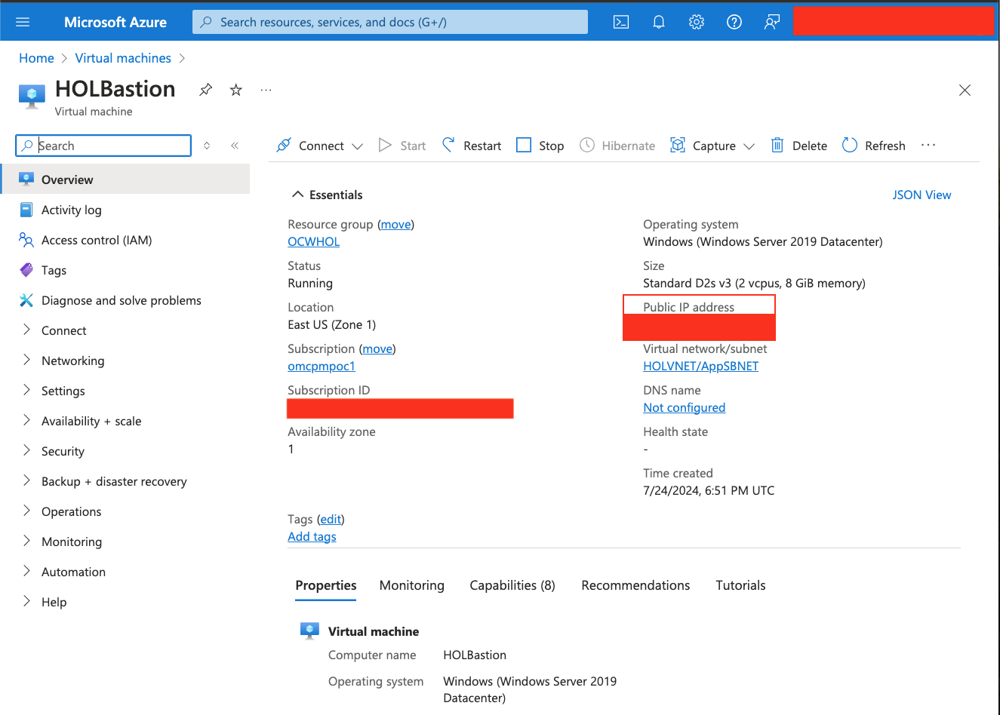
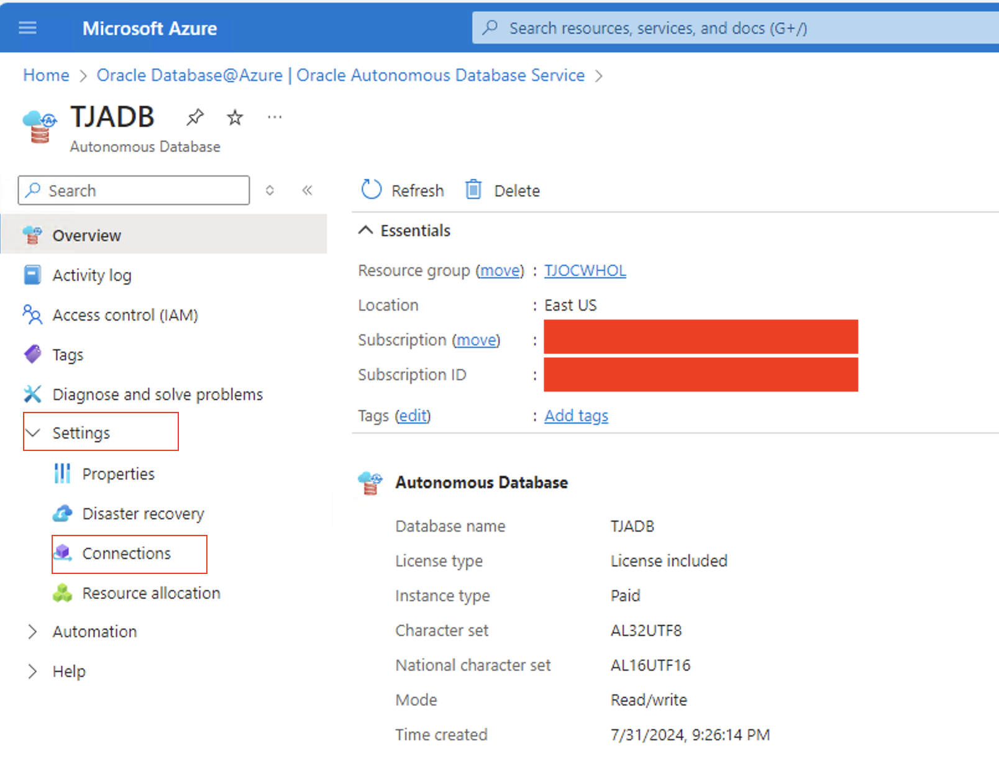

# Configure a development system for use with your Autonomous Database

## Introduction

This Lab walks you through on how to connect Visual Studio with Autonomous Database. 

The Windows Virtual machine provided for the workshop is pre-configured with Visual Studio and any extensions required. RDP into the Windows Virtual Machine to connect VS with Autonomous Database.


Estimated Time: 10 minutes

Watch the video below for a quick walk-through of the lab.
[Simplifying @ Azure](videohub:1_jy1zyem0)


### Objectives

As a database user, DBA or application developer,
1. Configure a secure connection from your development system to your autonomous database using Visual Studio, and SQLcl.

### Required Artifacts

- A pre-provisioned Autonomous database instance.
- Microsoft Remote Desktop client on your local laptop. Click [here](https://learn.microsoft.com/en-us/windows-server/remote/remote-desktop-services/clients/remote-desktop-mac#get-the-remote-desktop-client) to download.


## Task 1: Connect Windows compute client to Remote Desktop

- Log in to the Azure portal with your username/email and password.

- Click **Menu** and select **Virtual machines**.
    
    


- Click on your pre-configured windows virtual machine and copy the Public IP address.

    ***NOTE: Please select your assigned Windows VM.***
    ```
    VM Name: HOLWINVM_XXXXXXXX
    ```

    

- Open Microsoft Remote Desktop application on your local machine and connect to Virtual machine.

    

- Click on Add PC and paste the Public IP address and add a User.

- User account: 

    ```
    Add user account: opc
    Password: WElcome_123#
    ```
    
    

- Click on the newly added connection and open the connection to Windows Virtual machine. 

## Task 2: Connect Autonomous Database with Visual Studio

- To download the Autonomous Database credential wallet, login to the Azure portal from your Windows VM and navigate to Oracle Database@Azure and click on Oracle Autonomous Database Service.

    

- Click on your Autonomous Database, Settings and Connections. 

    

- Click on Download wallet.

    

- Select ***Instance wallet*** under ***Wallet type*** and enter ***WElcome_123#*** as the wallet password and click Download.

    

- Open Visual Studio and click on SQL Developer extension. 

    NOTE: It will take a minute for SQL Developer extension to show up in Visual Studio.

    

- NOTE: It is important to have SQL Developer Extension in your Visual Studio to continue with the Labs. If you do not see the SQL Developer extension, click on Add Extension and Install SQL Developer.

    

    

- Click Add Connections to Add Autonomous Database. 

    

- Enter the following details in the Create Connection window.
    ```
    Connection Name: Enter a connection name
    Authentication Type: Default
    Role: Default
    Username: Admin
    Password: WElcome_123#
    Connection Type: Cloud Wallet
    Configuration File: Choose the Zip file you downloaded earlier in the lab
    Service: ADBName_High
    ```

    

- Click ***Test*** to verify the connection and click Connect. You should now see the new connection in your Visual Studio.

    

    

- Right Click on the Connection and click on ***Open SQLcl***.

    

- SQLcl Terminal is opened and connected to your Autonomous Database. 

- Test the connectivity: 

    ```
    <copy>
    select * from dual;
    </copy>
    ```

    


You may now **proceed to the next lab**.

## Acknowledgements

*Great Work! You successfully connected to your autonomous database instance using Visual Studio and command line tools.*

- **Author** - Tejus Subrahmanya
- **Last Updated By/Date** - Tejus Subrahmanya, Autonomous Database Product Management, July 2024