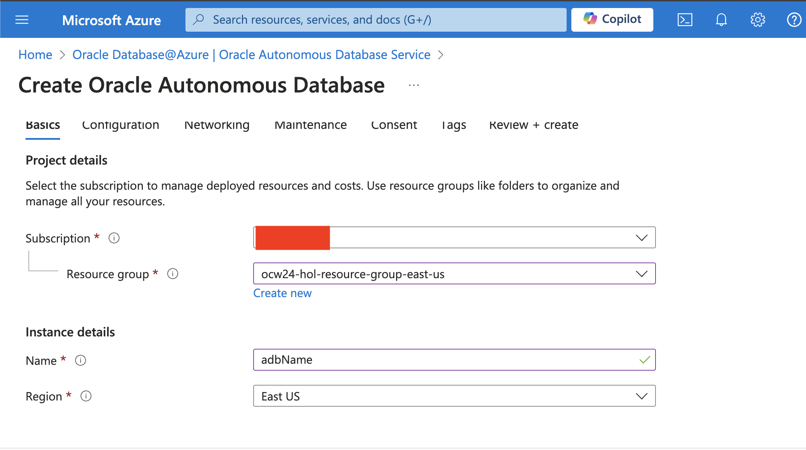
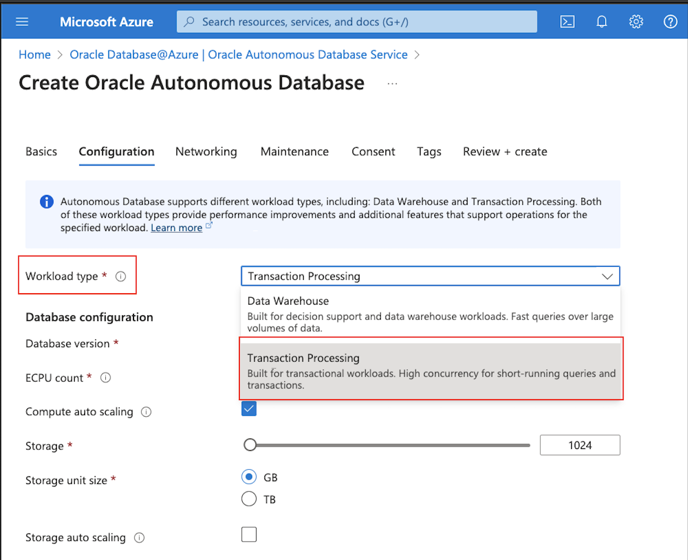
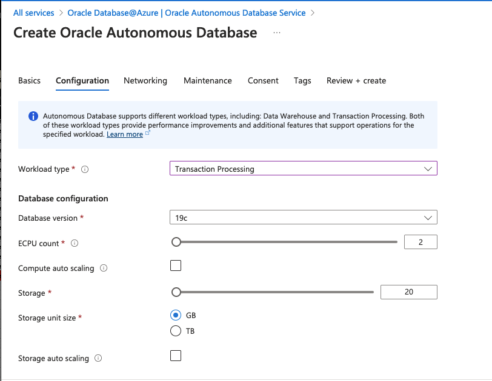
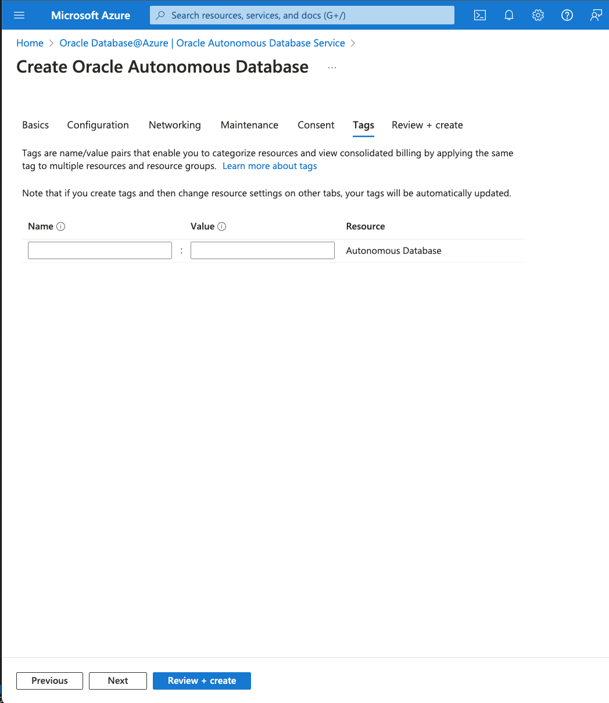
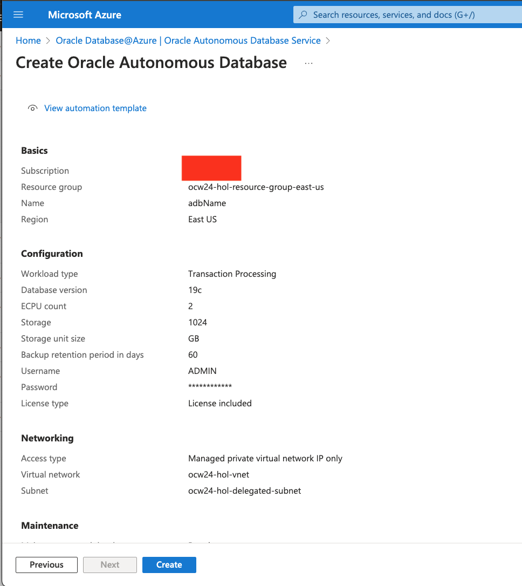

# Provisioning Autonomous Database

## Introduction

This lab walks you through the steps to provision Autonomous Database. 

Estimated Time: 10 minutes

Watch the video below for a quick walk-through of the lab.
[Provision ADB@Azure](videohub:1_2qkjv6o5)

### Objectives

As a database user, DBA or application developer:

1. Rapidly deploy an Autonomous Transaction Processing databases.

### Required Artifacts

- An Azure account with a pre-configured Resource Group and a Virtual Network.

## Task 1: Create Autonomous Database

In this section, you will be provisioning an Autonomous database using the Azure portal.

1.	Login to Azure Portal (portal.azure.com) and navigate to All services. Then click on Oracle Database@Azure.

    NOTE: Please click skip if you are asked to enable multi-factor authorization.

    

-  Click **Oracle Autonomous Database Service** from the menu.

    

- Click **Create** in Oracle Autonomous Database Service details page.

    


-  This will bring up the **Create Oracle Autonomous Database** screen where you specify the configuration of the instance.

- Select the **Subscription**, **Resource Group**, and enter Instance **Name** and pick the **Region** then click Next.

    

For this lab, we will be using the following Subscription: **omcpmhol1**, Resource Group: **ocw24-hol-resource-group-east-us**, and Region: **East US**.

-  Enter the details in the **Configuration** page.

    *NOTE: Autonomous Database supports different workload types, including: Data Warehouse and Transaction Processing. Both of these workload types provide performance improvements and additional features that support operations for the specified workload. [Learn More](https://docs.oracle.com/en/cloud/paas/autonomous-database/serverless/adbsb/about-autonomous-database-workloads.html#GUID-E1C8C5F2-22FB-4225-A3B9-9E78277A5834)*

-  Select **Transaction Processing** under the **Workload type** dropdown.
    
    

- Under **Database configuration**, enter the following details:
    ```
     Database Version: 19c
     ECPU count: 2
     Compute auto scaling: Disabled
     Storage: 1024 GB
     Storage auto scaling: Disabled
    ```
    


-  Under **Backup retention** select the Backup retention period in days.
    
    *For this lab, we will select 1 day as the Backup retention period.*

    

-  Under **Administrator credentials** enter the Admin password.

    *For this lab, we will be using the following as a password.*

    ```
    <copy>
    WElcome_123#
    </copy>
    ```

- Select the  **License type** as **License included**.

    

-  Click **Advanced options** to view or change **Character set** and **National character set** and click **Next**.

    *For this lab, we will use the default settings.*

    


- Enter the **Networking** configurations.

- Select the following under **Network access**
    
    *Note: TLS connections allow you to connect to your Autonomous Database without a wallet, if you use a JDBC thin driver with JDK8 or above. TLS connections require you to use an access control list (ACL) or private endpoint.*

- For the lab, we select the following and click Next. 

    ```
    Access type: Managed private virtual network IP only
    
    Required mutual TLS (mTLS) authentication: Disabled
    
    Virtual network: ocw24-hol-vnet
    
    Subnet: ocw24-hol-delegated-subnet
    ```

    
    

- Under **Maintenance**, select the **Maintenance patch level** and enter **Maintenance contact emails**, then click Next.
    
    

- Agree to the terms of services and click Next.

    

- Add Tags if required and click Next.

    

- Review the configurations and click Create.

    


You may now **proceed to the next lab**.

## Acknowledgements

*All Done! You have successfully deployed your Autonomous Database instance and it should be available for use in a few minutes.*

- **Author** - Tejus Subrahmanya
- **Last Updated By/Date** - Tejus Subrahmanya, July 2024