# Get started - Autonomous Database

## Introduction

This lab walks you through the prerequisites to get started with Oracle Database@Azure - Autonomous Database. This involves creating a Resource Group, VNet, and a subnet that needs to be delegated to Oracle.Database/networkAttachement.

Estimated Time: 20 minutes

### Objectives

As a database user, DBA, or application developer:

1. Create a Resource Group and Virtual Network in the Azure portal.

## Task 1: Create a Resource Group

In this section, you will create a resource group and VNet.

1.  Login to Azure Portal (portal.azure.com) and navigate to All services. Then click on the **Resource groups** icon.

    

2.	On the ‘Resource groups’ page, click on the ‘Create’ button.

    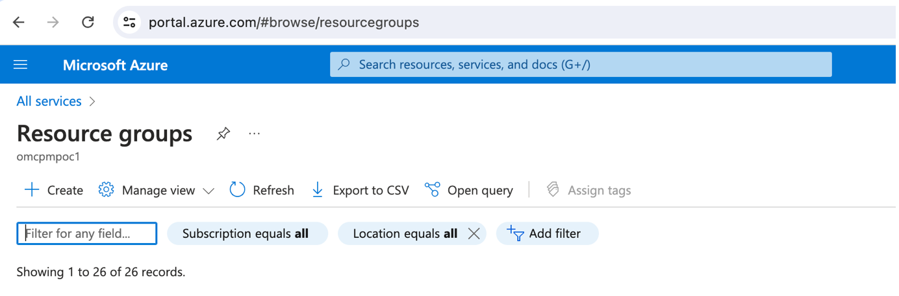

3.	On “Create resource groups’ provide details in each tab as mentioned below. 
    Basics:
    a.  Subscription – select your billing subscription in the directory you selected
    b.  Resource group – Enter the name for the resource group to be created
    c.  Region – Select your region from the drop-down list
    

    

    Tags
    Provide input to organize your resource with tagging as shown below
    a.	Name
    b.	Value
    
    

    The ‘Review + create’ page will validate the input provided in the previous steps. Once Validation is passed, it will create a resource group.

    

4.	Navigate to ‘Resource groups’ from ‘Home’ screen and search for the Resource group created to validate  

    

## Task 2:  Create Virtual Network (VNet)
1. Navigate to ‘Azure Services’ and select Virtual networks. Then click on the Create button

    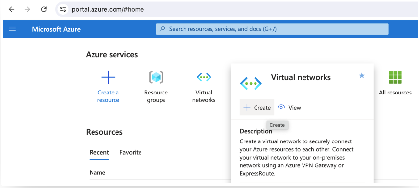

2.	Create Virtual Network page will appear. Provide all required details as shown below for each tab
    
    Project Details:
    * **Subscription:**
    * **Resource group**
    
    Instance Details
    * **Virtual network name**
    * **Region**

    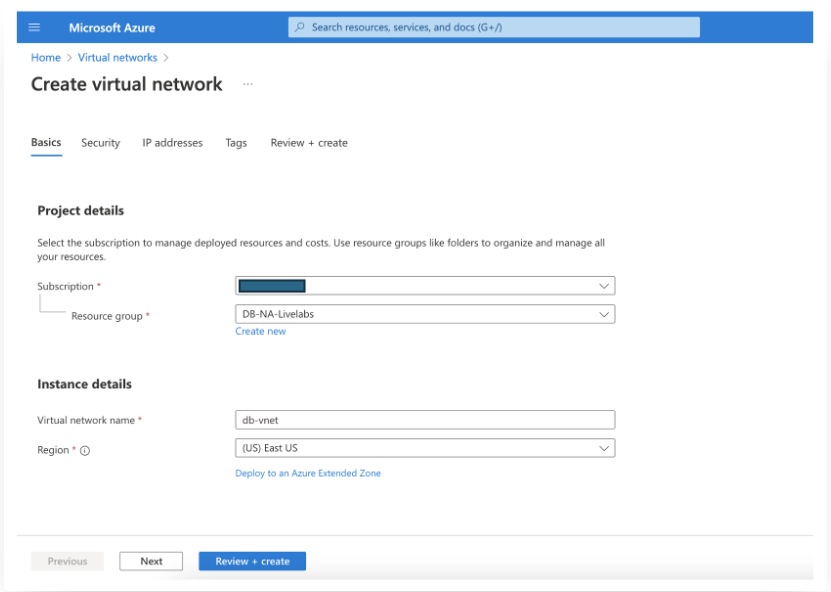

     Security
    * **Virtual Network encryption:** Select Virtual Network Encryption checkbox to enable the encryption of the traffic traveling within the VNet

    * **Azure Bastian:** Select Enable Azure Bastian checkbox if Bastian Server is required to connect to specific resource later.

    * **Azure Firewall:** Similar to traffic encryption and Bastian service, you can enable the Azure Firewall if required.

    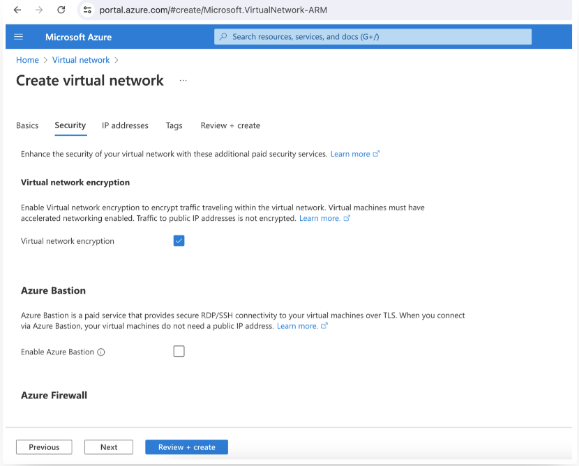

    * **IP Addresses:** There is an option to choose IPV4/IPV6 addresses for your network resources. 
    Select default IP Address range or provide new IP range based on your requirement. Here we are using default IP range for IP addresses as shown below.

    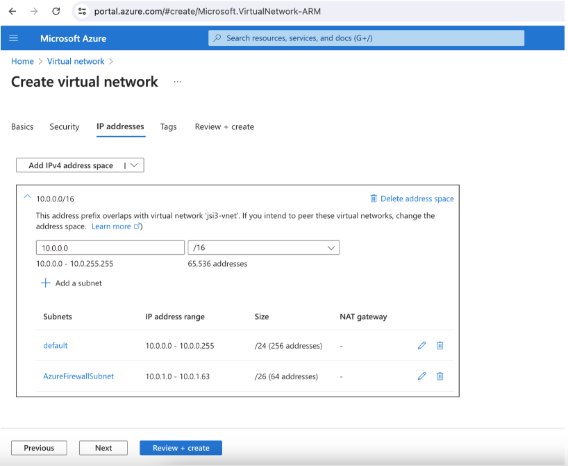

    Tags
    
    Provide input to organize your resource with tagging as shown below
    * **Name**
    * **Value**

    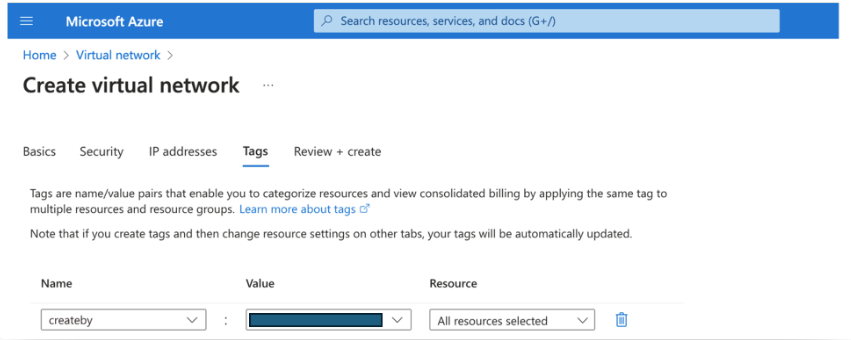

    On the **Review + create** page, it will validate the input provided in previous steps. Once Validation is passed, it will create the virtual network.

    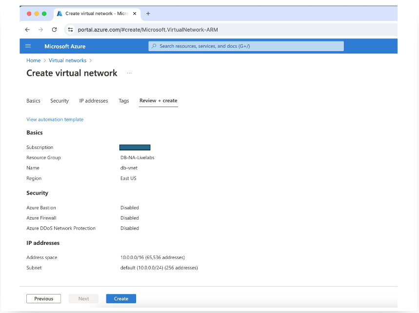

    Deployment can be monitored as below.

    Once all required resources are created for virtual network, deployment status will get changed to **‘Complete’**.

    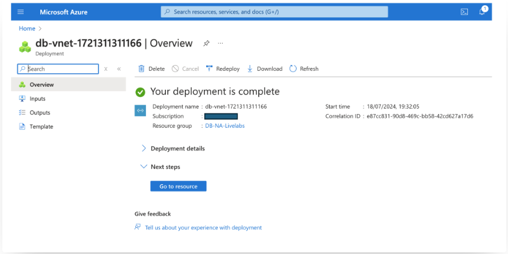

    Navigate to **Virtual Networks** and search for the name of the VNet created to see details about it.

## Task 3: Add Subnet and Delegate to Oracle Database@Azure Service

- Select the VNet created in Task 2 and click on ‘Add a subnet'.

    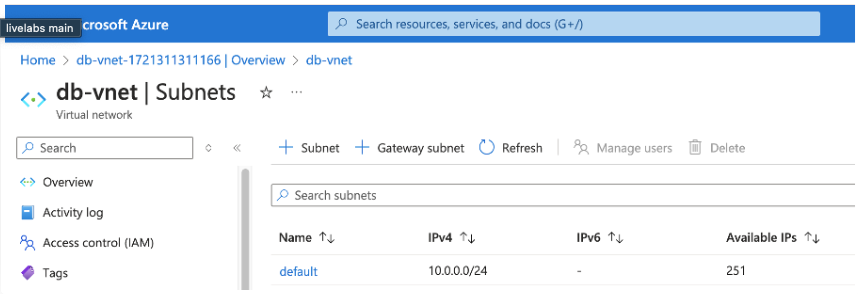

- Provide a name for the subnet and select an IP address range based on the size of network required for the deployment.

    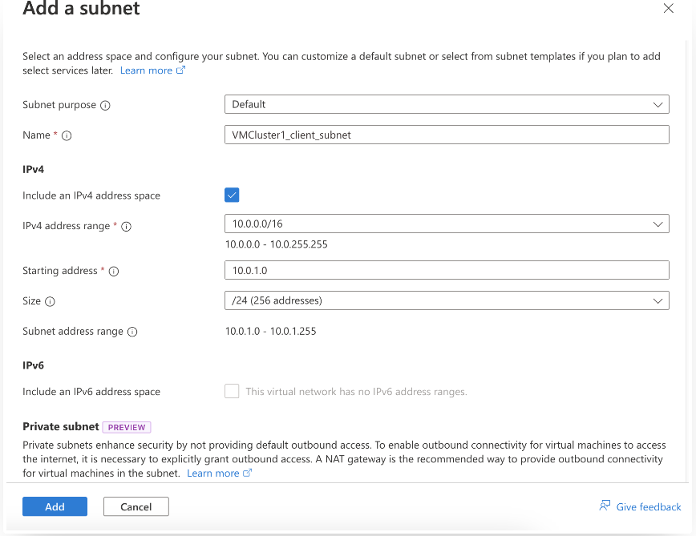

- You need to delegate this subnet to **Oracle.Database/networkAttachments**. Under the **Subnet Delegation** option, select **Oracle.Database/networkAttachments** from the drop down list.

    

- Click on Add button to add this subnet to the VNet.

    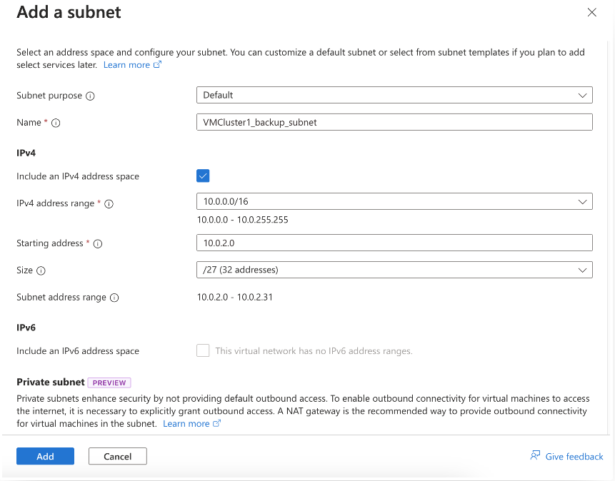

You may now **proceed to the next lab** to provision Autonomous Database.

## Acknowledgements

*All Done! You have successfully created Resource Group and Virtual Network.*

- **Author** - Sanjay Rahane, Principal Cloud Architect, North America Cloud Engineering Services (CES)

- **Last Updated By/Date** - Sanjay Rahane, July 2024