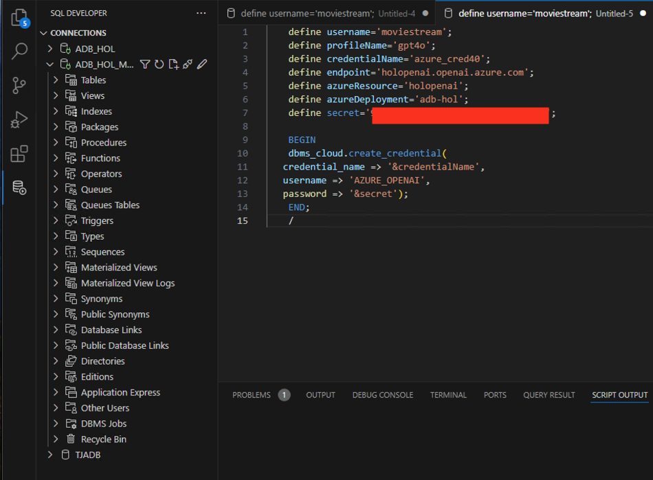

# Chat with your data in Autonomous Database using Generative AI

## Introduction

In this lab, you will learn how to use Autonomous Database Select AI (Select AI) to query your data using natural language. You don't need prior knowledge of the data structure or how that data is accessed.

What is Natural Language Processing?
Natural language processing is the ability of a computer application to understand human language as it is spoken and written. It is a component of artificial intelligence (AI).

What is Generative AI?
Generative AI enables users to quickly generate new content based on a variety of inputs. Inputs and outputs to these models can include text, images, sounds, animation, 3D models, and other types of data.

Estimated Time: 30 minutes

### Objectives

1. Configure your Autonomous Database to leverage a generative AI model for querying data using natural language
2. Use Select AI to query data using natural language

Oracle MovieStream Business Scenario

The lab's business scenario is based on Oracle MovieStream - a fictitious movie streaming service that is similar to services to which you currently subscribe. You'll be able to ask questions about movies, customers who watch movies, and the movies they decide to watch.

### Required Artifacts

- An Azure account with a pre-provisioned Autonomous Database and Azure OpenAI.
- You have imported the data from the sample data pump file (Refer to Lab 3: Migrate to ADB using Data pump)

## Task 1: Integrate Azure OpenAI with Autonomous Database

Autonomous Database supports models from OCI Generative AI, Azure OpenAI, OpenAI, and Cohere. This workshop will use the Azure OpenAI model.

1.	Login to your Microsoft Windows Virtual machine and open Visual Studio with Autonomous Database.


    

-  Right click on your Database connection and **Clone** the connection to add ***moviestream*** user connection.

- Enter the connection name, Username and password and click Save.
    
    ***NOTE: Copy the username and password from below.***

    ```
    <copy>
    Username: MOVIESTREAM
    Password: watchS0meMovies#
    </copy>
    ```

    

     

- Right click on the connection (Admin) again and click **Open SQL Worksheet** in the Oracle Autonomous Database Service details page.

    


    Note: You will be executing the below sql queries as ***Admin*** user.

***Create an AI Profile for OCI Generative AI***

A Select AI profile encapsulates connection information for an AI provider. This includes:
1. A security credential (e.g. the resource principal)
2. The name of the provider
3. The name of the Large Language Model LLM (optional)
4. A list of target tables that will be used for natural language queries (required when using NL2SQL) You can create as many profiles as you need, which is useful when comparing the quality of the results of different models.

For a complete list of the Select AI profile attributes, see the [DBMS CLOUD AI Package](https://docs.oracle.com/en/cloud/paas/autonomous-database/serverless/adbsb/dbms-cloud-ai-package.html#GUID-D51B04DE-233B-48A2-BBFA-3AAB18D8C35C) in Autonomous Database Serverless documentation.

-  Define the variables (Run the below as Admin user). Get your ***Secret*** from [here](https://genaisecret.blob.core.windows.net/secret/secret.txt)

    ```
    <copy>
    define username='moviestream';
    define profileName='gpt4o';
    define credentialName='azure_cred40';
    define endpoint='holopenai.openai.azure.com';
    define azureResource='holopenai';
    define azureDeployment='adb-hol';
    define secret='Azure API key';
    </copy>
    ```
    
    

- As ADMIN, you will open up the azure openai endpoint so that ***moviestream*** user can make connections to it.
 
     ```
    <copy>
        BEGIN                                                                          
        DBMS_NETWORK_ACL_ADMIN.APPEND_HOST_ACE(                                      
       host => '&endpoint',
       ace  => xs$ace_type(privilege_list => xs$name_list('http'),             
                           principal_name => '&username',                          
                           principal_type => xs_acl.ptype_db)                 
        );                                                                            
        END;                                                                           
        /
    </copy>
    ```  

    

- Grant execute to the moviestream user

    ```
    <copy>
    grant execute on DBMS_CLOUD_AI to moviestream;
    </copy>
    ```

- Now log in as the ***moviestream*** user that will be using generative AI.
Create a credential that allows the user to access the Azure OpenAI endpoint

NOTE: The MOVIESTREAM user was created as part of the migrating to ADB Lab. 


Moviestream schema password: ***watchS0meMovies#***.

-  Right click on ***moviestream*** connection in your Visual Studio and clik **Open SQL Worksheet**. 

    Note: You will be executing the below sql queries as ***moviestream*** user.

    

***Note: Please edit the Secret key that you downloaded earlier in the Lab.***

    ```
    <copy>
    define username='moviestream';
    define profileName='gpt4o';
    define credentialName='azure_cred40';
    define endpoint='holopenai.openai.azure.com';
    define azureResource='holopenai';
    define azureDeployment='adb-hol';
    define secret='Azure API key';

    BEGIN                       
    dbms_cloud.create_credential(                                                 
    credential_name => '&credentialName',                                            
    username => 'AZURE_OPENAI',                                                 
    password => '&secret');                            
    END;                           
    /
    </copy>
    ```




-  Create an AI profile for the Azure OpenAI model. Copy and paste the following code into your SQL Worksheet, and then click the Run Script icon.

```
<copy>
    begin
  -- recreate the profile
  dbms_cloud_ai.drop_profile(
    profile_name => '&profileName',
    force => true
    );


  dbms_cloud_ai.create_profile(
    profile_name => '&profileName',
    attributes =>       
        '{"provider": "azure",        
          "azure_resource_name": "&azureResource",                    
          "azure_deployment_name": "&azureDeployment",
          "credential_name": "&credentialName",
          "comments":"true",          
          "object_list": [
            {"owner": "&username", "name": "GENRE"},
            {"owner": "&username", "name": "CUSTOMER"},
            {"owner": "&username", "name": "PIZZA_SHOP"},
            {"owner": "&username", "name": "STREAMS"},
            {"owner": "&username", "name": "MOVIES"},
            {"owner": "&username", "name": "ACTORS"}
          ]          
          }'
    );
  end;
  /
</copy>
```


## Task 2: Test the AI profile

- We will use the PL/SQL API to generate a response from the model. This example is using the chat action. It is not using any private data coming from your database.

- Since you can have multiple Select AI profiles, you need to pick the one to use for your session. Use the DBMS_CLOUD_AI.SET_PROFILE procedure to specify which profile to use as follows:

```
<copy>
begin
  dbms_cloud_ai.set_profile(
        profile_name => '&profileName'
    );
end;
/
</copy>
```

- Ask Natural Language Questions
You can now ask questions using SELECT AI. AI is a special keyword in the SELECT statement that tells Autonomous Database that the subsequent text will be either an action or the natural language question.

Here are the actions:

chat: Use for general AI chat.
runsql [default]: Use to ask a question and get a structured result.
narrate: Use to ask a question and get a conversational result.
showsql: Use to show the SQL code that was used to produce the result.

Let's look at a couple of examples:

1. Test the LLM and learn about Autonomous Database as the MOVIESTREAM user. Copy and paste the following code into your SQL Worksheet, and then click the Run Script icon.

```
<copy>
SELECT AI chat what is autonomous database;
</copy>
```

- Let us use the data we have already imported to Autonomous Database 

```
<copy>
SELECT AI chat
What is Tom Hanks best known for
</copy>
```

- The default for SELECT AI is runsql. This will run queries against your private data:

```
<copy>
SELECT AI
What are total sales of tom hanks movies
</copy>
```

- View the SQL code that is generated by the following question:

```
<copy>
SELECT AI showsql
What are total sales of tom hanks movies
</copy>
```

***NOTE: Notice that to answer the previous question, the sales data was joined to the movie table and a filter was applied.***

- Let's run more sophisticated query:

```
<copy>
SELECT AI what are our total streams broken out by genre;
</copy>
```

- Run the explainsql to get the query: 

```
<copy>
SELECT AI explainsql what are our total streams broken out by genre;
</copy>
```

- What's great is you can now easily apply AI to your organization's data with a simple query

- Let's look at the support chat: 

```
<copy>
SELECT support_chat 
FROM v_customer_support
WHERE support_chat_id = 1;
</copy>
```

- And now, let's summarize find out the sentiment of the support conversation. 
A JSON document is a really good way to structure the prompt; the LLM can easily interpret the 
task and data set to operate on. The following SQL query combines the task with the data set.

```
<copy>
SELECT JSON_OBJECT(
        'task' VALUE 'summarize the support chat in 3 sentences. also return the customer sentiment',
        support_chat) AS prompt_details
FROM v_customer_support WHERE support_chat_id = 1;
</copy>
```


- Now apply GenAI in a query to get the answer

```
<copy>
WITH prompt_document AS (
    -- this json document
    SELECT JSON_OBJECT(
        'task' VALUE 'summarize the support chat in 3 sentences. also return the customer sentiment',
        support_chat) AS prompt_details
    FROM v_customer_support WHERE support_chat_id = 1
)
SELECT 
    DBMS_CLOUD_AI.GENERATE(
        PROMPT => prompt_details,
        PROFILE_NAME => 'gpt4o',
        ACTION       => 'chat'                     
    ) AS response
FROM prompt_document;
</copy>
```

- Create an EMAIL promotion to a customer. Recommend movies based on those they previously watched AND movies that Moviestream wants to promote. This is information the LLM knows nothing about - the prompt will augment the model with customer data

```
<copy>
WITH promoted_movie_list AS
(
    -- movies we want to promote
    SELECT
        json_arrayagg(json_object(
                'title' value m.json_document.title , 
                'year' value m.json_document.year)
            ) as promoted_movie_list
    FROM "movieCollection" m
    WHERE m.json_document.studio like '%Amblin Entertainment%'
),
customer_latest_movies AS (
    -- movies the customer watched
    SELECT 
        s.cust_id,            
        m.title,
        m.year,
        max(s.day_id) as day_id
    FROM streams s, movies m, v_target_customers c
    WHERE m.movie_id = s.movie_id
        and c.customer_id = 1
        and c.cust_id = s.cust_id
    GROUP BY s.cust_id, m.title, m.year
    ORDER BY day_id desc
    FETCH first 3 ROWS ONLY
),
customer_details AS (
    -- attributes about the customer
    SELECT 
        m.cust_id,
        c.customer_id,
        c.first_name,
        c.last_name,
        c.age,
        c.gender,
        c.has_kids,
        c.marital_status,
        c.dog_owner,
        max(day_id),            
        json_arrayagg(m.title) as recently_watched_movies
    FROM v_target_customers c, customer_latest_movies m
    WHERE 
        c.cust_id = m.cust_id
    GROUP BY  
        m.cust_id,
        c.customer_id,
        first_name,
        last_name,
        age,
        gender,
        has_kids,
        marital_status,
        dog_owner
),
dataset AS (
    -- combine this into a json document
    SELECT json_object(p.*, c.*) doc
    FROM customer_details c, promoted_movie_list p
)
SELECT
    -- generate the promotion!
    DBMS_CLOUD_AI.GENERATE (
        prompt => 'Create a promotional email with a catchy subject line and convincing email text. Follow the task rules. ' ||
                  '1. Recommend 3 movies from the promoted movie list that are most similar to movies in the recently watched movie list. ' ||
                  '   Do not say that we are promoting these movies. For each move, say why you will love them.' || 
                  '2. Use lots of fun emojis in the response. ' ||
                  '3. Finish the email thanking them for being a customer and sign it "From The MovieStream Team" \n' 
                  || doc,
        profile_name => 'gpt4o',
        action => 'chat'
    ) AS email_promotion
FROM dataset;
</copy>
```

***In summary, using LLMs infer a lot from human language. It's always good to verify your results.***


## Acknowledgements

*All Done! You have successfully integrated Azure OpenAI with your Autonomous Database instance and used Autonomous Database Select AI to query your data using natural language.*

- **Author** - Tejus Subrahmanya
- **Last Updated By/Date** - Tejus Subrahmanya, August 2024