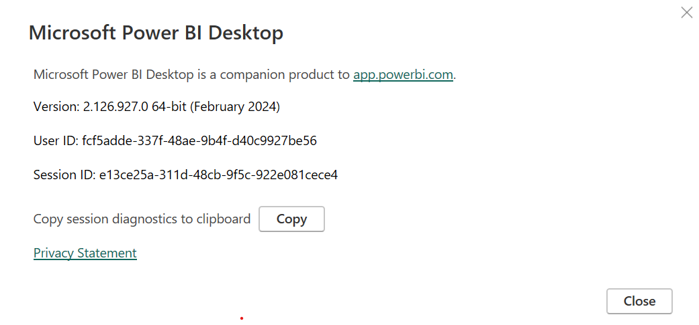
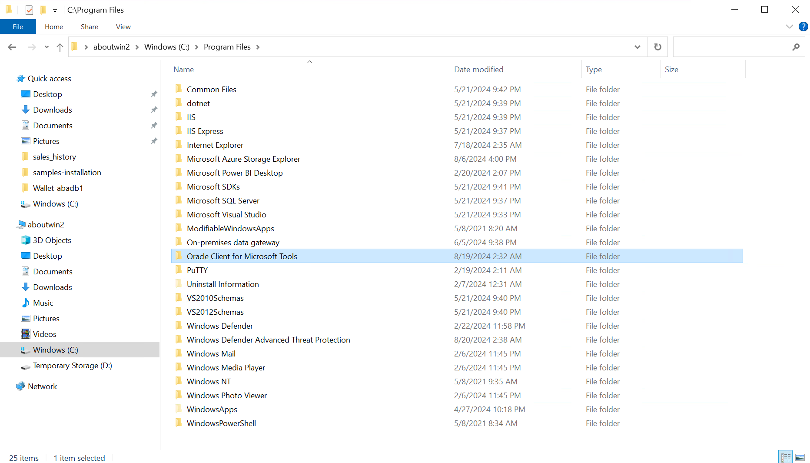
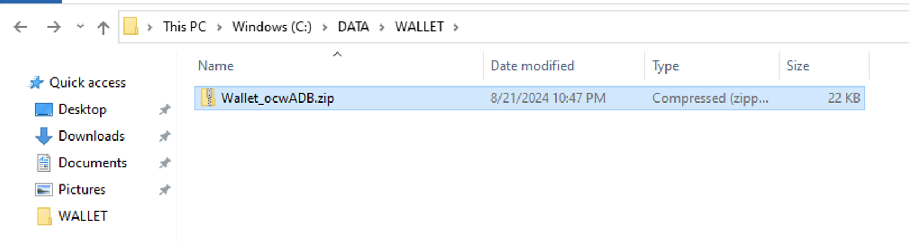
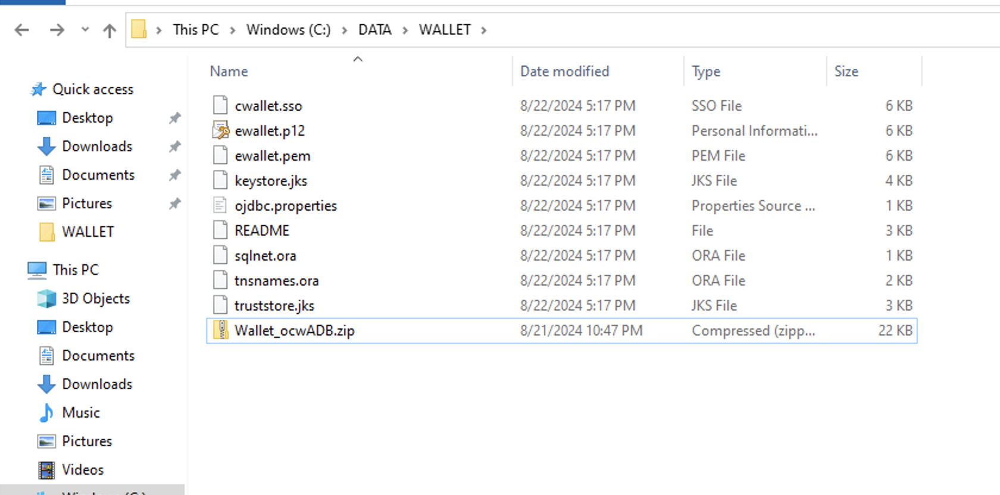
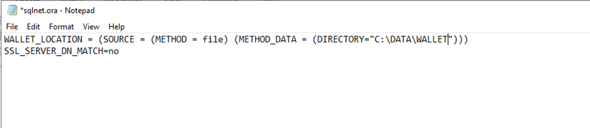
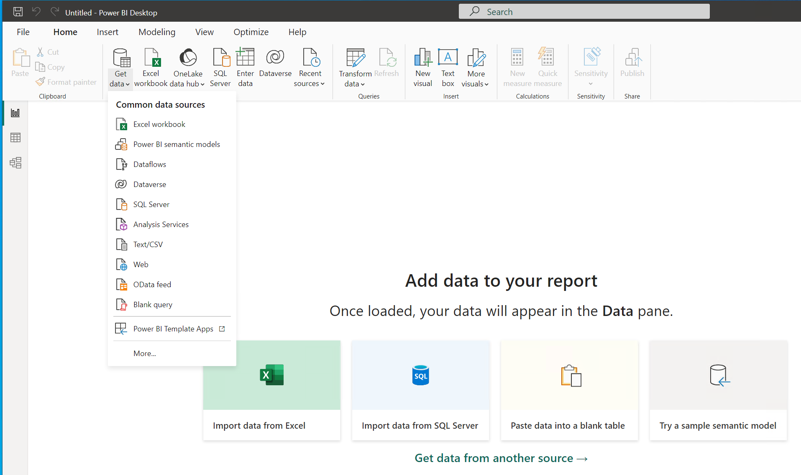
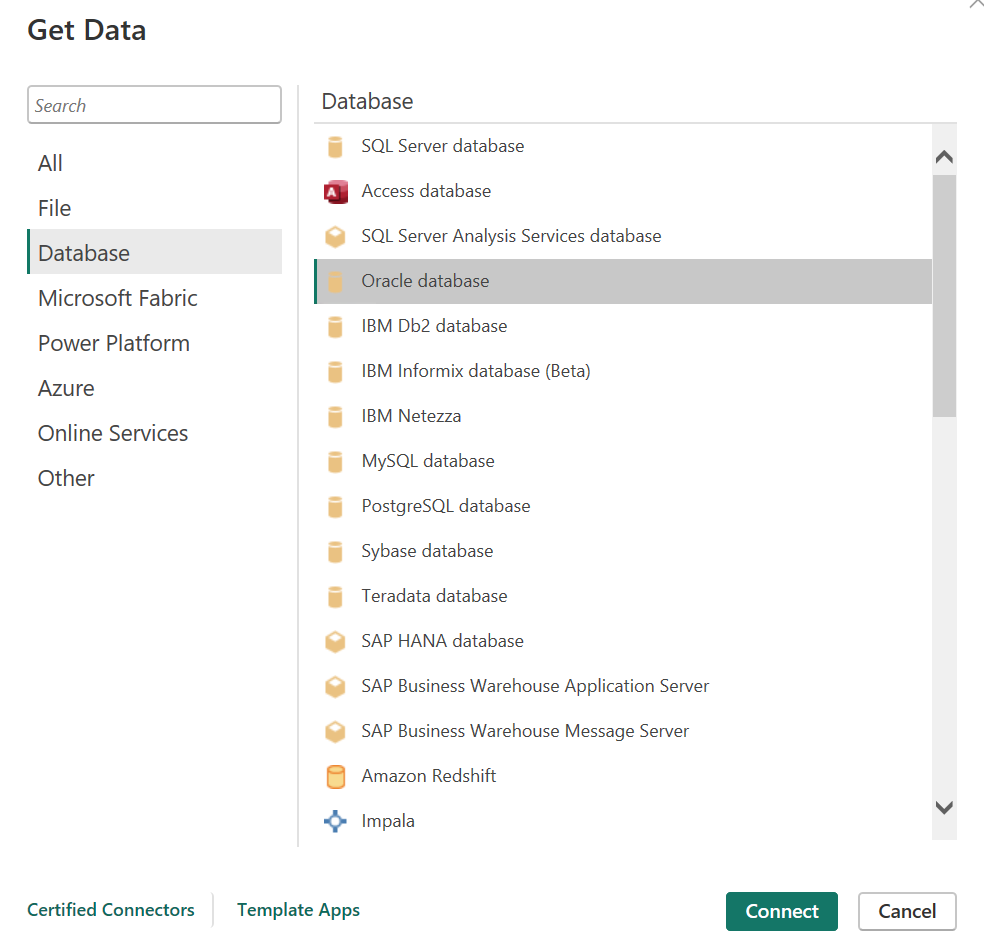
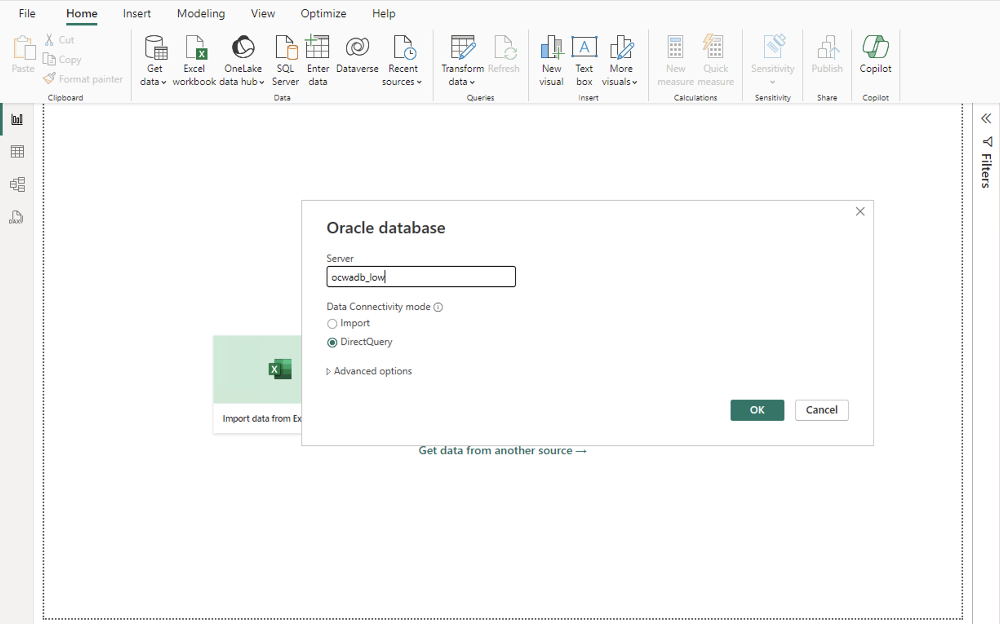
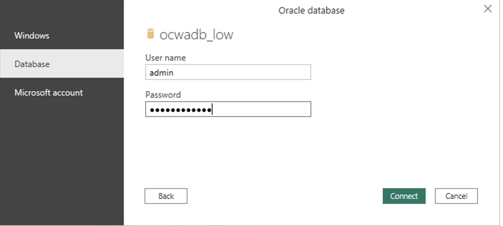
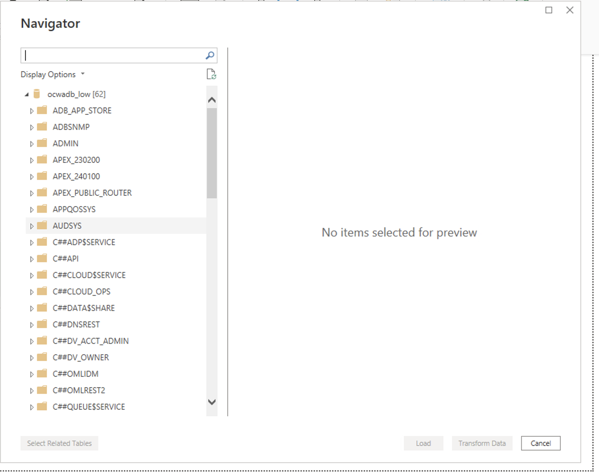

# Connecting Power BI Desktop to an Oracle Autonomous Database in Oracle Database@Azure 

## Introduction
Power BI Desktop is a free application you install on your Windows machines that lets you connect to, transform, and visualize your data. With Power BI Desktop, you can connect to multiple sources of data to build visuals and collections of visuals you can share as reports.

Oracle Database@Azure is an Oracle and Microsoft partnership solution that delivers Oracle database services running on Oracle Cloud Infrastructure (OCI), collocated in Microsoft Azure data centers. Azure customers can now procure, deploy, and use Oracle database services running on OCI within the native Azure portal and APIs, giving them an OCI-in-Azure-like experience. 

This lab allows you to connect Power BI Desktop to an Oracle Database in Oracle Database@Azure to visualize data and generate reports.

Estimated Time: 10-15 minutes

Watch the video below for a quick walk-through of the lab.
[Simplifying @ Azure](videohub:1_ehgzfts4)

### Objectives

1. Use Microsoft Power BI Desktop to retrieve data from an Autonomous Database in Oracle Database@Azure.
2. Configure Power BI to query an Autonomous database schema.
3. Generate a Power BI Desktop report.

### Prerequisites
- Access to Oracle Database@Azure via an active Azure subscription and an OCI tenancy
- A pre-provisioned Autonomous Database with admin access.
- A pre-provisioned Azure Windows virtual machine with network access to the database.


## Task 1: Verify that Power BI Desktop is installed in your Virtual Machine

- Open Power BI

- Click File -> About

- Verify it is the 64-bit version

  


## Task 2: Verify that the Oracle Client for Microsoft Tools is installed

Ensure that the Oracle Client for Microsoft Tools is installed on the virtual machine you are using for this lab

- Verify that the following directory with its subfolder and files exist




## Task 3: Set up a connection to an Autonomous database

  - Copy the downloaded Autonomous Database credentials zip file into a directory.

    ```
    <copy>
    C:\DATA\Wallet\
    </copy>
    ```
  
     

  - Unzip the wallet in the same directory.

     
    
  - Open the sqlnet.ora configuration file in the credentials directory in a text editor and set the DIRECTORY value to the ADB wallet directory location, such as:

    ```
    <copy>
      WALLET_LOCATION = (SOURCE = (METHOD = file) (METHOD_DATA = (DIRECTORY=C:\DATA\WALLET))) 
    </copy>
    ```

     

    
  - Open Power BI Desktop

  - Click **Get Data** and select **More** at the bottom of the list

  

  - Select **Database** on the left side menu

  - Select **Oracle database** from the list

  

  - Enter the **Server** in the following format:

    ```
    ADB_low
    ```

  

  - Check the **DirectQuery** radio button
    
  - Click **OK**

  - Power BI will request you to enter the database credentials. Select ***Database*** on the left side of the window and enter ***Admin*** and password and click Connect.

  

  - Power BI should now connect to ADB. In the navigator window, select the schema objects needed and load the data. 

    

## References

    * https://www.oracle.com/a/ocom/docs/database/microsoft-powerbi-connection-adw.pdf
    * https://learn.microsoft.com/en-us/power-bi/connect-data/desktop-connect-oracle-database

You may now **proceed to the next lab**.

## Acknowledgements

*Fantastic! You successfully learned to connect Autonomous Database to Power BI.*

- **Author** - Anwar Belayachi
- **Last Updated By/Date** - Tejus Subrahmanya / August 20, 2024