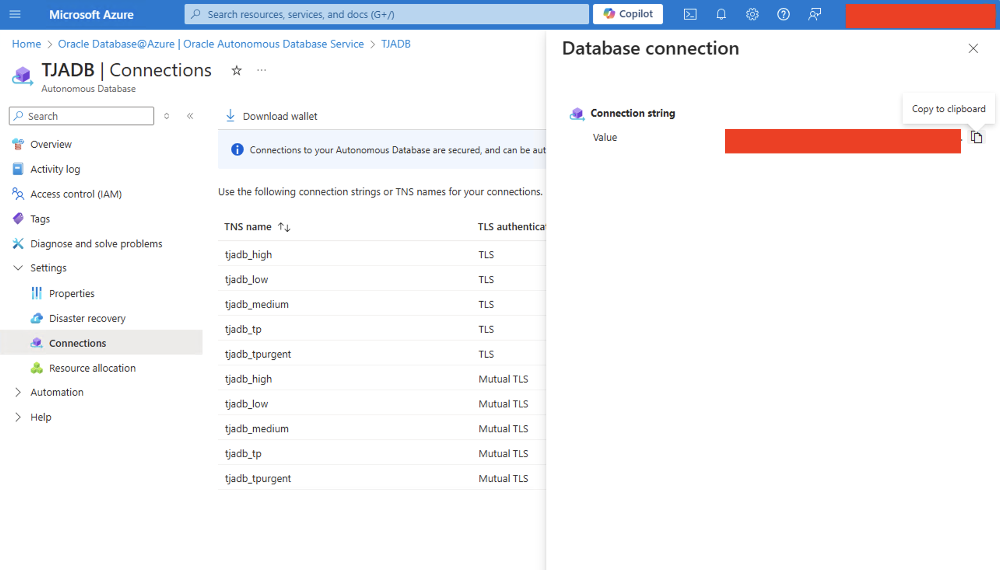
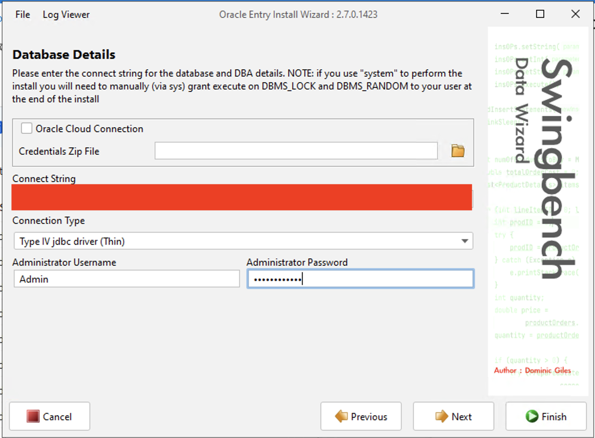
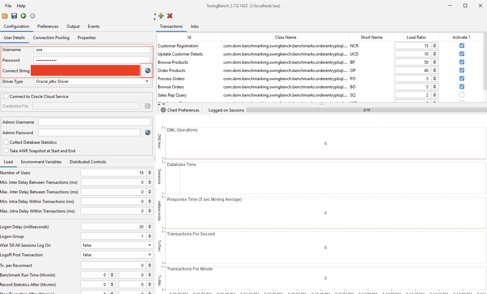

# Connect Autonomous Database with Swingbench

## Introduction

<<<<<<< HEAD
This lab walks you through how to install and configure a workload generation tool called Swingbench and monitor the performance of an Autonomous Database.

Estimated Time: 10 minutes

Watch the video below for a quick walk-through of the lab.
[Simplifying @ Azure](videohub:1_xj46a62c)

=======
This lab walks you through how to install and configure a workload generation tool called Swingbench and monitor the performance of Autonomous Database.

Estimated Time: 10 minutes

>>>>>>> 41adebb2a7ca349e08ad90935ed23a35db804420
### Objectives

As an administrator:
1. Install and configure Swingbench to simulate a transaction processing workload.
2. Enable Compute auto scaling in Autonomous Database and monitor the performance.


### Required Artifacts

<<<<<<< HEAD
- A pre-provisioned instance of an Autonomous database and a Developer Client image. 
=======
- A pre-provisioned instance of Autonomous database and Developer Client image. 
>>>>>>> 41adebb2a7ca349e08ad90935ed23a35db804420

Refer to Lab 2: **Connect securely with Visual Studio code**.

## Task 1: Download and install Swingbench

- Connect to your developer client machine via RDP. Detailed instructions are provided in Lab 2: **Connect securely with Visual Studio code**.

    *The remainder of this lab assumes you are connected to the Windows instance through RDP  and are operating from the Windows instance and not your local machine (except if noted).*

<<<<<<< HEAD
- Windows VM is pre-installed with Swingbench application. Verify in the below directory.
=======
- Windows VM is pre-installed with swingbench application. Verify in the below directory.
>>>>>>> 41adebb2a7ca349e08ad90935ed23a35db804420

    ```
    <copy>
    cd C:\Users\opc\Downloads\swingbenchlatest
    </copy>
    ```

- If you do not see the swingbench application folder, download it from the below link. Open a Microsoft Edge browser and download the latest version of swingbench.

    ````
    <copy>
    https://www.dominicgiles.com/downloads/
    </copy>
    ````

<<<<<<< HEAD
### Transfer DB Wallet to the Swingbench client machine
If you have not downloaded the Database Wallet already to your Dev Client machine in an earlier lab, follow the steps in Lab 2: **Connect securely with Visual Studio code** to download the wallet.


## Task 2: Connect the Swingbench application to Autonomous database

Now that you have installed Swingbench, the next step is to connect the application to your Autonomous database.

- You are ready to run Swingbench workloads on Autonomous database. Workloads are simulated by users submitting transactions to the database.

- Load sample data to your Autonomous Database. To start **oewizard** to load Schema and data, navigate to Swinbench winbin folder and run oewizard.bat.


NOTE: If the Swingbench application complaints about JDBC Drivers, download from [JDBC Downloads](https://www.oracle.com/java/technologies/downloads/#jdk22-windows) and follow the on-screen instructions to install.
=======
### Transfer DB Wallet to swingbench client machine
If you have not downloaded the wallet already to your Dev Client machine in an earlier lab, follow the steps in Lab 2: **Connect securely with Visual Studio code** to download the wallet.


## Task 2: Connect swingbench application to Autonomous database

Now that you have installed swingbench, the next step is to connect the application to your Autonomous database.

- You are ready to run Swingbench workloads on Autonomous database. Workloads are simulated by users submitting transactions to the database.

- Load sample data to your Autonomous Database. To start oewizard to load Schema and data, navigate to Swinbench winbin folder and run oewizard.bat.


NOTE: If swingbench application complaints about JDBC Drivers, download from [JDBC Downloads](https://www.oracle.com/java/technologies/downloads/#jdk22-windows) and follow the on-screen instructions to install.
>>>>>>> 41adebb2a7ca349e08ad90935ed23a35db804420

```
<copy>
cd C:\Users\opc\Downloads\swingbenchlatest\swingbench\winbin

oewizard.bat
</copy>
```


- Click Next and select Version 2.0.

    

- Select Create the Order Entry Schema and click Next.

    

- Copy the Connect string from Azure portal, and change the Username to ***Admin*** and enter your Admin password and click Next. 

<<<<<<< HEAD
    NOTE: Copy _tp connect string from Azure console.

=======
>>>>>>> 41adebb2a7ca349e08ad90935ed23a35db804420
    

    

- Change the password to ***WElcome_123#*** and keep the remaining default and click Next.

    

- Keep Database Options as default and click Next. 

    

- Change User defined scale to ***0.1 GB*** and click Next and Finish. 

    

- Building the simple order entry schema should be done in a few mins. 

    

    


- Once the Schema is created, start the Swingbench UI. Open CMD in your Windows instance and navigate to Swingbench winbin folder.

    ```
    <copy>
    cd C:\Users\opc\Downloads\swingbenchlatest\swingbench\winbin
    </copy>
    ```

    

- Start Swingbench UI
    ```
    <copy>
    swingbench.bat
    </copy>
    ```
    
    

<<<<<<< HEAD
- Running the above command will open the Swingbench configuration tool. Select the following to connect Swingbench to Autonomous database. 
=======
- Running the above command should open up the Swingbench configuration tool and select the following to connect Swingbench to Autonomous database. 
>>>>>>> 41adebb2a7ca349e08ad90935ed23a35db804420

- Select SOE_Server_Side_V2 and click OK.

    

- Enter the following in Swingbench UI
   
    ```
    Username: soe
    Password: WElcome_123#
    Connect String: adb_tp <Copy from Azure portal>
    ```

    

    

 - Test the connection to the database by clicking on connect link in Connect String. If the entered details are correct, you should see a confirmation popup - ***Connected to database using supplied parameters***

    

- Start Benchmark run by clicking on the ***Green Play*** button

    

- You should now see the Transaction happening in your Autonomous database. 

    

<<<<<<< HEAD
***NOTE: Do not disconnect the Swingbench application. The next steps show the Auto scaling capability of the Autonomous Database.***
=======
***NOTE: Do not disconnect the swingbench application. The next steps show the Autoscaling capability of the Autonomous Database.***
>>>>>>> 41adebb2a7ca349e08ad90935ed23a35db804420

## Task 3: Enable Compute Auto Scaling in Autonomous database

- Login to Azure portal and navigate to your Autonomous database overview page and expand ***Settings*** and click on ***Resource allocation*** and ***Manage***.

    

- Check on ***Compute auto scaling*** and click Apply.

    

<<<<<<< HEAD
- Open the Swingbench application and notice how your Transactions per minute are increasing when enabling Auto scaling. 
=======
- Open Swingbench application and notice how your Transactions per minute is increasing on enabling Auto scaling. 
>>>>>>> 41adebb2a7ca349e08ad90935ed23a35db804420

    

- Navigate back to Azure portal and turn off Auto Scaling. 

<<<<<<< HEAD
- Stop the Swingbench application. 

    

You may now **proceed to the next lab**.

## Acknowledgements
*Congratulations! You successfully configured the Swingbench java application with Autonomous database and observed how compute auto scaling can benfit your applications .*
=======
You may now **proceed to the next lab**.

## Acknowledgements
*Congratulations! You successfully configured the swingbench java application with Autonomous database and observed how compute auto scaling can benfit your applications .*
>>>>>>> 41adebb2a7ca349e08ad90935ed23a35db804420

- **Author** - Tejus Subrahmanya
- **Last Updated By/Date** - Tejus Subrahmanya, Autonomous Database Product Management, August 2024