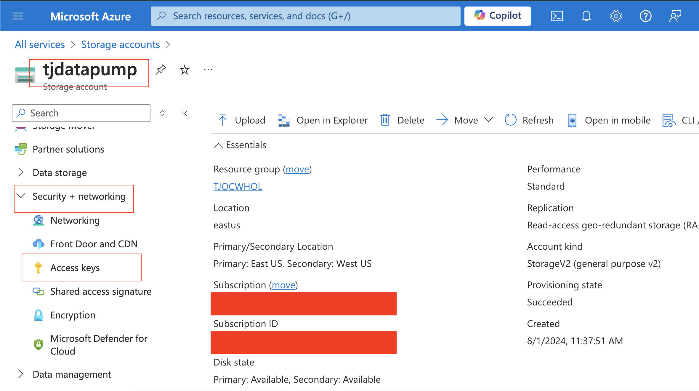
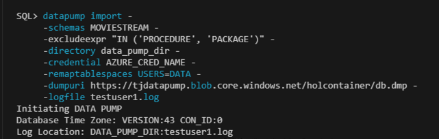
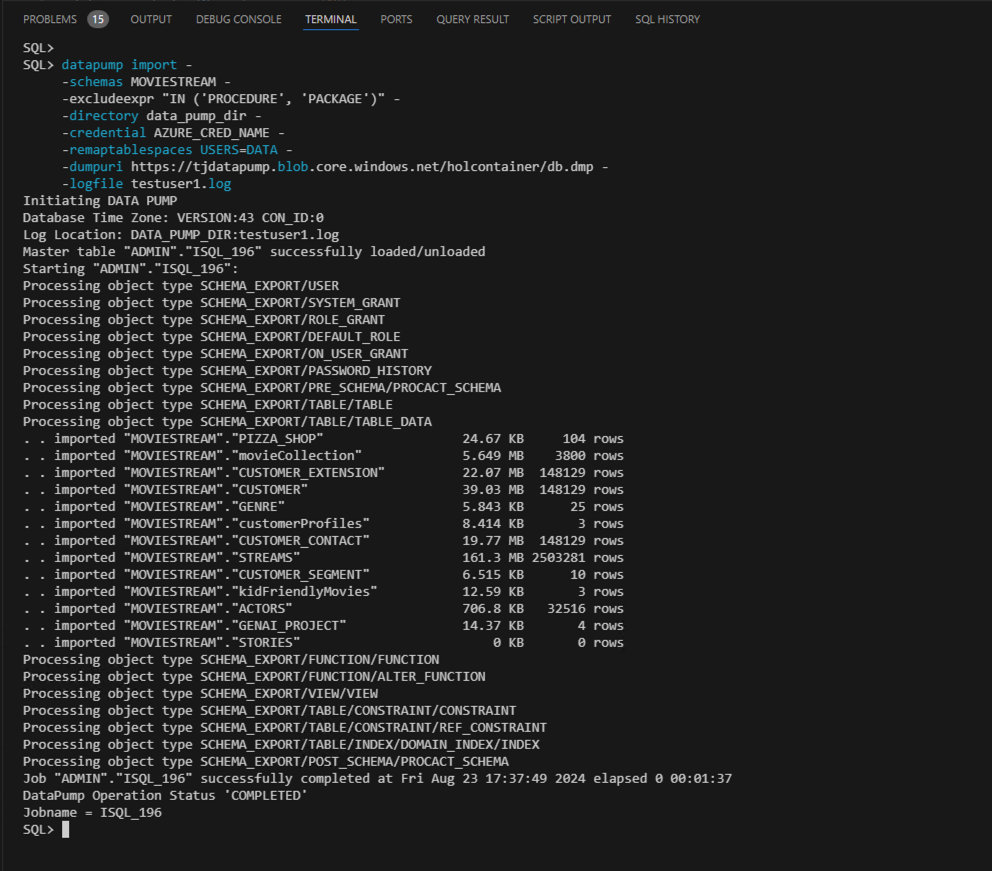

# Migrating to Autonomous Database using Data Pump

## Introduction
Oracle Data Pump offers very fast bulk data and metadata movement between user managed Oracle databases and Autonomous Database.

Data Pump Import lets you import data from Data Pump files residing on the Object Storage. You can save your data to your Cloud Object Store and use Oracle Data Pump to load data to Autonomous database.

This lab walks you through the steps to migrate a sample application schema using Data Pump Import into your Autonomous Database.

Estimated Time: 15 minutes


Watch the video below for a quick walk-through of the lab.
[Simplifying @ Azure](videohub:1_68d8k1oy)

### Objectives

As a database admin or user:
1. Set up cloud credentials and use the sample .dmp file to import data to your Autonomous database.


### Required Artifacts
- Access to a pre-provisioned Autonomous Database instance.
- A pre-provisioned Windows instance with Visual studio installed.


## Task 1: Generate an authentication token for your user account

- Assuming you are logged into your Azure account, navigate to ***All services*** -> ***Storage*** -> ***Storage Accounts***.
     

- On the Storage accounts details page, scroll down and click on **tjdatapump**.
    

- On the **tjdatapump** details page, click and expand Security+Network and click on ***Access Key***.
    

- Copy the **key** and save it in a notepad.

    

## Task 2: Set up User credentials in your target autonomous database

Now that we have the credentials token, let's set up the target database to read from the Azure Storage and import data.

RDP to your provided developer client image. Once logged into your developer client, launch **Visual Studio Code** as discussed in an earlier lab and connect to your database.

Here, we will use **SQLcl** to demonstrate the steps needed to set up Azure storage credentials.

- Once connected to your autonomous database as ***admin*** user, run the following pl/sql procedure, replacing password with access key.

NOTE: For this lab you will use ***tjdatapump*** as username.

    ```
    <copy>
    set define off
    begin
    DBMS_CLOUD.CREATE_CREDENTIAL(
    credential_name => 'AZURE_CRED_NAME',
    username => 'tjdatapump',
    password => 'Access_Key_copied_in_task1'
    );
    END;
    /
    </copy>
    ```

- Here's a screenshot of the above command run from a SQLcl.

    

- Ensure the pl/sql procedure is executed successfully from the log message.

- Test the access to Azure storage

    ```
    <copy>
    select * from DBMS_CLOUD.LIST_OBJECTS('AZURE_CRED_NAME', 'https://tjdatapump.blob.core.windows.net/holcontainer/');
    </copy>
    ```

    

## Task 3: Import data from Azure storage using impdp utility

- From the same SQLcl window run the data pump import command.

    ```
    <copy>
    datapump import -
    -schemas MOVIESTREAM -
    -excludeexpr "IN ('PROCEDURE', 'PACKAGE')" -
    -directory data_pump_dir -
    -credential AZURE_CRED_NAME -
    -remaptablespaces USERS=DATA -
    -dumpuri https://tjdatapump.blob.core.windows.net/holcontainer/db.dmp -
    -logfile testuser1.log
     </copy>
    ```

    

- Your import will be completed in a few minutes as shown below.

    
    

All Done! Your application schema was successfully imported.

You may now **proceed to the next lab**.

## Acknowledgements

*Congratulations! You have successfully completed migrating an Oracle database to the Autonomous database.*

- **Author** - Tejus Subrahmanya
- **Last Updated By/Date** - Tejus Subrahmanya, August 2024