# How to use ExpressLane

## Introduction

PLease make sure that you read the following instructions carefully to understand how to use the ExpressLane Sandbox.

Estimated Lab Time: 5 minutes

### Objectives

In this lab, you will learn:
* How to view the ExpressLane Sandbox Login Information
* How to reset your OCI user password
* How to terminate an Autonomous Database instance

## Task 1: View ExpressLane Login Information

1. After creating a reservation for a LiveLab Workshop, you will receive an e-mail indicating that your reservation is being processed, followed by an e-mail indicating that your environment has been created.

  

  >**Note:** You will receive the second created e-mail just before your selected reservation time.

4. Log into LiveLabs. Click your username, and click **My Reservations**. Then click the **Launch Workshop** link for the Workshop environment you'd like to use. Note that you may have several Workshops listed.

  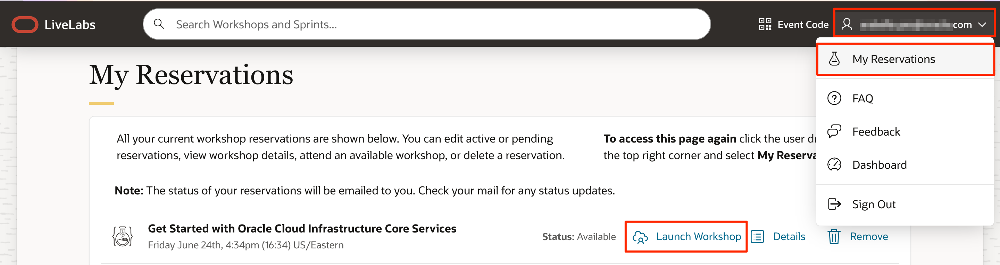

5. Click **View Login Info** and click **Launch OCI**.
  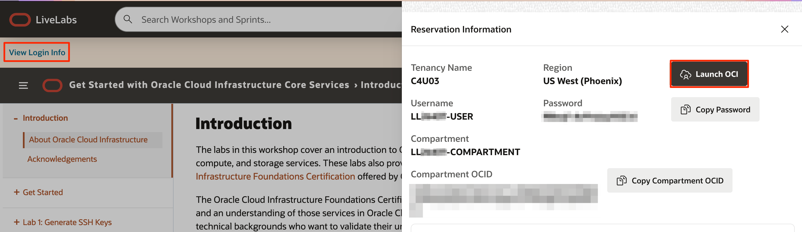

6. If you need to view your login information anytime, click **View Login Info**.
  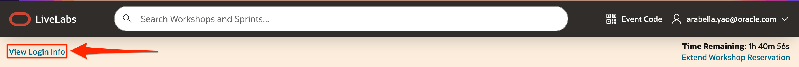

## Task 2: Reset your OCI User Password

1. In case you have forgotten your OCI User Password, you can reset using the **View Login Info**

2. Log into LiveLabs. Click your username, and click **My Reservations**. Then click the **Launch Workshop** link for the Workshop environment you'd like to use. Note that you may have several Workshops listed.

  

3. Click **View Login Info** and click **Reset Password**.
  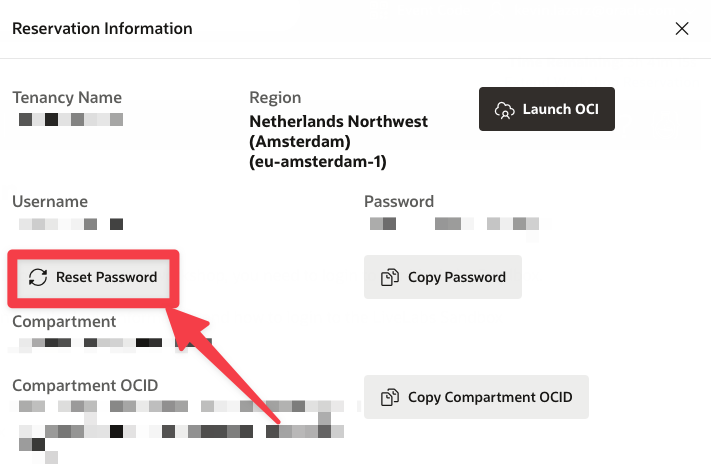

## Task 3: Terminate a Provisioned Oracle Autonomous Database Instance
Because you may want to do various workshops that require an ADB instance, we recommend to terminate instances used in previous workshops.

You can permanently delete (terminate) instances that you no longer need. Terminating an Oracle Autonomous Database permanently deletes the database data. However, automatic backups are not deleted if you have chosen Recovery Appliance or NFS as a backup destination. You can delete automatic backups directly from the Recovery Appliance or NFS.

This lab walks you through the steps to terminate an available or stopped Oracle Autonomous Database instance. For the purpose of this lab, an always free demo Oracle Autonomous Transaction Processing database instance named DEMOATP is provisioned in a compartment. *Note:* While this lab terminates an Oracle Autonomous Transaction Processing database, the steps are the same for terminating an Oracle Autonomous Data Warehouse database.

1. In the Oracle Cloud console, you need to be in the region where your Oracle Autonomous Database resources is provisioned. You can see your current default **Region** in the top right-hand corner of the page. To change the default region, click on the **Region** drop-down and choose the region where your Oracle Autonomous Database resource is provisioned.

    

2. Click on navigation menu, search **Oracle Database** and choose **Autonomous Transaction Processing** (ATP). *Note:* While this lab terminates an Oracle Autonomous Transaction Processing database that is already provisioned, the steps are the same for terminating an Oracle Autonomous Data Warehouse database.

    **Note:** You can also directly access your Oracle Autonomous Transaction Processing service in the **Quick Actions** section of the dashboard.

    

3. From the compartment drop-down menu select the **Compartment** where your Oracle Autonomous Database resource is provisioned. If there were a long list of databases, you could filter the list by the **State** of the databases (Available, Stopped, Terminated, etc) to view the database you wish to terminate. You can also sort by **Workload Type**.

    In this lab, as **DEMOATP** is an Oracle Autonomous Transaction Processing database which is already provisioned, we selected the **Transaction Processing** workload type to filter the database.

    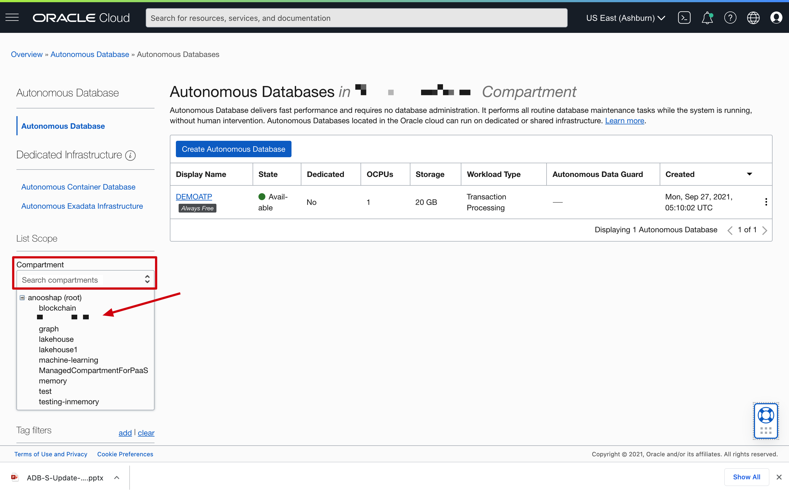
    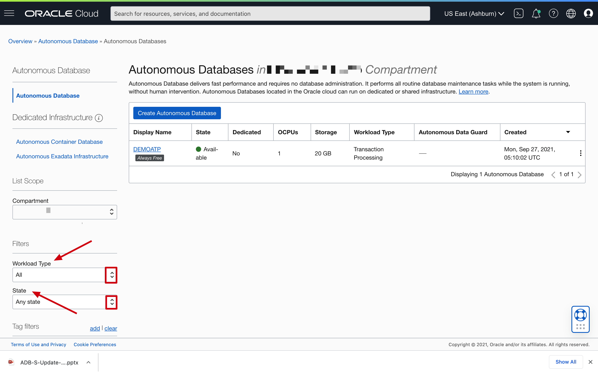

4. From the databases displayed, click **Display Name** of the database you wish to terminate.

    In this lab, we are terminating the available **DEMOATP** Oracle Autonomous Transaction Processing database instance. Click **DEMOATP**.

    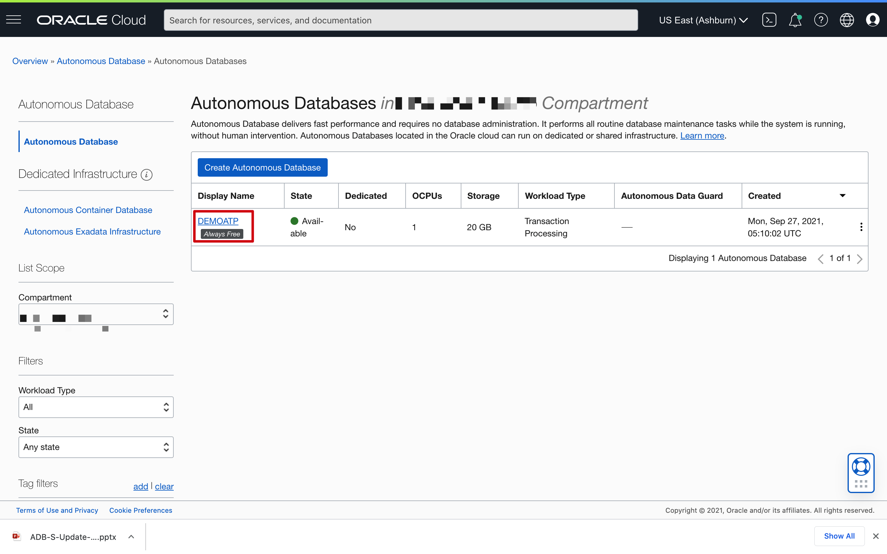

5. Click **More Actions**.

    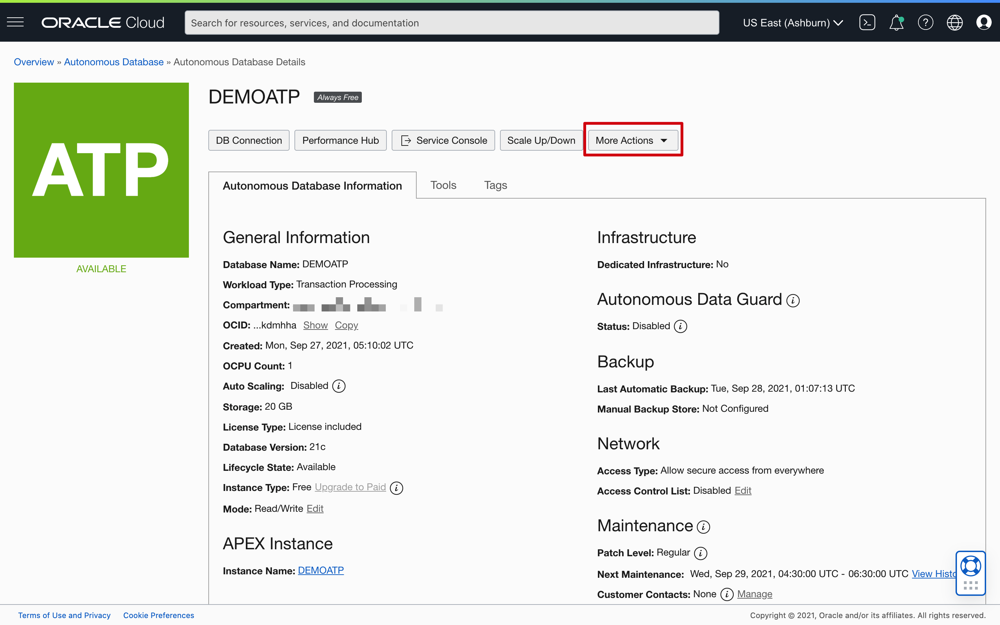

6. From the more actions drop-down, scroll down and click **Terminate**.

    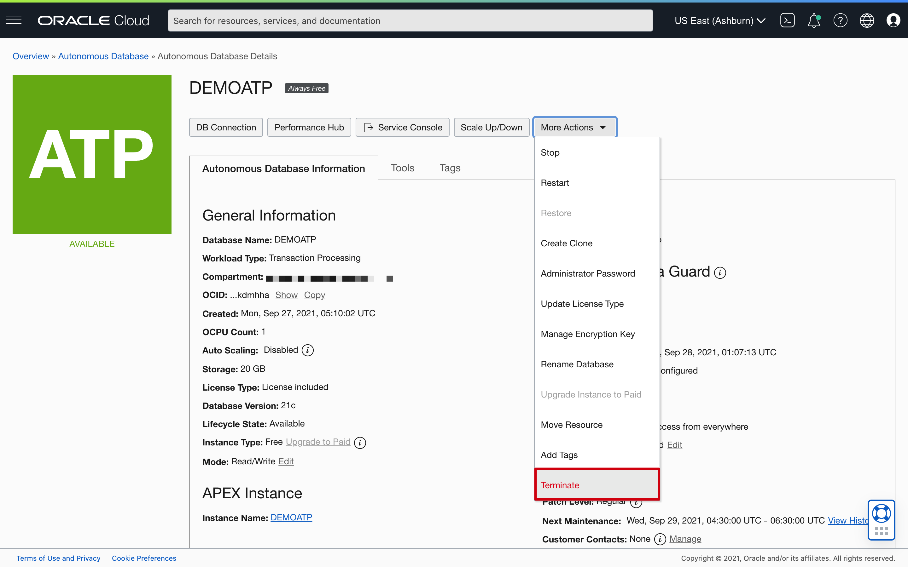

7. Confirm that you wish to terminate your Oracle Autonomous Database in the confirmation dialog. Type the database name in the input field and click **Terminate Autonomous Database**.

    In this lab, type **DEMOATP** and click **Terminate Autonomous Database**.

    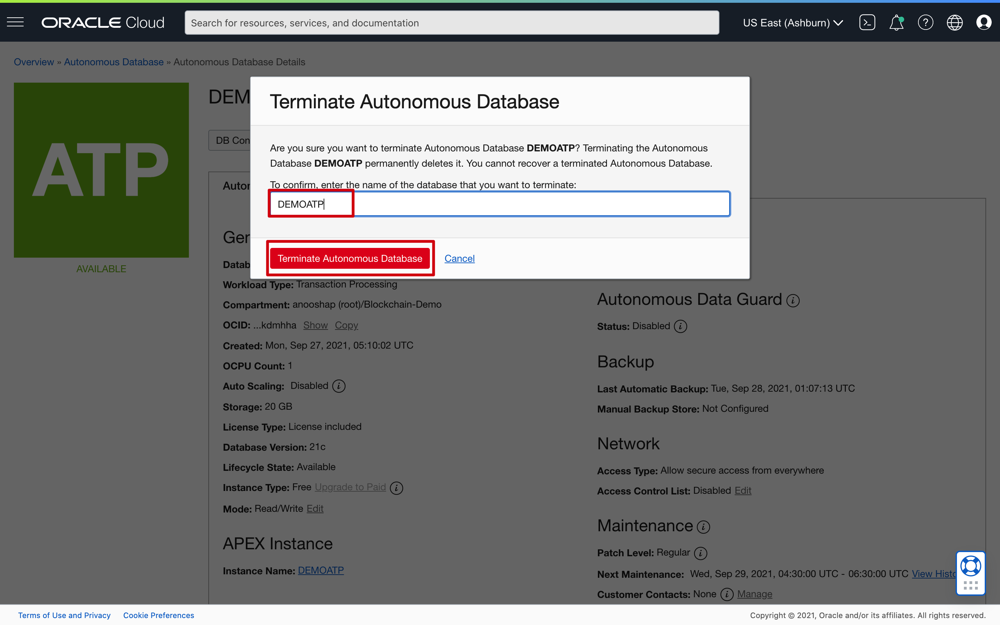

8.  Your instance will begin to terminate, the Lifecycle State will turn from Available to Terminating.

    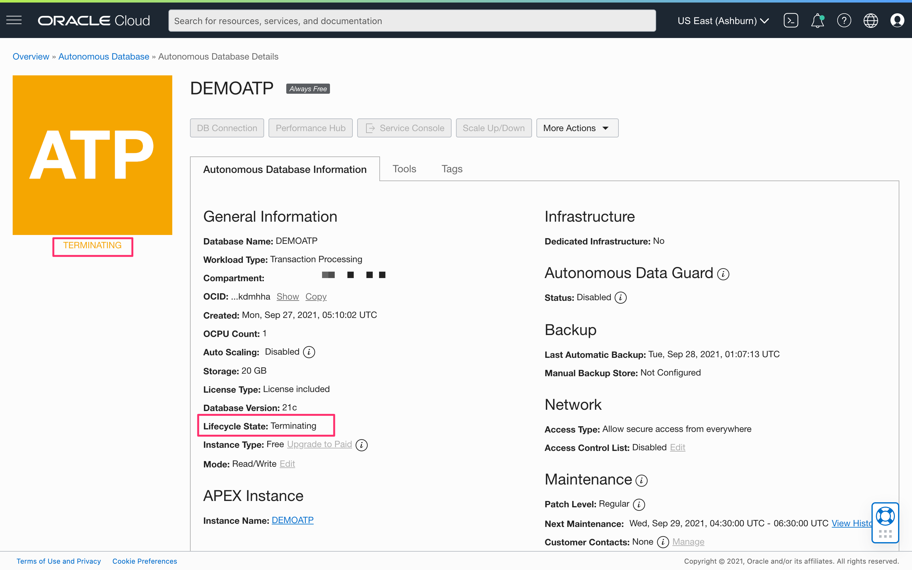

9. After a few minutes, once the instance is terminated, the Lifecycle state will change from Terminating to Terminated.

    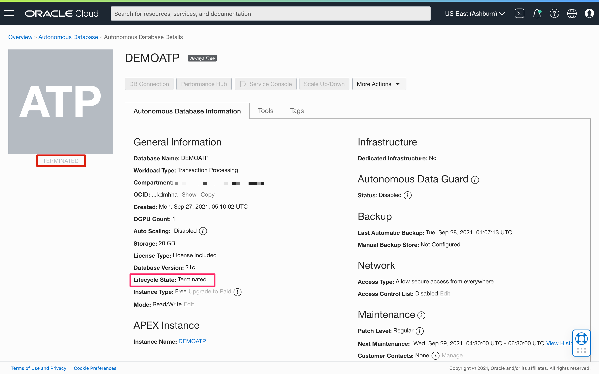

    You have successfully terminated an Oracle Autonomous Database instance.

## Learn More

* Click [here](https://docs.oracle.com/en-us/iaas/exadata/doc/eccmanagingadbs.html#GUID-A00BC3BB-3AE6-4FBF-AEAF-2D9C14CD1D9A) to know more about Managing Autonomous Databases.

## Acknowledgements
* **Author** - Kevin Lazarz, Senior Principle Product Manager, DB Product Management
* **Last Updated By/Date** - Kevin Lazarz, November 2022
