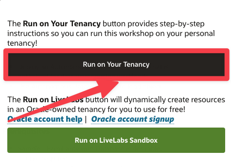

# Focus Area - Graph & Spatial

## Introduction

In this lab, you can find the list of recommended LiveLabs Workshops that can be executed using the ExpressLane Sandbox.
Simply, explore the list of workshop and select the one you would like to do.
Click on the provided link and you will be forwarded to the applicable LiveLabs Workshop landing page. 

**Important:**   
You already have access to the LiveLabs ExpressLane Environment.   
Always select, **Run on Your Tenancy** when starting a workshop.

## Workshop 1: Find Circular Payment Chains using Graph Queries in Autonomous Database

Use graph analytics and visualization to detect potentially fraudulent money transfers.
This workshop covers how to load data in CSV files into the database and introduces key graph data modeling and analysis concepts and the interactive Graph Studio for working with graphs in an Autonomous Database. It shows you how to use graph queries to find circular payments, i.e. potentially fraudulent transactions. You will load data from CSV files containing Account and Transaction information. Then create a graph and finally query it and visualize the results.

<a href="https://livelabs.oracle.com/pls/apex/dbpm/r/livelabs/view-workshop?wid=770" class="tryit-button">Try it!</a>

## Workshop 2: Working with RDF Graphs in Graph Studio

Graph Studio in Oracle Autonomous Database enables users to model, create, query, and analyze property graph data. It includes notebooks, developer APIs for executing graph queries using PGQL, nearly 60 built-in graph algorithms, and offers dozens of visualizations including native graph visualization.
In addition to property graph, Graph Studio now extends support for semantic technologies, including storage, inference, and query capabilities for data and ontologies based on Resource Description Framework (RDF) and Web Ontology Language (OWL).   
Hence, you can now use Graph Studio for the following supported RDF features:

* Create an RDF graph
* Execute SPARQL queries on the RDF graph in a notebook paragraph
* Analyze and visualize RDF graphs

<a href="https://livelabs.oracle.com/pls/apex/dbpm/r/livelabs/view-workshop?wid=770" class="tryit-button">Try it!</a>

## Workshop 3: Work with Spatial Data in Oracle Database

This workshop introduces the spatial features of Oracle Database. You'll learn how to use spatial queries to identify items based on proximity and containment within a region.

<a href="https://livelabs.oracle.com/pls/apex/dbpm/r/livelabs/view-workshop?wid=736" class="tryit-button">Try it!</a>

## Learn More

* [LiveLabs](https://livelabs.oracle.com)

## Acknowledgements
* **Author** - Kevin Lazarz, Senior Principle Product Manager, DB Product Management
* **Last Updated By/Date** - Kevin Lazarz, November 2022

