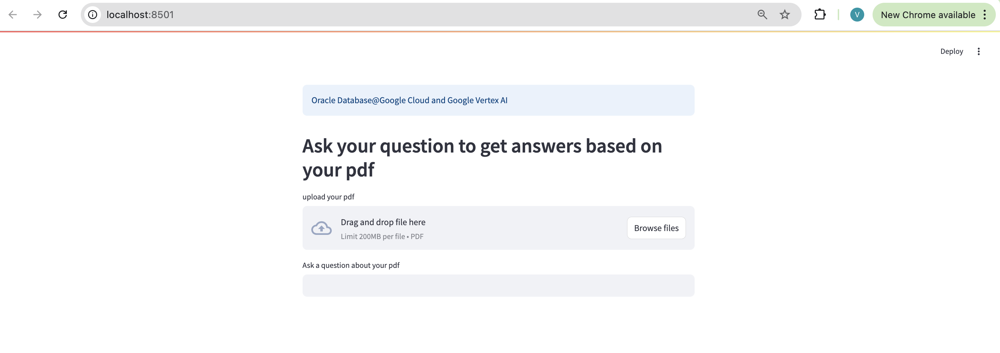
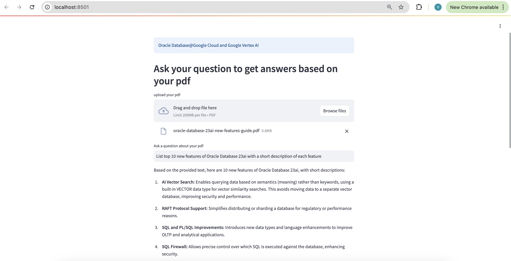

# Run the RAG Application interactively

## Introduction

Estimated Time: 10 min

### Objectives

In this lab you will run the RAG application interactively using a simple user interface. You can select and load from several PDF documents, and ask your own question in the prompt. This is the same application with the 7 essential RAG steps as the previous lab but demonstrates use through a user interface.

### Required Artifacts

- A pre-provisioned instance of an Autonomous Database.
- Google Cloud Compute VM instance.

## Task 1: Run Application

1. From the VSCode terminal, go to directory `vectors`

    ```
    <copy>
    cd $HOME/vectors
    </copy>
    ```
2. Update the following in application python file - `rag_app_ui.py` :

    DB Username, 
    DB Password, 
    DB Connection String, 
    DB Wallet Password, 
    Google Cloud Project ID, 
    Google Cloud Region

3. Run the RAG application from terminal

    ```
    <copy>
    streamlit run rag_app_ui.py
    </copy>
    ```

    

4. Click **Open in Browser** to launch the application in a browser. If the prompt doesn't show up, open a browser and launch the application - http://IP-Address-of-Compute-VM:8501.

    

    Your application will now be running. Simply follow the UI.

5. Click the **Browse files** button and load a PDF document.

    After a few seconds the PDF document will be loaded, transformed to text, chunked, and vectorized into Oracle Database 23ai.

    A prompt area will now appear for you to ask a question about your PDF. You can type in your own question or use the suggestions listed below.

6. Type a question and hit return.
    
    In a few seconds the LLM will answer the question and respond with context stored in Oracle Database 23ai.

    

Suggestions

For the Oracle Database 23ai documentation:

* What are the new features in Oracle Database 23ai
* Tell me more about AI Vector Search
* Tell me more about new enhancement to SQL
* Tell me more about JSON Relational Duality
* List 5 new features of Oracle 23ai database

### Conclusion

In this lab you ran a RAG application with a UI using the same steps for RAG leveraging Oracle Database@Google Cloud and Google Vertex AI. The blueprint is the same. Now it's your turn. Experiment with different transformers for different data sources. It could be video, audio, text and more. They're all embedded as vectors in Oracle Database 23ai.

By using AI Vector Search in Oracle Database 23ai, you can build RAG applications with important context without having to retrain the LLM. The context is stored, searched and retrieved from Oracle Database 23ai and passed to Google Vertex AI Gemini Flash Model to generate accurate, up to date, and targeted responses to your prompts.

## Acknowledgements

- **Authors/Contributors** - Vivek Verma, Master Principal Cloud Architect, North America Cloud Engineering
- **Last Updated By/Date** - Vivek Verma, Mar 2025