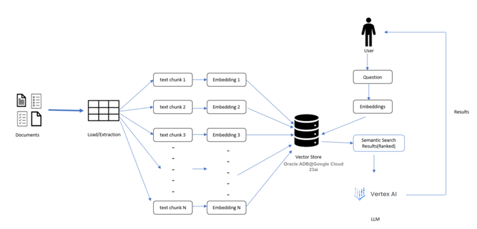
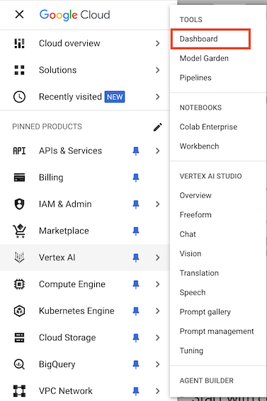
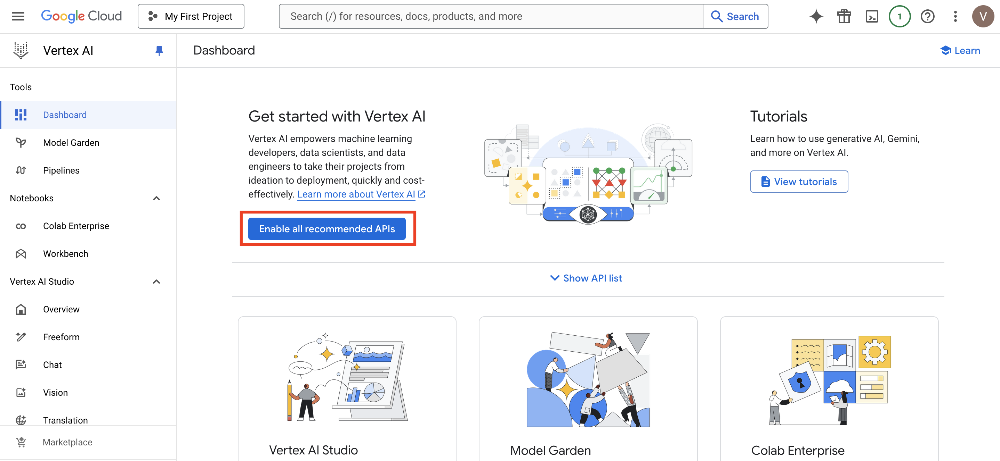
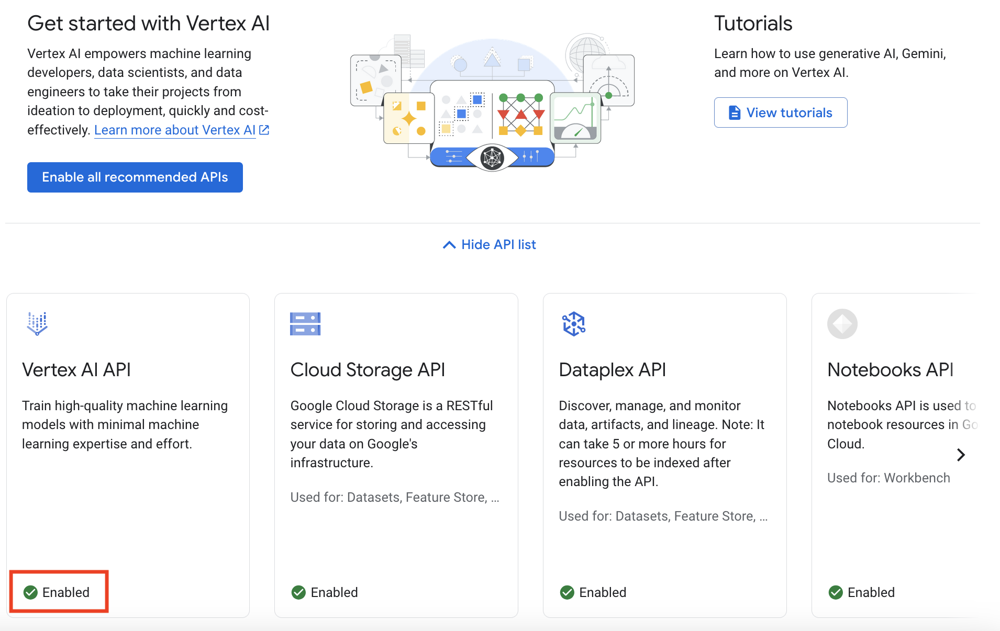
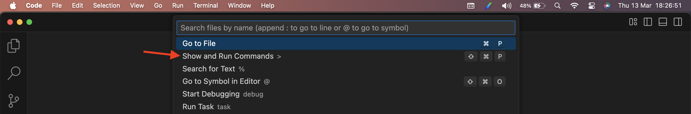
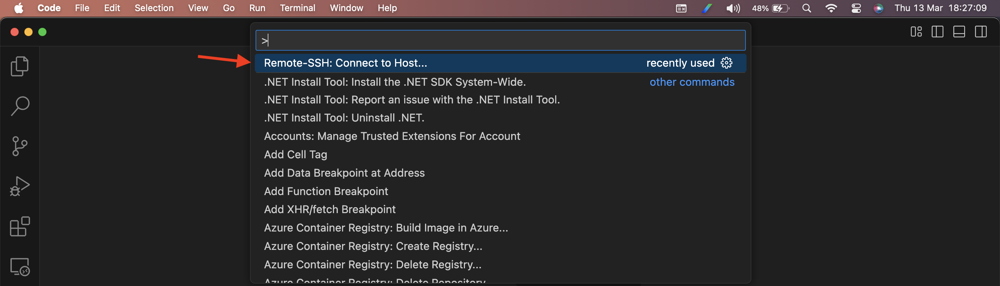
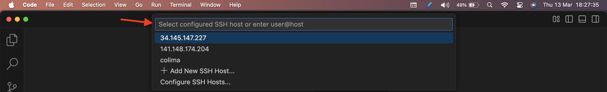
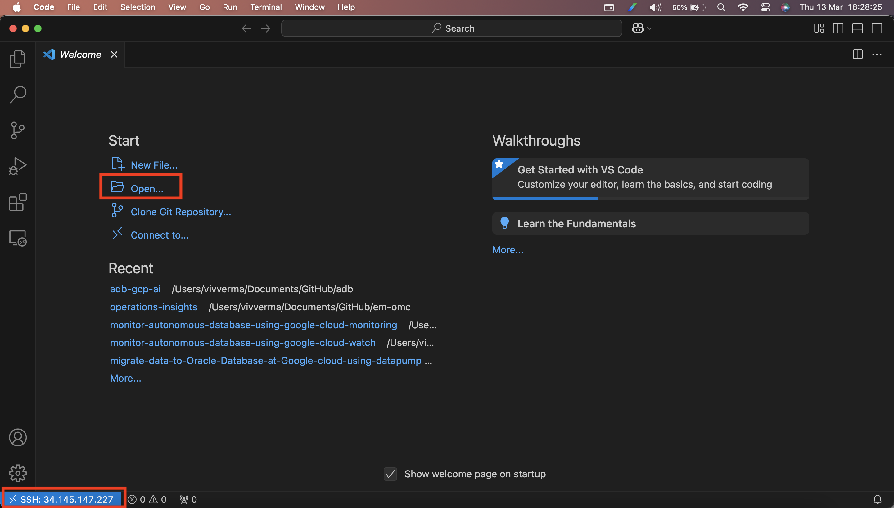
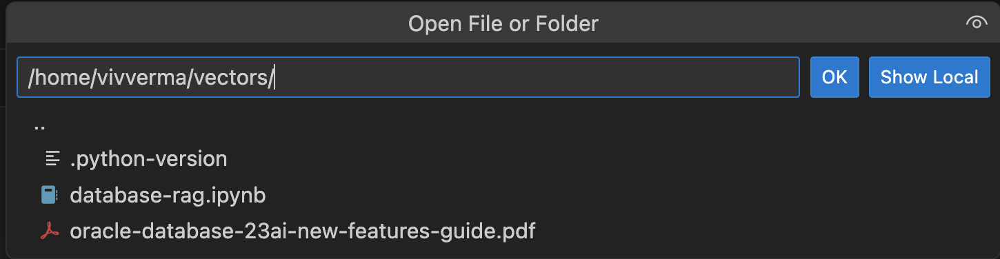

# Build the RAG Chatbot engine

## Introduction

In this lab we will implement a RAG (Retrieval Augmented Generation) chatbot using vector similarity search and Generative AI / LLMs.

We will guide you through the process of loading and parsing a pdf file, integrating it with an Oracle 23ai database, and employing the Google Cloud Platform to order it and run the Python code and Generative AI services needed for the chatbot.

Oracle Database 23ai will be used as the vector store. In this lab, we will use a pdf file as the source data, but you can apply these steps to other data types including audio and video. **Gemini 1.5 Flash (gemini-1.5-flash-002)**, a multimodal model from Google AI, is leveraged for RAG.

High-level steps followed in this lab:

1. Load your document.

2. Transform the document to text.

3. Chunk the text document into smaller pieces.

4. Using an embedding model, embed the chunks as vectors into Oracle Database 23ai.

5. Ask the question for the prompt, the prompt will use the same embedding model to vectorize the question.

6. The question will be passed to Oracle Database 23ai and a similarity search is performed on the question.

7. The results (context) of the search and the prompt are passed to the LLM to generate the response.

    

### Concepts

- What is a Vector?

    A vector is like a fingerprint for information. Just like every person’s fingerprint is unique and gives us lots of details about them, a vector in AI is a unique set of numbers representing the important semantic features of a piece of information, like a block of text, an image, a sound, or a video.

- What is Similarity Search and Outlier Search?

    A similarity search helps you find semantically similar things, like Google or Bing does. But imagine being able to do that in the database, with text, audio, image, and video files and the full power of SQL and PL/SQL at your disposal. An outlier search does the opposite: it retrieves the most dissimilar results.

- What is a LLM?

    LLMs, or Large Language Models, are AI algorithms that use deep learning techniques and large data sets to understand, summarize, generate, and predict new content. Oracle AI Vector Search works well with any Large Language Model [LLM] and vector embedding model.

- What is RAG?

    Retrieval Augmented Generation (RAG) is a technique that enhances LLMs by integrating Similarity Search. This enables use cases such as a corporate chatbot responding with private company knowledge to make sure it’s giving answers that are up-to-date and tailored to your business.

Estimated Time: 10 minutes

### Objectives

As a database user, DBA or application developer:

1. Implement a RAG chatbot using vector similarity search and Generative AI/LLMs.
2. Load and parse a FAQ-like text file, integrating it with an Oracle 23ai database.
3. Employ the Google Cloud Platform to order and run the Python code and Generative AI services needed for the chatbot.
4. Use the Oracle Database 23ai vector database to store and retrieve relevant information.
5. Leverage the Gemini Generative AI service (Vertex AI) to generate high-quality responses to user queries.

### Required Artifacts

- A pre-provisioned instance of an Autonomous Database.
- Google Cloud Compute VM instance.

## Task 1: Enable Vertex AI API

In this section, you will be enabling Vertex AI API to be used later in the lab.

1.	From Google Cloud Console go to the main menu and click **Vertex AI** and **Dashboard**.

    

2. The will launch the **Vertex AI Dashboard**. On the Dashboard click **Enable all recommended APIs**.

    

3. After the API is enabled, confirm the same from the **Dashboard**.

    

## Task 2: Launch VSCode

We will use Visual Studio Code (VSCode) to connect to our Google Cloud VM and run our Jupyter Notebook.

Please use VSCode's Remote Explorer function to connect to your remote VM. If you don't know how to do that, please see [this tutorial first](https://code.visualstudio.com/docs/remote/ssh).

1. Launch VSCode on your local machine and connect to the remote VM. Click the **Search Bar** and select **Show and Run Commands**.

    

2. Type **Remote-SSH** and select **Remote-SSH: Connect to Host...**.

    

3. Enter the IP address of the Google Compute VM Instance that we provisioned earlier in this workshop and press **Enter**.

    

4. On the next VSCode Window, verify that you have remotely connected to the Compute VM instance. Left bottom corner has a message **SSH: IP Address**. Click **Open** to open the Juniper Notebook.

    

5. Select the `database-rag.ipynb` file present under `vectors` directory.

    

## Task 3: Run the RAG application code snippets in Jupyter notebook

Open the `vectors.ipynb` file (this file, really) in VSCode and continue reading while executing the code cells below.

You may now **proceed to the next lab**.

## Acknowledgements

- **Authors/Contributors** - Vivek Verma, Master Principal Cloud Architect, North America Cloud Engineering
- **Last Updated By/Date** - Vivek Verma, Mar 2025