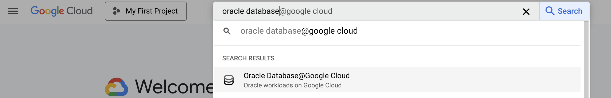
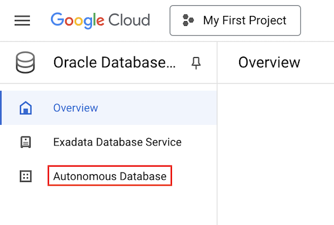
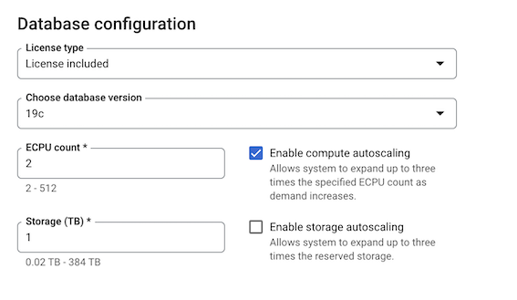
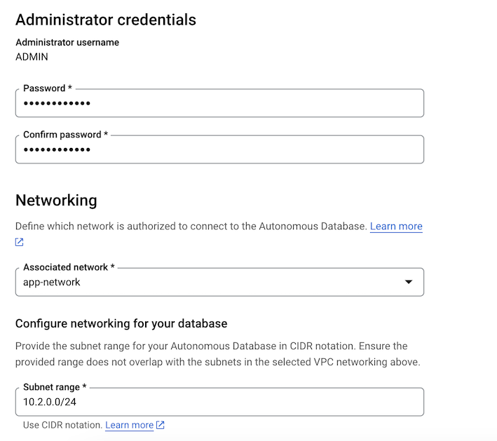
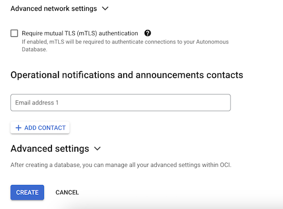
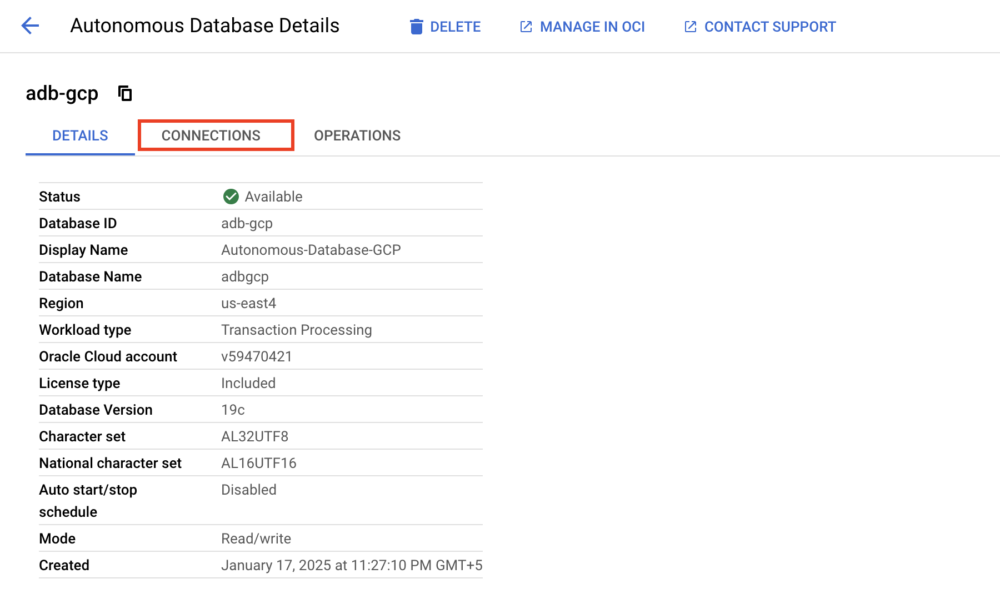
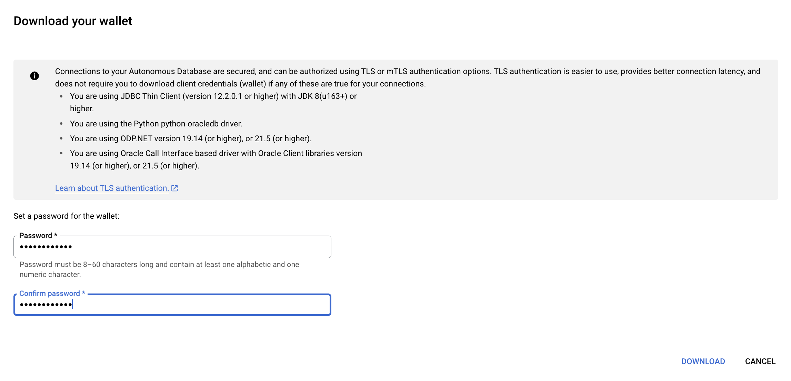

# Provisioning Autonomous Database

## Introduction

This lab walks you through the steps to provision Autonomous Database. 

Estimated Time: 10 minutes

### Objectives

As a database user, DBA or application developer:

1. Rapidly deploy an Autonomous Transaction Processing databases.

### Required Artifacts

- A Google Cloud account with a pre-configured Virtual Private Cloud (VPC) Network.

## Task 1: Create Autonomous Database

In this section, you will be provisioning an Autonomous Database using the Google Cloud Console.

1.	Login to Google Cloud Console (console.cloud.google.com) and search for **Oracle Database** in the **Search Bar** on the top of the page. Click on **Oracle Database@Google Cloud**.

    

-  Click **Autonomous Database** from the left menu.

    

- Click **Create** on the Autonomous Database details page.

    

-  This will bring up the **Create an Autonomous Database** screen where you specify the configuration of the database.

- Enter the following for **Instance details**:

    * **Instance ID** - adb-gcp
    * **Database name** - adbgcp
    * **Database display name** - Autonomous-Database-GCP
    * **Region** - us-east4

    

- Select **Transaction Processing** for **Workload configuration**

    

- Leave all defaults for **Database configuration**

    

- Enter the password for admin user under **Administrator credentials**

- In the **Associated network** drop-down, select the network you want to use - 'app-network'. This is the VPC that contains the public subnet where compute VM instance is placed. This VPC is used to connect to the Autonomous Database subnet.

- Enter CIDR range '10.2.0.0/24' for **Subnet range** under **Configure networking for your database**. This is the IPv4 subnet range for your Autonomous Database. The database subnet range can't overlap with the subnet range of the VPC network specified under **Associated network**. The subnet range specified here will create a Private Subnet where the Autonomous Database will be placed. If a Private Subnet with this range exists, the database will be added to that private subnet.

    

- Leave the rest as defaults and click **CREATE** to create the Autonomous Database.

    

- Post creation the Autonomous Database will appear on the **Autonomous Database** page.

    

## Task 2: Download the Autonomous Database wallet file

**Oracle Autonomous Database** only accepts secure connections to the database. This requires a **'wallet'** file that contains the SQL\*NET configuration files and the secure connection information. Wallets are used by client utilities such as SQL Developer, SQL\*Plus etc.

- On the **Autonomous Database** page click the Autonomous Database that was provisioned.

    

- Go to the **CONNECTIONS** tab.

    

- Click **DOWNLOAD WALLET** on the **Connections** page.

    

- Set a password for the wallet on the **Download your wallet** page and click **DOWNLOAD**

    
    
- Create a folder named **wallet** on the Compute VM instance and scp or Copy over the Wallet zip file to wallet folder on the VM instance. If you are using a Linux Terminal, run the following command to copy over the wallet to the VM instance -

    ```
    <copy>
    scp -i <private_key_file> Wallet_db_name.zip <Compute_VM_IP>:/home_directory/wallet/.
    </copy>
    ```

- Login to the Compute VM and unzip the database wallet that was uploaded in the previous step.

    ```
    <copy>
    cd wallet
    sudo apt install unzip
    unzip Wallet_db_name.zip
    </copy>
    ```

You may now **proceed to the next lab**.

## Acknowledgements

*All Done! You have successfully deployed your Autonomous Database instance and is available for use now.*

- **Authors/Contributors** - Vivek Verma, Master Principal Cloud Architect, North America Cloud Engineering
- **Last Updated By/Date** - Vivek Verma, Mar 2025