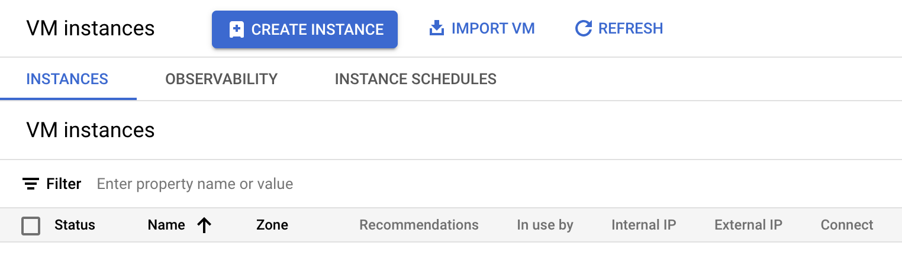
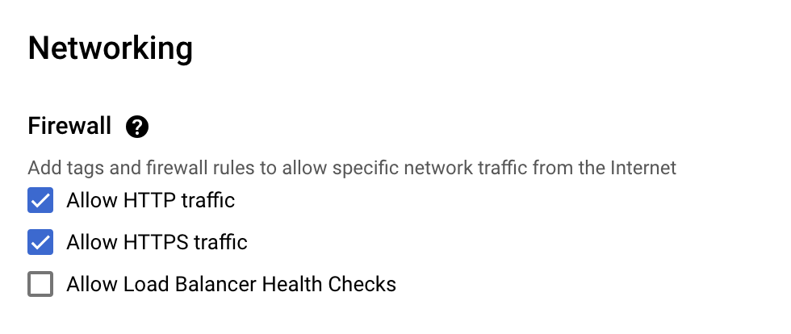

# Provisioning Google Cloud resources

## Introduction

This lab walks you through the prerequisites to get started with Oracle Database@Google Cloud - Autonomous Database. This involves creating a Virtual Private Cloud (VPC) Network in Google Cloud that will be associated with the Autonomous Database and a Compute VM instance that will be used to connect to the Autonomous Database.

Estimated Time: 30 minutes

### Objectives

As a database user, DBA, or application developer:

1. Create a Virtual Private Cloud (VPC) Network in Google Cloud Portal.
2. Provision a Compute VM instance in Google Cloud.
3. Setup the Python environment

## Task 1: Create a Virtual Private Cloud (VPC)

In this section, you will create a VPC which will have two subnets: 

* A private subnet where you Autonomous Database is deployed (this will be created as part of your ADB deployment). A private subnet will protect your database endpoint from internet access.
* A public subnet where you will deploy a virtual machine. You will use this VM to access Autonomous Database.

1.  Login to Google Cloud Console (console.cloud.google.com) and click on the **Navigation Menu**. Then click on **VPC Networks** under **VPC Network**..

    

2.	On the **VPC networks** page, click on the **CREATE VPC NETWORK** button.

    

3.	On **Create a VPC Network** provide details as mentioned below. 
    
    * **VPC Name** - app-network
    * **Description** - Application Database Network

    

    Under **Subnets** enter the details of the Subnet -

    * **Subnet Name** - public-subnet
    * **Description** - Public Subnet
    * **Region** - us-east4
    * **IPv4 range** - 10.1.0.0/24
    * Leave the rest as defaults under **Subnets**

    

    Under **Firewall rules** select all rules -

    

    Click **CREATE** to create the VPC Network.

    

4.	The created VPC will show up on the **VPC networks** page -

    

## Task 2:  Provision Google Cloud Compute VM Instance

1.  Generating ssh key pairs
    
    SSH keys are required to access a running compute VM instance securely. You can use an existing SSH-2 RSA key pair or create a new one. Instructions for creating SSH keys can also be found on the [OCI documentation page](https://docs.cloud.oracle.com/iaas/Content/GSG/Tasks/creatingkeys.htm). For Linux instances you can generate SSH keys [here](https://docs.oracle.com/en-us/iaas/Content/Compute/Tasks/managingkeypairs.htm#Managing_Key_Pairs_on_Linux_Instances).

2. From the Google Cloud Console (console.cloud.google.com), click on the **Navigation Menu**. Then click on **VM instances** under **Compute Engine**.

    

3. On the **VM instances** page click **CREATE INSTANCE**

    

4. Under **Machine configuration** enter the following -

    * **Name** - app-instance
    * **Region** - us-east4
    * Leave the rest as default.

    

5.  Leave all as default under **OS and storage**

6.  Click **Networking** on the left tab and enter the following -

    * **Allow HTTP traffic** - Checkmark
    * **Allow HTTPS traffic** - Checkmark

    

    Click the drop down for **Network interfaces**

    

    Enter the following under **Edit network interface**

    * **Network** - app-network
    * **Subnetwork** - public-subnet

    

7.  Click **Security** on the left tab and enter the following. Click **MANAGE ACCESS** and click **ADD ITEM** under **Add manually generated SSH keys**. Enter the public ssh key. Click **CREATE** to create the VM instance.

    

8.	The created VM instance will show up on the **VM instances** page -

    

You may now **proceed to the next lab** to provision Autonomous Database.

## Task 3:  Setup the Python environment

For this lab, we will use Visual Studio Code (VSCode) to connect to our Google Cloud Compute VM and run all the configuration steps, edit, and run our Jupyter Notebook.

1. Launch a terminal session and ssh to the Compute VM instance using the IP address and the private key corresponding to the public key that was entered during Compute VM instance provisioning. After connecting to the VM instance update the softwares installed.

    ```
    <copy>
    sudo apt update
    </copy>
    ```

2. Install `pyenv` on the Compute VM. This is our way to quickly and neatly manage multiple Python versions on the same machine. For this lab, we will use Python 3.12. Run the following commands (for the latest version of this procedure, see [the official pyenv page here](https://github.com/pyenv/pyenv-installer)):

    ```
    <copy>    
    sudo apt install -y make build-essential libssl-dev zlib1g-dev libbz2-dev \
    libreadline-dev libsqlite3-dev wget curl llvm libncurses5-dev libncursesw5-dev \
    xz-utils tk-dev libffi-dev liblzma-dev python3-openssl git

    curl https://pyenv.run | bash

    echo 'export PYENV_ROOT="$HOME/.pyenv"' >> ~/.profile
    echo 'command -v pyenv >/dev/null || export PATH="$PYENV_ROOT/bin:$PATH"' >> ~/.profile
    echo 'eval "$(pyenv init -)"' >> ~/.profile

    echo 'export PYENV_ROOT="$HOME/.pyenv"' >> ~/.bashrc
    echo 'command -v pyenv >/dev/null || export PATH="$PYENV_ROOT/bin:$PATH"' >> ~/.bashrc
    echo 'eval "$(pyenv init -)"' >> ~/.bashrc

    exec "$SHELL"
    </copy>
    ```

3. Install Python 3.12 on the VM:

    ```
    <copy>
    pyenv install 3.12
    </copy>
    ```

4. Create a new folder called `vectors` . Go to the `vectors` folder and make Python 3.12 the active kernel for it:

    ```
    <copy>
    cd vectors
    pyenv local 3.12
    </copy>
    ```

5. Last step in this phase is installing the Python libraries for accessing the Oracle Database and sentence transformers (to convert strings to vectors):

    ```
    <copy>
    pip install --upgrade pip
    pip install oracledb
    pip install dotenv
    pip install sentence-transformers
    pip install PyPDF2
    pip install langchain
    pip install --upgrade google-cloud-aiplatform
    pip install langchain_community
    pip install -U langchain-community
    pip install langchain_huggingface
    pip install -U langchain-google-vertexai
    pip install streamlit
    pip install oci
    </copy>
    ```

## Acknowledgements

*All Done! You have successfully created a VPC Network and Compute VM instance.*

- **Authors/Contributors** - Vivek Verma, Master Principal Cloud Architect, North America Cloud Engineering
- **Last Updated By/Date** - Vivek Verma, Mar 2025