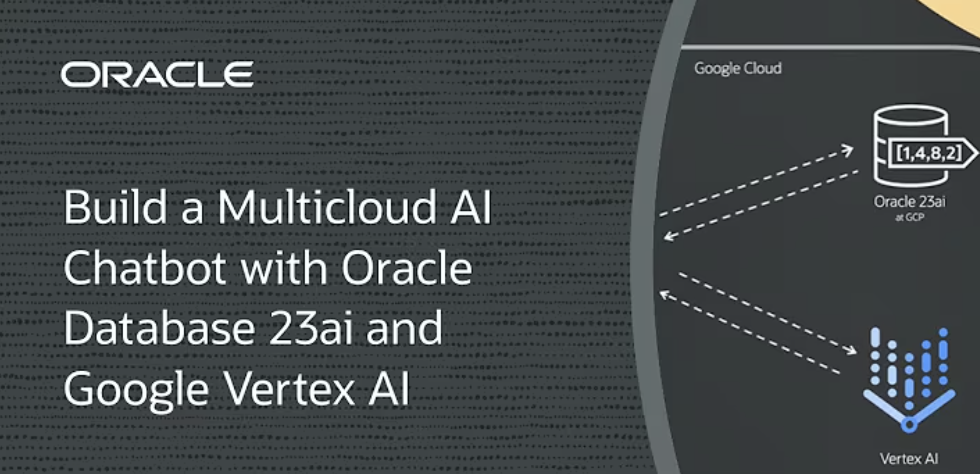

# About this Workshop

## Introduction to Oracle Database@Google Cloud
Oracle Database@Google Cloud is an Oracle Cloud Database service that runs Oracle Database workloads in your Google Cloud environment. Built on Oracle's best database services - Oracle Exadata Database Service and Oracle Autonomous Database - you can quickly develop and modernize applications with capabilities such as Oracle Database 23ai AI Vector Search and Google’s Vertex AI. 

With native integration, you can deploy your Oracle database services in a Google Cloud data center running on Oracle Cloud Infrastructure (OCI) Exadata hardware with minimal latency. Workloads reside in Google Cloud and the Exadata systems used by both services are deployed in Google Cloud data centers. You get the best from Oracle and Google Cloud – which includes the performance and monitoring tools, developer tools, analytics, etc.

In this workshop you’ll learn how to deploy a retrieval-augmented generation–based chatbot on Google Cloud using Oracle Database 23ai. This is done with the Oracle Database@Google Cloud service, which enables you to run Oracle Database workloads in a Google Cloud environment and with Gemini 1.5 Flash, the best performing Gemini model from Google Vertex AI.

**Gemini 2.5 Flash**

We will be using **Gemini 2.5 Flash** AI model in this lab. Gemini 2.5 models are thinking models, capable of reasoning through their thoughts before responding, resulting in enhanced performance and improved accuracy.

Gemini 2.5 Flash: best for balancing reasoning and speed.

Gemini 2.5 Flash is a thinking model, designed to tackle increasingly complex problems.

Key features:

* User can activate thinking

* User can set a thinking budget (8k-24k tokens)

**Use cases**

* **Visual information seeking**: Use external knowledge combined with information extracted from the input image or video to answer questions.
* **Object recognition**: Answer questions related to fine-grained identification of the objects in images and videos.
* **Digital content understanding**: Answer questions and extract information from visual content like infographics, charts, figures, tables, and web pages.
* **Structured content generation**: Generate responses based on multimodal inputs in formats like HTML and JSON.
* **Captioning and description**: Generate descriptions of images and videos with varying levels of detail.
* **Reasoning**: Compositionally infer new information without memorization or retrieval.
* **Audio**: Analyze speech files for summarization, transcription and Q&A
* **Multimodal processing**: Process multiple types of input media at the same time, such as video and audio input

Estimated Workshop Time: 120 minutes

## Workshop Objectives
This set of hands-on-labs is designed to assist developers, multicloud architects, and database users in setting up and using various features of the **Autonomous Database Service**. The labs in this workshop address provisioning Autonomous Database@Google Cloud and deploying a retrieval-augmented generation–based chatbot on **Google Cloud** using **Oracle Database 23ai** and **Vertex AI**.

## Prerequisites
- An existing Google Cloud Account

If you do not have an Oracle Cloud Infrastructure (OCI) account, you can create one during your service deployment. If you do have an OCI account, you can use it with Oracle Database@Google Cloud.

Find more details on getting started [Onboarding with Oracle Database@Google Cloud](https://docs.oracle.com/en-us/iaas/Content/database-at-gcp/oagcp-onboard.htm)

### Workshop Labs

* Get Started
* Lab 1: Provision Google Cloud resources
* Lab 2: Provision Autonomous Database@Google Cloud
* Lab 3: RAG Application with Oracle Database@Google Cloud
* Lab 4: Run the RAG application using UI

Please proceed to the next lab.

## Acknowledgements
- **Authors/Contributors** - Vivek Verma, Master Principal Cloud Architect, North America Cloud Engineering
- **Last Updated By/Date** - Vivek Verma, July 2025