# Provisioning Autonomous Database

## Introduction

This lab walks you through the steps to provision Autonomous Database.

Estimated Time: 10 minutes

### Objectives

As a database user, DBA or application developer:

1. Provision an ODBG Network
2. Rapidly deploy an Autonomous Transaction Processing databases.

### Required Artifacts

- A Google Cloud account with a pre-configured Virtual Private Cloud (VPC) Network.

## Task 1: Create an ODBG Network

In this section, you will create an ODBG Network. **ODBG networks** provide secure and private connectivity to your Oracle Database resources, giving you control over how they connect and communicate.

1. Login to Google Cloud Console (console.cloud.google.com) and search for **Oracle Database** in the **Search Bar** on the top of the page. Click on **Oracle Database@Google Cloud**.

    

- Click **ODBG network** from the left menu.

    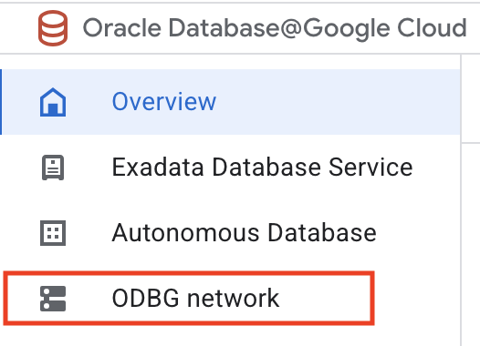

- Click **Create** on the ODBG network page.

    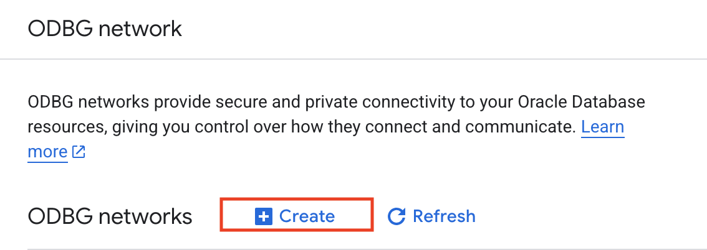

- This will bring up the **Create ODBG network** screen where you specify the configuration of the ODBG network.

- Enter the following for **ODBG network**:

  - **Associated network** - app-network
  - **Region** - us-east4
  - **ODBG network name** - odbg-network

    Click **Create**.

    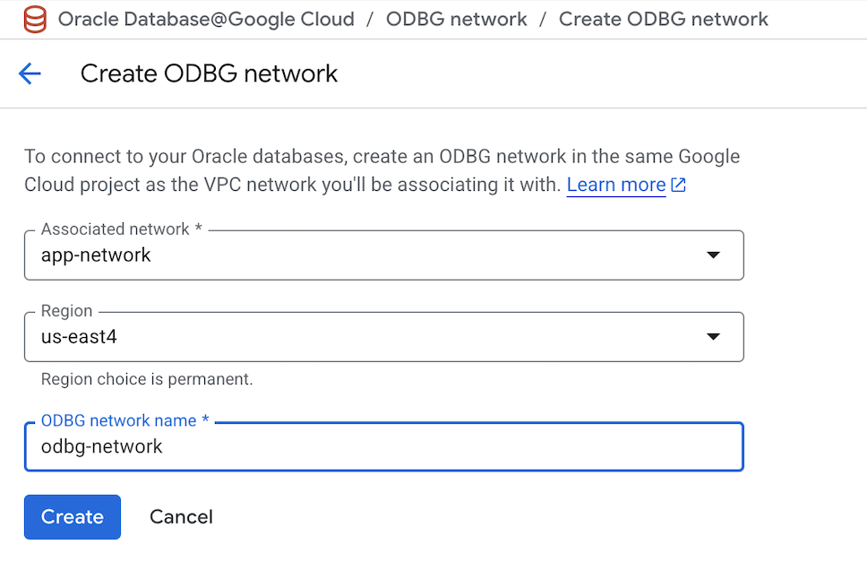

- On the **ODBG network** page click on the ODBG network that we just created **odbg-network**.

    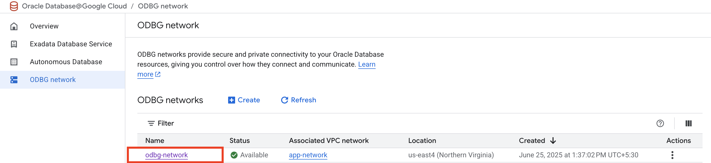

- On the **ODBG network details** page click **Create** to create a Subnet.

    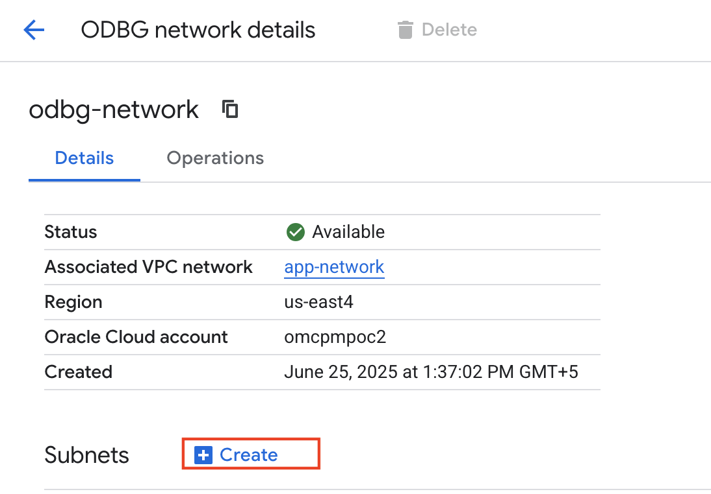

- Enter the following for **ODBG subnet**:

  - **Subnet name** - db-subnet
  - **Subnet range** - 10.2.0.0/24
  - **Subnet type** - Client

    Click **Create**.

    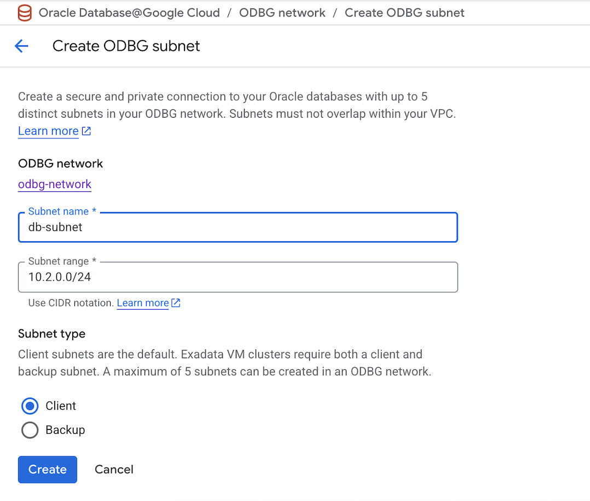

- On the **ODBG network details** page, verify the details of the ODBG Network and confirm the **Status** of subnet **db-subnet** is set to **Available**.

    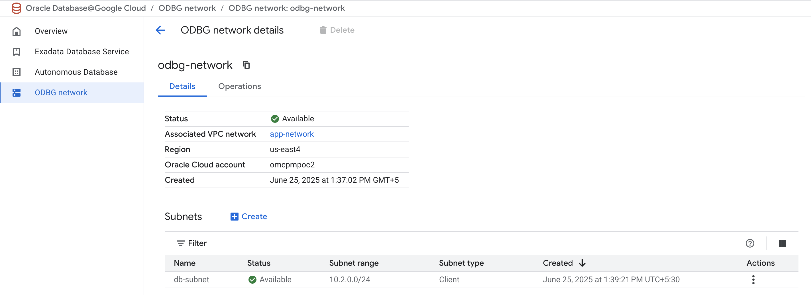

## Task 2: Create Autonomous Database

In this section, you will be provisioning an Autonomous Database using the Google Cloud Console.

1. Login to Google Cloud Console (console.cloud.google.com) and search for **Oracle Database** in the **Search Bar** on the top of the page. Click on **Oracle Database@Google Cloud**.

    

- Click **Autonomous Database** from the left menu.

    

- Click **Create** on the Autonomous Database details page.

    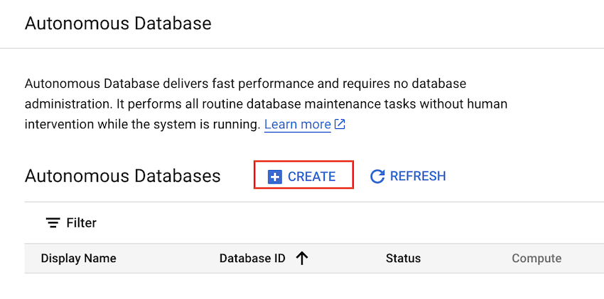

- This will bring up the **Create an Autonomous Database** screen where you specify the configuration of the database.

- Enter the following for **Instance details**:

  - **Instance ID** - adb-gcp
  - **Database name** - adbgcp
  - **Database display name** - Autonomous-Database-GCP
  - **Region** - us-east4

    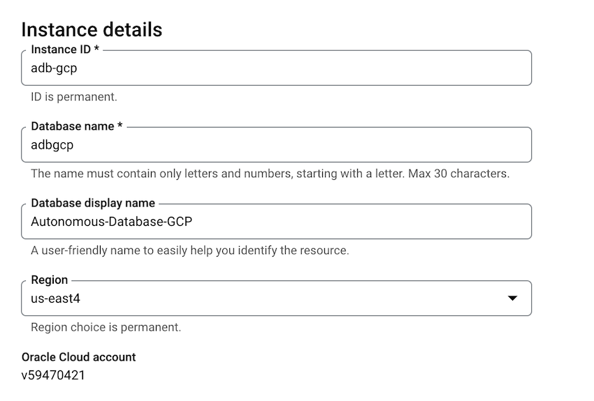

- Select **Transaction Processing** for **Workload configuration**

    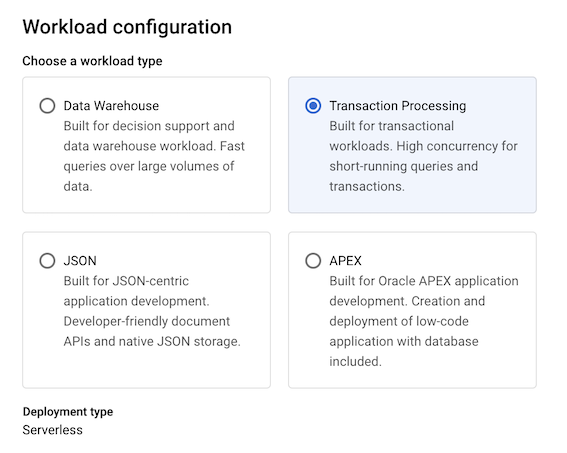

- Select **23ai** for **Choose database version** and leave the rest as defaults for **Database configuration**

    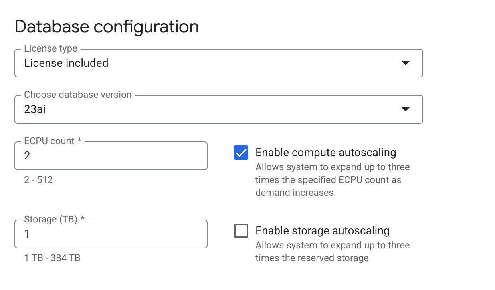

- Enter the password for admin user under **Administrator credentials**

    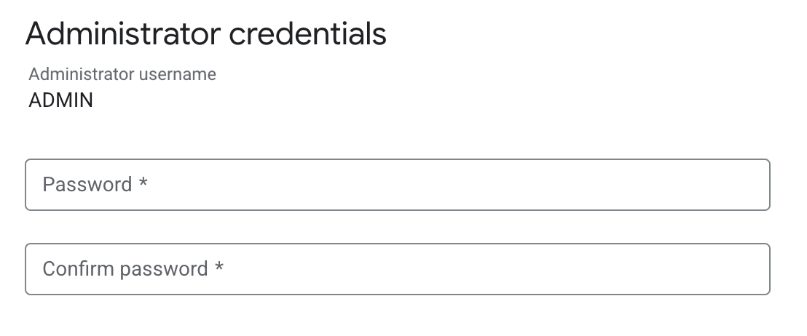

- Under the **Networking** section, select **Private endpoint access only** for **Access type**.

- For **Private endpoint**, enter the following:

  - **Network project** - Select the default project name for the VPC network
  - **ODBG Network** - odbg-network
  - **Client subnet** - db-subnet (10.2.0.0/24)

    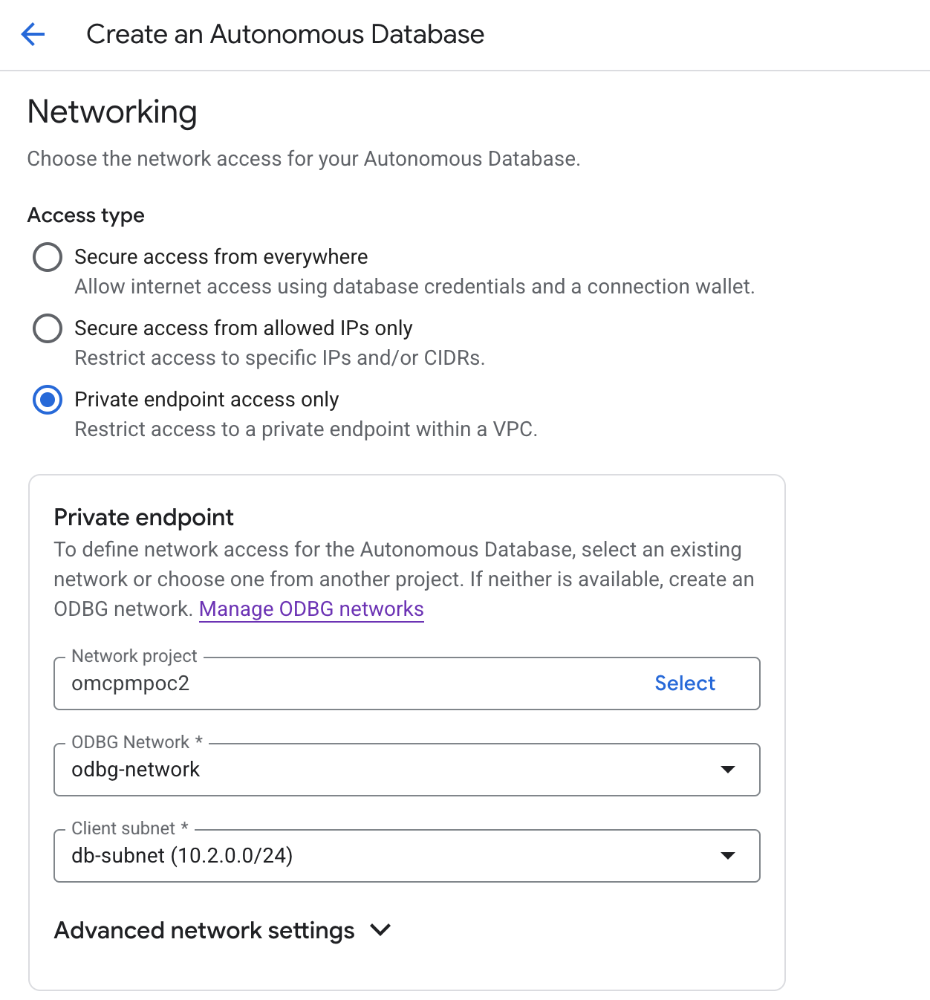

- Leave the rest as defaults and click **CREATE** to create the Autonomous Database.

    

- Post creation the Autonomous Database will appear on the **Autonomous Database** page.

    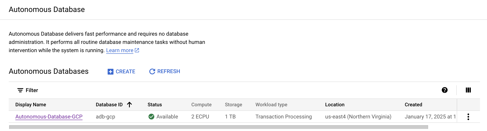

You may now **proceed to the next lab**.

## Acknowledgements

*All Done! You have successfully deployed your Autonomous Database instance and is available for use now.*

- **Authors/Contributors** - Vivek Verma, Master Principal Cloud Architect, North America Cloud Engineering
- **Last Updated By/Date** - Vivek Verma, Aug 2025
