# Connect Autonomous Database with Swingbench

## Introduction

This lab walks you through how to install and configure a workload generation tool called Swingbench and monitor the performance of an Autonomous Database.

Estimated Time: 10 minutes

### Objectives

As an administrator:
1. Install and configure Swingbench to simulate a transaction processing workload.

### Required Artifacts

- A pre-provisioned instance of an Autonomous database and a Developer Client image. 

## Task 1: Connect to Compute VM Instance

1. Launch a terminal session and ssh to the Compute VM instance using the IP address and the private key corresponding to the public key that was entered during Compute VM instance provisioning. After connecting to the VM instance update the softwares installed.

    ```
    <copy>
    sudo apt update
    </copy>
    ```

    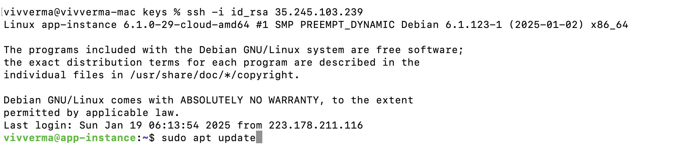

2. Verify the version of java installed on the VM instance and install java if the same is missing.

- Verify java

    ```
    <copy>
    java -version
    </copy>
    ```

- Install java

    ```
    <copy>
    sudo apt install default-jre
    </copy>
    ```
    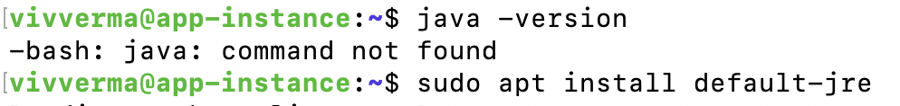

- Verify java post installation

    ```
    <copy>
    java -version
    </copy>
    ```

    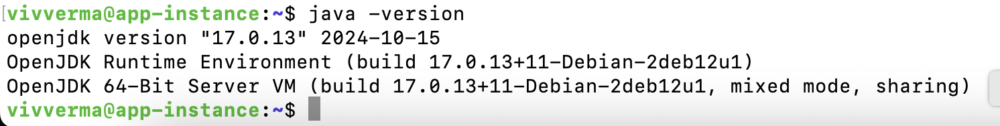

## Task 2: Download and install Swingbench

1. Download Swingbench for Linux.

    On the VM instance downlowd Swingbench by running the following on command prompt.

    ```
    <copy>
    wget https://www.dominicgiles.com/site_downloads/swingbenchlatest.zip
    </copy>
    ```

    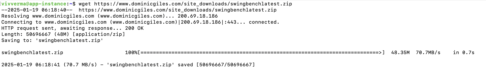

2. Download zip and unzip Swingbench.

    Install zip on the VM instance and unzip Swingbench.

    ```
    <copy>
    sudo apt install zip
    unzip swingbenchlatest.zip
    cd swingbench
    ls -ltr
    </copy>
    ```
    
    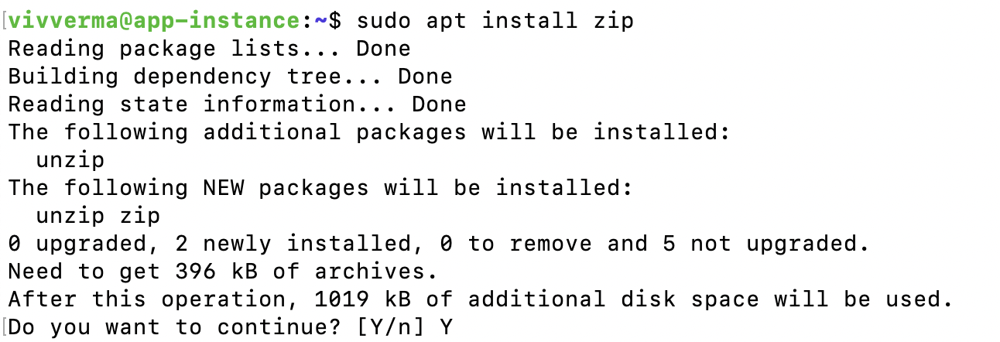
    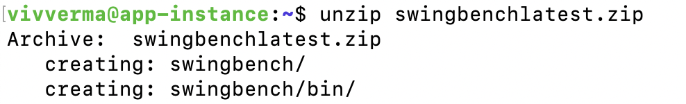
    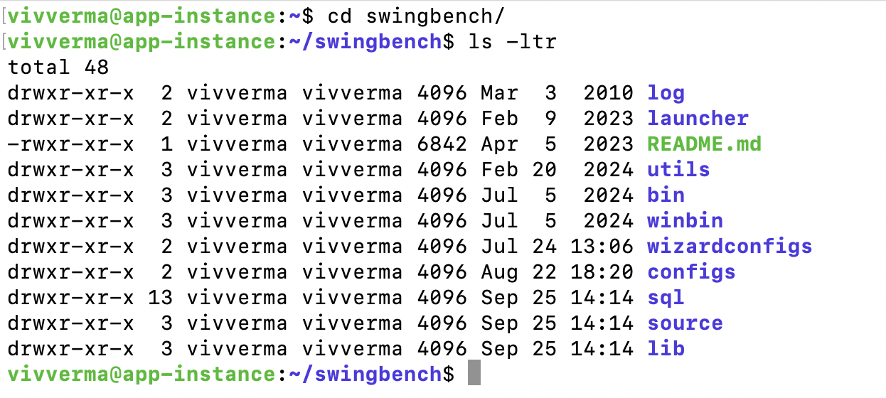

3. Download the Autonomous Database wallet file

- On the **Autonomous Database** page click the Autonomous Database that was provisioned.

    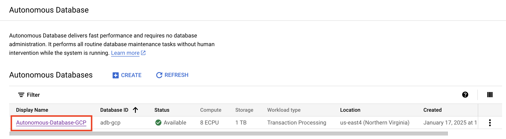

- Go to the **CONNECTIONS** tab.

    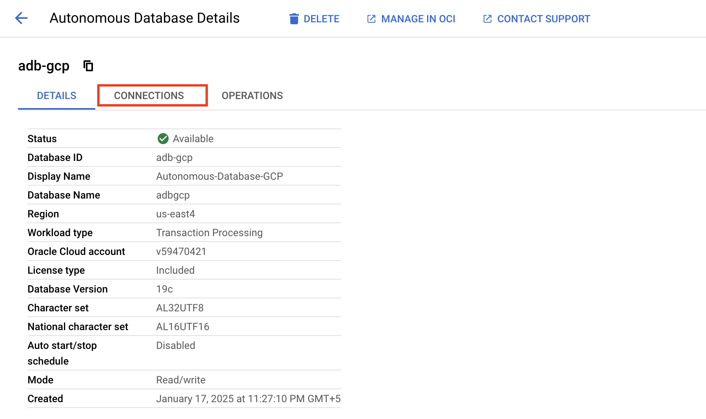

- Click **DOWNLOAD WALLET** on the **Connections** page.

    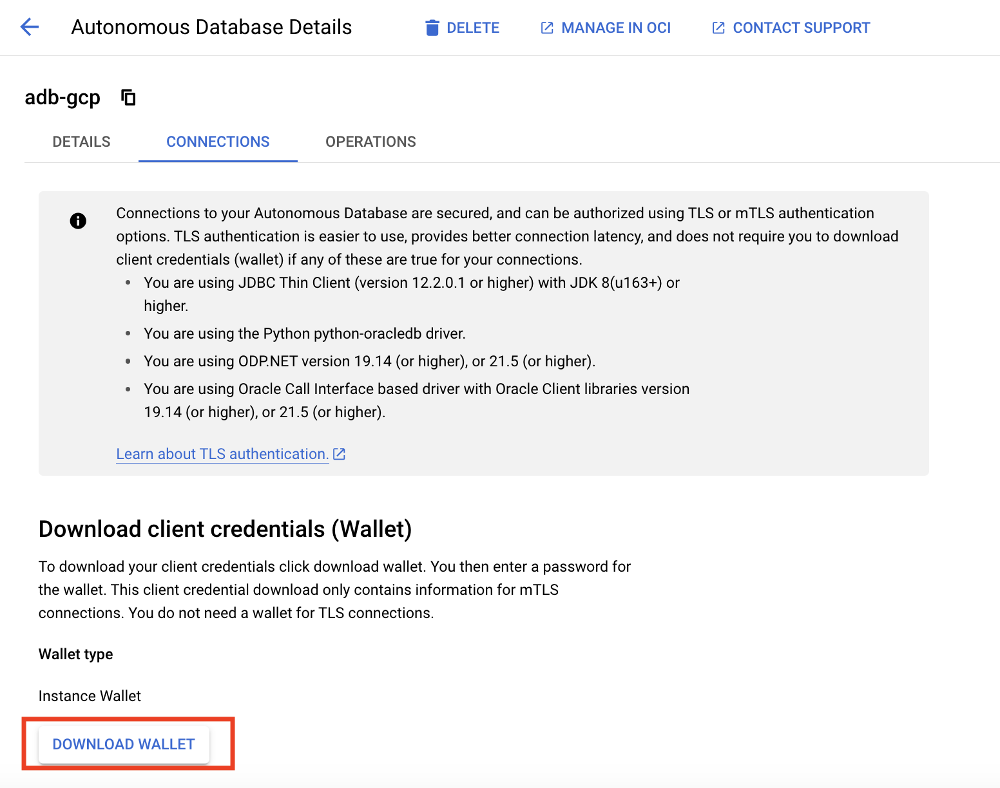

- Set a password for the wallet on the **Download your wallet** page and click **DOWNLOAD**

    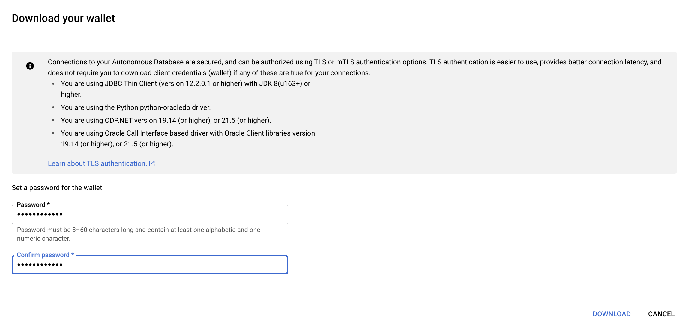
    
- Scp or Copy over the Wallet zip file to VM instance.

## Task 3: Connect the Swingbench application to Autonomous database

Now that you have installed Swingbench and copied over the Autonomous Database wallet to the VM instance, the next step is to connect the application to your Autonomous database.

- You are ready to run Swingbench workloads on Autonomous database. Workloads are simulated by users submitting transactions to the database.

- Load sample data to your Autonomous Database. To start **oewizard** to load Schema and data, navigate to Swinbench bin folder and run oewizard. 

    * admin\_user_password is the Autonomous Database admin user password
    * soe\_user_password is the password for soe schema that will get created 

```
<copy>
cd ~/swingbench/bin

./oewizard -cf ~/Wallet_adbgcp.zip -cs adbgcp_high -ts DATA -dbap admin_user_password -dba admin -u soe -p soe_user_password -async_off -scale 2 -hashpart -create -cl -v
</copy>
```

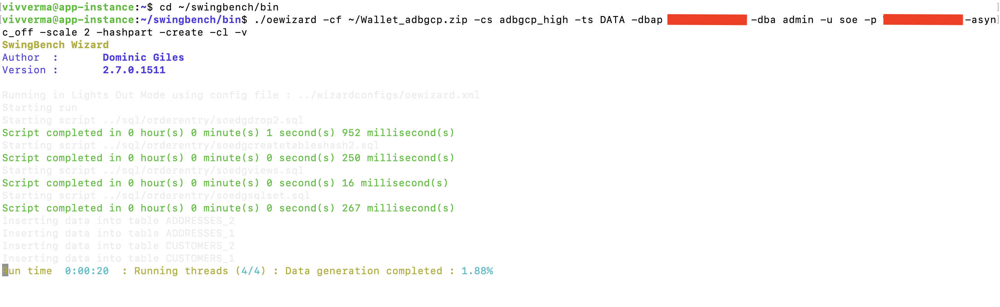

- Validate the schema created correctly using the following command

```
<copy>
cd ~/swingbench/bin

./sbutil -soe -cf ~/Wallet_adbgcp.zip -cs adbgcp_high -u soe -p soe_user_password -val
</copy>
```

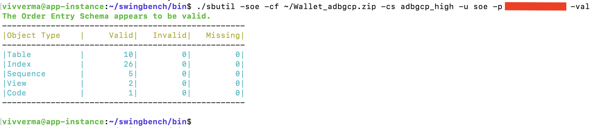

- Edit the config file to not exceed the login rate

    Run the following command from command line 

```
<copy>
sed -i -e 's/<LogonGroupCount>1<\/LogonGroupCount>/<LogonGroupCount>5<\/LogonGroupCount>/' \
       -e 's/<LogonDelay>0<\/LogonDelay>/<LogonDelay>300<\/LogonDelay>/' \
       -e 's/<WaitTillAllLogon>true<\/WaitTillAllLogon>/<WaitTillAllLogon>false<\/WaitTillAllLogon>/' \
       ../configs/SOE_Server_Side_V2.xml
</copy>
```

- Once the Schema is created, run a workload against the newly created schema

    Run the following command to run a workload against the soe schema

    ```
    <copy>
    ./charbench -c ../configs/SOE_Server_Side_V2.xml \
            -cf ~/Wallet_adbgcp.zip \
            -cs adbgcp_low \
            -u soe \
            -p soe_user_password \
            -v users,tpm,tps,vresp \
            -intermin 0 \
            -intermax 0 \
            -min 0 \
            -max 0 \
            -uc 128 \
            -di SQ,WQ,WA \
            -rt 0:0.30
    </copy>
    ```


    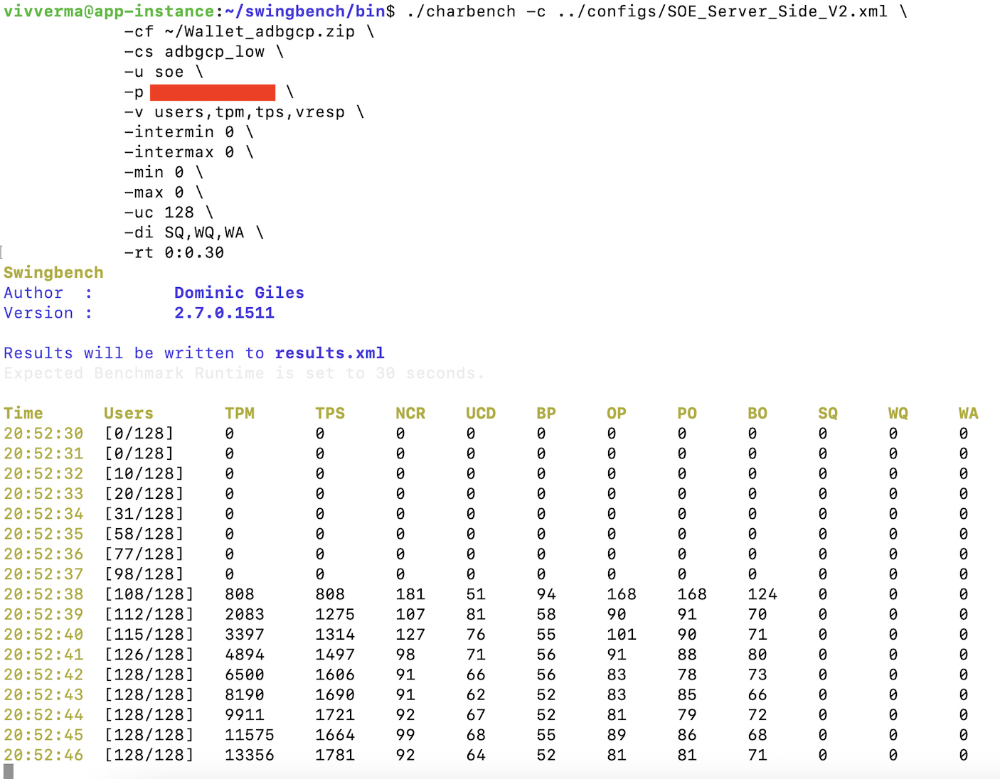

- You should now see the Transaction happening in your Autonomous database. 

***NOTE: Do not disconnect the Swingbench application***

You may now **proceed to the next lab**.

## Acknowledgements
*Congratulations! You successfully configured the Swingbench java application with Autonomous database.*

- **Authors/Contributors** - Vivek Verma, Master Principal Cloud Architect, North America Cloud Engineering
- **Last Updated By/Date** - Vivek Verma, Jan 2025