# Oracle Database Actions

## Introduction
You can access Database Actions from Autonomous Database. Database Actions provides development tools, data tools, administration, and monitoring features for Autonomous Database. Using Database Actions you can run SQL statements, queries, and scripts in a worksheet. 

Database Actions provides a web-based interface with development, data tools, administration, monitoring, and download features for Autonomous Database. 

The following table lists the main features of Database Actions.

 

Estimated Time: 15 minutes

### Objectives

As a database admin or user:
1. Provision a Windows Compute VM in Google Cloud.
2. Access Database Actions under Autonomous Database.

### Required Artifacts
- Access to a pre-provisioned Autonomous Database instance.

## Task 1: Provision Windows Compute VM instance in Google Cloud

1. From the Google Cloud Console (console.cloud.google.com), click on the **Navigation Menu**. Then click on **VM instances** under **Compute Engine**.

    

2. On the **VM instances** page click **CREATE INSTANCE**

    

3. Under **Machine configuration** enter the following -

    * **Name** - windows-instance
    * **Region** - us-east4
    * Leave the rest as default.

    

5.  Click **OS and storage** on the left tab and click **Change** to change the Operating System to Windows. Under the drop down for **Operating system** select **Windows Server**. Leave others as default.

    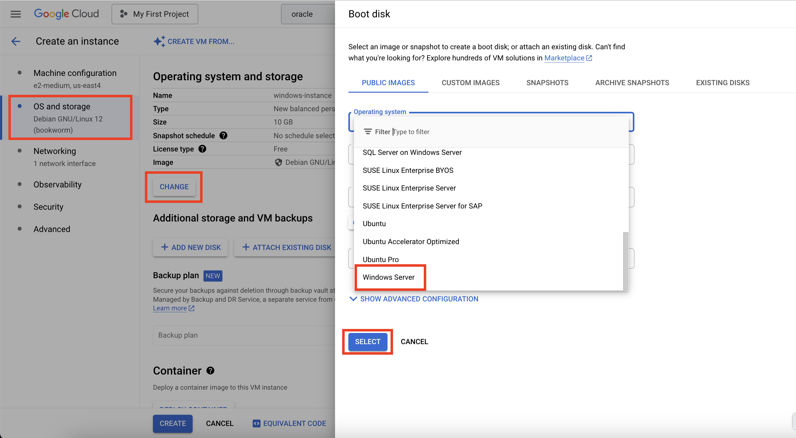

6.  Click **Networking** on the left tab and enter the following -

    * **Allow HTTP traffic** - Checkmark
    * **Allow HTTPS traffic** - Checkmark

    

    Click the drop down for **Network interfaces**

    

    Enter the following under **Edit network interface**

    * **Network** - app-network
    * **Subnetwork** - public-subnet

    

7.  Click **Security** on the left tab and enter the following. Click **MANAGE ACCESS** and click **ADD ITEM** under **Add manually generated SSH keys**. Enter the public ssh key. Click **CREATE** to create the VM instance.

    

8.	The created VM instance will show up on the **VM instances** page -

    

9. Set the Windows VM login password by clicking on **Set Windows password**.

    

10. RDP to the VM instance using the External IP address and login using the username and password set in above step.

    We will use this Windows Compute VM to launch **Autonomos Database** - **Database Actions**.

## Task 2: Oracle Database Actions Overview

You can view available Oracle Database@Google Cloud metrics using Cloud Monitoring in the Google Cloud console.

To view an available metric:

1. From the **Autonomous Database Details** page, click **MANAGE ON OCI** to go to the OCI Console.

    

2. Login to the OCI Console using your OCI crendentials.

    

3. Post login you will reach the **Autonomous Database details** page on OCI.

    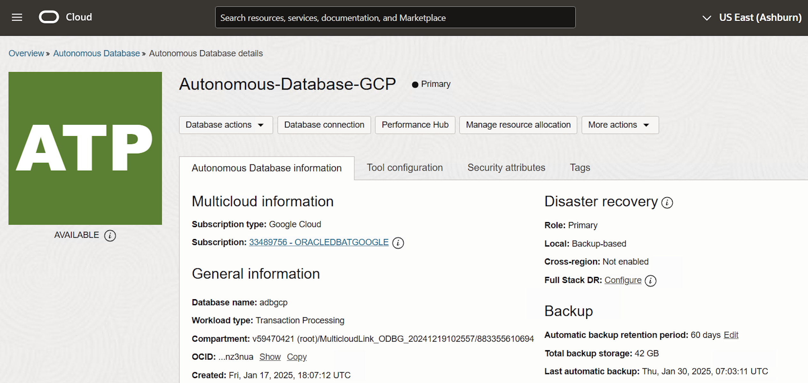

4. Click **Database actions** and launch **View all database actions**.

    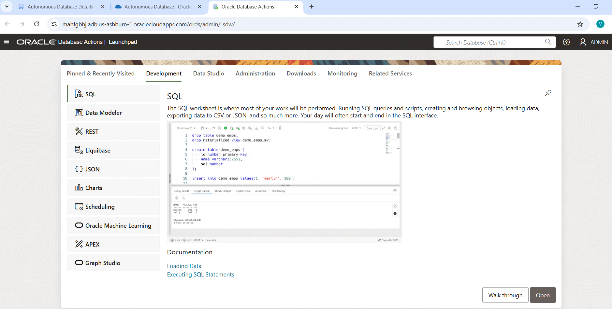

5. Click **Open** to launch **SQL Worksheet**.

    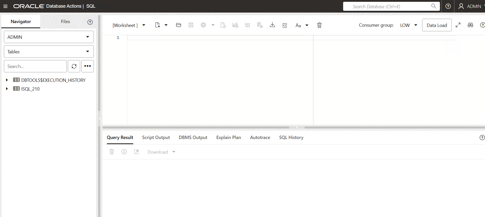

6. Under **Navigator** on the left, click on the **ADMIN** schema and select **SOE** that was installed during the Swingbench lab.

    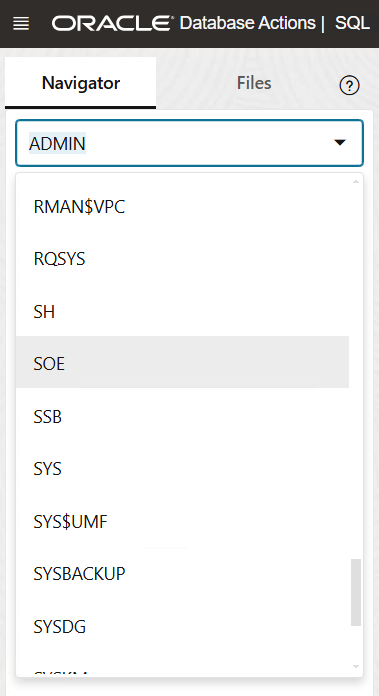

7. This will list all the tables under **SOE** schema. Right click on the **ADDRESS** table and click **Open** to see table details.

    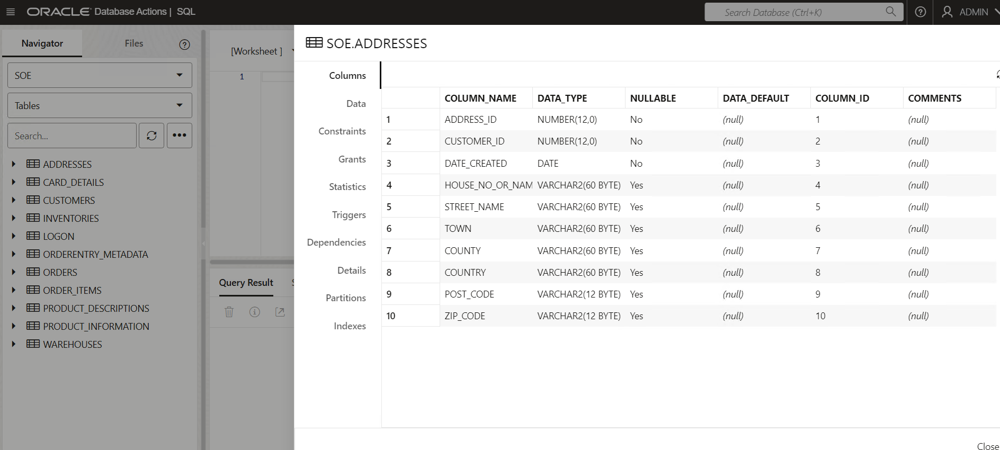

    Click **Close** to go back to **SQL Worksheet**.

    On the SQL Worksheet you can use the **Consumer Group** drop-down list to select the consumer group to run your SQL or PL/SQL code. See [Executing SQL Statements in the Worksheet Editor](https://docs.oracle.com/en/database/oracle/sql-developer-web/sdwad/sql-page.html#SDWAD-GUID-1BE36B0F-4D2B-4CC2-B705-4D8794D8FC8C) for more information.

8. Click **Database actions** to go back to the **Database actions** main page and click **Data Studio**.

    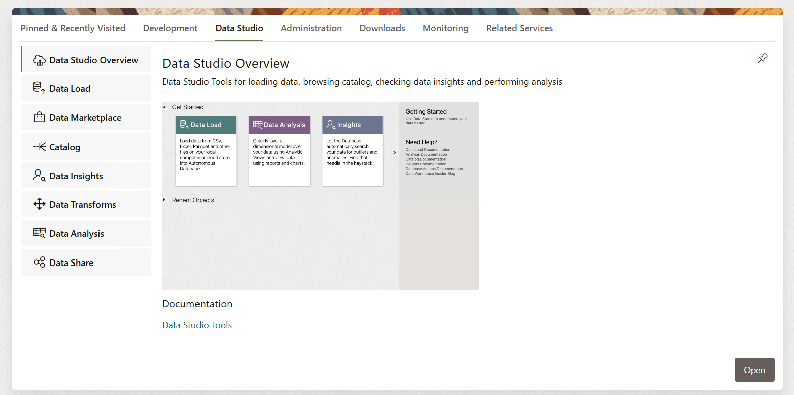

9. Click **Open** to launch the **Data Studio Overview** page.

    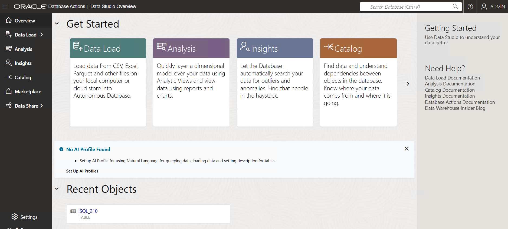

    The Data Studio comprises of the Data Load, the Data Analysis, the Data Insights, Catalog, Data Marketplace and the Data Share tool.

    The Data Studio Tools enables you to load data from cloud and other diverse sources, analyzes it and gain insights from it. You can share the result of the analysis with other users. It is a one-stop application of your analytics tool from multiple data sources. This tool makes sure that there is seamless transition between different applications. The multiple ways of navigation do not impact the progress of your work. For instance, if you are working on data analysis and decide you need some additional data, you can navigate to the Data Load page, bring in the new contents, and return to your analysis in progress. 

10. Click **Data Load** to go to the **Data Load** page which lists various options to load data into the Autonomous Database.

    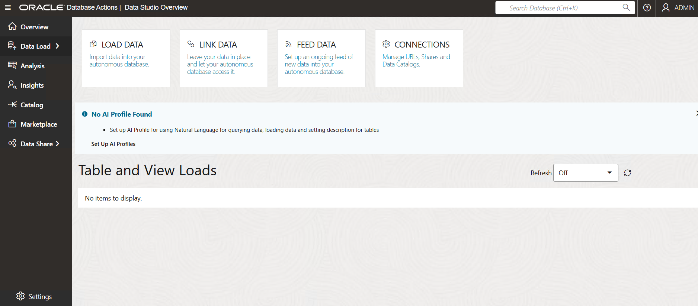

11. Click **Database actions** to go back to the **Database actions** main page and click **Administration**.

    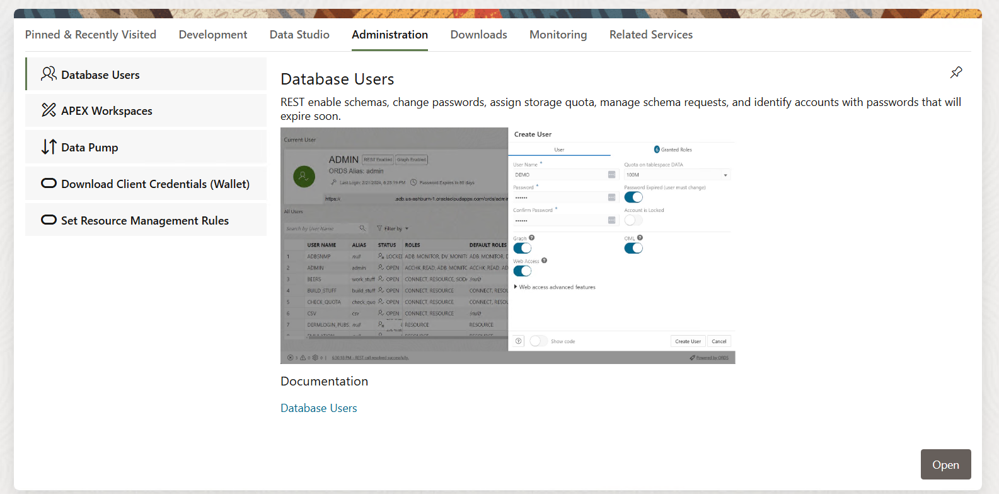

12. Click **Open** to launch the **Database Users** page.

    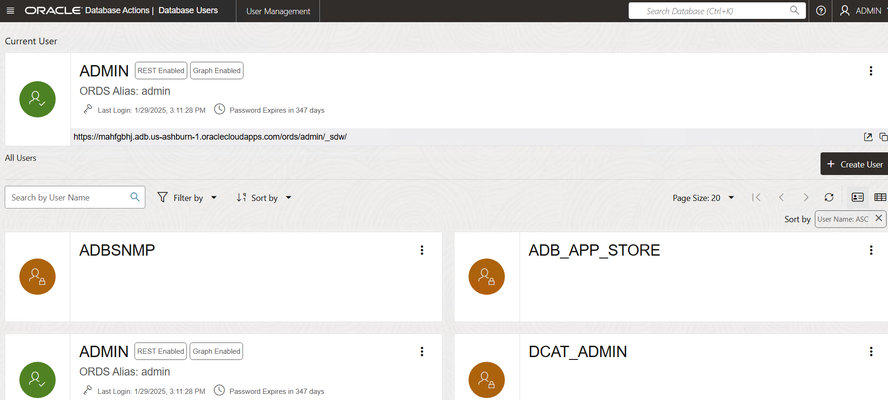

     The Database Users page enables you to perform user management tasks such as create, edit, enable REST, and delete, and create and manage self service schemas. For user management, the actions available are based on the user privileges (CREATE, ALTER, DROP) granted to you. Users with no assigned privileges can still access the Database Users page to browse all users. However, the only action available to them is changing their password.

13. Click **Database actions** to go back to the **Database actions** main page and click **Downloads**.

    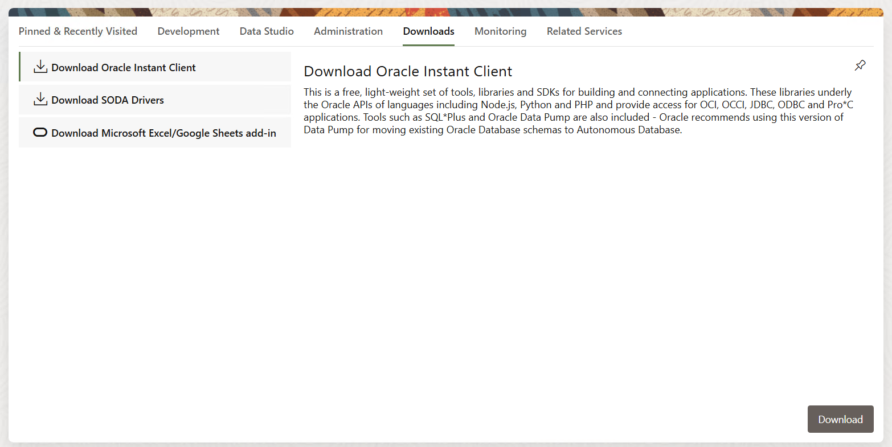

    From the **Downloads** page you can -

    * Download Oracle Instant Client
    * Download SODA Drivers
    * Download Microsoft Excel/Google Sheets add-in

14. Click **Database actions** to go back to the **Database actions** main page and click **Monitoring**.

    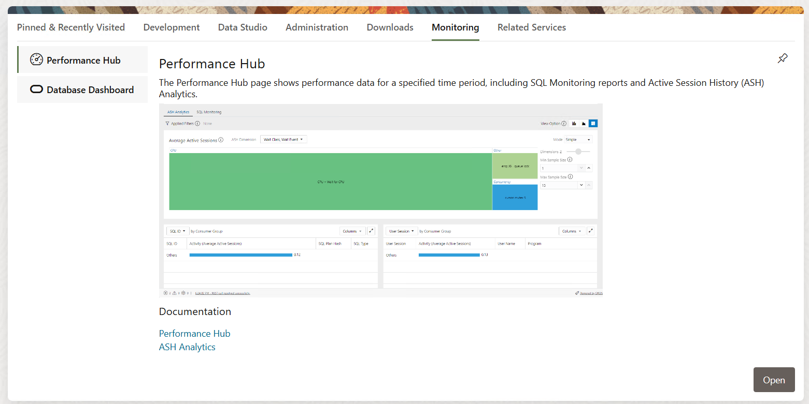

15. Click **Open** to launch **Performance Hub**.

    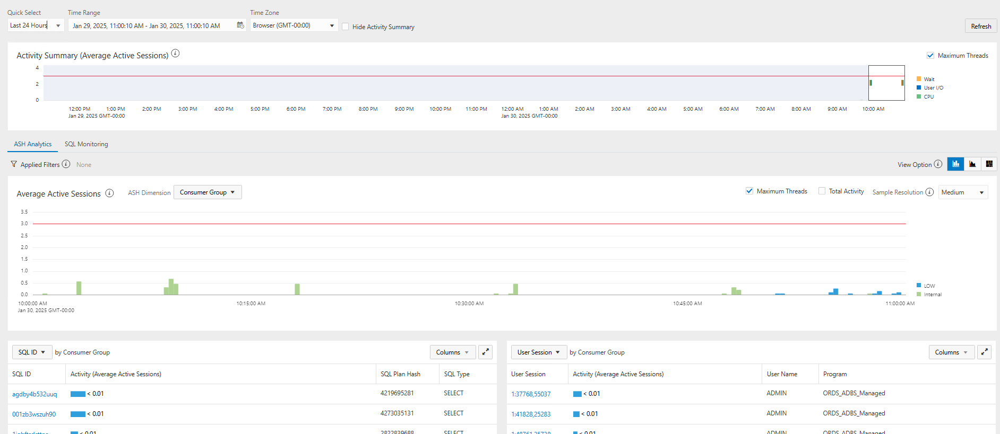

    The Database Dashboard card in Database Actions provides the Overview and Monitor tabs where you can find information about the performance of an Autonomous Database instance.

    Review [Monitor the Performance of Autonomous Database](https://docs.oracle.com/en/cloud/paas/autonomous-database/serverless/adbsb/monitor-performance-intro.html) to check how you can leverage Performance Hub to monitor the performance of your database.

16. Click **Database actions** to go back to the **Database actions** main page and click **Related Services**.

    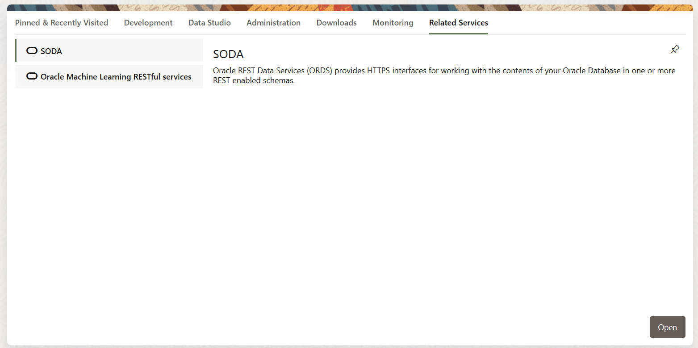

    SODA - Oracle REST Data Services (ORDS) provides HTTPS interfaces for working with the contents of your Oracle Database in one or more REST enabled schemas.
    
    Oracle Machine Learning RESTful services -  Oracle Machine Learning provides REST APIs for OML4Py Embedded Python Execution and OML Services.

17. Click **Open** and **Copy** the URL.

    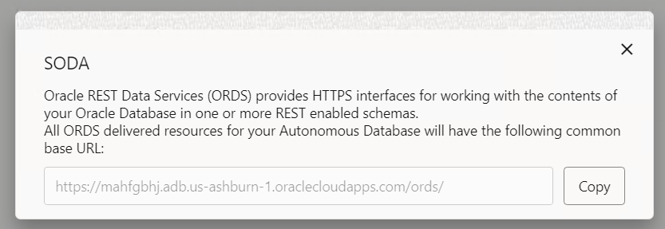

18. Open the URL in a separate tab to launch the **ORACLE REST Data Services** page.

    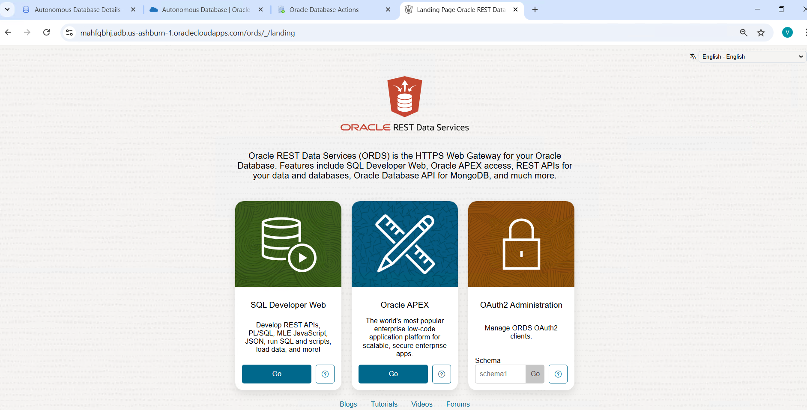

    Refer [Developing RESTful Services in Autonomous Database](https://docs.oracle.com/en/cloud/paas/autonomous-database/serverless/adbsb/ords-autonomous-database.html) for more details.

## Acknowledgements
- **Authors/Contributors** - Vivek Verma, Master Principal Cloud Architect, North America Cloud Engineering
- **Last Updated By/Date** - Vivek Verma, Jan 2025