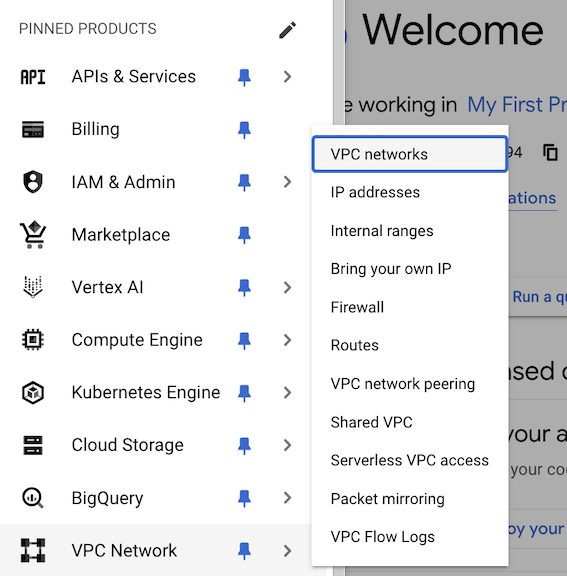
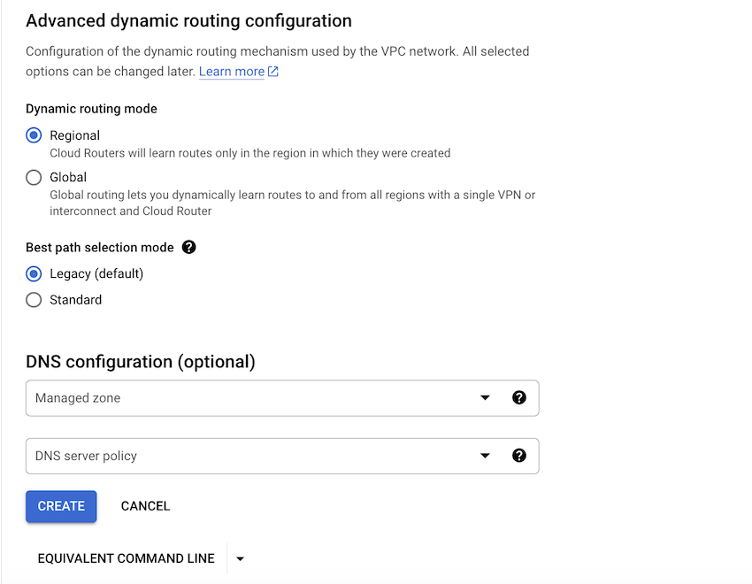
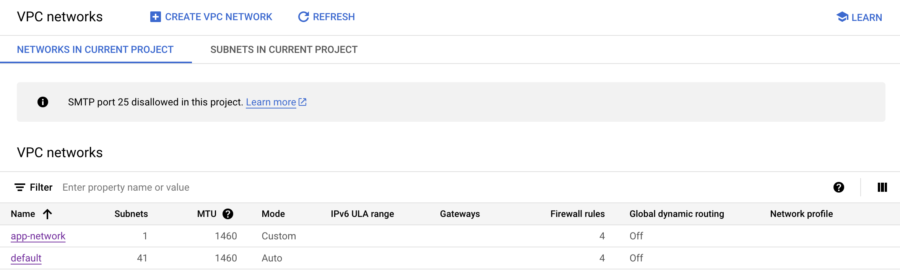
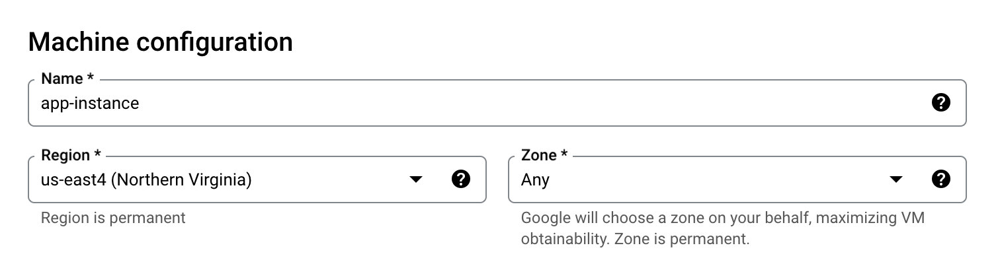

# Get started - Autonomous Database

## Introduction

This lab walks you through the prerequisites to get started with Oracle Database@GCP - Autonomous Database. This involves creating a Virtual Private Cloud (VPC) Network in Google Cloud that will be associated with the Autonomous Database and a Compute VM instance that will be used to connect to the Autonomous Database.

Estimated Time: 30 minutes

### Objectives

As a database user, DBA, or application developer:

1. Create a Virtual Private Cloud (VPC) Network in Google Cloud Portal.
2. Provision a Compute VM instance in GCP.

## Task 1: Create a Virtual Private Cloud (VPC)

In this section, you will create a VPC.

1.  Login to Google Cloud Console (console.cloud.google.com) and click on the **Navigation Menu**. Then click on **VPC Networks** under **VPC Network**..

    

2.	On the **VPC networks** page, click on the **CREATE VPC NETWORK** button.

    

3.	On **Create a VPC Network** provide details as mentioned below. 
    
    * **VPC Name** - app-network
    * **Description** - Application Database Network

    

    Under **Subnets** enter the details of the Subnet -

    * **Subnet Name** - public-subnet
    * **Description** - Public Subnet
    * **Region** - us-east4
    * **IPv4 range** - 10.1.0.0/24
    * Leave the rest as defaults under **Subnets**

    

    Under **Firewall rules** select all rules -

    

    Click **CREATE** to create the VPC Network.

    

4.	The created VPC will show up on the **VPC networks** page -

    

## Task 2:  Provision GCP Compute VM Instance

1.  From the Google Cloud Console (console.cloud.google.com), click on the **Navigation Menu**. Then click on **VM instances** under **Compute Engine**.

    

2. On the **VM instances** page click **CREATE INSTANCE**

    

3. Under **Machine configuration** enter the following -

    * **Name** - app-instance
    * **Region** - us-east4
    * Leave the rest as default.

    

4.  Leave all as default under **OS and storage**

5.  Click **Networking** on the left tab and enter the following -

    * **Allow HTTP traffic** - Checkmark
    * **Allow HTTPS traffic** - Checkmark

    

    Click the drop down for **Network interfaces**

    

    Enter the following under **Edit network interface**

    * **Network** - app-network
    * **Subnetwork** - public-subnet

    

6.  Click **Security** on the left tab and enter the following. Click **MANAGE ACCESS** and click **ADD ITEM** under **Add manually generated SSH keys**. Enter the public ssh key. Click **CREATE** to create the VM instance.

    

7.	The created VM instance will show up on the **VM instances** page -

    

You may now **proceed to the next lab** to provision Autonomous Database.

## Acknowledgements

*All Done! You have successfully created a VPC Network and Compute VM instance.*

- **Authors/Contributors** - Vivek Verma, Master Principal Cloud Architect, North America Cloud Engineering
- **Last Updated By/Date** - Vivek Verma, Jan 2025