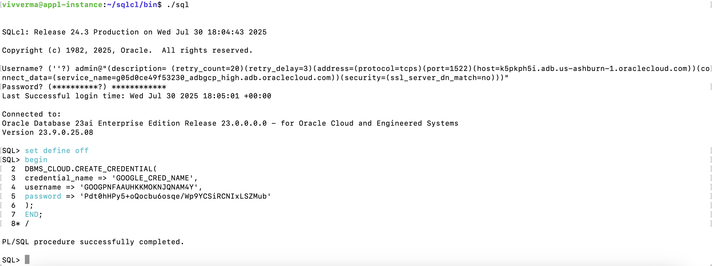

# Migrating to Autonomous Database using Data Pump

## Introduction

Oracle Data Pump offers very fast bulk data and metadata movement between user managed Oracle databases and Autonomous Database.

Data Pump Import lets you import data from Data Pump files residing on the Object Storage. You can save your data to your Cloud Object Store and use Oracle Data Pump to load data to Autonomous Database.

This lab walks you through the steps to migrate a sample application schema using Data Pump Import into your Autonomous Database.

Estimated Time: 15 minutes

### Objectives

As a database admin or user:

1. Upload a datapump dumpfile to Google Cloud Storage Bucket.
2. Get the access key to allow Autonomous Database to connect to the cloud storage bucket.
3. Install sqlcl and connect to ADB
4. Use the sample .dmp file to import data to your Autonomous Database.

### Required Artifacts

- Access to a pre-provisioned Autonomous Database instance.
- Google Cloud Compute VM instance.

## Task 1: Generate access key for your user account

- Assuming you are logged into your Google Cloud account, click on **Settings** under **Cloud Storage** from the Navigation Menu.

    

- On the **Settings** page select **INTEROPERABILITY**. Scroll down the page and click **CREATE A KEY** under **Access keys for your user account**.

    

    

- Note down the **Access key** and **Secret** in a notepad.

## Task 2: Upload the Dump file to Google Cloud Storage Bucket

- Download the dump file [here](https://storage.cloud.google.com/vvgcpdblab/HR.dmp).

- From the Google Cloud Console, under **Cloud Storage** go to **Buckets** to create a Cloud Storage Bucket. Click **CREATE** to create a bucket. For this workshop we will name the bucket **gcpdatapump**. *If gcpdatapump bucket name is already taken, create a bucket with any other name.*

- Once the bucket is created. Upload the dump file under the **gcpdatapump** bucket.

## Task 3: Set up User credentials in your target autonomous database

Now that we have the Access key and the Secret, let's set up the target database to read from the Google Cloud Storage and import data.

Here, we will use **SQLcl** to demonstrate the steps needed to set up Google Cloud Storage credentials.

Download and install sqlcl on the Google Cloud Compute VM instance.

You can download sqlcl from https://download.oracle.com/otn_software/java/sqldeveloper/sqlcl-24.3.2.330.1718.zip

- After downloading sqlcl unzip the zip file.

    ```
    <copy>
    wget https://download.oracle.com/otn_software/java/sqldeveloper/sqlcl-24.3.2.330.1718.zip
    unzip sqlcl-24.3.2.330.1718.zip
    </copy>
    ```

- On the Google Cloud Console, from the **Autonomous Database** page click the Autonomous Database that was provisioned.

    

- Under **CONNECTIONS** tab on the **Autonomous Database Details** page note down the **TNS name** and **Connection string**.

    
    

- Create a 'tnsnames.ora' file under 'sqlcl/bin' and set the 'TNS_ADMIN' variable to current working directory. Connect to the Autonomous Database using the connection string or by setting up the tnsnames path.

    * Setting up tnsnames path and connecting to the database -

    ```
    <copy>
    cd sqlcl/bin
    $ cat tnsnames.ora 
    adbgcp_high=(description= (retry_count=20)(retry_delay=3)(address=(protocol=tcps)(port=1522)(host=mahfgbhj.adb.us-ashburn-1.oraclecloud.com))(connect_data=(service_name=gd443790554e91c_adbgcp_high.adb.oraclecloud.com))(security=(ssl_server_dn_match=no)))
    $ 
    export TNS_ADMIN=`pwd`
    ./sql admin@adbgcp_high
    </copy>
    ```
    * Using connection string -

    ```
    <copy>
    cd sqlcl/bin 
    ./sql admin@"(description= (retry_count=20)(retry_delay=3)(address=(protocol=tcps)(port=1522)(host=mahfgbhj.adb.us-ashburn-1.oraclecloud.com))(connect_data=(service_name=gd443790554e91c_adbgcp_high.adb.oraclecloud.com))(security=(ssl_server_dn_match=no)))"
    </copy>
    ```

- Once connected to your autonomous database as ***admin*** user, run the following pl/sql procedure, replacing the username with **Access key** and password with **Secret**.

    ```
    <copy>
    set define off
    begin
    DBMS_CLOUD.CREATE_CREDENTIAL(
    credential_name => 'GOOGLE_CRED_NAME',
    username => 'Access_key',
    password => 'Secret'
    );
    END;
    /
    </copy>
    ```

- Here's a screenshot of the above command run from a SQLcl.

    

- Ensure the pl/sql procedure is executed successfully from the log message.

- Test the access to Google Cloud Storage by using the bucket name used to upload the dump file.

    ```
    <copy>
    SELECT * FROM DBMS_CLOUD.LIST_OBJECTS('GOOGLE_CRED_NAME', 'https://gcpdatapump.storage.googleapis.com/');
    </copy>
    ```

    

## Task 4: Import data from Google Cloud Storage Bucket using impdp utility

- From the same SQLcl window run the data pump import command. *Replace the bucket name*

    ```
    <copy>
    datapump import -
    -schemas HR -
    -excludeexpr "IN ('PROCEDURE', 'PACKAGE')" -
    -directory data_pump_dir -
    -credential GOOGLE_CRED_NAME -
    -remaptablespaces USERS=DATA -
    -dumpuri https://gcpdatapump.storage.googleapis.com/HR.dmp -
    -logfile testuser1.log
     </copy>
    ```
    
    

All Done! Your application schema was successfully imported.

You may now **proceed to the next lab**.

## Acknowledgements

*Congratulations! You have successfully completed migrating an Oracle database to the Autonomous Database.*

- **Authors/Contributors** - Vivek Verma, Master Principal Cloud Architect, North America Cloud Engineering
- **Last Updated By/Date** - Vivek Verma, July 2025
