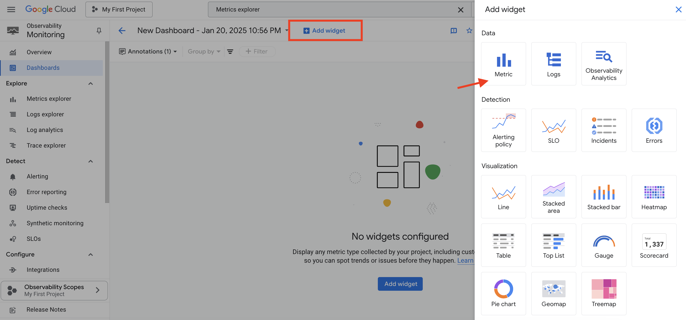

# Monitor Autonomous Database from Google Cloud Console

## Introduction
Cloud Monitoring lets you monitor your Oracle Database@Google Cloud resources using custom dashboards. You can create custom dashboards using Cloud Monitoring and the available Oracle Database@Google Cloud metrics and logs.

This lab walks you through the steps to view and use the monitoring metrics available for Oracle Database@Google Cloud resources using Cloud Monitoring.

You can use Cloud Monitoring to monitor your Oracle Database@Google Cloud resources using custom dashboards, and metrics charts and alerts.

Estimated Time: 15 minutes

### Objectives

As a database admin or user:
1. Monitor Oracle Database@Google using Cloud Monitoring.
2. Create custom monitoring Dashboard for Oracle Database@Google.

### Required Artifacts
- Access to a pre-provisioned Autonomous Database instance.

## Task 1: View Autonomous Database Metrics in Google Cloud

You can view available Oracle Database@Google Cloud metrics using Cloud Monitoring in the Google Cloud console.

To view an available metric:

1. After logging into your Google Cloud Console, search for 'Metrics explorer' in the **Search** bar. Click **Metrics explorer**.

     

2. In the **Queries** section, click **Select a metric**, and choose **Autonomous Database**. Under **ACTIVE METRIC CATEGORIES** select **Autonomousdatabase**. Click **CPU Utilization** under **ACTIVE METRICS**.

     

3. Click **Apply**. The metric is displayed. You can view your metric as a chart, table, or both by selecting the option in the results pane.

    

4. Similarly a number of other Metrics can be viewed for Autonomous Database.

## Task 2: Monitor using Cloud Monitoring dashboards

Cloud Monitoring lets you monitor your Oracle Database@Google Cloud resources using custom dashboards. You can create custom dashboards using Cloud Monitoring and the available Oracle Database@Google Cloud metrics and logs.

To create a custom dashboard, do the following:

1. In the Google Cloud console, under **Observability Monitoring**, click **Dashboards**.

2. In the **Dashboards** page, click **Create Dashboard**.

    

3. In the dashboard toolbar, click **Add widget**.

4. In the **Add widget** pane, select a widget to add to your dashboard. For this workshop select **Metric**. 

    

    You can select a widget based on the type of data to display or how you want to display the data. In all cases, a configuration pane is opened. For example, you can select the Metric widget and then set the visualization to Stacked area. Or, you can select the Stacked area widget and then select the metric.

5. On the **Configure widget** page, click **Select a metric** and select **Autonomous Database**. Click **CPU Utilization** and click **Apply**.

    

6. Click **Apply** to add the widget to the Dashboard.

    

7. This will add the widget to the dashboard.

    

8. Follow steps 3 to 7 to add more widgets to the dashboard. 

    

9. Click on the Dashboard name and rename it to **Autonomous Database Dashboard**.

10. Go back to **Dashboards Overview** to see the list of Dashboards.

    

11. Click the newly created dashbaord from the list of dashboards and change the time range to **Today**. View the refreshed Dashboard.

    

You may now **proceed to the next lab**.

## Acknowledgements
- **Authors/Contributors** - Vivek Verma, Master Principal Cloud Architect, North America Cloud Engineering
- **Last Updated By/Date** - Vivek Verma, Jan 2025