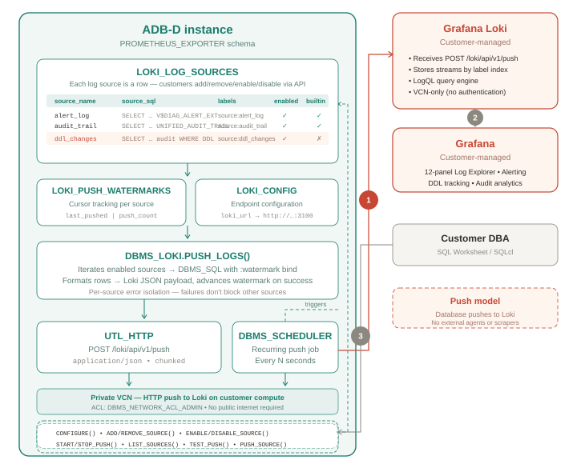

# Streaming Autonomous AI Database Logs to Grafana Loki with DBMS_LOKI

## Introduction

Oracle Autonomous AI Database on Dedicated Exadata Infrastructure (Autonomous AI Database) generates two critical log streams: the **alert log** for database diagnostics and the **unified audit trail** for security and compliance. These logs are accessible only through SQL or the OCI Logging service. In this workshop, you will build a native log push engine that continuously streams these logs to Grafana Loki directly from within the database, with no external agents, Promtail, or file scrapers required.

By the end of this workshop, you will have a built a fully functional log observability pipeline with database logs, streamed to Loki via PL/SQL and visualized in a Grafana Log Explorer dashboard, including a custom DDL change tracker of your own.

*Estimated Workshop Time:* 75 minutes

### Architecture

The key technical insight behind this workshop is that Autonomous AI Database can push its own logs using `UTL_HTTP` and `DBMS_SCHEDULER`. A PL/SQL package (`DBMS_LOKI`) iterates through registered log sources, executes each SQL query with a watermark bind variable (ensuring only new entries are sent), formats the results as Loki JSON payloads, and POSTs them to Loki's Push API. Since the database initiates all communication and exposes no inbound endpoint, no OAuth 2.0 configuration or additional authentication is required.

**Companion workshop:** This workshop focuses on logs using a push model to Grafana Loki. For metrics using a pull model with ORDS and Prometheus, see the companion workshop: [*Build a Prometheus-Compatible Telemetry Endpoint for ADB-D Using ORDS*](../../adb-prometheus/workshop/db-users/index.html).

### Objectives

In this workshop, you will learn how to:

- Install and configure Grafana Loki on a VCN compute instance
- Deploy the DBMS_LOKI PL/SQL package for watermark-based log streaming
- Configure and start continuous log streaming to Loki
- Build a Grafana Log Explorer dashboard for Autonomous AI Database logs
- Register a custom log source (DDL change tracking) using the self-service API
- Set up Grafana alerts on audit trail events

### Prerequisites

This lab assumes you have:

- An Autonomous AI Database instance running in a private subnet
- ADMIN access to the Autonomous AI Database (via SQL Worksheet or SQLcl)
- A compute instance in the same VCN as your Autonomous AI Database (or the ability to create one in [Lab 1](?lab=install-loki))
- An OCI Bastion Service configured in the same VCN
- OCI CLI installed and configured on your local machine
- An SSH key pair (for example, `~/.ssh/id_ed25519`)
- Basic familiarity with SQL, PL/SQL, and Linux command line

### Log Sources You Will Stream

| Source | Underlying View | What It Captures |
|---|---|---|
| Alert log | `V$DIAG_ALERT_EXT` | Partition maintenance, instance events, errors |
| Unified audit trail | `UNIFIED_AUDIT_TRAIL` | Logins, DDL, DML, privilege use, return codes |
| DDL changes (custom) | Filtered audit trail | CREATE/ALTER/DROP TABLE, INDEX, GRANT, REVOKE |

You may now **proceed to the next lab**.

## Acknowledgements

- **Author** - German Viscuso, Product Manager, Oracle Autonomous AI Database
- **Last Updated By/Date** - Vandana Rajamani, Consulting UA Developer, June 2026
