# Build a Prometheus-Compatible Telemetry Endpoint for Autonomous AI Database Using ORDS

## Introduction

Oracle Autonomous AI Database on Dedicated Exadata Infrastructure (Autonomous AI Database) provides access to a rich set of performance and monitoring views, including `V$SYSSTAT`,`V$SYSMETRIC`, `V$WAITCLASSMETRIC`, and many others. However, it does not natively offer a Prometheus-compatible metrics endpoint for external monitoring and observability platforms.

In this workshop, you will learn how to build a custom Prometheus metrics endpoint entirely within the database using Oracle REST Data Services (ORDS), PL/SQL, and the Prometheus exposition format. This approach enables seamless integration of Autonomous AI Database performance metrics with modern monitoring and observability ecosystems.

By the end of this workshop, you will have implemented a complete observability pipeline, enabling real-time database telemetry to be collected by Prometheus and visualized through Grafana dashboards. This solution operates entirely within Oracle Autonomous AI Database, eliminating the need for external agents, exporters, or additional monitoring infrastructure while providing comprehensive visibility into database performance and health.

*Estimated Workshop Time:* 90 minutes

### Architecture

Unlike standard ORDS handlers, which typically encapsulate responses in JSON, this implementation leverages the `source_type_media` handler type to stream raw content directly to the client with a custom `Content-Type` header. By returning content as `text/plain; version=0.0.4` along with a CLOB formatted according to the Prometheus exposition standard, we can expose a native `/metrics` endpoint directly from Oracle Autonomous AI Database.

### Objectives

In this workshop, you will learn how to:

- Create a PL/SQL function that queries Oracle performance views and outputs Prometheus exposition format text
- Use ORDS `source_type_media` to serve raw `text/plain` content (bypassing JSON wrapping)
- Secure the endpoint with OAuth2 client credentials flow
- Deploy Prometheus and Grafana on a compute instance in the same VCN
- Build a comprehensive Grafana dashboard for Autonomous AI Database observability

### Prerequisites

This lab assumes you have:

- An Autonomous AI Database instance running in a private subnet
- ADMIN access to the Autonomous AI Database (via Database Actions or SQLcl)
- An OCI Bastion Service configured in the same VCN
- OCI CLI installed and configured on your local machine
- An SSH key pair (e.g., `~/.ssh/id_ed25519`)
- Basic familiarity with SQL, PL/SQL, and Linux command line

### Metrics You Will Expose

| Category | Source View | Example Metrics |
|---|---|---|
| System Statistics | `V$SYSSTAT` | Logons, cursors, commits, reads, writes, parses |
| Wait Classes | `ACD_V$WAITCLASSMETRIC` | Wait time/count per class (User I/O, Concurrency, etc.) |
| System Metrics | `ACD_V$SYSMETRIC` | Avg Active Sessions, Buffer Cache Hit %, CPU %, Executions/s |
| Sessions | `V$SESSION` | Count by status (ACTIVE, INACTIVE) and type |
| Tablespace | `DBA_TABLESPACE_USAGE_METRICS` | Used percentage per tablespace |
| PGA Memory | `V$PGASTAT` | Allocated, in-use, and max watermark |
| Processes | `V$PROCESS` | Current process count |

You may now **proceed to the next lab**.

## Acknowledgements

- **Author** - German Viscuso, Product Manager, Oracle Autonomous AI Database
- **Last Updated By/Date** - Vandana Rajamani, Consulting UA Developer, June 2026
