# Using Oracle Analytics Cloud (OAC)

## Introduction

**Oracle Analytics Cloud** provides the industry's most comprehensive cloud analytics in a single unified platform, including everything from self-service visualization and powerful inline data preparation to enterprise reporting, advanced analytics, and self-learning analytics that deliver proactive insights.

You are going to use an **Oracle Analytics Cloud** instance to give your end users a self-service approach to analyzing the data.

### Objectives

- **Create a connection** from Oracle Analytics Cloud to Autonomous Database
- **Prepare** a dataset
- **Create Visualizations** to analyze data

Estimated Lab Time: 75 minutes.

## Task 1: Create the connection from Oracle Analytics Cloud to Autonomous Database

**Oracle Autonomous Database** only accepts secure connections to the database. This requires a **'wallet'** file that contains the SQL\*NET
configuration files and the secure connection information. Wallets are used by client utilities such as SQL Developer, SQL\*Plus etc. For this
workshop, you will use this same wallet mechanism to make a connection from OAC to the **Autonomous Database**.

> **Note**: This section assumes you have already created your Oracle Analytics Cloud instance as part of the 'Lab 2 - Provisioning your Oracle Analytics Cloud (OAC)' instance section. If not, please return to the beginning of Lab2 and go through the instance creation.

1. Download your Autonomous Database wallet.

    **You need first to download the wallet file** containing your credentials. There are two types of wallets:

    - **Instance Wallet**: Wallet for a single database only; this provides a database-specific wallet

    - **Regional Wallet**: Wallet for all Autonomous Databases for a given tenant and region (this includes all service instances that a cloud account owns)

    > **Note**: Oracle recommends you provide a database-specific wallet, using Instance Wallet, to end users and for application use whenever possible. Regional wallets should only be used for administrative purposes that require potential access to all Autonomous Databases within a region.

2. Click the **Navigation Menu** in the upper left, navigate to **Oracle Database**, and select **Autonomous Data Warehouse**.

	

    You can see all the **ADW** instances that you have **created**.
    **Select** the instance that we created before.

    

3. On the "**Autonomous Database Details**" page for your Autonomous Database, click the **DB Connection** button.

    You can access to the '**Autonomous Database Details**' page using the **cloud console** page.

    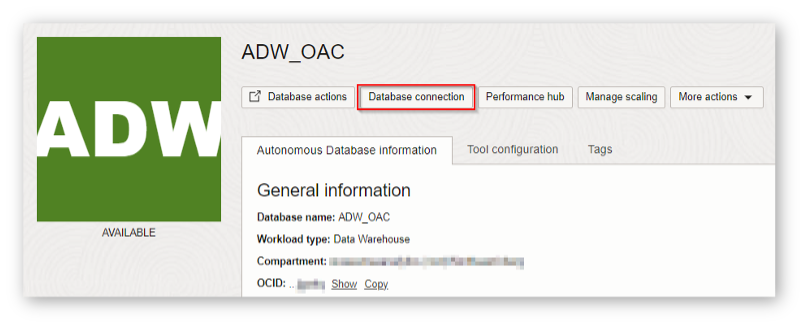

    This will open a pop-up window. Select Wallet Type **Instance Wallet** and then **Download Wallet**.

    

   You will be asked to provide a **password** for the wallet. The password must meet the rules for the **Oracle Cloud password** complexity. This password is a password that you need to remember for your **wallet**. You can use the **admin password** that you created before.

4. Select **Download** and save the wallet to your **local machine**.

    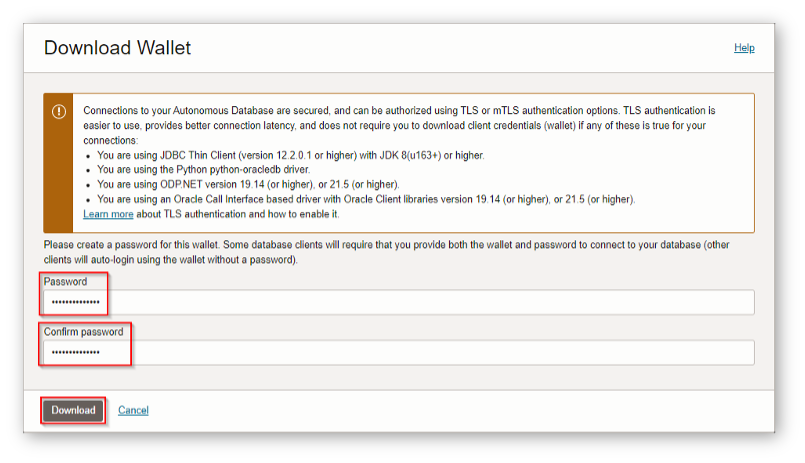

5. You can now **Close** the **Database Connection** pop up window.

    

6. Use the Wallet in Oracle Analytics Cloud

    **Return** to the **Oracle Cloud Infrastructure console** and click on the menu icon on the left.
    **Navigate** to **Analytics** and then **Analytics Cloud**.

    

7. **Open** the Cloud Analytics **URL** associated with your instance (the one that we created in Lab 2) by clicking the **dots menu** button on the right-hand side of your instance information and selecting **Analytics Home Page**.

    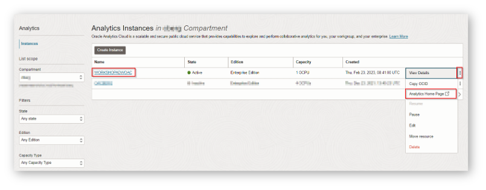

    The **Oracle Analytics** page will open in a new browser **window/tab**.

8. On the top right-hand side of the screen, click **Create**, and then **Connection**.

    

9. Choose **Oracle Autonomous Data Warehouse**.

    

    Use the following information to configure your **connection**.

    I recommend selecting first the autonomous database wallet zip file you just downloaded in ***Client Credentials*** field. It will automatically extract the required *cwallet.sso* and then **autocomplete** several of the fields for you. Later on you just have to review and modify them if need it.

    - **Connection Name**: WORKSHOPADWOAC
        ```
        <copy>WORKSHOPADWOAC</copy>
        ```

    - **Client Credentials**: Use the Browse button to upload the **wallet zip > file** that you downloaded. It will automatically extract the cwallet.sso file from this zip bundle.

    - **Username**: `ADMIN` -- We have created this user on the ADW instance creation.
        ```
        <copy>ADMIN</copy>
        ```

    - **Password**: The password that you created on the ADW instance creation at the beginning of the workshop.

    - **Service Name**: Choose the name of your database followed by the \_high suffix.

    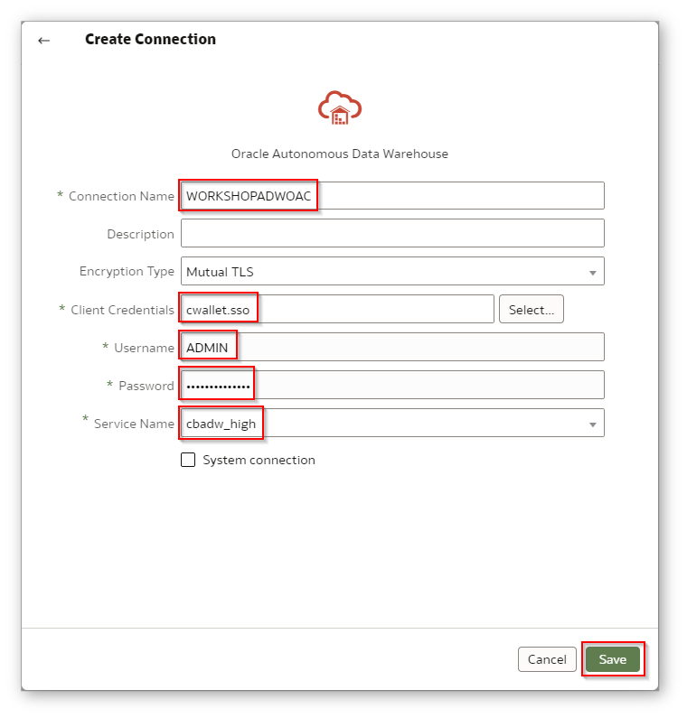

10. Select **Save** to save your new connection **information**.

## Task 2: Prepare the dataset

When you create a project, you add one or more **data sets** containing the data that you want to ** and explore**. Data sets contain data
from subject areas, Oracle Applications, databases, or uploaded data files such as spreadsheets. You can also add multiple data sets to your
existing projects.

1. On the top right-hand side of the **Oracle Analytics** Home Page, click **Create**, and then **Data Set**.

    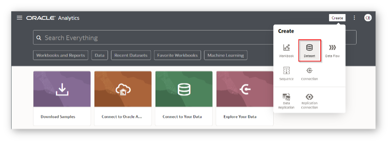

2. Select **WORKSHOPADWOAC**, the connection you **created** in the previous step.

    

3. In the next window, click on the  **Schemas** section. We will **SH** (Sales History) for the workshop purpose.
 
    The **SH schema** provides a small data set you can use to run the sample queries in the [Oracle Database Data Warehousing Guide](https://docs.oracle.com/en/database/oracle/oracle-database/19/dwhsg/sql-analysis-reporting-data-warehouses.html#GUID-1D8E3429-735B-409C-BD16-54004964D89B).

    For more information on the SH schema see [*Sample Schemas*](https://docs.oracle.com/en/database/oracle/oracle-database/19/comsc/introduction-to-sample-schemas.html#GUID-844E92D8-A4C8-4522-8AF5-761D4BE99200) and [*Schema Diagrams*](https://docs.oracle.com/en/database/oracle/oracle-database/19/comsc/schema-diagrams.html#GUID-D268A4DE-BA8D-428E-B47F-80519DC6EE6E).

    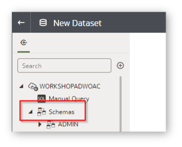
    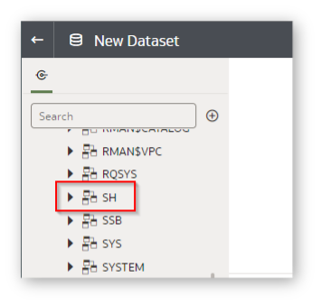

    Let's start by analyzing the **Sales History** schema's table.
    
    

4. Drag and Drop **SALES** table from the **SH schema** into the white canvas. Wait a few seconds until all the fields from **SALES** have been added to the canvas. You should see something similar to the following screenshoot.

    

    This will display the columns available in the **SALES** table.
    

5. Click on the **SALES Page** at the bottom of the page to **Edit** and **Prepare** the data for the visualizations that we will do in the next Task.

    


6. All the number-type columns from this table are treated as **MEASURE** by default. You can check the information on the **Properties** section of each table column under the Data Type section.

    Confirm that:
    - **PROD&#95;ID**
    - **CHANNEL&#95;ID**
    - **PROMO&#95;ID** 
    
    have **Data Type** are **Number** and **Treat As** are **ATTRIBUTE**. 

    For reviewing or/and making changes of these fields, select one field at the time and change **MEASURE** to **ATTRIBUTE** the information on the **Properties** section of each table column under the Data Type section.
    
    
    
7. We need to make a few more **modifications** on the table fields before we built the visualizations. 
    
    This time we will change the **Aggregation rule** to **CUST&#95;ID** from **SUM** to **Count Distinct** from the COLUMNS Properties panel from the left bottom.

    


8. We will **Save the Dataset** by clicking the **Save Database bottom** on the superior part of the screen and select **Save**. Here you have the information that we need:

    - **Name**: SH&#95;SALES
        ```
        <copy>SH&#95;SALES</copy>
        ```
    - **Description**: (Optional)
    

    
    

9. The **Data Set** was successfully **added**.

    

## Task 3: Create Visualizations using your data sets

1. Create a new project by clicking **Create Workbook**.

    

    A new screen with a **white canvas** is opened using the **SH&#95;SALES Data Set** you created.

    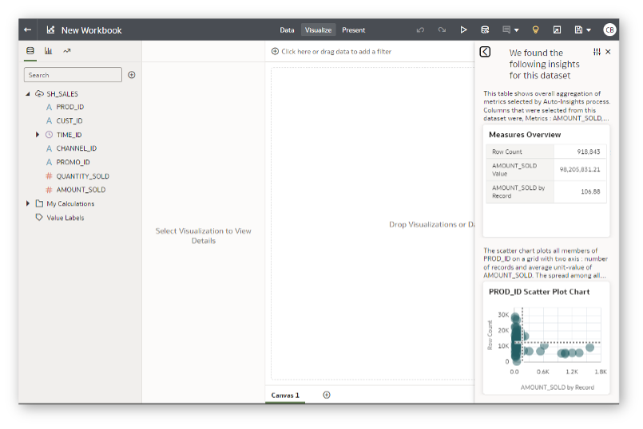

    Before drowning into details, let us give you a quick **explanation** of the different parts of this screen. This will help you to easily follow the next steps.

    An **Oracle Analytics Project** consists of **three main parts** (you can see them at the top right part of the screen):

    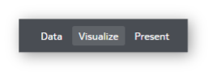

    - **Data**: Here is where you configure your data. You get a preview of each dataset on the project. You enrich it by adding columns, hiding or renaming the available ones. You can also define joins between datasets here.

    - **Visualize**: Here is where you explore and Analyze the data. You can create several canvases to hold the different visualizations you define.

    - **Present**: Here is where you create a more presentation-oriented view of the analysis you created. This tab allows you to choose which insights to show and add comments and descriptions. It helps to understand your analysis journey and focus on showing the results.

    During this workshop, you will use the **Present** and **Visualize** tabs mainly.

    You have already seen the **Prepare** screen on previous steps. The **Visualize** screen is this one:

    

    Main areas to note here are:

    - **Explorer**: Contains all fields from your datasets to be used in the project

    - **Chart Definition**: Contains definition of the selected Visualization, which fields to use and where (Axis, Filters, Trellis Groups...). This is the default view which is active. You can switch to the Properties view as described below.

    - **Canvas**: Your play area. You can place your visuals here. You can also create more Canvases and copy/move visuals around

    Inside the Chart Definition you can switch from the general Chart Definition attributes to the detailed Properties view:

    - **Properties**: Allows you to define the properties and parameters of the selected object. 

    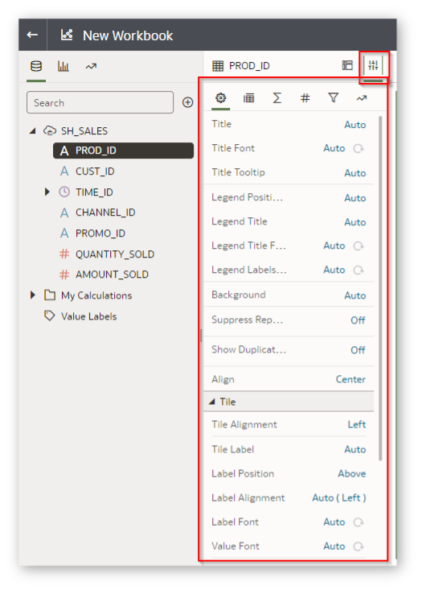


2. Select **AMOUNT&#95;SOLD** column from the **Explorer** and check whether it is being used as a proper **Measure**. You can see this by its # prefix in the **Explorer**.

    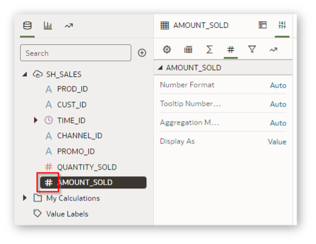

    You can also review the **Aggregation** rule in the Values tab of the Properties.

    

    By **Default the Aggregation** rule applied will be **SUM** as defined in the Data Set.

3. We will **add Month** to your selection: **Hold the Control Button on your Keyboard** and expand **TIME_ID** and select **Month**, after right click of your mouse and select **Create Best Visualization**.

    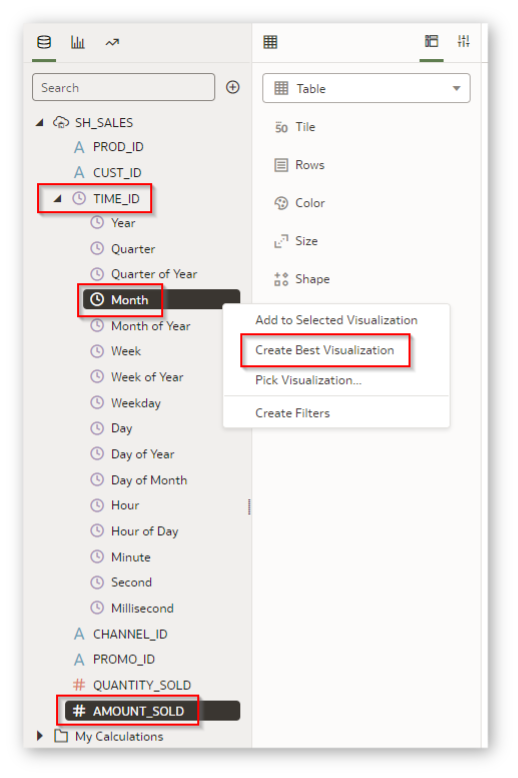

4. Verify that the **information** that is showing in the canvas is the following:

    **Line, Values (Y-Axis) &#45;&#45; AMOUNT&#95;SOLD, Category (X-Axis) &#45;&#45; TIME&#95;ID (Month)**.

    

5. Right click on the chart, select **Add Statistics** and **Trend Line**.

    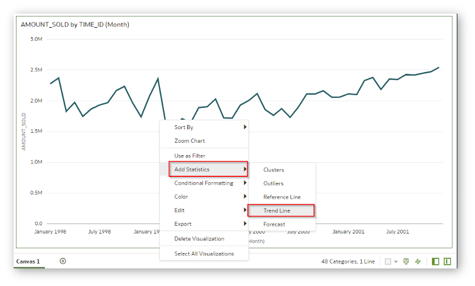
    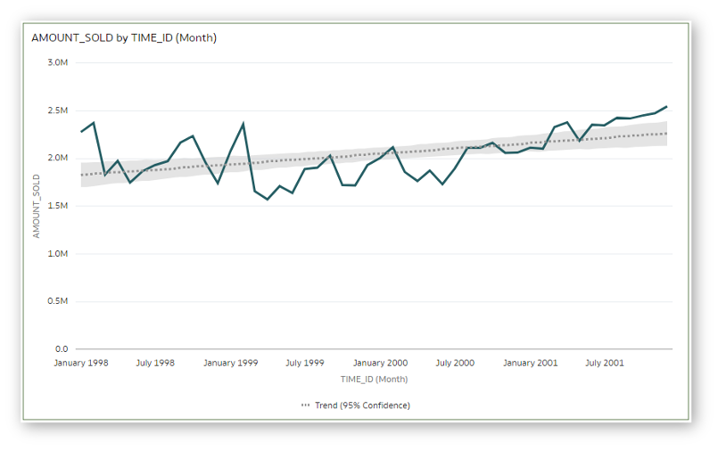

6. In the **Properties** view, under the Analytics tab please change the **Confidence Intervals** for the **Trend** from **95% to Off**.

    
    

    Although we had some ups and downs in the **totals**, you see that in the overall the total amount sold has been trending up, meaning our **sales are in good shape**.

    We will compare this information (**AMOUNT&#95;SOLD by TIME&#95;ID (Month)**) to our active customer base over time. To find the number of active customers, we will "**count distinct**" on **CUST&#95;ID on a Monthly basis**.

7. Select **CUST_ID** column from the **TABLE panel**. We modified the **Aggregation rule** to **Count Distinct** in Task 2 of this Lab, when we prepared the data. Now its time to use it.

    Be sure you drag and drop **CUST&#95;ID** column to the Values (**Y-Axis**) section with your mouse in the canvas. Be sure it is added **AMOUNT&#95;SOLD** and not replace it. Right click on **CUST&#95;ID** and select **Y2 Axis** as part of the **CUST&#95;ID** details.

    

    

    This **results** shows you that the number of customers is going down but the amount sold is going up, so we are **selling more to less customers**.

8. We will **Save the Workbook** by clicking the **Save Workbook** bottom on the superior part of the screen and select **Save**. Here you have the information that we need:

    - **Name**: Visualization
        ```
        <copy>Visualization</copy>
        ```
    - **Description**: (Optional)
        
    
    

9. We will create a **new Data Set** of data to enrich the **canvas**.

    Click the **+** bottom in the left top corner of the Analytics Cloud Page and **Add Data Set**.

    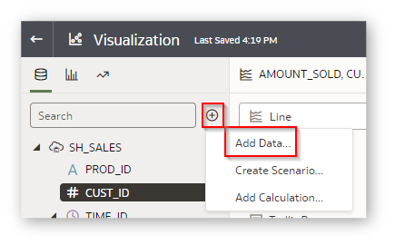

10. Select **Create Data Set**.

    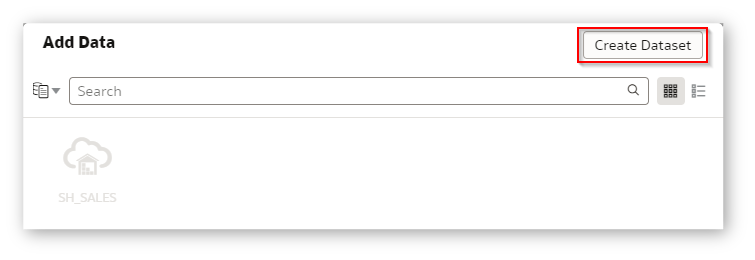

11. A new browser tab will open up automatically called **New Dataset**.

    

12. Select the data source **WORKSHOPADWOAC** from **Create Dataset**.

    

13. Click on the  **Schemas** section. We will **SH** (Sales History) for the workshop purpose.

    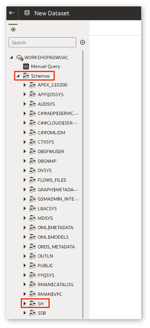

    Let's start by analyzing the **Sales History** schema's table.
    
    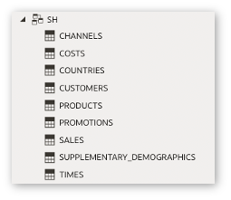

14. Drag and Drop **PRODUCTS** table from the **SH schema** into the white canvas. Wait a few seconds until all the fields from **PRODUCTS** have been added to the canvas. You should see something similar to the following screenshoot.

    

    This will display the columns available in the **PRODUCTS** table.

15. We will **Save the Dataset** by clicking the **Save Database** bottom on the superior part of the screen and select **Save**. Here you have the information that we need:

    - **Name**: SH&#95;PRODUCTS
        ```
        <copy>SH&#95;PRODUCTS</copy>
        ```
    - **Description**: (Optional)

    
    

16. The **Data Set** was successfully **added**.

    

17. Now we have to **join** the new Data Set, **SH&#95;PRODUCT**, to the data set that we created a few steps before **SH&#95;SALES**.

    Switch over to the browser tab called **Visualization**.

    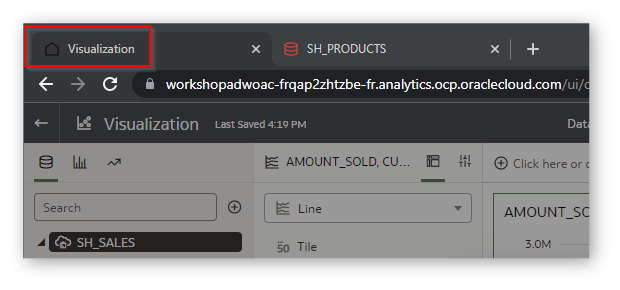

18. You will see that the **Add Data** window is open and automatically shows us the **SH&#95;PRODUCTS** data set which we have just created and **saved**.

    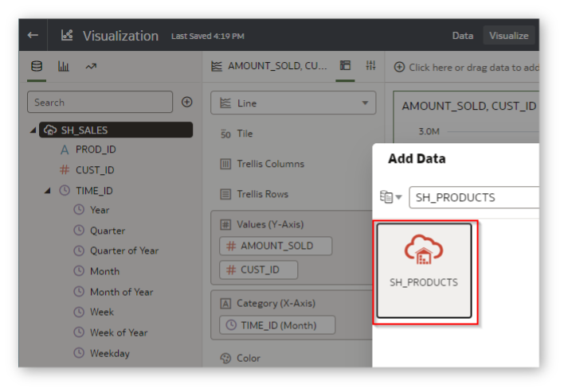

19. Click **Add to Workbook**.

    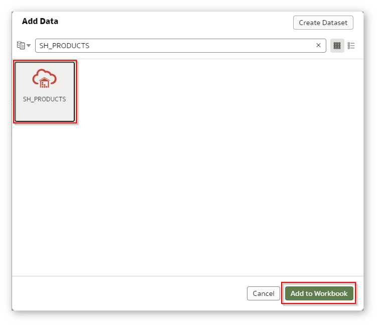

20. Click on the **Data** tab.

    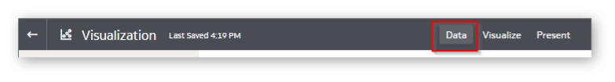

21. You arrive in the **Data Diagram view** as visible at the bottom of the screen. You can see that OAC has automatically **joined the two data sets** together based on the corresponding keys it identified.

    

22. Click on the **1** between SH_SALES and SH_PRODUCTS to review the details of the automatically created join. The 1 specifies that one **join condition was created**.
    
    

23. You can see that OAC has automatically joined **SH_SALES to SH_PRODUCTS** based on the common **PRODUCT_ID** column.

    

    Click **OK** to close the Blend Data dialog again.

24. Now that the **preparation** of the data is done, you can navigate again to **Visualize** page in the right top corner of the **Analytics Cloud Home Page**.

    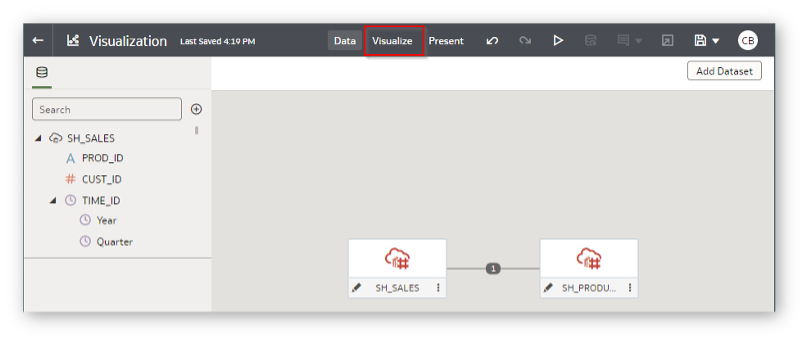


25. In the canvas go to **TIME_ID** section, **Show by** and select **Quarter** instead Month. You achieve this by **right-clicking on the TIME_ID** (Month) column under Category (X-Axis).

    

26. As soon as you choose **Quarter** the chart will **change dynamically**.

    

    We will eliminate the **Linear Trend Line** that we have in the graph.

27. Click in the **Chart Definition** and in the **Properties tab**, select the **Analytics** icon. You can either click on the green sliding button in the **Trend** section to remove the **Linear** trend but leave its definition existing in the chart or press the waste bin icon to **completely remove** the Trend.

    

28. We can see the **graph without the Trend Linear line**.

    

29. Select **PRODUCT_CATEGORY** from **SH&#95;PRODUCTS** and add it in the **Trellis Columns** section of the canvas.

    
    

    You can see now a **Trend** on the **AMOUNT&#95;SOLD** and the number of distinct customers by product category. This allows you to compare the performance of each product. However, using just lines can be a bit messy. You will try now to make this graphic more appealing.

30. Select **AMOUNT&#95;SOLD** from the canvas and select **Bar** to change the visualization.

    
    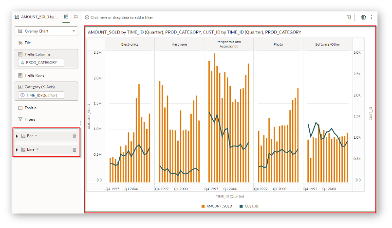

31. Select **Workbook Properties** from the **Burger Menu** in the right top corner.

    

32. Select in the **Color Series** and select another **color** that you prefer. For this exercise we will choose **Southwest**.

    

33. Select **OK** after applying the **color changes**.

    

    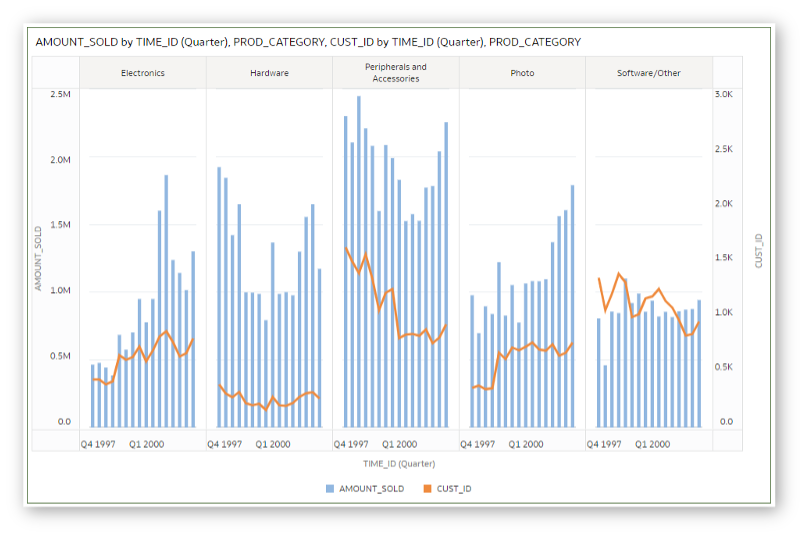

34. We will save the **Workbook** again. Click in the **Save** menu.

    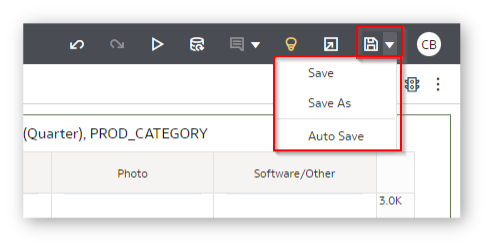

35. You can share your project by **email or social media**. Have a look at the **possibilities**.

    Select the Share icon and select **File or Print**.

    

36. You can choose to **Save** your project in a wide variety of standard formats such as **PowerPoint (pptx), Acrobat (pdf), Image (png), Data (csv), Package (dva)**.  You can choose which parts of your project to include, such as **All Canvas, only the Active Canvas or the Active Visual**.

    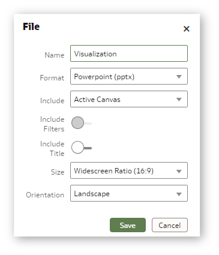
    

    The file will be **downloaded** locally on your machine.

    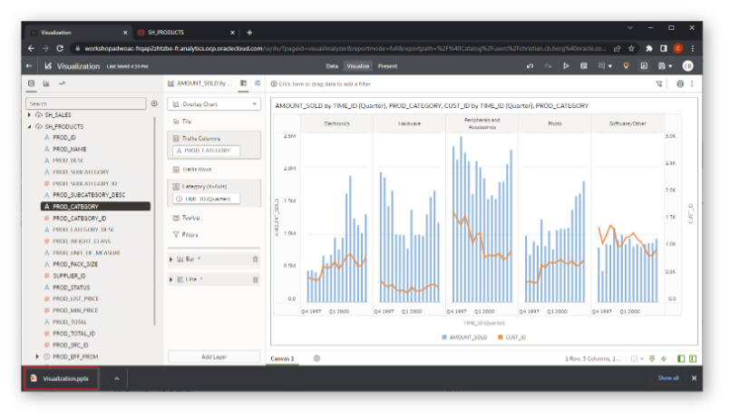

37. When you select **Print**, you can choose which parts of your project to include in the **Printed output, such as All Canvas, only the Active Canvas or the Active Visual**, etc.

    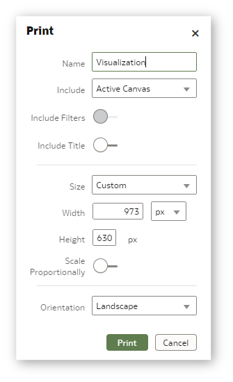

Watch our short recap video that includes an outlook of other functionalities of **Oracle Autonomous Database (ADB)** and **Oracle Analytics Cloud (OAC)**:

[](youtube:/Iz4lRgnql4o)

*Congratulations! Well done!*

## **Acknowledgements**

- **Author** - Priscila Iruela - Technology Product Strategy Director, Juan Antonio Martin Pedro - Analytics Business Development
- **Contributors** - Victor Martin, Melanie Ashworth-March, Andrea Zengin, Christian Berg
- **Last Updated By/Date** - Priscila Iruela, Feb 2023