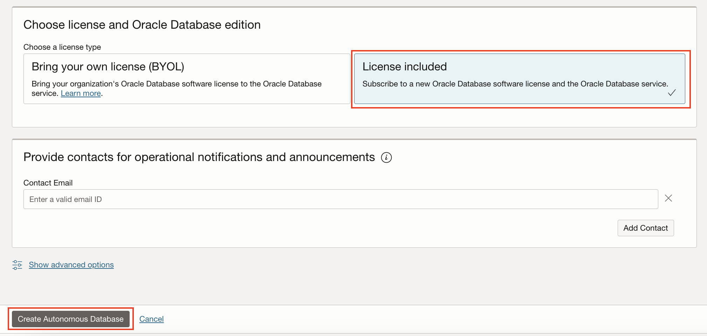

# Create a new Autonomous Data Warehouse Database

## Introduction

This workshop walks you through the steps to get started using the **Oracle Autonomous Data Warehouse Database (ADW)**. You will provision a new database in just a few minutes.

Oracle Autonomous Databases have the following characteristics:

**Self-driving**
Automates database provisioning, tuning, and scaling.

- Provisions highly available databases, configures and tunes for specific workloads, and scales compute resources when needed, all done automatically.

**Self-securing**
Automates data protection and security.

- Protect sensitive and regulated data automatically, patch your database for security vulnerabilities, and prevent unauthorized access—all with Oracle Autonomous Database.

**Self-repairing**
Automates failure detection, failover, and repair.

- Detect and protect from system failures and user errors automatically and provide failover to standby databases with zero data loss.

Watch our short video that explains how to provision your Autonomous Database instance:

[](youtube:IfWJhnodAxk)

Estimated Lab Time: 15 minutes.

### Objectives 
- Create an Autonomous Database with the latest features of Oracle Databases

## Task 1: Create a new Autonomous Data Warehouse Database

1. Click on the hamburger **MENU** link at the upper left corner of the page.

    This will produce a drop-down menu, where you should select **Autonomous Data Warehouse**.

    

    This will take you to the management console page.

    To learn more about comparments, see [Managing Compartments](https://docs.cloud.oracle.com/en-us/iaas/Content/Identity/Tasks/managingcompartments.htm).
    
2. To create a new instance, click the blue **Create Autonomous Database** button.

    

    Enter the required information and click the **Create Autonomous Database** button at the bottom of the form. For the purposes of this workshop, use the information below:

    - **Compartment:** Verify that a compartment (<tenancy_name>) is selected.

    By default, any OCI tenancy has a default ***root*** compartment, named after the tenancy itself. The tenancy administrator (default root compartment administrator) is any user who is a member of the default Administrators group. For the workshop purpose, you can use ***root***.
    By default, any OCI tenancy has a default ***root*** compartment, named after the tenancy itself. The tenancy administrator (default root compartment administrator) is any user who is a member of the default Administrators group. For the workshop purpose, you can use ***root***.

    - **Display Name:** Enter the display name for your ADW Instance. For this demo purpose, I have called my database `ADW_OAC`.
        ```
        <copy>ADW_OAC</copy>
        ```
    
    - **Database Name:** Enter any database name you choose that fits the requirements for ADW. The database name must consist of letters and numbers only, starting with a letter. The maximum length is 14 characters. You can leave the name provided. That field is not a mandatory one.
    - **Workload Type:** Autonomous Data Warehouse  
    
    - **Deployment Type:** Shared Infrastructure
    
    - **Always Free:** On

    You can select Always Free configuration to start enjoying your Free Autonomous Database. You will have see the Always Free logo next to the name of your database:

    

    We have selected 'Always Free Tier On'. 

    To learn more about Always Free check the following [link](https://www.oracle.com/uk/cloud/free/#always-free).

    

    - **Choose Database version:** 19c
    
    - **CPU Count:** 1
    
    - **Storage Capacity (TB):** 1

    - **CPU Count and Storage Capacity (TB)** are defined by default for the Always Free Tier.
    
    - **OCPU Auto scaling:** Off
    
    - **Storage Auto scaling:** Off

    

3. Under **Create administration credentials** section:

    - **Administrator Password:** Enter any password you wish to use noting the specific requirements imposed by ADW.
    
    - **Reminder:** Note your password in a safe location as this cannot be easily reset.

    Under **Choose network access** section:

    - Select **'Secure access from everywhere'**: *On*
    
    

4. Under **Choose a license type** section, choose **License Type: Licence Included**.

    When you have completed the required fields, scroll down and click on the blue **Create Autonomous Database** button at the bottom of the form:

    

5. The Autonomous Database **Details** page will show information about your new instance. You should notice the various menu buttons that help you manage your new instance - because the instance is currently being provisioned all the management buttons are greyed out.

    

6. A summary of your instance status is shown in the large box on the left. In this example, the color is amber and the status is **Provisioning**.

    

7. After a short while, the status will change to **Available** and the "ADW" box will change color to green:

    

8. Once the Lifecycle Status is **Available**, additional summary information about your instance is populated, including workload type and other details.

    The provisioning process should take **under 5 minutes**.

9. After having the Autonomous Database instance **created** and **available**, you can get a message window asking you to upgrade from 18c to 19c if you have selected 18c as a database version during the provisioning. You can **upgrade** the database release if you wish after the hands-on session, otherwise the upgrade process can take a **few minutes** and you can miss a few exercises during the session.

    This page is known as the **Autonomous Database Details Page**. It provides you with status information about your database, and its configuration. Get **familiar** with the buttons and tabs on this page.

    

    Remember: You will have visible the Always Free logo next to the name of your database:

    

You have just created an Autonomous Database with the latest features of Oracle Databases.

## **Acknowledgements**

- **Author** - Priscila Iruela - Technology Product Strategy Director, Juan Antonio Martin Pedro - Analytics Business Development
- **Contributors** - Victor Martin, Melanie Ashworth-March, Andrea Zengin
- **Last Updated By/Date** - Priscila Iruela, June 2022

## Need Help?
Please submit feedback or ask for help using our [LiveLabs Support Forum](https://community.oracle.com/tech/developers/categories/livelabsdiscussions). Please click the **Log In** button and login using your Oracle Account. Click the **Ask A Question** button to the left to start a *New Discussion* or *Ask a Question*.  Please include your workshop name and lab name.  You can also include screenshots and attach files.  Engage directly with the author of the workshop.

If you do not have an Oracle Account, click [here](https://profile.oracle.com/myprofile/account/create-account.jspx) to create one.