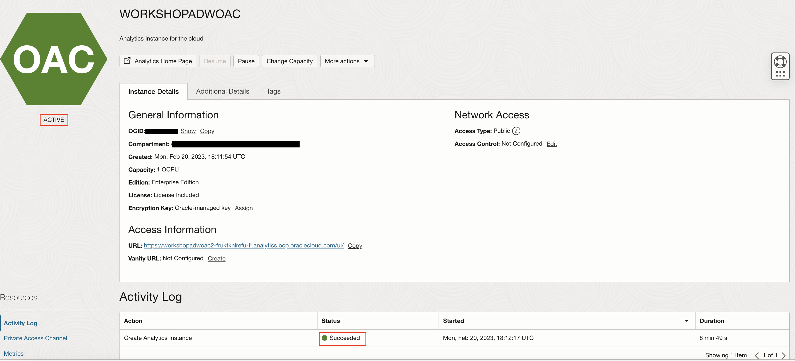

# Provisioning your Oracle Analytics Cloud (OAC) instance

## Introduction

This section describes the process of deploying **Oracle Analytics Cloud** instances on Oracle Cloud Infrastructure Gen 2, which is the default for newly provisioned accounts in **EMEA** and **US**.

Your Oracle Cloud Free Tier account will use the Oracle Cloud Free Trial **credits** while this instance is provisioned, as Oracle Analytics Cloud is not part of the **Always Free** cloud services.

Provisioning an Oracle Analytics Cloud instance can take over **40 minutes**.

Watch our short video that explains how to provision your Oracle Analytics Cloud instance:

[](youtube:ZAqXlhivQCg)

Estimated workshop Time 15 minutes.

### Objectives
- Create an Oracle Analytics Cloud Instance

## Task 1: Create an Oracle Analytics Cloud (OAC) Instance

Return to the Oracle Cloud Infrastructure Console accessing from **Oracle Home Page** (oracle.com) and sign in into your cloud account.
Click in **View Account** and **Sign in to Cloud**.


1. Click on the menu icon on the left. Verify that you are signed in as a **Single Sign On** (Federated user) user by selecting the **Profile** icon in the top right hand side of your screen. If your username is shown as:

    - oracleidentitycloudservice/&lt;your username&gt;
    
    Then you are **connected** as a **Single Sign On** user.

    

    If your username is shown as:

    -  &lt;your username&gt;
    
    Then you are **signed in** as an **Oracle Cloud Infrastructure** user.

    

    If your user does not contain the identity provider (**oracleidentitycloudprovider**), please logout and select to authenticate
    using **Single Sign On**.

    

    To be capable of using **Oracle Analytics Cloud** we need to be Sign-On as a **Single Sign-On** (SSO) user.

    For more information about federated users, see [User Provisioning for Federated Users](https://docs.cloud.oracle.com/en-us/iaas/Content/Identity/Tasks/usingscim.htm).

2. Return to the **Home Console Page** and navigate to **Analytics & AI** section and then **Analytics Cloud**.

    

    > **Note**: You must be connected as a **Single Sign On** (**Federated user**) user to a tenancy, which has available cloud credits to see this menu item. Local OCI users are not able to do this.

3. Select **Create Instance**.

    Complete the form using the following information:

    - **Compartment**: Select a valid compartment in your tenancy
    
    - **Instance Name**: `WORKSHOPADWOAC`
        ```
        <copy>WORKSHOPADWOAC</copy>
        ```
    - **Description**: &lt;Optional&gt;
        ```
        <copy>Analytics Instance for the cloud</copy>
        ```
    - **Feature Set**: Enterprise Analytics (important)
    
    - **Capacity**: 1 - Non Production
    
    - **License Type**: "Subscribe to a new Analytics Cloud software > license and the Analytics Cloud." (You will use this service as part of the free Oracle Cloud trial that you requested for this workshop).

4. Select **Create**.

    

5. On the **Confirmation** screen, select **Create**.

    The Analytics instance page will be displayed with a status of **CREATING**.

    

    ***Reminder***: Provisioning an Oracle Analytics Cloud instance can take over **40 minutes**.

6. The Analytics instance page will be displayed with a status of **ACTIVE**.

    


## **Acknowledgements**

- **Author** - Priscila Iruela - Technology Product Strategy Director, Juan Antonio Martin Pedro - Analytics Business Development
- **Contributors** - Victor Martin, Melanie Ashworth-March, Andrea Zengin
- **Last Updated By/Date** - Priscila Iruela, June 2022