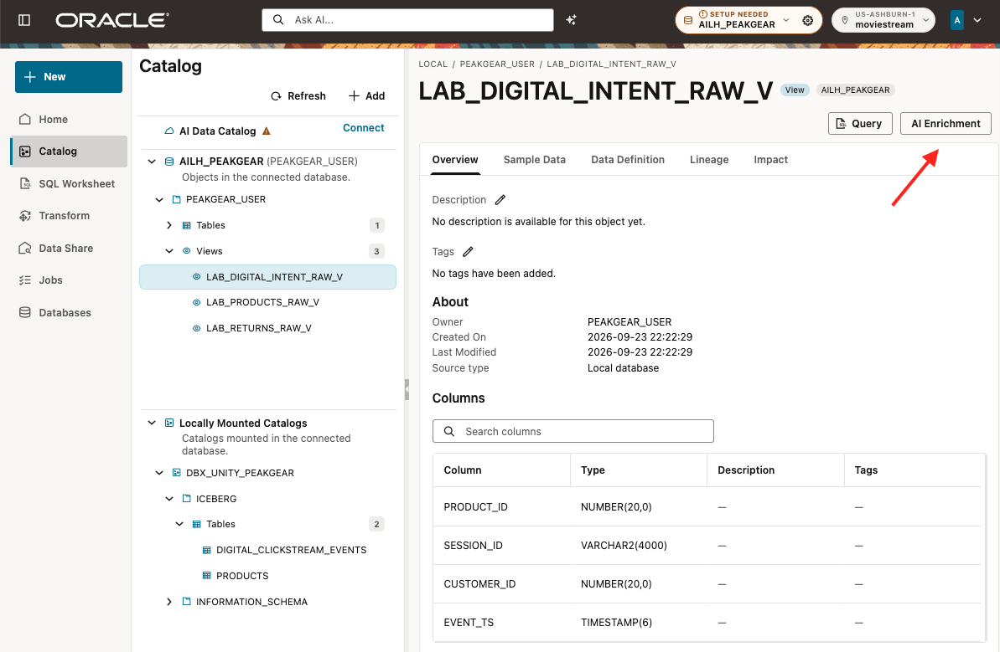
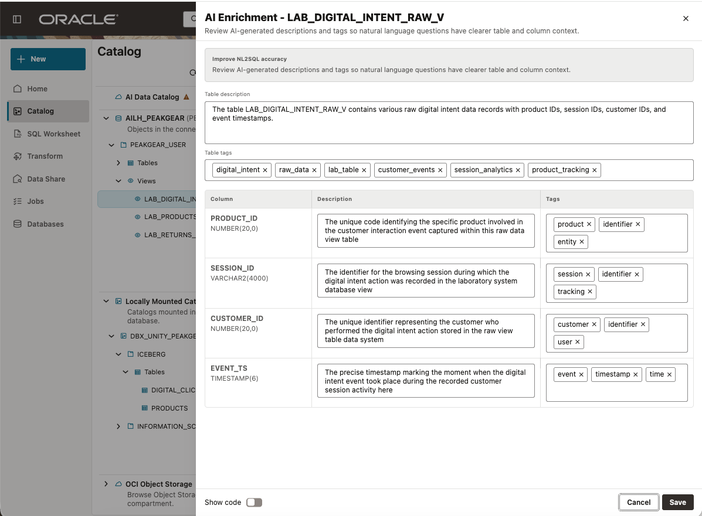
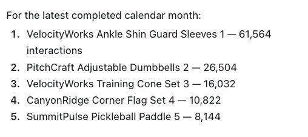

# Lab 5: Add business meaning with AI Enrichment

Estimated Time: 12 minutes

## Introduction

AI Enrichment can suggest descriptions and tags, but the participant reviews
and saves the business contract. Data Studio persists the reviewed text as
native database annotations. That contract gives Codex a reliable definition
for the same simple question from Lab 4.

### Objectives

In this lab, you will:

* use Data Studio AI Enrichment without creating an AI profile;
* review and save a precise meaning for digital interest; and
* ask exactly the same business question again.

## Task 1: Open AI Enrichment

The default AI profile is already prepared. Do **not** create, select, edit, or
validate a profile.

1. Open **Catalog**.
2. Open the PEAKGEAR&#95;USER schema, then **Views**.
3. Select LAB&#95;DIGITAL&#95;INTENT&#95;RAW&#95;V.
4. Click **AI Enrichment**.
5. Wait briefly for editable fields. AI-generated text is a suggestion, not a
   source of truth.

## Task 2: Review the business contract

Replace the view-level description with this exact text:

~~~text
Each row is one digital product interaction. In this lab, customer interest
means the count of rows (digital events). "Right now" means the latest
completed calendar month based on EVENT_TS. Report the result by PRODUCT_ID.
This view has no product names, returns, revenue, or store.
~~~

Set the view tags to:

~~~text
digital_intent, event_data, product_popularity, no_store_attribution
~~~

Set these column descriptions and tags:

| Column | Description | Tags |
|---|---|---|
| PRODUCT&#95;ID | Business product identifier. Join key to LAB&#95;PRODUCTS&#95;RAW&#95;V.PRODUCT&#95;ID; it is not a measure. | product&#95;key, join&#95;key |
| SESSION&#95;ID | Browsing-session identifier. It is not a customer identifier or additive measure. | session&#95;identifier |
| CUSTOMER&#95;ID | Customer identifier associated with the event. Row count is not a count of unique customers. | customer&#95;identifier |
| EVENT&#95;TS | Timestamp of the interaction. Use it to derive the latest completed calendar month. | event&#95;timestamp, time&#95;key |

Turn on **Show code** only to review what Data Studio will save. The point is
not to copy generated SQL: click **Save** only after the description and tags
are correct in the UI.

## Task 3: Verify the saved annotation

Close the dialog and reopen the view in Catalog. The Overview description must
begin with:

~~~text
Each row is one digital product interaction
~~~

Optionally verify the saved database metadata:

~~~sql
SELECT object_type,
       object_name,
       column_name,
       annotation_name,
       annotation_value
FROM user_annotations_usage
WHERE object_name = 'LAB_DIGITAL_INTENT_RAW_V'
  AND annotation_name IN ('DESCRIPTION', 'TAGS')
ORDER BY column_name NULLS FIRST,
         annotation_name;
~~~

<!-- Screenshot to insert after approved dry run: images/ai-enrichment-saved.png
     Alt text: Data Studio Catalog shows the saved description and tags for
     the Digital Intent view. -->

## Task 4: Repeat the same question

In the same Codex task, ask exactly the same question from Lab 4:

~~~text
Which products are customers interested in right now?
~~~

Expected result: Codex uses the saved contract to calculate the latest-month
digital-event ranking. It can join to LAB&#95;PRODUCTS&#95;RAW&#95;V only to present the
corresponding business-facing product names; that lookup does not change the
metric, time window, or result grain.

The words in the business question did not change. The answer improved because
the definition, time period, and result grain are now saved in Data Studio.

### Checkpoint

LAB&#95;DIGITAL&#95;INTENT&#95;RAW&#95;V has saved `DESCRIPTION` and `TAGS` annotations, and Codex
has answered the same question with the defined metric, time window, and
product grain.

## Learn More

* [Oracle Data Studio Guide](https://docs.oracle.com/en/cloud/paas/autonomous-database/data-studio-guide/)

## Acknowledgements

* **Author** - Oracle AI Lakehouse workshop team
* **Last Updated By/Date** - Oracle AI Lakehouse workshop team, September 2026
