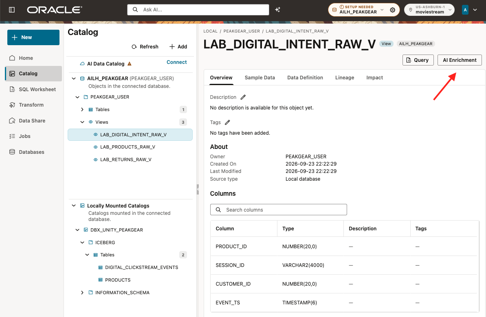
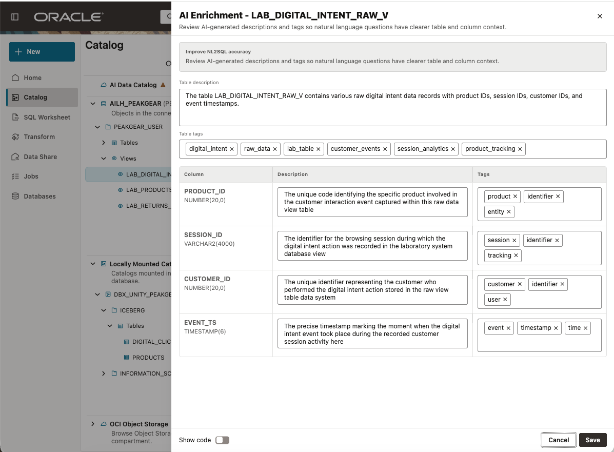
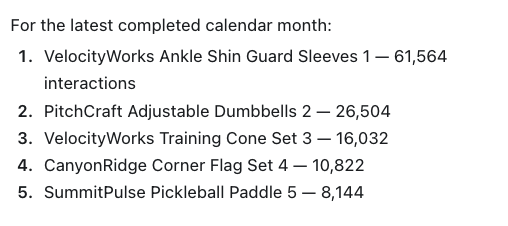

# Lab 5: Add business meaning with AI Enrichment

Estimated Time: 12 minutes

## Introduction

AI Enrichment can suggest descriptions and tags, but the participant reviews
and saves the business contract. Data Studio persists the reviewed text as
native database annotations. In this lab, you enrich all three raw views in
one place: digital interactions, the product catalog, and operational returns.
The saved contracts give Codex a reliable definition for the same simple
question from Lab 4 and prepare the source context for the harder question in
Lab 6. You will not repeat AI Enrichment in Lab 6.

### Objectives

In this lab, you will:

* use Data Studio AI Enrichment without creating an AI profile;
* review and save descriptions and tags for all three raw views;
* define digital interest, product labels, and returned units; and
* ask exactly the same business question again.

## Task 1: Open AI Enrichment

Continue after Lab 4's connection checkpoint and raw-question stop. Keep the
same Codex task open while editing the metadata in Data Studio.

The default AI profile is already prepared. Do **not** create, select, edit, or
validate a profile.

1. Open **Catalog**.
2. Open the PEAKGEAR&#95;USER schema, then **Views**.
3. Select LAB&#95;DIGITAL&#95;INTENT&#95;RAW&#95;V.
4. Click **AI Enrichment**.
5. Wait briefly for editable fields. AI-generated text is a suggestion, not a
   source of truth.

Task 2 provides the definitions for all three views. Save the digital view
first, then repeat the same **Catalog > Views > AI Enrichment** flow for
LAB&#95;PRODUCTS&#95;RAW&#95;V and LAB&#95;RETURNS&#95;RAW&#95;V. Each view needs its own **Save**.

## Task 2: Review the business contract

### Digital interactions

For LAB&#95;DIGITAL&#95;INTENT&#95;RAW&#95;V, use the following definitions.

Replace the view-level description with this exact text:

~~~text
<copy>
Each row is one digital product interaction. In this lab, customer interest
means the count of rows (digital events). "Right now" means the latest
completed calendar month based on EVENT_TS. Aggregate events by PRODUCT_ID,
then join LAB_PRODUCTS_RAW_V on PRODUCT_ID to display PRODUCT_NAME. That
catalog must contain one row per product; never multiply event counts in the
label join. Keep unknown product names unknown. This event view has no product
names, returns, revenue, or store.
</copy>
~~~

Set the view tags to:

~~~text
<copy>
digital_intent, event_data, product_popularity, no_store_attribution
</copy>
~~~

Set these column descriptions and tags:

| Column | Description | Tags |
|---|---|---|
| PRODUCT&#95;ID | Business product identifier. Join key to LAB&#95;PRODUCTS&#95;RAW&#95;V.PRODUCT&#95;ID; it is not a measure. | product&#95;key, join&#95;key |
| SESSION&#95;ID | Browsing-session identifier. It is not a customer identifier or additive measure. | session&#95;identifier |
| CUSTOMER&#95;ID | Customer identifier associated with the event. Row count is not a count of unique customers. | customer&#95;identifier |
| EVENT&#95;TS | Timestamp of the interaction. Use it to derive the latest completed calendar month. | event&#95;timestamp, time&#95;key |

Turn on **Show code** only to review what Data Studio will save. The point is
not to copy generated SQL: click **Save** only after the description and tags
are correct in the UI.

### Product catalog

In **Catalog**, open LAB&#95;PRODUCTS&#95;RAW&#95;V and click **AI Enrichment**. Review
and save these business definitions:

| Object | Description | Tags |
|---|---|---|
| View | One row per product. Conformed catalog shared by digital intent and returns. Category rolls up product. | product&#95;catalog, conformed&#95;dimension, category&#95;hierarchy |
| PRODUCT&#95;ID | Shared product join key. | product&#95;key, join&#95;key |
| PRODUCT&#95;NAME | Business-facing product name. | product&#95;name |
| CATEGORY&#95;NAME | Category used to aggregate products. | category, hierarchy&#95;level |

Click **Save** before moving to the next view.

### Operational returns

In **Catalog**, open LAB&#95;RETURNS&#95;RAW&#95;V and click **AI Enrichment**. Review
and save these business definitions:

| Object | Description | Tags |
|---|---|---|
| View | One operational return event by product, store and timestamp. Aggregate separately before comparing with digital popularity. Returns are a quality context, not a rate. | `returns`, quality&#95;signal, operational&#95;data, no&#95;return&#95;rate |
| PRODUCT&#95;ID | Product join key. Join to LAB&#95;PRODUCTS&#95;RAW&#95;V.PRODUCT&#95;ID. | product&#95;key, join&#95;key |
| STORE&#95;ID | Store identifier for returns analysis. | store&#95;key, join&#95;key |
| RETURN&#95;QTY | Additive number of returned units. Default aggregation is `SUM`. | `measure`, `units`, `additive`, `sum` |
| RETURN&#95;CREATED&#95;AT | Timestamp when the return was recorded. Derive calendar month from it. | event&#95;timestamp, time&#95;key |

Click **Save**. All three views must be saved before Task 3.

## Task 3: Verify the saved annotations

Close the dialog and reopen each view in Catalog. Confirm that its reviewed
description and tags are visible, including the column definitions. The
digital view's Overview description must begin with:

~~~text
<copy>
Each row is one digital product interaction
</copy>
~~~

Optionally verify the saved database metadata:

~~~sql
<copy>
SELECT object_type,
       object_name,
       column_name,
       annotation_name,
       annotation_value
FROM user_annotations_usage
WHERE object_name IN (
        'LAB_DIGITAL_INTENT_RAW_V',
        'LAB_PRODUCTS_RAW_V',
        'LAB_RETURNS_RAW_V'
      )
  AND annotation_name IN ('DESCRIPTION', 'TAGS')
ORDER BY object_name,
         column_name NULLS FIRST,
         annotation_name;
</copy>
~~~

Each view must have saved view-level `DESCRIPTION` and `TAGS` annotations.
Also check the product-name and join-key column descriptions before continuing.

<!-- Screenshot to insert after approved dry run: images/ai-enrichment-saved.png
     Alt text: Data Studio Catalog shows the saved description and tags for
     the Digital Intent view. -->

## Task 4: Repeat the same question

In the same Codex task, ask exactly the same question from Lab 4:

~~~text
<copy>
Which products are customers interested in right now?
</copy>
~~~

Expected result: Codex uses the saved contract to calculate the latest-month
digital-event ranking. It can join to LAB&#95;PRODUCTS&#95;RAW&#95;V only to present the
corresponding business-facing product names; that lookup does not change the
metric, time window, or result grain.

The current Starter Kit includes that safe label lookup. If an older installed
kit still returns only IDs, download the current kit, rerun its setup with this
reservation's URL and Database Password, and create a fresh Codex task with the
Lab 4 boundary. Do not create Analytic Views early just to display product names.

The words in the business question did not change. The answer improved because
the definition, time period, and result grain are now saved in Data Studio.

### Checkpoint

All three raw views have reviewed, saved `DESCRIPTION` and `TAGS` annotations,
and Codex has answered the same question with the defined metric, time window,
and product grain. Lab 6 reuses these annotations; it does not run AI Enrichment
again.

## Learn More

* [Oracle Data Studio Guide](https://docs.oracle.com/en/cloud/paas/autonomous-database/data-studio-guide/)

## Acknowledgements

* **Author** - Oracle AI Lakehouse workshop team
* **Last Updated By/Date** - Oracle AI Lakehouse workshop team, October 2026
