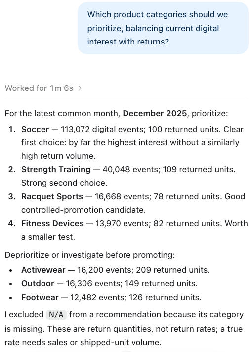

# Lab 7: Create Analytic Views with Codex

Estimated Time: 15 minutes

## Introduction

The business question now has reviewed source semantics, but it needs a
reusable governed model. Codex will use the LiveLab MCP server to create and
validate two Analytic Views:

* LAB&#95;DIGITAL&#95;POPULARITY&#95;AV for digital events by time, category, and product.
* LAB&#95;RETURNS&#95;AV for returned units by time, category, product, and store.

The participant does not paste complex Analytic View DDL. Codex creates the
model from the saved Data Studio definitions and validates it before answering.

### Objectives

In this lab, you will:

* ask Codex to build the governed model through MCP;
* confirm that both Analytic Views are valid; and
* receive a governed category recommendation with drill-down evidence.

## Task 1: Ask Codex to build the model

In the existing Codex task, paste:

~~~text
Use the LiveLab MCP server to create and validate the governed model I need to
answer this business question: Which product categories should we prioritize,
balancing current customer interest with returns?

Use the reviewed Data Studio descriptions and tags on the three PeakGear views.
Create only objects owned by PEAKGEAR_USER. Build a common completed-month
window, category-to-product hierarchy, and additive measures for digital events
and returned units. Create and validate LAB_DIGITAL_POPULARITY_AV and
LAB_RETURNS_AV. Do not invent sales, revenue, or a return rate.
~~~

Expected result: Codex reads the annotations, creates the supporting semantic
objects that it needs, creates both Analytic Views, and validates that the
views can be queried. It should stop and report a specific missing input if it
cannot create a hierarchy or shared dimension.

If the MCP build capability cannot express a required shared dimension or
custom hierarchy, stop and ask the instructor for the reviewed fallback DDL.
Do not replace the normal participant path with a paste of instructor SQL.

<!-- Screenshot to insert after approved dry run: images/codex-builds-av.png
     Alt text: Codex uses LiveLab MCP to create and validate the two PeakGear
     Analytic Views, with non-secret validation evidence. -->

## Task 2: Ask the final business question

Ask:

~~~text
Which product categories should we prioritize, balancing current customer
interest with returns?
~~~

Expected result: Codex answers from the two Analytic Views and provides a
governed drill-down to the relevant categories and products. It states the
completed-month window and the measures used:

* customer interest = digital event count;
* returns = sum of returned units; and
* returns are quality context, not a return rate.

### Checkpoint

LAB&#95;DIGITAL&#95;POPULARITY&#95;AV and LAB&#95;RETURNS&#95;AV are valid, and Codex can answer
the final question through their governed hierarchy and measures.

## Summary

The same customer-interest concept progressed through three stages:

| Stage | What Codex can do | Why |
|---|---|---|
| Raw sources | Refuse to invent the answer | Fields do not define the business question. |
| Data Studio annotation | Answer one clearly defined single-source question | The metric, grain, and time window are saved. |
| Analytic Views | Make a governed cross-source recommendation with drill-down | Time, hierarchy, and aggregation semantics are reusable. |

## Learn More

* [Oracle Data Studio Guide](https://docs.oracle.com/en/cloud/paas/autonomous-database/data-studio-guide/)

## Acknowledgements

* **Author** - Oracle AI Lakehouse workshop team
* **Last Updated By/Date** - Oracle AI Lakehouse workshop team, September 2026
