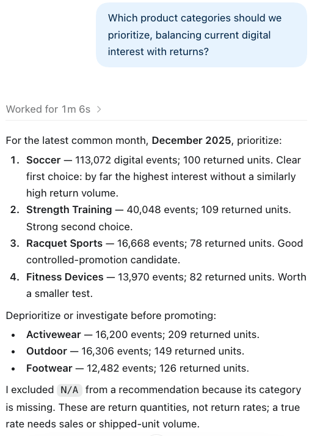

# Lab 5: Create an Analytic View with Codex

Estimated Time: 20 minutes

## Introduction

Lab 4 saved the reviewed descriptions and tags for all three raw tables. Reuse
those annotations here; do not run AI Enrichment again. The next question
combines digital behavior, a product hierarchy, and operational returns. The
Lab 2 tables are local snapshots of the connected sources. A
one-off join would be technically possible but would not be a shared,
reviewable, reusable business model.

In this lab, first identify the model requirements, then ask Codex through the
LiveLab MCP server to create or reuse and validate **one Analytic View** with
product-to-category and month hierarchies. It contains two additive measures:
digital event count and returned units for the same completed month.

The participant does not paste complex Analytic View DDL. Codex uses explicit
SQL DDL through **adp_run_query**, not **adp_build_analytic_view**, and validates
the model from the saved Data Studio definitions before answering.

### Objectives

In this lab, you will:

* ask the harder business question and identify the governed-model gap;
* ask Codex to build the governed model through MCP;
* confirm that one AV and both measures are validated and reconciled; and
* receive a governed category recommendation with drill-down evidence.

### Prerequisites

Complete Lab 4, including the saved descriptions and tags for
LAB&#95;DIGITAL&#95;INTENT&#95;RAW&#95;T, LAB&#95;PRODUCTS&#95;RAW&#95;T, and
LAB&#95;RETURNS&#95;RAW&#95;T. Keep the same Codex task and LiveLab MCP connection
open. This lab does not repeat AI Enrichment or create an AI profile.

## Task 1: Ask the harder business question

In Codex, ask:

~~~text
<copy>
Which product categories should we prioritize, balancing current customer
interest with returns?
</copy>
~~~

## Task 2: Review the governed-model requirements

Expected result: Codex should state that it needs a governed model before
making the recommendation. It should identify all of these requirements:

* one common, completed-month time window;
* a reusable category-to-product hierarchy;
* digital events with non-NULL product IDs aggregated by product and month,
  with unattributed events counted and reported separately;
* returned units aggregated independently by product and month before the
  two measures are combined; and
* governed drill-down rather than a one-off cross-source join.

This is not a failure. It is the decision to create a reusable semantic model
instead of making an unreviewed recommendation from ad-hoc SQL.

<!-- Screenshot to insert after approved dry run: images/governed-model-gap.png
     Alt text: Codex identifies the time, hierarchy, and aggregation rules
     required before returning a cross-source recommendation. -->

### Checkpoint

Codex has reused the Data Studio metadata saved in Lab 4 and identified the
governed-model requirements without inventing a recommendation. Continue to
Task 3 in this same lab to build the model.

## Task 3: Ask Codex to build the model

In the same Codex task used since Lab 3, click **Copy** in the upper-right
corner of the following block, then paste the request into Codex. The complete
boundary is already established in Lab 3, Task 2; do not paste it again here.
This short request authorizes the model build using those standing rules.
Codex discovers suitable existing objects and chooses any necessary new names
from the saved source definitions; do not prescribe names from another run.

~~~text
<copy>
Go ahead: create or reuse and validate one Analytic View to answer:
Which product categories should we prioritize, balancing current customer interest with returns?

Follow the established boundary. Use existing local tables and reviewed metadata. Reuse suitable dependencies and create only what is missing in PEAKGEAR_USER. Avoid repeated discovery and unnecessary rebuilds, but keep the required validation.

Return a short summary of the AV and validation results.
</copy>
~~~

Expected result: Codex batches independent metadata reads, validates product
keys and category mappings, and reuses a suitable existing AV and its
dependencies. If none is suitable, it creates the minimum supporting local
tables, dimensions, hierarchies, and one AV using explicit SQL DDL through
adp_run_query. It performs one consolidated final health check and reconciles
both measures for the latest shared completed month against the local sources.
It stops and reports a missing essential metric definition, ambiguous product
mapping, or required permission if the task cannot be completed. A missing
unknown-category annotation alone is not a blocker: the Lab 3 boundary provides
an explicit default, which Codex applies and discloses briefly.

The PEAKGEAR&#95;USER-only boundary established in Lab 3 still applies. Use the
object names reported by Codex; the participant does not have to prescribe them.

Do not use the high-level auto-builder, create exploratory AVs, or create a
second AV for returns. Reuse verified metadata and dependencies instead of
repeatedly discovering or rebuilding them. After a timeout or ambiguous
error, inspect whether the affected object exists and whether the operation
completed before retrying. Repeat checks only after a failure or relevant
change. SQL creation is still MCP-driven: the learner does not paste DDL.

Before creating the product/category model, validate attribution against the
shared catalog. Exclude digital events with NULL PRODUCT&#95;ID from those
rankings and report their count for the same common month. Keep the raw source
table intact. Every non-NULL product ID in both facts must map to exactly one
catalog product. Stop and report missing products or ambiguous product-key
mappings rather than dropping them or inventing mappings. For products with
NULL or blank categories, use the saved handling rule or the Lab 3 default:
retain their measures in an `Unknown / Unspecified` technical bucket in the
derived model, include it in reconciliation, and report its totals separately
from named-category recommendations. Do not block the AV build just because
there is no saved unknown-category rule. Preserve existing source labels such
as `N/A` and the literal text `null`; call out those labels separately from
named-category recommendations instead of assigning categories from product
names.

Aggregate each fact independently by product and month before combining it
with the other fact, and preserve product-month rows present in either source.
For the final comparison, query category rows for the common month; use product
detail for drill-down. Do not sum detail rows together with their All-level
totals. This model does not require a store hierarchy.

The Lab 2 raw tables and any supporting aggregate tables are workshop
snapshots. Codex must state their source month and validate the model against
those tables. Do not imply continuous refresh unless the model implements it.

<!-- Screenshot to insert after approved dry run: images/codex-builds-av.png
     Alt text: Codex uses explicit SQL through LiveLab MCP to create or reuse
     and validate one PeakGear Analytic View with both measures. -->

## Task 4: Ask the final business question

Ask:

~~~text
<copy>
Which product categories should we prioritize, balancing current customer
interest with returns?
</copy>
~~~

Expected result: Codex answers from the validated Analytic View and provides a
governed drill-down to the relevant categories and products. It states the
completed-month window and the measures used:

* customer interest = digital event count for non-NULL product IDs;
* digital events without product IDs are excluded from category ranking and
  their count is reported separately for the common month;
* returns = sum of returned units; and
* returns are quality context, not a return rate.

### Checkpoint

The Analytic View created or reused by Codex is valid and queryable, both
measures reconcile for the shared completed month, and Codex can answer the
final question through its governed hierarchies and measures.

## Summary

The same customer-interest concept progressed through three stages:

| Stage | What Codex can do | Why |
|---|---|---|
| Raw sources | Refuse to invent the answer | Fields do not define the business question. |
| Data Studio annotation | Answer a clearly defined event ranking with product labels | The metric, grain, time window, and product lookup are saved. |
| One validated Analytic View | Make a governed cross-source recommendation with drill-down | Both measures share reviewed time, hierarchy, and aggregation semantics. |

## Learn More

* [Oracle Data Studio Guide](https://docs.oracle.com/en/cloud/paas/autonomous-database/data-studio-guide/)

## Acknowledgements

* **Author** - Oracle AI Lakehouse workshop team
* **Last Updated By/Date** - Oracle AI Lakehouse workshop team, October 2026
