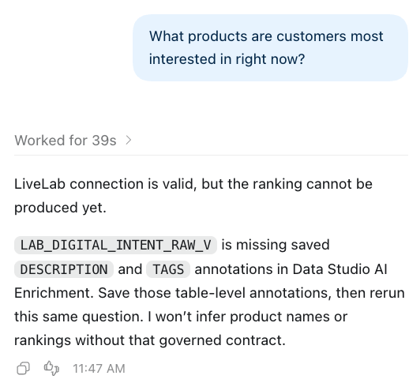

# Lab 4: Connect Codex and ask the raw-data question

Estimated Time: 8 minutes

## Introduction

Codex is connected through the project-scoped LiveLab MCP server. It is not
given a database administrator account. The MCP launcher does not need the
Azure or Databricks secret: those are stored in database-owned credentials.
The first question is intentionally simple. The correct answer
is not a ranking: raw fields alone do not define what customer interest means.

### Objectives

In this lab, you will:

* connect a clean laptop to the prepared Data Studio environment;
* prove the MCP session is connected as PEAKGEAR&#95;USER; and
* see Codex stop rather than invent a business definition.

### Prerequisites

* Labs 2 and 3 are complete.
* Codex Desktop is installed and signed in.
* You have the database-specific URL copied in Lab 2 and the **Database User**
  and **Database Password** from your active LiveLabs **Environment Details**.

## Task 1: Set up LiveLab MCP

1. **Download the Starter Kit.** Click
   <a href="../downloads/peakgear-livelab-starter-kit.zip" download="peakgear-livelab-starter-kit.zip"><strong>Download Here — PeakGear LiveLab Starter Kit (.zip)</strong></a>.
   Save it in **Downloads** as `peakgear-livelab-starter-kit.zip`. Keep the ZIP;
   you will unpack it in Terminal. If the browser adds `(1)` or another suffix,
   rename the downloaded file to the exact name above before continuing.
   There is only one Starter Kit.

2. **Open Terminal.** Press **Command-Space**, type **Terminal**, and press
   **Return**. Keep this Terminal window open for the following steps.

3. **Unpack the ZIP and prepare the project folder.** Copy this entire block
   into Terminal using **Copy**, then press **Return**:

~~~sh
<copy>
cd "$HOME/Downloads"
PEAKGEAR_KIT_DIR="$(mktemp -d "$HOME/Downloads/peakgear-starter.XXXXXX")"
ditto -x -k "peakgear-livelab-starter-kit.zip" "$PEAKGEAR_KIT_DIR"
mkdir -p "$HOME/Documents/peakgear-livelab"
cd "$PEAKGEAR_KIT_DIR/starter-kit"
</copy>
~~~

   You are now in the extracted `starter-kit` folder. A fresh extraction keeps
   older downloaded copies unchanged.

4. **Have the database-specific URL ready before running setup.** Use the
   HTTPS origin copied in **Lab 2, Task 3** from your assigned database's
   Database Actions URL. It must end in **oraclecloudapps.com**, without an
   `/ords/...` path. If you did not copy it yet, complete that task now.

   Keep your LiveLabs **Reservation Information → Environment Details** open
   for the **Database User** and **Database Password**. No ADMIN login or SQL
   lookup is needed. Do not use the OCI login password, a URL from a screenshot,
   datastudio.oracle.com, localhost:8000, or the Operations database listener.

5. **Run setup.** Return to the same Terminal window. Paste this command and
   press **Return**:

~~~sh
<copy>
zsh ./01-setup-peakgear-mcp.command
</copy>
~~~

   Wait while setup installs the required packages. Do not run extra install
   commands. Setup does not require your Mac administrator password.

6. **Answer the setup prompts in order.**

   | Prompt | What to do |
   |---|---|
   | Lab Data Studio URL | Paste the actual database-specific HTTPS origin copied in Lab 2, then press Return. Do not use localhost:8000. |
   | Password for PEAKGEAR&#95;USER | Copy Database Password from LiveLabs Reservation Information → Environment Details. Paste it into Terminal, then press Return. Nothing appears while you type or paste; this is normal. |
   | Finder folder picker | Open Documents, select peakgear-livelab, then click Choose. This is the folder created in step 3. |
   | Success / Press Return to close this window | Confirm the displayed URL and PEAKGEAR&#95;USER, then press Return. |

   Use your reservation's **Database Password**, not its OCI Login Credentials
   password, a screenshot's example, or your Mac password.

7. **Open the project in Codex.** After setup finishes, run this in Terminal:

~~~sh
<copy>
open -a Codex "$HOME/Documents/peakgear-livelab"
</copy>
~~~

   Click **Trust** if Codex asks whether you trust this project.

8. **Create one new Codex task in that project.** LiveLab starts automatically
   for the new task. Continue with Task 2 below. Do not reuse an older task or
   add an MCP server manually.

The setup stores the connection password in the local macOS Keychain. It does
not write that password or source tokens into the generated project
configuration. The event values are intentionally documented in the workshop.

> Keep the whole extracted `starter-kit` folder. Both numbered scripts and the
> supporting files belong to the same kit. You do not need to edit TOML or
> install Python or uv manually.

## Task 2: Establish the MCP boundary

Paste this once into the new Codex task:

~~~text
<copy>
You are the PeakGear business analyst.

For every business question, use only the MCP tools from the LiveLab server.
Before calling any other LiveLab tool, call adp_get_connection_info.
Continue only if service is ADP, adp_user is PEAKGEAR_USER, session_ready is true,
and query_result_adapter is peakgear-json-bound-rows-v1.
Also confirm adp_url matches the database-specific URL I configured for this reservation.
If a check fails, stop and report the mismatch.

Use only PEAKGEAR_USER objects. Do not list other schemas, credentials,
database links, or catalogs. Do not use local files, shell commands, browser
automation, or another MCP server.

Read saved Data Studio descriptions and tags before answering a business
question. If required business meaning is missing, state exactly what is
missing instead of making an assumption.
</copy>
~~~

The first tool call must be **adp&#95;get&#95;connection&#95;info**. Continue only if its
non-secret response shows:

| Field | Required value |
|---|---|
| service | ADP |
| adp&#95;url | The database-specific URL configured for your current reservation |
| adp&#95;user | PEAKGEAR&#95;USER |
| session&#95;ready | true |
| query&#95;result&#95;adapter | peakgear-json-bound-rows-v1 |

If the URL or database user is wrong, stop and rerun
**01-setup-peakgear-mcp.command** with the current reservation's database URL
and Database Password, then create a new Codex task. A restart alone does not
change the saved connection.

If the identity matches but the session is not ready, open Terminal and run:

~~~sh
<copy>
zsh "$HOME/.local/share/peakgear-livelab/peakgear-livelab-admin.command"
</copy>
~~~

Choose **1 — Start LiveLab cleanly — stop PeakGear LiveLab only**, then create a
new Codex task in the same project. Do not choose the ALL-MCP cleanup options.

## Task 3: Ask the raw-data question

Ask exactly this:

~~~text
<copy>
Which products are customers interested in right now?
</copy>
~~~

Expected result: Codex should explain why it cannot responsibly answer yet. In
particular, LAB&#95;DIGITAL&#95;INTENT&#95;RAW&#95;V does not define:

* whether interest means events, sessions, or customers;
* the grain of one row;
* the period represented by “right now”; or
* a product name to display to a business user.

Do not repair the answer with a hand-written SQL ranking. A confident top-five
list at this stage is the wrong outcome.

### Checkpoint

Codex has proven its PEAKGEAR&#95;USER MCP session and has made a controlled stop
for the raw question.

## Learn More

* [Oracle Data Studio Guide](https://docs.oracle.com/en/cloud/paas/autonomous-database/data-studio-guide/)
* [Codex project configuration and trust](https://learn.chatgpt.com/docs/config-file/config-basic)

## Acknowledgements

* **Author** - Oracle AI Lakehouse workshop team
* **Last Updated By/Date** - Oracle AI Lakehouse workshop team, October 2026
