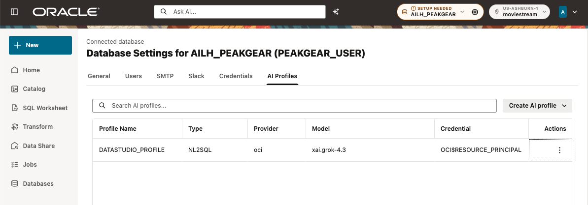

# Lab 2: Sign in as PEAKGEAR&#95;USER

Estimated Time: 5 minutes

## Introduction

The rest of the workshop is performed as PEAKGEAR&#95;USER. This boundary matters:
the user owns the Data Studio metadata, the Unity catalog mount, the Lake Cache
policy, the raw views, and the Analytic Views. ADMIN owns only the shared
infrastructure prepared in Lab 1.

### Objectives

In this lab, you will:

* start a fresh PEAKGEAR&#95;USER session; and
* confirm that Data Studio and the default AI profile are ready.

## Task 1: Sign in again

1. Sign out of the ADMIN Data Studio session.
2. Open the Lab Data Studio URL copied in Lab 1.
3. Sign in as PEAKGEAR&#95;USER with the private lab password.
4. Open **SQL Worksheet**.

Run:

~~~sql
SELECT USER AS database_user,
       SYS_CONTEXT('USERENV', 'CURRENT_SCHEMA') AS current_schema
FROM dual;
~~~

Both values must be PEAKGEAR&#95;USER.

## Task 2: Confirm the prepared AI capability

In **Database Settings**, open the **AI Profiles** tab. Confirm that the
prepared NL2SQL profile uses the OCI Resource Principal. Do not choose
**Create AI profile**, do not change its object list, and do not select
**Create all user permissions**.

Return to SQL Worksheet. **AI Profile ready** confirms the participant session
can use AI Enrichment. If it is absent, stop and ask the instructor to repair
the environment before continuing. The general **SETUP NEEDED** badge may
remain for optional OCI workflows and is not this lab's acceptance check.

### Checkpoint

You are working as PEAKGEAR&#95;USER in a new database session and can see
**AI Profile ready**.

## Learn More

* [Oracle Data Studio Guide](https://docs.oracle.com/en/cloud/paas/autonomous-database/data-studio-guide/)

## Acknowledgements

* **Author** - Oracle AI Lakehouse workshop team
* **Last Updated By/Date** - Oracle AI Lakehouse workshop team, September 2026
