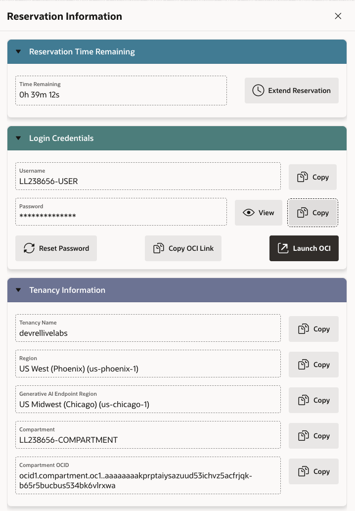
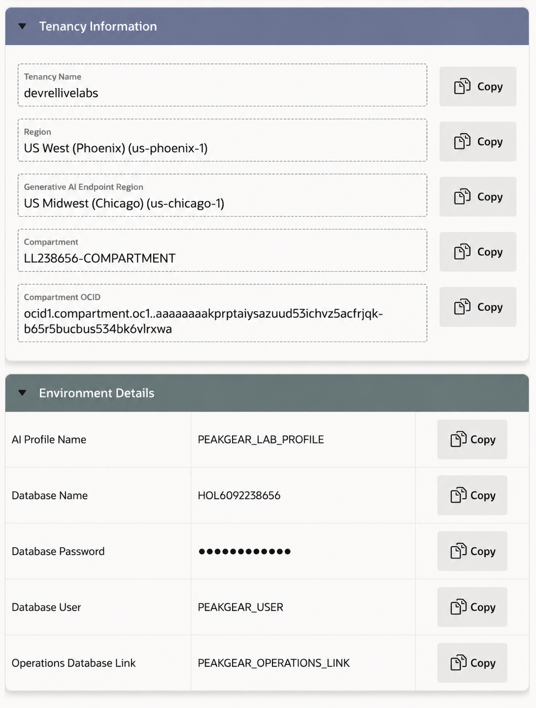

# Lab 2: Connect to your LiveLabs database

Estimated Time: 5 minutes

## Introduction

Your LiveLabs reservation already includes a prepared database, a participant
account, an Operations database link, and an AI profile. Start here: there is
no Lab 1 or participant ADMIN setup. Do not create a user, grant permissions,
create a database link, or create an AI profile.

Use the values from **your own active reservation**, not the example values
in the screenshots. OCI sign-in and database sign-in use different credentials.

### Objectives

In this lab, you will:

* find your assigned environment and credentials in LiveLabs;
* connect Data Studio to your prepared database; and
* obtain the database-specific URL for MCP setup in Lab 4.

### Prerequisites

* An active LiveLabs reservation with a ready environment.
* Codex Desktop installed and signed in before starting Lab 4.
* A Mac with Terminal for the supplied Starter Kit.

## Task 1: Find your reservation details

1. In LiveLabs, open **Reservation Information**. Check **Reservation Time
   Remaining** and extend the reservation if necessary.
2. In **Login Credentials**, use **Copy** beside **Username** and **Password**
   when signing in to OCI. **Launch OCI** opens the OCI Console. These are
   your OCI credentials, not your database credentials.

3. Find **Tenancy Information** and **Environment Details**. Keep this panel
   open throughout the workshop. The following screenshot is an illustrative
   example with the database password redacted, not a set of credentials to use.

   | LiveLabs field | Where you use it |
   |---|---|
   | Login Credentials: Username and Password | OCI Console and OCI sign-in to Data Studio. Do not use these for MCP database login. |
   | Tenancy Name, Region, and Compartment | Find the assigned database in OCI or Data Studio. Use Region, not Generative AI Endpoint Region, to locate it. |
   | Database Name | Select your reserved database, not another participant's database. |
   | Database User and Database Password | Connect to the database in Data Studio and configure MCP. Copy both from Environment Details. |
   | AI Profile Name | Identify the profile already prepared for AI Enrichment. Do not create another profile. |
   | Operations Database Link | Identify the prepared link used to read operational returns in Lab 3. |

   The current workshop expects Database User **PEAKGEAR&#95;USER** and
   Operations Database Link **PEAKGEAR&#95;OPERATIONS&#95;LINK**. If your
   reservation lists different values, ask the instructor before continuing;
   do not substitute credentials from a screenshot.

## Task 2: Connect Data Studio to the assigned database

1. Open [Oracle Data Studio](https://datastudio.oracle.com).
2. Sign in with the **OCI Login Credentials** and **Tenancy Name** from your
   LiveLabs reservation. If you are already signed in to another tenancy,
   switch to the reserved environment.
3. Select the **Region** and **Compartment** from **Tenancy Information**.
   Open **Databases** and find the **Database Name** from **Environment Details**.
4. Open that database's **Actions** menu and choose **Connect**.
5. Enter the **Database User** and **Database Password** from **Environment
   Details**, then click **Connect**. The OCI password is not the database password.
6. Open **SQL Worksheet** and run:

~~~sql
<copy>
SELECT USER AS database_user,
       SYS_CONTEXT('USERENV', 'CURRENT_SCHEMA') AS current_schema
FROM dual;
</copy>
~~~

   Both values must be PEAKGEAR&#95;USER. Also check the connected database
   name in the header against your reservation.

   The AI profile is already provisioned. If needed, review **Database Settings
   → AI Profiles** to find the **AI Profile Name** from your reservation; an
   example reservation uses PEAKGEAR&#95;LAB&#95;PROFILE. Do not create or edit
   a profile or select **Create all user permissions**. If the profile is
   missing or AI Enrichment is unavailable, ask the instructor to repair the
   reservation. The general **SETUP NEEDED** badge can refer to optional OCI
   workflows and is not a request to repeat provisioning.

## Task 3: Copy the database-specific URL for MCP

1. For the same assigned database, open **Database Actions** from its OCI
   database details page. You can reach that page with **Open in OCI Console**
   from the database's Actions menu in Data Studio, or use **Launch OCI** from
   LiveLabs and locate the reserved database.
2. Open its SQL workspace. If prompted for database sign-in, use the
   **Database User** and **Database Password** from Environment Details.
3. Copy the URL from the browser address bar. For MCP, keep only the HTTPS
   origin ending in **oraclecloudapps.com**, without the path, query, or fragment.

   For example, if the browser shows
   **https&#58;//your-assigned-host.oraclecloudapps.com/ords/...**, the MCP URL is
   **https&#58;//your-assigned-host.oraclecloudapps.com**. This is only an example:
   copy the actual host for your reservation. Do not construct it from the
   Database Name, and do not use **datastudio.oracle.com**, **localhost:8000**,
   the OCI Console URL, or the Operations database listener.

4. Keep that database-specific URL and your reservation's Database Password
   ready for Lab 4. Return to Data Studio as the participant database user.

   No ADMIN login or system-view SQL is required. If you cannot open Database
   Actions or obtain the assigned URL, ask the instructor before running setup.

### Checkpoint

Your connected database matches the reservation, the session is
PEAKGEAR&#95;USER, and you have the actual database-specific URL for Lab 4.
Keep Reservation Information open for its database password and profile name.

## Learn More

* [Access and navigate Oracle Data Studio](https://docs.oracle.com/en/cloud/paas/autonomous-database/data-studio-guide/access-and-navigate.html)
* [Work with database connections and resources](https://docs.oracle.com/en/cloud/paas/autonomous-database/data-studio-guide/work-database-connections-and-resources.html)

## Acknowledgements

* **Author** - Oracle AI Lakehouse workshop team
* **Last Updated By/Date** - Oracle AI Lakehouse workshop team, October 2026
