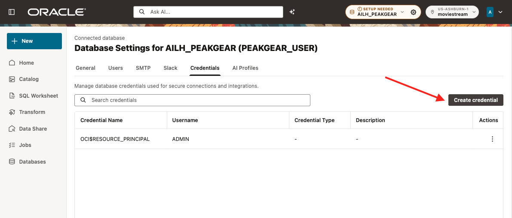
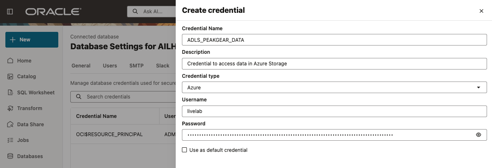
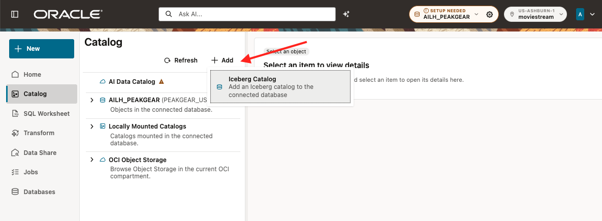
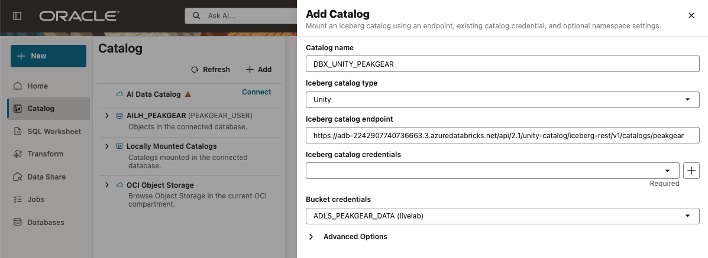
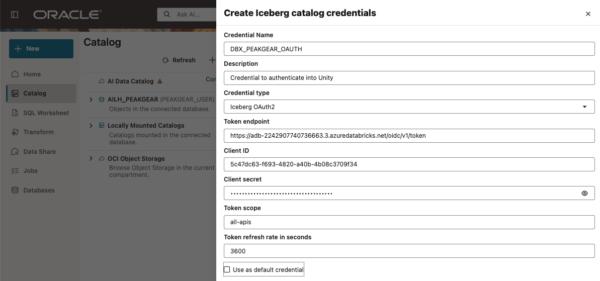
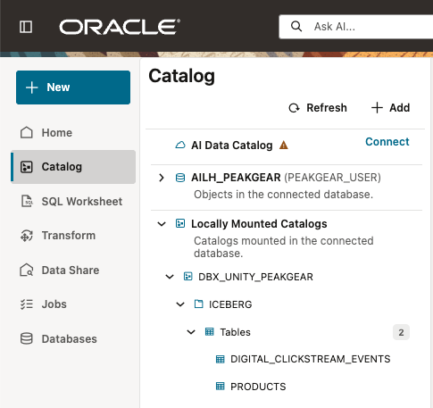

# Lab 2: Connect real sources

Estimated Time: 15 minutes

## Introduction

PeakGear connects two live systems:

* Databricks Unity Catalog supplies the Iceberg product catalog and digital
  clickstream events.
* The existing Oracle Operations database supplies return events through the
  public database link already provisioned for your LiveLabs reservation.

You will connect Databricks through the Data Studio UI, verify both live
sources, and create three participant-owned local tables. The tables are
workshop snapshots so later queries do not repeatedly scan remote sources.

### Objectives

In this lab, you will:

* create the Azure storage and Databricks OAuth credentials in Data Studio;
* mount the Databricks Unity Iceberg catalog;
* prove access to the two connected sources; and
* create the three raw business objects used by Codex.

## Task 1: Create the Azure storage credential in Data Studio

Open the connected database's **Settings** (gear icon), then select
**Credentials**. This one-off event includes the shared values for copy/paste;
no separate handout is needed. The complete reference is
[Event lab values](../assets/event-lab-values.md).

| Credential | Purpose | Value type |
|---|---|---|
| ADLS&#95;PEAKGEAR&#95;DATA | Read Iceberg files in Azure Blob Storage | Event Azure storage password |
| DBX&#95;PEAKGEAR&#95;OAUTH | Obtain renewable Unity Catalog access tokens | Databricks OAuth client |

Click **Create credential** and enter:

| Field | Value |
|---|---|
| Credential Name | ADLS&#95;PEAKGEAR&#95;DATA |
| Description | Credential to access data in Azure Storage |
| Credential type | Azure |
| Username | livelab |

Copy this into **Password**:

~~~text
<copy>
tFODcOQJpwaApm/p3wEqAdYIbvq9/N/jlMsbd2EMz6KwAyXps2+7D1TWLOvBQ8fCPOxaCXznM/YD+AStYElH9Q==
</copy>
~~~

Save the credential. Keep the name exactly. Both source credentials must be
owned by PEAKGEAR&#95;USER, not `ADMIN`. Create the OAuth credential in Task 2.

Storage path for this event:

~~~text
<copy>
https://livelab.blob.core.windows.net/digital-demand/peakgear-managed/
</copy>
~~~

## Task 2: Mount the Databricks Unity Catalog

In **Catalog**, click **Add**, then choose **Iceberg catalog**.

Enter:

| Field | Value |
|---|---|
| Catalog name | DBX&#95;UNITY&#95;PEAKGEAR |
| Iceberg catalog type | Unity |
| Iceberg catalog credentials | DBX&#95;PEAKGEAR&#95;OAUTH |
| Bucket credentials | ADLS&#95;PEAKGEAR&#95;DATA |
| Catalog endpoint | Copy the endpoint below |

Copy this into **Iceberg catalog endpoint**:

~~~text
<copy>
https://adb-2242907740736663.3.azuredatabricks.net/api/2.1/unity-catalog/iceberg-rest/v1/catalogs/peakgear
</copy>
~~~

When **Iceberg catalog credentials** is required, click the plus sign and
create the OAuth credential with these values:

| Field | Value |
|---|---|
| Credential Name | DBX&#95;PEAKGEAR&#95;OAUTH |
| Description | Credential to authenticate into Unity |
| Credential type | Iceberg OAuth2 |
| Token scope | all-apis |
| Token refresh rate in seconds | 3600 |

**Token endpoint**:

~~~text
<copy>
https://adb-2242907740736663.3.azuredatabricks.net/oidc/v1/token
</copy>
~~~

**Client ID**:

~~~text
<copy>
5c47dc63-f693-4820-a40b-4b08c3709f34
</copy>
~~~

**Client secret**:

~~~text
<copy>
dose7b979ac313c1063af5d4cdf09b1ee8fb
</copy>
~~~

Return to the catalog form, select DBX&#95;PEAKGEAR&#95;OAUTH, save the mount, and
refresh its catalog metadata. The catalog must expose the `ICEBERG` schema with
`PRODUCTS` and DIGITAL&#95;CLICKSTREAM&#95;EVENTS.

The UI is the normal workshop path. For a SQL-only dry run of Tasks 1 and 2,
use [01-connect-event-sources.sql](../scripts/01-connect-event-sources.sql).
It uses the owner-confirmed working mount calls and event values. Run it as
PEAKGEAR&#95;USER, only for missing credentials or a missing catalog; do not
recreate a mount that already works. The required host ACL is already
provisioned for PEAKGEAR&#95;USER. If access is denied, ask the instructor;
participants must not grant ACLs or switch to ADMIN.

## Task 3: Prove the two live sources

Open SQL Worksheet as PEAKGEAR&#95;USER. Copy and run **each block separately**;
Run SQL executes the current statement, not every statement in a pasted script.

~~~sql
<copy>
SELECT *
FROM iceberg.products@dbx_unity_peakgear
FETCH FIRST 5 ROWS ONLY;
</copy>
~~~

~~~sql
<copy>
SELECT *
FROM iceberg.digital_clickstream_events@dbx_unity_peakgear
FETCH FIRST 5 ROWS ONLY;
</copy>
~~~

~~~sql
<copy>
SELECT *
FROM customer_return_events@peakgear_operations_link
FETCH FIRST 5 ROWS ONLY;
</copy>
~~~

Each query should return up to five sample rows. This confirms that you can
read the source without running a full row count. The prepared lab sources
should contain data; if a query returns no rows or an error, ask the instructor
to check the source before continuing. A sample does not prove product-key
uniqueness; that check runs against the local product table before analytics.

On a new reservation, create the three raw, participant-owned tables by running
**each block separately**. Each `CREATE TABLE AS SELECT` can take time while it
copies source rows. Wait for the worksheet to report completion before starting
the next block. If you are resuming on the same database and a table already
exists, verify it in Catalog instead of recreating it. Do not replace a table
after saving its annotations in Lab 4. If an older run left `*_RAW_V` views in
the schema, leave them alone; this version uses the new `*_RAW_T` tables and
requires fresh table annotations in Lab 4.

~~~sql
<copy>
CREATE TABLE lab_products_raw_t AS
SELECT product_id,
       product_name,
       category AS category_name
FROM iceberg.products@dbx_unity_peakgear;
</copy>
~~~

~~~sql
<copy>
CREATE TABLE lab_digital_intent_raw_t AS
SELECT product_id,
       session_id,
       customer_id,
       CAST(event_ts AS TIMESTAMP) AS event_ts
FROM iceberg.digital_clickstream_events@dbx_unity_peakgear;
</copy>
~~~

~~~sql
<copy>
CREATE TABLE lab_returns_raw_t AS
SELECT product_id,
       store_id,
       return_qty,
       CAST(return_created_at AS TIMESTAMP) AS return_created_at
FROM customer_return_events@peakgear_operations_link;
</copy>
~~~

In Catalog, check **Tables** under PEAKGEAR&#95;USER for all three names. The
tables are local copies at the time the statements ran; they do not refresh
automatically. They do not yet add business definitions. Open **Sample Data**
for each table and confirm that rows are present after creation completes.
Later labs use these local snapshots through Data Studio and the bounded MCP
server. Before joining product labels, MCP checks the local product table for
duplicate product keys. If duplicates are reported, ask the instructor to
investigate; do not deduplicate arbitrarily or invent a product mapping.

### Checkpoint

You can read both Iceberg tables and the Operations return table. The three
raw lab tables exist under PEAKGEAR&#95;USER.

## Learn More

* [Oracle Data Studio Guide](https://docs.oracle.com/en/cloud/paas/autonomous-database/data-studio-guide/)

## Acknowledgements

* **Author** - Oracle AI Lakehouse workshop team
* **Last Updated By/Date** - Oracle AI Lakehouse workshop team, October 2026
