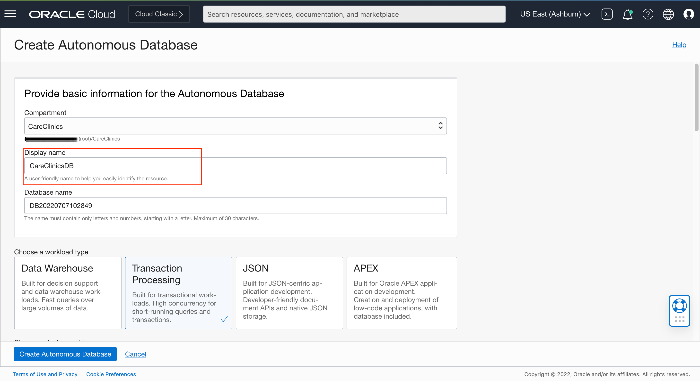
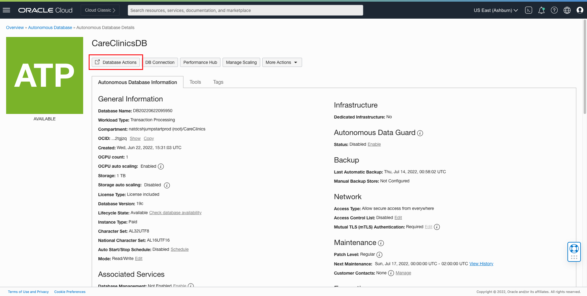
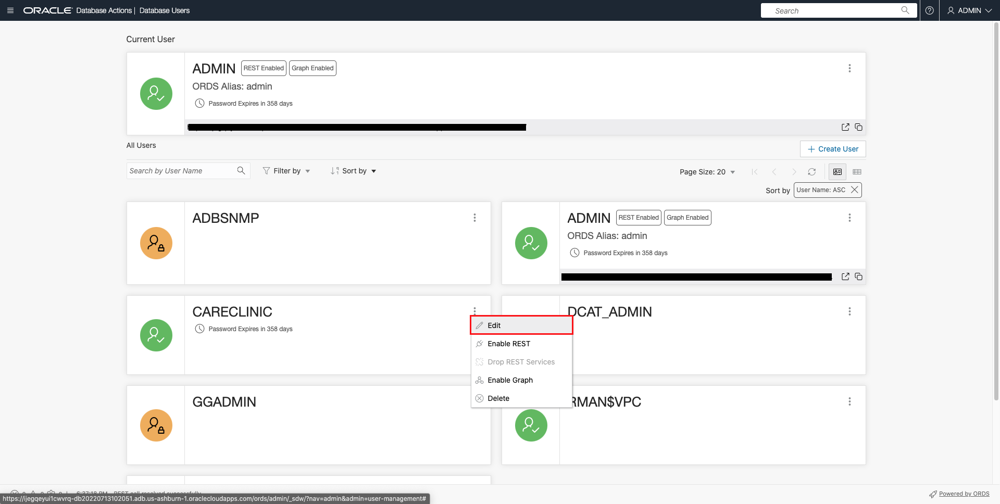
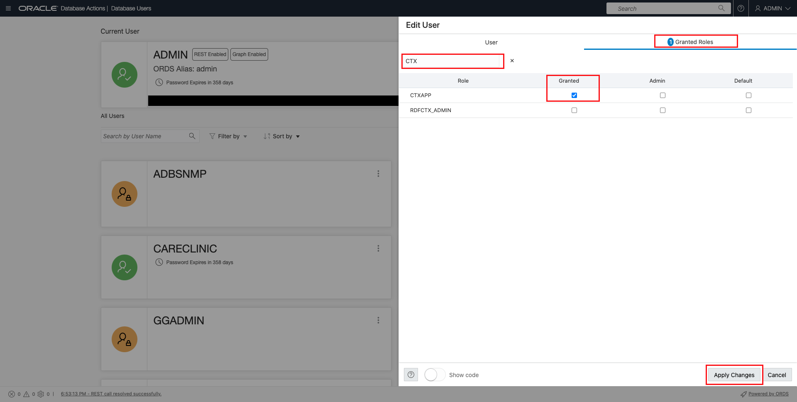
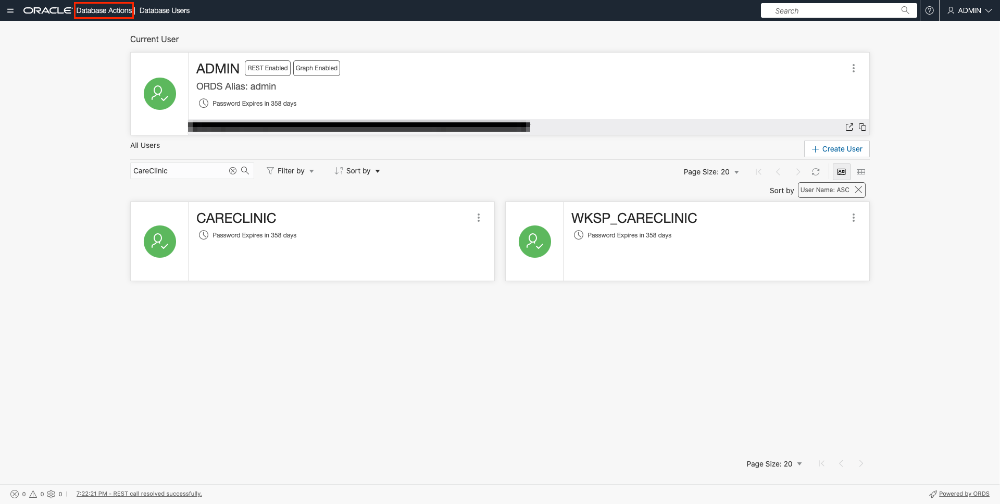
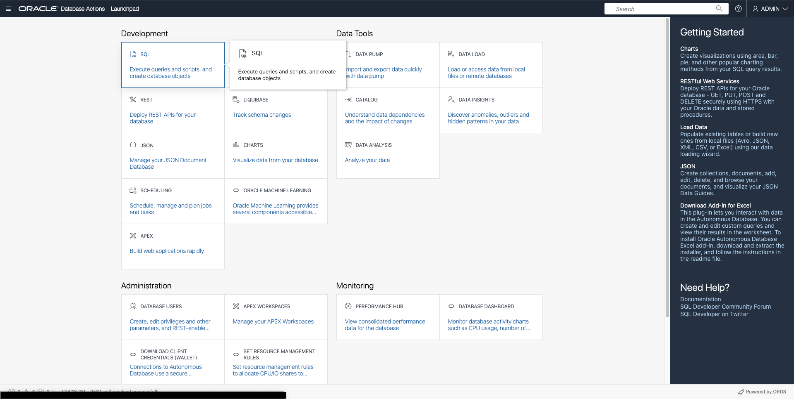
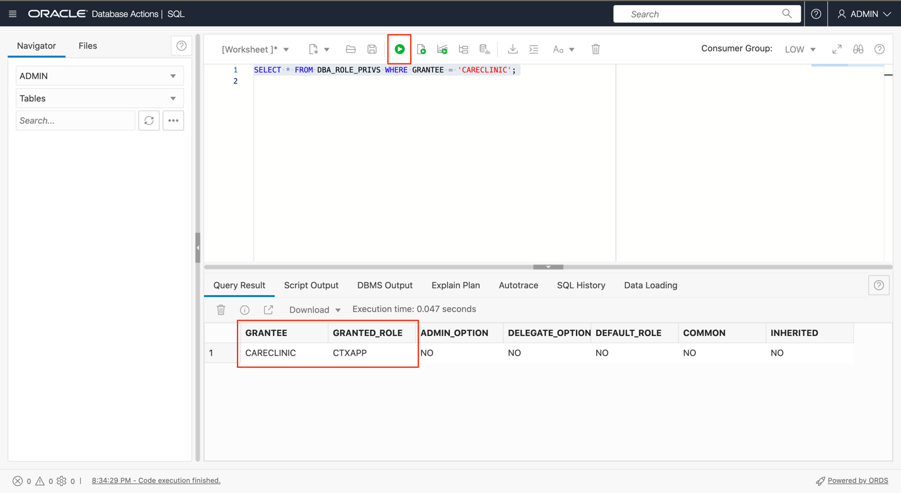
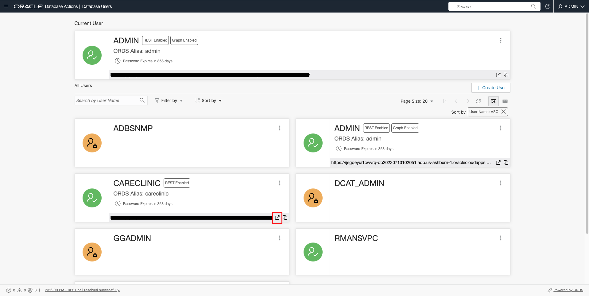
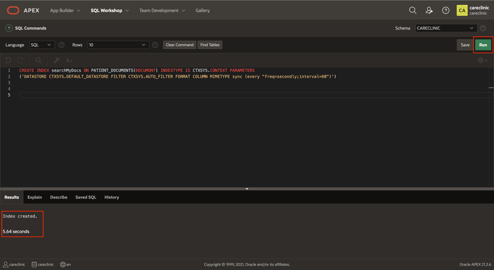

<!-- Updated September 11th, 2022 -->

# Low code development with advanced textual analysis in ATP


## Task 2: Create a compartment

1. Compartments are the primary means to organize, segregate, and manage access to OCI resources.  Every tenancy has a root compartment under which you create additional sub-compartments and sub-sub compartments (maximum six levels deep).  Compartments are tenancy-wide across regions. When you create a compartment, it is available in every region that your tenancy is subscribed to. You can get a cross-region view of your resources in a specific compartment with the tenancy explorer. See [Viewing All Resources in a Compartment](https://docs.oracle.com/en-us/iaas/Content/General/Concepts/compartmentexplorer.htm#Viewing_All_Resources_in_a_Compartment).  We will create a compartment called **CareClinics** for this course/workshop and create all related services in this compartment.  Navigate to the menu in the upper left and select Identity and Security, and then Compartments.

    

    

    Create the new compartment.

    

    


## Task 3: Create autonomous transaction processing database
1.  Login to your Oracle Cloud Tenancy and open the side menu

    
    

2.  Navigate Autonomous Transaction Processing

    
    

3.  Select the correct compartment (Ex: Care Clinic) and click **Create an Autonomous Database**

    
    

4.  Give a preferred Display Name (Ex: CareClinicsDB) and click **Transaction Processing** for the workload type

    
    

5.  Create the ADMIN password for the DB, following the database password requirements. Leave everything else as default

    **Note:** Make sure to save this password, you will need it later in this lab

    
    

6.  Click **Create Autonomous Database**

    
    

7.  Database provisioning will take about 5 minutes. Once the Lifecycle State is ***Available***, you can continue to the next task

    
    

## Task 4: Create an APEX workspace
1.  Under Tools, click **Oracle APEX**

    
    

2.  Enter ADMIN password (Step 5) and sign in

    
    

3. Create a new Workspace

    
    

4. Create a Database User and new password for this user (Ex: CareClinic)

    **Note:** Make sure to save this database user/password, you will need it later

    
    

5. After creating the workspace, click **CARECLINIC** to sign out of the admin(internal) workspace and into the workspace that you have just created

    
    

## Task 5: Upload sample data 

1. Enter password for new database user (Ex: CareClinic) and sign into the workspace

    
    

2. This is the oracle apex workspace running on the database you created earlier. Let's visit the SQL Workshop!

    
    

3. Inside the SQL Workshop > Object Browser to view any objects in the database. 

    **Note:** It should be empty i.e no tables currently in the database. Uploading a DDL script will create the table structure you need, and then you can inset the data from .csv files

    
    

4. Go to SQL Scripts and upload the contents of the [file](https://objectstorage.us-ashburn-1.oraclecloud.com/p/jyHA4nclWcTaekNIdpKPq3u2gsLb00v_1mmRKDIuOEsp--D6GJWS_tMrqGmb85R2/n/c4u04/b/livelabsfiles/o/labfiles/Create_Tables.sql). This will build the table structure of the tables required. 


    
    

5. Upload the script

    
    

6. Once uploaded, run the script

    
    

7. Ensure the statements are processed with no errors 
    
    

8. Return to the object browser. You are now able to view all 8 tables that were just created in the object browser. Now you will need to upload the data into them

    
    

9. Click **Load Data** and upload the respective .csv file for HEALTHCARE\_FACILITY. The full data set can be found [here].(https://objectstorage.us-ashburn-1.oraclecloud.com/p/jyHA4nclWcTaekNIdpKPq3u2gsLb00v_1mmRKDIuOEsp--D6GJWS_tMrqGmb85R2/n/c4u04/b/livelabsfiles/o/labfiles/CareClinicData.zip)

    
    

10. Repeat this step for 5 more tables. All settings can be left as default. (Exclude the **PATIENT\_DOCUMENTS** and the **PATIENT\_INSURANCE** tables)

    **Note:** After each load, click view table to return to the object browser

    ­­

11. There should now be data in 6/8 tables

    
    

12. Let's create a new application using the Healthcare\_Facility Table

    
    

13. Give your application a name, and click create application. Delete dashboard page by clicking edit and deleting that entry. You can leave everything else as default!

    
    

14. Run the application and sign in with your database user (Step 11)!

    
    

15. These are two sample pages created for you that show the **Health Care Facility** table. Let's click Application 100 and create a page to upload our sample documents to our **Patients Documents** Table

    
    

## Task 6: Add pages to application

1. Create new Page!

    **Note:** This is on version APEX 22.1, it may look slightly different to the current version

    
     

2. Select **Classic Report**

    
    

3. Select **Include Form Page** and give both the classic report and form page unique names. Select the source for this report as the **PATIENT\_DOCUMENTS** table

    **Note:** Its important to note that the report and form are being created on pages 5 and 6 respectively. These will be referenced later in this lab.

    
    

4. Keep the Primary Key Column as ID(Number)

    
    

5. Let's hide some columns we do not want showing in the report. You can Ctrl/Cmd+Click these columns and change their type to Hidden Column

    
    

6. Select the DOCUMENT Column and in the right side panel change the **Mime Type**, **Filename Column**, and **Last Updated Column** to match the columns in our **Patient\_Documents** table!

    **Note:** Don't forget to save!

    
    

7. You will need to repeat the same steps for the form page (Page 6). Change the unwanted columns to type **Hidden**

    
    

8. Select the **P6\_Documents** page item, and change the **MIME Type Column**, **Filename Column**, and **BLOB Last Updated Column**, and Save. 

    **Note:** You will need to type these out to match exactly to the database columns.

    
    

9. Let's create a Popup LOV on our **P6\_PATIENT\_VISIT\_ID**. This will help you assign the correct **Patient Visit ID** for the documents you are going to upload.

    
    

10. Scroll down and change the Type to **SQL Query** and add this query under. 
 
    ```
    <copy>
    Select PV.PATIENT_VISIT_ID || ' - ' || P.FIRST_NAME || ' ' || P.LAST_NAME d, PATIENT_VISIT_ID r from PATIENT_VISIT PV, PATIENT P where PV.PATIENT_ID = P.PATIENT_ID
    </copy>
    ```

    
    

11. Go back to Page 5 and run the application 

    **Note:** Modal Pages cannot be run directly from the page designer, for example Page 6

    
    

12. Sign into the application, if prompted, and click **Create** to inset new record into Patient\_Documents Table. All sample documents can be found [here] (https://objectstorage.us-ashburn-1.oraclecloud.com/p/jyHA4nclWcTaekNIdpKPq3u2gsLb00v_1mmRKDIuOEsp--D6GJWS_tMrqGmb85R2/n/c4u04/b/livelabsfiles/o/labfiles/Patient_Documents.zip)

    
    

13. Upload all 6 PDF documents ensuring that the **Patient Visit ID** matches the document name that is being uploaded

    
    

14. Now there will be 6 documents in the Patient\_Document Table. 

    
    

15. This will also be reflected in the SQL Workshop -\> Object Browser -\> Patient\_Document !

    
    

## Task 7: Explore Oracle Text

1. Return to the Cloud Console, and inside the ATP DB you created, click **Database Actions**

    
    

2. Click Database Users!

    
    

3. Edit the new user you have created Ex: CareClinic

    
    

4. Under Granted Roles, search for "CTX" and check "CTXAPP" and apply changes

    
    

5. In order to verify the role was granted, return to Database Actions

    
    

6. Under Development, click **SQL**

    
    

7. Execute the following query, ensuring to change the statement to match your database user that was created in Task 2 

    ```
     <copy>
    Select * From DBA_ROLE_PRIVS WHERE GRANTEE = 'CARECLINIC';
     </copy>
    ```

    
    

8. Return to **Database Actions**, and click into **Database Users**. Enable REST on the Database User you created by clicking the more actions and enabling rest

    
    

9. Open a new window by clicking below and sign in with the user that was created (Step 11)

    
    

10. Open SQL Web Developer

    
    

11. Enable REST on both **PATIENT** and **PATIENT\_INSURANCE** tables by right clicking them. Leave all settings as default!

    
    

12. Ensure are both tables now have REST Enables, you will need this later for the other labs

    
    

13. Now visit the APEX workspace. Go to **SQL Commands** under SQL Workshop

    
    

14. Create an Index on the Patient\_Documents Table, where the visit summaries are stored

    ```
     <copy>
    CREATE INDEX searchMyDocs ON Patient_Documents(Document) INDEXTYPE IS CTXSYS.CONTEXT PARAMETERS ('DATASTORE CTXSYS.DEFAULT_DATASTORE FILTER CTXSYS.AUTO_FILTER FORMAT COLUMN MIMETYPE sync (every "freq=secondly;interval=60")')
     </copy>
    ```

    
    

15. Run the following query utilizing Oracle Text. Oracle Text returns all documents (previously indexed) that satisfy the expression along with a relevance score for each document. You can use the scores to order the documents in the result set. If you would like to read more about Oracle Text, more information can be found <a href="https://docs.oracle.com/en/database/oracle/oracle-database/21/ccapp/understanding-oracle-text-application-development.html#GUID-CF13C01A-F5E6-4EF5-839B-C09CF0024D5E">here</a>

    In this first example we are looking for all documents who have the work MRN inside the after visit summary. The CONTAINS operator must always be followed by the > 0 syntax, which specifies that the score value returned by the CONTAINS operator must be greater than zero for the row to be returned.

     ```
     <copy>
    SELECT SCORE(1), ID,PATIENT_VISIT_ID,  TITLE, CREATED_BY  FROM PATIENT_DOCUMENTS WHERE CONTAINS(DOCUMENT, 'MRN', 1) > 0;
     </copy>
    ```

    
    

16. Find all documents that have the word ABC with a score \> 1 and also contains the word Medical Center.

    ```
     <copy>
    SELECT SCORE(1), ID,PATIENT_VISIT_ID,  TITLE, CREATED_BY   FROM PATIENT_DOCUMENTS WHERE CONTAINS(DOCUMENT, '(ABC > 1) and Medical Center', 1) > 0;
     </copy>
    ```

    
    

17. This is a proximity search to look for the word ADULT near the word EXERCISES

    ```
     <copy>
    SELECT SCORE(1), ID,PATIENT_VISIT_ID,  TITLE, CREATED_BY   FROM PATIENT_DOCUMENTS WHERE CONTAINS(DOCUMENT, 'near((ADULT, EXERCISES), 5)', 1) > 0;
     </copy>
    ```

    
    

18. Fuzzy Search on a term, this gives the ability to find the work medications in the document without correct spelling. !

    ```
     <copy>
    SELECT SCORE(1), ID,PATIENT_VISIT_ID,  TITLE, CREATED_BY   FROM PATIENT_DOCUMENTS WHERE CONTAINS(DOCUMENT, '?medicatis\', 1) > 0;
     </copy>
    ```

    
    

19. Soundex Search on a term, giving the ability to find words that sound like the term provided, in this case "pressure". 

     ```
     <copy>
    SELECT SCORE(1), ID,PATIENT_VISIT_ID,  TITLE, CREATED_BY   FROM PATIENT_DOCUMENTS WHERE CONTAINS(DOCUMENT, '!prissuer', 1) > 0;
     </copy>
    ```

    
    

20. Stem search on a term. For example if we are looking for documents with that stem of Journal, then it will return words like "journaling"

     ```
     <copy>
    SELECT SCORE(1), ID,PATIENT_VISIT_ID,  TITLE, CREATED_BY   FROM PATIENT_DOCUMENTS WHERE CONTAINS(DOCUMENT, '$journal', 1) > 0;
     </copy>
    ```

    
    

21. Accumulation Search on two or more terms. This is looking for both terms in the document and assigning a score. Higher if both terms are present.!

     ```
     <copy>
    SELECT SCORE(1), ID,PATIENT_VISIT_ID,  TITLE, CREATED_BY   FROM PATIENT_DOCUMENTS WHERE CONTAINS(DOCUMENT, 'medications ACCUM Medical', 1) > 0 order by Score(1) desc;
     </copy>
    ```

    
    

22. You can also weight each term as seen here. The word physical carries 3x the weight of the work exercises. 

    ```
     <copy>
    SELECT SCORE(1), ID,PATIENT_VISIT_ID,  TITLE, CREATED_BY   FROM PATIENT_DOCUMENTS WHERE CONTAINS(DOCUMENT, 'exercises ACCUM physical*3', 1) > 0 order by score(1) desc;
     </copy>
    ```

    
    

23. Those are some of the basic queries within Oracle Text. 

    Construct Themes Tables: To build themes for your documents you will first need to create a table to hold the themes. Run each statement individually by highlighting the the statement then click Run.

    ```
    <copy>
    create table themes (query_id number, theme varchar2(2000), weight number);
    </copy>
    ```
  
   

24. Create Themes index for the documents currently in the PATIENT\_DOCUMENTS table

    ```
    <copy>
    begin
	for x in (select ID from PATIENT_DOCUMENTS) loop
    ctx_doc.themes ('searchMyDocs', x.ID, 'themes', x.ID, full_themes => false);
    end loop;
    end;
    </copy>
    ```

    
    

25. Query all themes. Show all themes with weight over 25

    ```
     <copy>
	select r.title, r.filename, t.theme, t.weight from PATIENT_DOCUMENTS r, themes t
    where r.id = t.query_id and weight > 25
    order by id asc;
     </copy>
    ```

    
    

26. Repeat for the Gist Table. 

    **Note:** Run each of the 3 statements individually

    ```
     <copy>
	create table gists (query_id  number, pov  varchar2(80), gist  CLOB);
     </copy>
    ```
    ```
    <copy>
	begin
	for x in (select ID from PATIENT_DOCUMENTS) loop
    ctx_doc.gist('searchMyDocs', x.ID, 'gists',x.ID,'P', pov =>'GENERIC');
    end loop;
    end;
     </copy>
    ```
    ```
     <copy>
	select * from gists;
     </copy>
    ```
    
    

27. Repeat for the Filtered Docs Table

    **Note:** Run each of the 3 statements individually

    ```
     <copy>
    create table filtered_docs(QUERY_ID number, DOCUMENT clob);
     </copy>
    ```
    ```
    <copy>
	begin
	for x in (select ID from PATIENT_DOCUMENTS) loop
    	ctx_doc.filter ('searchMyDocs', x.ID, 'filtered_docs', x.ID, plaintext => true);
    end loop;
    end; 
     </copy>
    ```
    ```
    <copy>
	select r.title, f.document as "Plain Text Summary" from PATIENT_DOCUMENTS r, filtered_docs f
    where r.ID = f.query_id
     </copy>
    ```

    
    

28. Finally repeat for the Full Themes tables
    
    **Note:** Run each of the 3 statements individually

    ```
    <copy>
    create table full_themes( QUERY_ID	number, THEME   varchar2(2000),WEIGHT   NUMBER);
    </copy>
    ```
    ```
    <copy>
	begin
	for x in (select ID from PATIENT_DOCUMENTS) loop
    	ctx_doc.themes ('searchMyDocs', x.ID, 'full_themes', x.ID, full_themes => true);
    end loop;
    end; 
    </copy>
    ```
    ```
    <copy>
	select r.title, r.filename, t.theme, t.weight from PATIENT_DOCUMENTS r, full_themes t
    where r.ID = t.query_id
    order by ID asc;
    </copy>
    ```

    
    

29. We can verify all 4 tables were created by visiting the Object Browser

    
    

## Task 8: Implement Oracle Text for End Users

1. Now let's create a new page to let end users view document gists with 1 click. Create Page, and select **Classic Report**

    
    

2. Give the Classic Report a name, and select Modal Dialog, this will allow the page to be a pop-up instead of a redirect. Finally select the source as SQL Query and enter the query as shown

    ```
    <copy>
	select * from gists where query_id = :P7_QUERY_ID;
    </copy>
    ```
    **Note:** Ensure that this new page is page number 7 in-order for the query to populate properly

    

3. On the new page, rename the Title of the content body on the right pane to 
    **&P7_Title. Gist**.
    Create two page items, **P7\_QUERY\_ID** and **P7\_TITLE**, by right-clicking on the content body region, and selecting **Create Page Item**

    
    

4. Set the Type of both new page items to **Hidden**

    
    

5. Save and return to page 5 by using the page navigation. Right-Click Columns and **Create Virtual Column** on your report

    
    

6. While Selecting the new virtual column you created, change the Heading to **Document Gist**. Under Link, click **No Link Defined** to define a new link for this virtual column. Set the link to page 7. Under Set Items, ensure you add both **P7\_Query\_ID** and **P7\_TITLE**, with values of **\#ID\#** and **\#TITLE\#** respectively. Note: Use the menu to the right of the text box makes this easier.

    
    

7. Add a Link Text by expanding the menu and selecting any of the default options shown.

    
    

8. Save and Run the application. Test this new feature by clicking on the pencil icon under Document Gist.

    
    

9. You now have a gist of the PDF documents with just one click. Now lets see how we can replicate this to add Filtered Docs in plain text to the table as well.

    
    

10. Navigate to Page 7 using the development tool bar below. Choose the "+" icon and select Page as Copy. Select **Page in this application**

    
    

11. Select the new page as page 8, and provide a new page name. On the next page select **Do not associate with a navigation menu entry**

    
    

12. Give the Page Region a new name and copy

    
    

13. You now have a new page (Page 8) where you can alter the SQL query to reflect that of Full Text. Let's create another virtual column link to this page

    ```
    <copy>
	select r.title, f.document as "Plain Text Summary" from PATIENT_DOCUMENTS r, filtered_docs f
    where r.ID = f.query_id and f.query_id = :P8_QUERY_ID;
    </copy>
    ```

    

14. Save and return to Page 5. Right- Click columns and Create Virtual Column

    
    

15. Make changes similar to before in step 6. Set the link to page 8. Under Set Items, ensure you add both **P8\_Query\_ID** and **P8\_TITLE**, with values of **\#ID\#** and **\#TITLE\#** respectively.

    
    

16. Change the link text to a default icon. Save and run the page

    
    

17. By clicking the magnifying glass icon we can see the full text for that individual document

    
    

Congratulations! You have successfully completed this lab.


