#  Dynamic Scaling Autonomous Transaction Process CPUs

## Introduction

In this lab, you will dynamically scale the number of OCPU resources available to a an Autonomous Transaction Processing (ATP) instance. Use an open source load generator, Swingbench, you will see how ATP dynamically scales up as a result of manually adding additional OCPU resources.

## Task 1: Install Swingbench on your local PC (shell)

1. Open a shell on your local PC, for example Git Bash.

2. Check that you have Java installed:

    ```
    <copy>java -version</copy>
    ```

    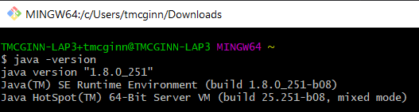

    If you don't have Java Runtime version 8 or later, please download and install Java first.

3. Download the latest version of Swingbench from [here](https://www.dominicgiles.com/swingbench/swingbenchlatest.zip).

4. Unzip Swingbench in the local folder:

    ```
    <copy>
    unzip swingbenchlatest.zip
    </copy>
    ```

     

## Task 2: Create ATP instance in OCI and Configure Swingbench on Compute instance to generate load traffic

*In this section we will create a ATP instance in OCI. We will initially create this instance with only 1 OCPU and scale it after generating load test from the compute instance created earlier*

1. Switch to OCI console, from services menu Click **Autonomous Transaction Processing** under Oracle Database.

2. Select your compartment. <if type="livelabs">Your compartment should begin with the username you logged in with. Do not select the root compartment. </if>Leave Transaction Processing selected. Click **Create Autonomous Database**.

3. Fill out the dialog box:

    - DISPLAY NAME: Provide a name <if type="livelabs">- to ensure you have create a unique name, prepend the name with you username, for example "LL-234-DB"</if>
    - DATABASE NAME: Provide a name <if type="livelabs">- to ensure you have create a unique name, prepend the name with you username, without any hyphens, for example "LL234DB"</if>
    - Choose a Workload type: Transaction Processing
    - Choose a Deployment type: Shared Infrastructure

    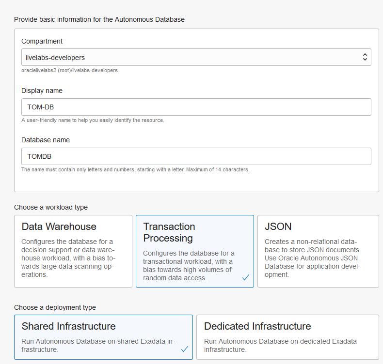

    Under **Configure the database**

    - Always Free: Leave Default
    - Choose database version: Leave Default
    - OCPU count: 1
    - Auto Scaling: Make sure flag is Un-checked

    Under **Create administrator credentials**

    - Username: ADMIN (default)
    - Password: Provide a password (For example : AAbbcc123456 **Do not use &,!, in the password due to script limitation that we will execute later.**)
    - Confirm Password: Confirm the password provided

    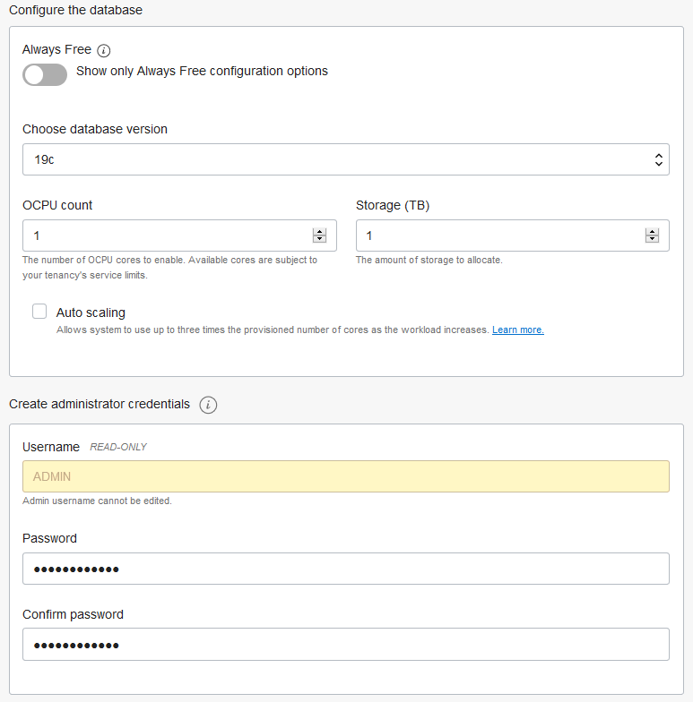

    Under **Choose network access**

    - Allow secure access from anywhere: Make sure this option is checked
    - Configure access control rules: Leave default (unchecked)

    Under **Choose a license type**.

    - License Included: Check this option

    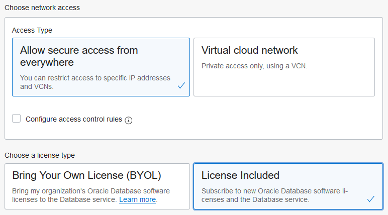

4. Click **Create Autonomous Database**. Wait for State to change to Available (few minutes).

5. Once Database is in running state, click **DB Connection**.

    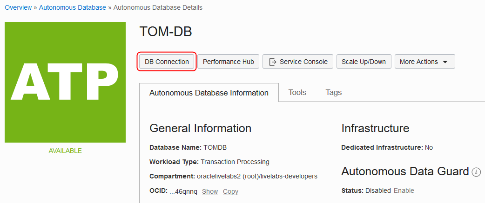

6. In the pop up window under **Wallet Type** choose **Instance Wallet**. Click **Download Wallet**. Provide a password (you can use the same password as the one used to create the instance , AAbbcc123456).

    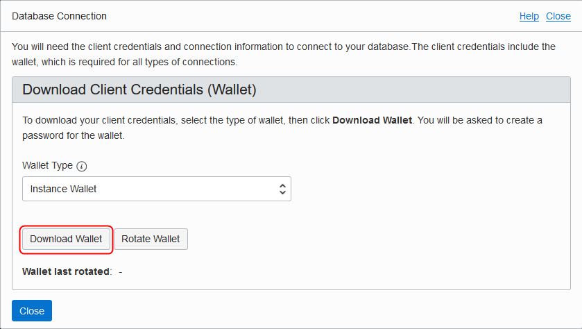

7. Save the file and Note down the directory name where the file was saved.

8. In your Git Bash shell, change directories to where you unzipped swingbench/bin:

    ```
    <copy>
    cd <directory>/swingbench/bin
    </copy>
    ```

9. Enter below commands, replacing the value in < >.
(This will install a schema to run our transactions against)

    ```
    <copy>
    ./oewizard -cf <CREDENTIAL_ZIP_FILE> -cs <DB_NAME>_medium  -ts DATA -dbap <DB_PASSWORD> -dba admin -u soe -p <DB_PASSWORD> -async_off -scale 0.1 -hashpart -create -cl -v
    </copy>
    ```

    **For Example:**
    ./oewizard -cf ~/Downloads/Wallet\_TOMDB.zip -cs TOMDB\_medium -ts DATA -dbap AAbbcc123456 -dba admin -u soe -p AAbbcc123456 -async\_off -scale 0.1 -hashpart -create -cl -v

    **NOTE:** In above example, CREDENTIAL\_ZIP\_FILE is 'Wallet\_TOMDB.zip', DB\_NAME is TOMDB, DB\_PASSWORD is AAbbcc123456.

     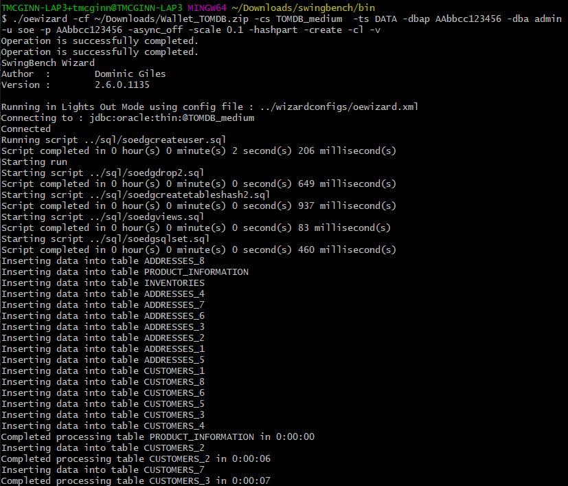

10. The script will take around 10-15 minutes to populate the Database. Verify the script complete successfully

     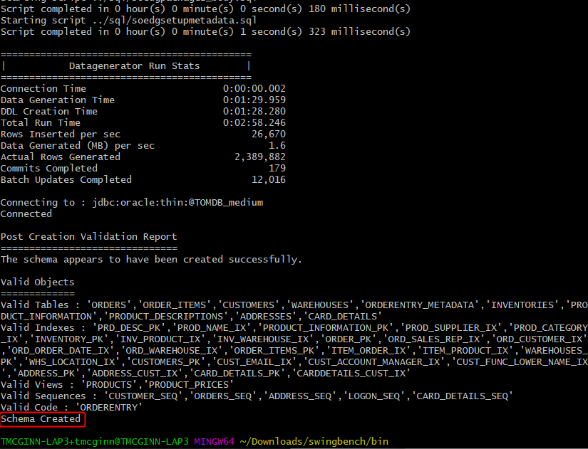

    *Note: If you are connected to your company's VPN, the script may fail. Disconnect from the VPN and try again.*

11. Validate the schema, Enter command:

    ```
    <copy>
    ./sbutil -soe -cf <CREDENTIAL_ZIP_FILE> -cs <DB_NAME>_medium -u soe -p <DB_PASSWORD> -tables
    </copy>
    ```
     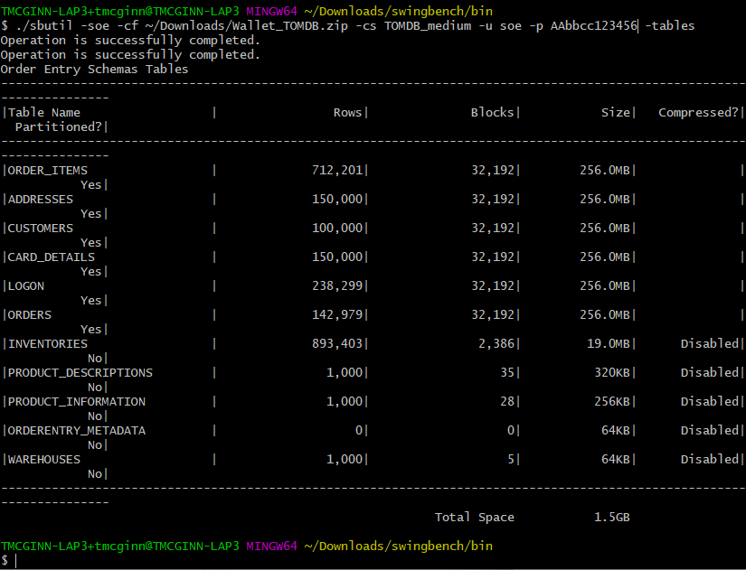

12. Next we will configure the load generator file. Enter command:

    ```
    <copy>
    cd ../configs
    </copy>
    ```

13. Enter command:

    ```
    <copy>
    vi SOE_Server_Side_V2.xml
    </copy>
    ```
    (You can also use nano as the editor)

14. Search for string **LogonGroupCount** and change the existing number to **4**. On the next line with string **LogonDelay** change the number to **300**. Finally on line with string **WaitTillAllLogon** change the flag to **false** (case sensitive). Save and exit the editor. See below example

     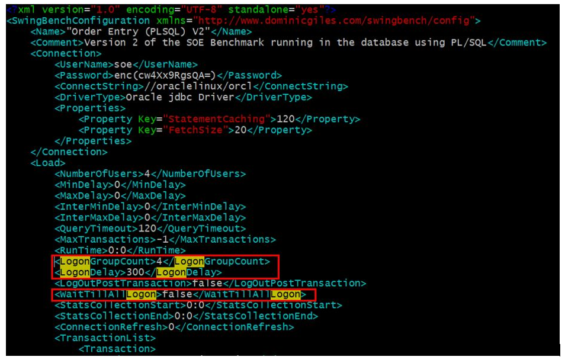

15. Now we will generate some load. Enter command:

    ```
    <copy>
    cd ../bin
    </copy>
    ```
    Then Enter command:
    ```
    <copy>
    ./charbench -c ../configs/SOE_Server_Side_V2.xml -cf <CREDENTIAL_ZIP_FILE>  -cs <DB_NAME>_medium -u soe -p <DB_PASSWORD> -v users,tpm,tps,vresp -intermin 0 -intermax 0 -min 0 -max 0 -uc 128 -di SQ,WQ,WA -rt 0:30.30
    </copy>
    ```

19. After a few seconds the number in 4th column (TPS)indicating Transactions Per Seconds will stabilize in 2xx range. Remember the current ATP DB instance has only 1 OCPU.

     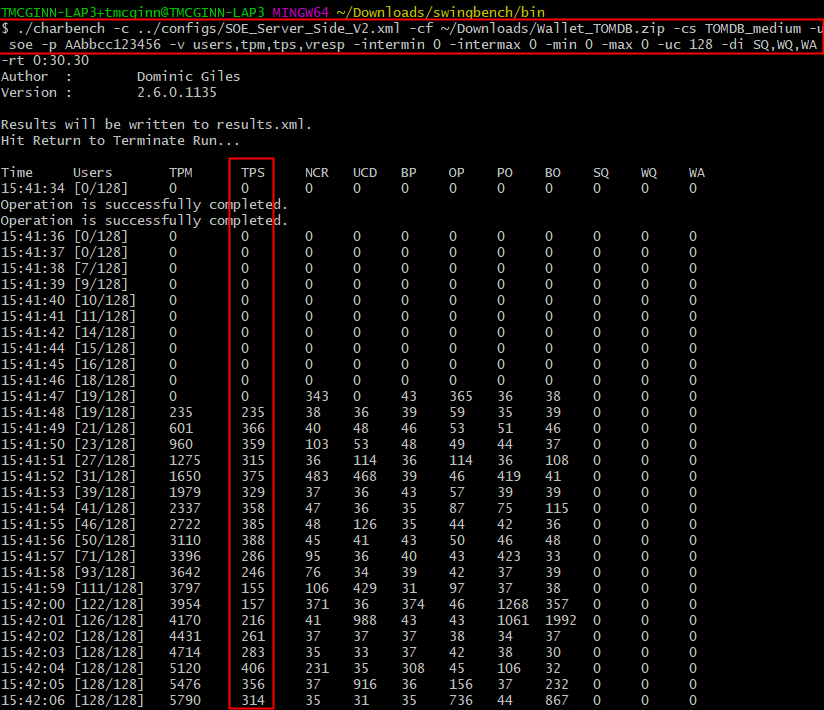

*We have Autonomous Transaction Processing DB instance configured and are testing Transaction per second data using a compute instance. Next we will dynamically scale the OCPU count via OCI console and observe the Transaction Per Second number. We will also see that Dynamic CPU scaling has no impact on the operation of Autonomous Transaction Processing Instance.*

## Task 3: Dynamically Scale CPU on ATP instance and verify results

In this section we will utilize the dynamic CPU scaling feature of Autonomous Transaction Processing instance and verify Transaction Per second number.

1. Switch to OCI Console, From OCI Services Menu Click **Autonomous Transaction Processing** under Database.

2. Click the name of Autonomous Transaction Processing instance created earlier

3. Click **Scale Up/Down**, in the pop up window change OCPU to **2** and Click **Update**. Also observe the Automatic backup that are being performed. Instance will be in 'Scaling in Progress' state for some time.

     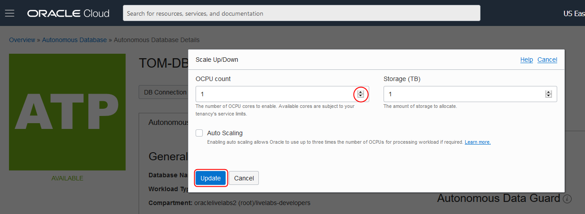

     

4. Switch to ssh session to the compute instance. Ensure the script is still running and Transaction per second data is being displayed. As the instance becomes Available the Transactions Per Second number will be higher.

     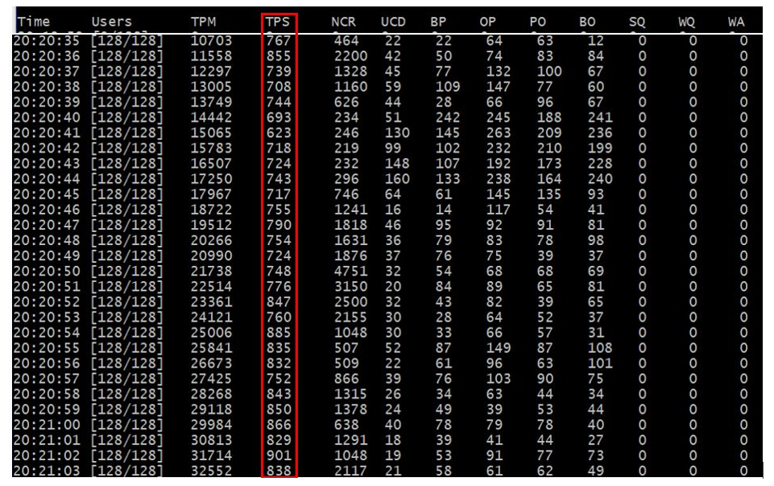

5. You can Scale the number of OCPU Up or Down dynamically and observe TPS number change accordingly.

6. Switch to OCI screen and from your ATP instance details page Click **Service Console**. From Service Console you can observe Performance data under **Overview** and **Activity** tabs.
     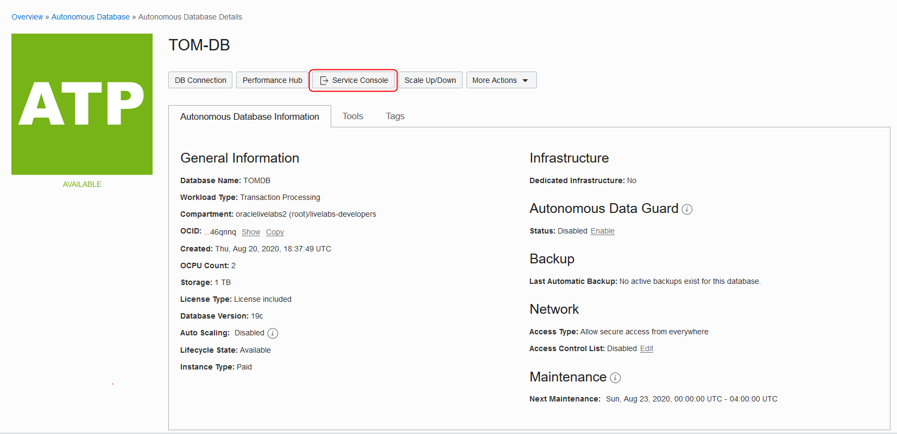

     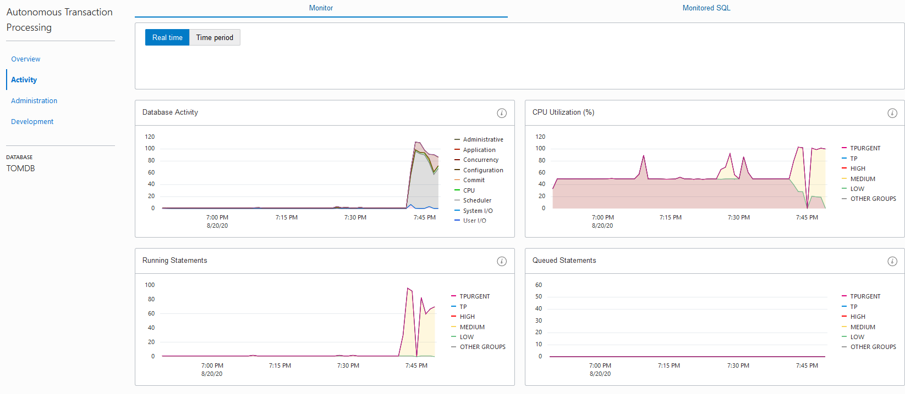

*We have now demonstrated the Dynamic Scaling of CPU for an ATP instance. We also successfully generated load traffic and observed CPU usage and other indicators for the ATP instance.*

## Task 4: Delete the resources
*NOTE: As a practice user will need to figure out any errors encountered during deletion of resources.*

1. Switch to  OCI console window.

2. From your ATP details page, Hover over the action icon  and Click **Terminate**. In the confirmation window provide the ATP instance name and Click **Terminate Database**

     
     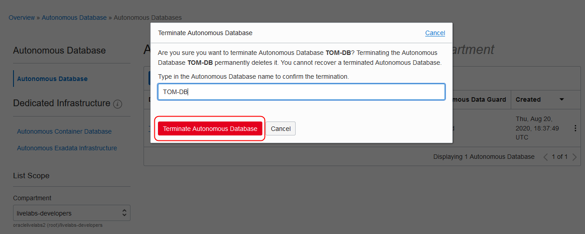

     *Congratulations! You have successfully completed the lab.*

## Acknowledgements

- **Author** - Flavio Pereira, Larry Beausoleil
- **Adapted by** -  Yaisah Granillo, Cloud Solution Engineer
- **Last Updated By/Date** - Madhusudhan Rao, Apr 2022

