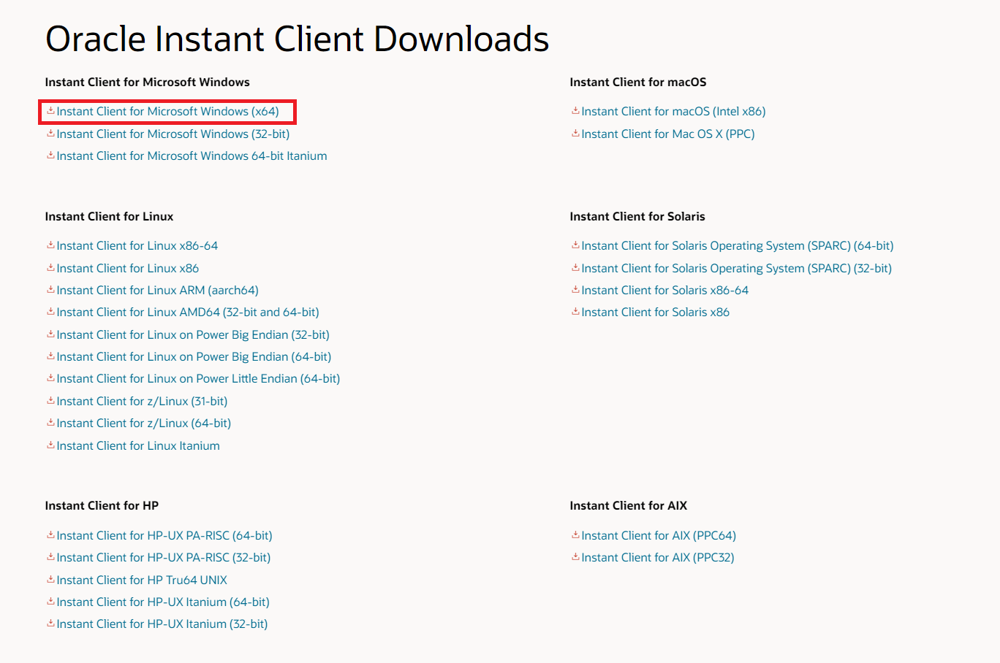
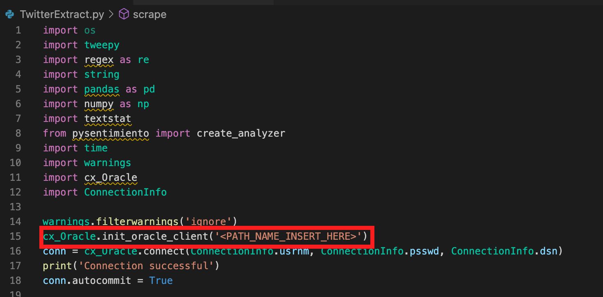

# API Collection

## Introduction

In this lab, we will use Visual Studio Code (VSCode) IDE to initiate a connection to the database and Twitter API using cx_Oracle and the Python library, Tweepy.  

Download the Python lab files: [Link](https://objectstorage.us-ashburn-1.oraclecloud.com/p/WvD2F0Cb533ApmtHNBXotz9VRD2BhwP7wR_qrGGhTs1Md6dtur3xrHew9UawNXSG/n/orasenatdpltsecitom03/b/Twitter_LL/o/Twitter_LL2.zip)

Estimated Time: 40 minutes


### Objectives

In this lab, you will complete the following tasks:

- Install cx_Oracle
- Review Twitter API
- Run the Extract

### Prerequisites

This lab assumes you have:
- An Oracle Always Free/Free Tier, Paid or LiveLabs Cloud Account
- An IDE of your choosing (VSCode)
- Installed Python 3.9 (Newest version will not work as of writing)

## Task 1: Install cx_Oracle

1. Visit this site to download instant client:
    - [Oracle Instant Client Downloads](https://www.oracle.com/database/technologies/instant-client/downloads.html)

    Select the OS version that matches your computer. In this example, I am selecting the Windows x64 version.

    

    On the next page, select the **basic package.**

    

2. Extract the zip file to a location that best works for yourself. In this example, I extracted to root (C:\) and made a folder **instant_client** to extract the zip into.

    

3. Make note of the path (C:\instant_client\instantclient_21_6), as you will place this in environment variables.
    - For windows, search **Environment Variables** and edit the **Path** variable to paste the path.

    

    - For macOS, you will need to use a CLI. For oldermacOS versions (before Catalina), use **bash** shell. For macOS Catalina and later, use **zsh** (z shell).
      - For bash: 
            
            ```
            <copy>nano ~/.bash_profile</copy>
            ```  

      - For zsh:
            ```
            To set the value of an environment variable, use the appropriate shell command to associate a variable name with a value. For example, to set the variable PATH to the value /bin:/sbin:/user/bin:/user/sbin:/system/Library/, you would enter the following command in a Terminal window:
            <copy>PATH=/bin:/sbin:/user/bin:/user/sbin:/system/Library/ export PATH</copy>
            **Note the correct path for your extracted instant client for this step**
            ```

4. Download the Python lab files: [Link](https://objectstorage.us-ashburn-1.oraclecloud.com/p/WvD2F0Cb533ApmtHNBXotz9VRD2BhwP7wR_qrGGhTs1Md6dtur3xrHew9UawNXSG/n/orasenatdpltsecitom03/b/Twitter_LL/o/Twitter_LL2.zip) .

    -Extract and open the folder in VSCode.  

5. Open the ConnectionInfo.py file to paste the path for the Instant Client.

    - Paste the path for **TNS_ADMIN** appending the following endpoint: **\network\admin** .
    - Paste the path (C:\instant_client\instantclient_21_6) for the **LD_LIBRARY_PATH** . 

    

6. Edit the **# Username** section of the ConnectionInfo.py file:
   
    - usernm: **admin**
    - psswd: **Provided when creating the ATP**
    - dsn: **See next step**

7. Open OCI and navigate to the ATP that was created earlier. Select **DB Connection** to access connection strings.

    

8. Download the wallet and copy the first TNS Name in the popup window and paste in the **dsn**. Save the **ConnectionInfo.py** file.

    

9. Extract the wallet file to the **Instant Client** directory with the endpoint **/network/admin**.

    

## Task 2: Review Twitter API

1. Open the **TwitterExtract.py** file and make note of the following variables (**APIkey** & **APIsecret**). We will fill this out in the following steps.

2. Open the browser and access the following [Link](https://developer.twitter.com/en/docs/twitter-api) to open the Twitter API documentation.

3. Select **Sign Up** if you do not have previous access to Twitter API.

4. After completing the information to sign up (if you haven't done so already), you can create an app by selecting **Create app**.

    

5. Name the app and select **Next** at the bottom. 

    

6. Notice the generated **API Key** and **Secret**. Copy these variables and paste in the **TwitterExtract.py** file.

## Task 3: Run the Extract

1. Using VSCode terminal, we are ready to run the code. **Make sure you have installed all of the python libraries** or else you will run into errors. Use **pip install "module name"**. Be sure to install to the correct version of Python (if 3.9 is not default). In order to install to a specific version of python, find the path to 3.9 and declare that prior to using pip install.

    

    - if you have 3.10 version of python installed, be sure to install 3.9 now. Use this [link](https://www.python.org/downloads/release/python-390/) to install (Select the version that matches your computer).
    - If you have both, that is no problem for VSCode as you can change the Python Interpreter. Use **CMD+Shift+P** to type **Python: Select Interpreter**

    

    - Select the 3.9 Version of Python to run the code correctly.

    

2. Select the **Play button** in the top right to run the code in terminal from VSCode.

    

3. If you run into errors, Check the following:

    - TNS error: Wallet/ instant client path or dns value does not match the correctly - repeat previous section.

    

    -Also, be sure your **Schema name** matches the code for the INSERT statements.

    

    -If you receive an error, **Cannot locate a 64-bit Oracle Client library,** then you will need to add the following to the TwitterExtract.py file:

    ```
    <copy>cx_Oracle.init_oracle_client('<PATH_NAME_INSERT_HERE>')</copy>
    ```

    

    You will need to declare the path in which you installed the python library.

4.  Notice the following:
    - **Model insert success**
    - **Successful user insert**
    - **Successful tweet insert**

    

5.  Let this script run for at least 20 minutes for approximately 100 inserts (longer is better). Press **CTRL+C** in the terminal to end the script.

## Learn more
- [cx_Oracle installation](https://cx-oracle.readthedocs.io/en/latest/user_guide/installation.html)
- [Twitter API documentation](https://developer.twitter.com/en/docs/twitter-api)
- [Use environment variables in Terminal on Mac](https://support.apple.com/guide/terminal/use-environment-variables-apd382cc5fa-4f58-4449-b20a-41c53c006f8f/mac)

## Acknowledgements

- **Author**- Nicholas Cusato, Santa Monica Specialists Hub
- **Contributers**- Rodrigo Mendoza, Ethan Shmargad, Thea Lazarova
- **Last Updated By/Date** - Nicholas Cusato, September 2022