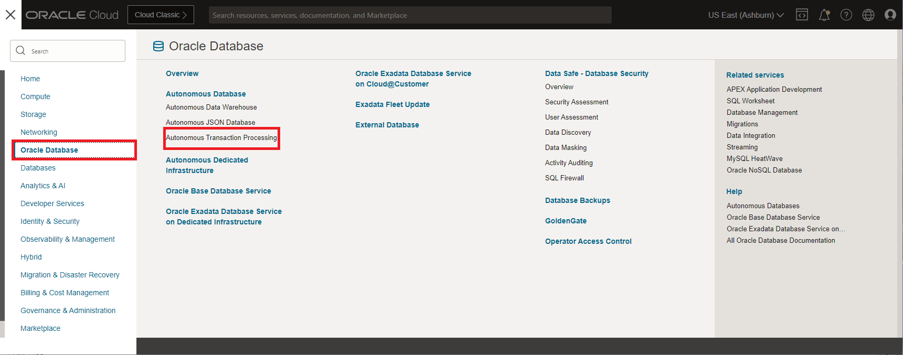
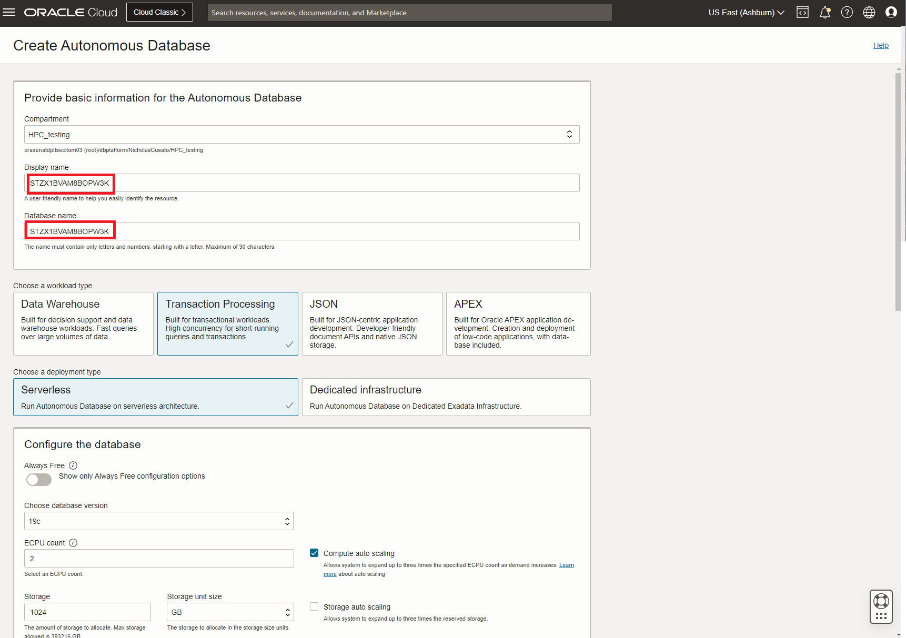
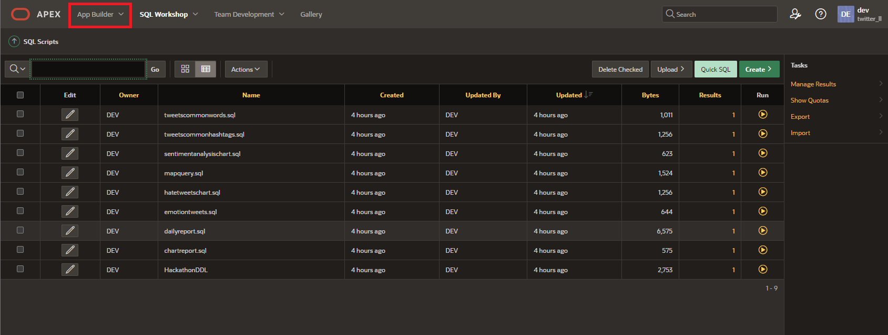

# Create Schema

## Introduction

In this lab, we will create a ATP to import a schema for the data. We will review the process for creating the Autonomous Transaction Processing (ATP) instance, Schema for the APEX workspace, and import the APEX app, along with the DDL.

Download the SQL files for the lab: [Link](https://objectstorage.us-ashburn-1.oraclecloud.com/p/c05qc1I_EZ-pvXve6Fzla7LTbmdprMenxIMEolBMyxYPCZVLoa1Ir_u9wvaChkKF/n/orasenatdpltsecitom03/b/Twitter_LL/o/Lab%20FilesTwitter_LL1.zip)

Estimated Time: 20 minutes

### Objectives

In this lab, you will complete the following tasks:

- Create ATP instance
- Create Schema
- Import DDL and SQL commands
- Import APEX APP

### Prerequisites

This lab assumes you have:
- An Oracle Always Free/Free Tier, Paid or LiveLabs Cloud Account

## Task 1: Create ATP instance

1. With OCI open, we will navigate to the ATP portal by selecting the hamburger menu in the top left corner, which will allow for you to select **Oracle Database** and then, **Autonomous Transaction Processing.**

     

1. Select **Create Autonomous Database.**

     

3. (optional) Enter a display name and database name.  

     

4. Create a password for admin credentials.

     

5. Change network access to **allowed IPs and VCNs only** and change IP notation type to **CIDR Block.** 

     

6. Select **License included** and then select **Create Autonomous Database** at the bottom.

         

## Task 2: Create Schema

1. After ATP has been created, the status will update the color to green. Select **Tools** at the menu bar, then select **Open APEX**.

     

2. Enter the password you used to create the ATP.

     

3. Select **Create Workspace**

     

4. Select **New Schema.**

     

5. Enter a workspace name (Schema), username, and password.
   
    ```
    Workspace Name: TWITTER_LL
    Workspace Username: dev
    Password: <password>
    ```

      

6. Sign out by clicking the **admin icon** in the top right, which will open a menu to sign out. Click **Sign out.**   

    

7. Select **Return to Sign In Page.**

    

8. Enter the information that was used to make the workspace from step 6 and click **Sign in.**

    

## Task 3: Import DDL and SQL commands

1.  Select **SQL Workshop** from the menu options.

      

2. Select **SQL Scripts** to upload sql files provided.

      

3. Select **Upload** to browse and upload the sql files.

    - Download the lab files if you haven't already: [Link](https://objectstorage.us-ashburn-1.oraclecloud.com/p/c05qc1I_EZ-pvXve6Fzla7LTbmdprMenxIMEolBMyxYPCZVLoa1Ir_u9wvaChkKF/n/orasenatdpltsecitom03/b/Twitter_LL/o/Lab%20FilesTwitter_LL1.zip)

      

4. Starting with the **HackathonDDL** file, select the **play button (Run)** to run the individual sql files.

      

5. Observe that the statements were successfully processed. Click the back arrow to return to the SQL Scripts homepage and run each individual script like before.

      

6. After a successful completion of each sql script, select **App Builder** from the top menu options. 

      

## Task 3: Import APEX APP

1. Select **Import App** to begin uploading the APEX app.

     

2. Select the **Drag and Drop** button to upload the file **apexApplicationHackathon.sql,** and then select the **Next** button.

     

3. Confirm the import on the next page by selecting **Next** at the bottom.

     
              
4. Install the app by selecting **Install Application** at the bottom of the page.

     

5. Select **Run Application** at the bottom to view the app homepage.

     

## Acknowledgements

- **Author**- Nicholas Cusato, Santa Monica Specialists Hub, August 22, 2022
- **Contributers**- Rodrigo Mendoza, Ethan Shmargad, Thea Lazarova
- **Last Updated By/Date** - Nicholas Cusato, August 22, 2022