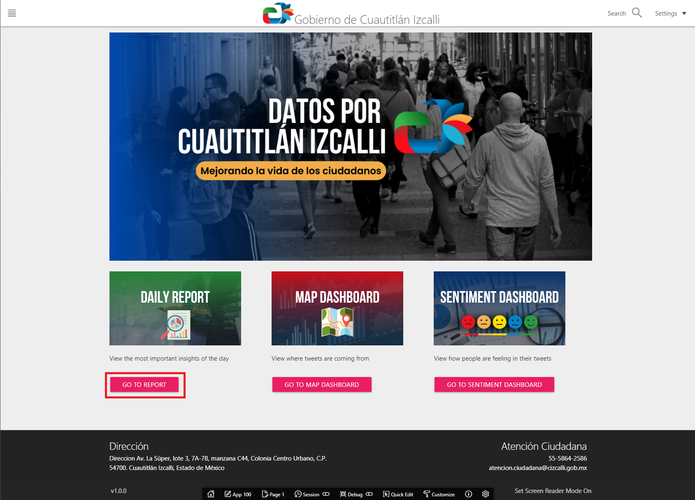
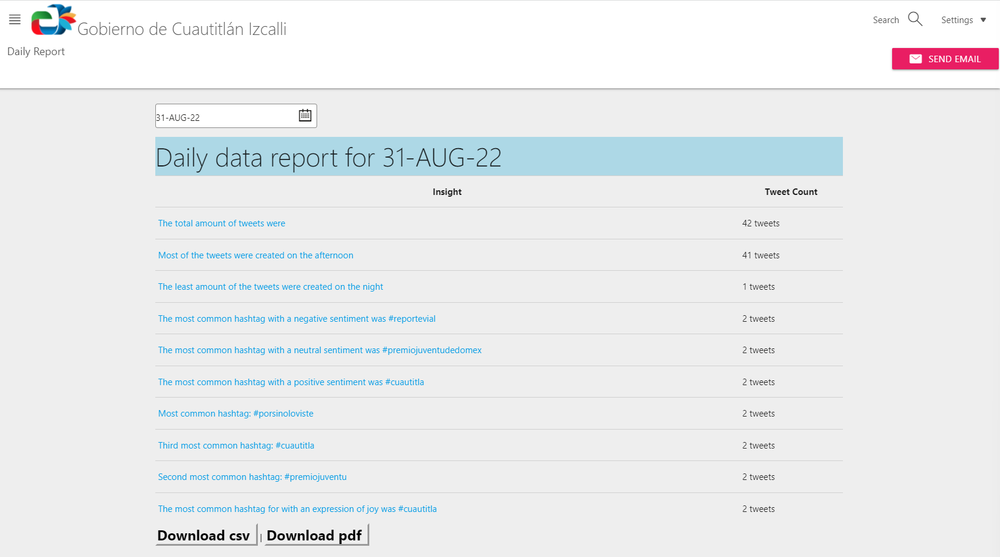
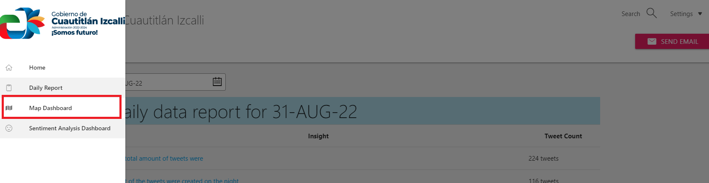
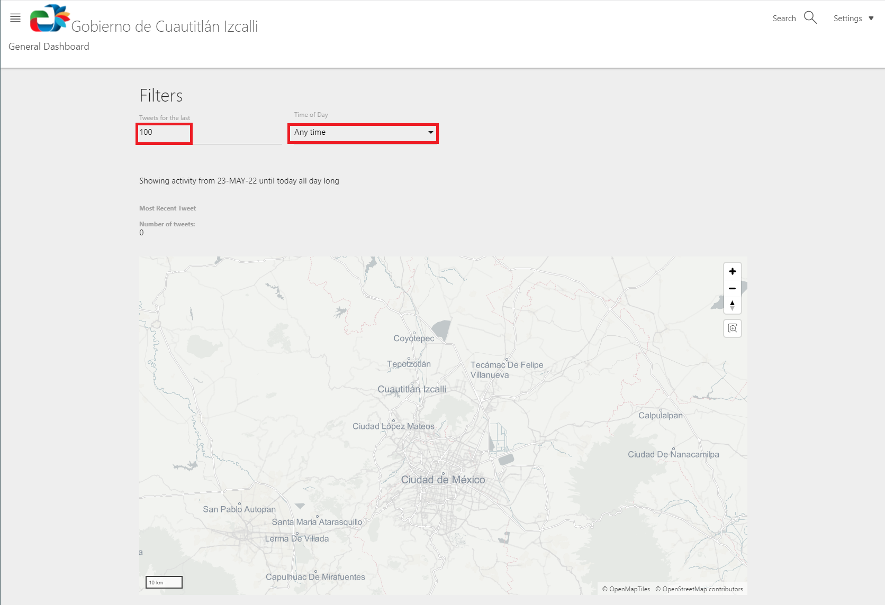
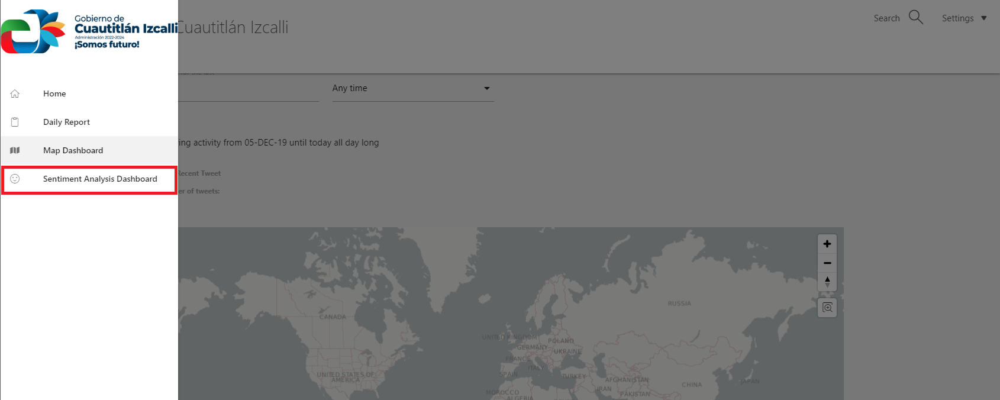
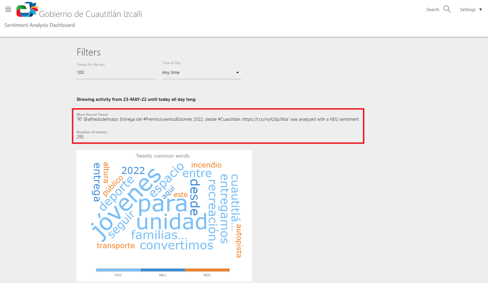
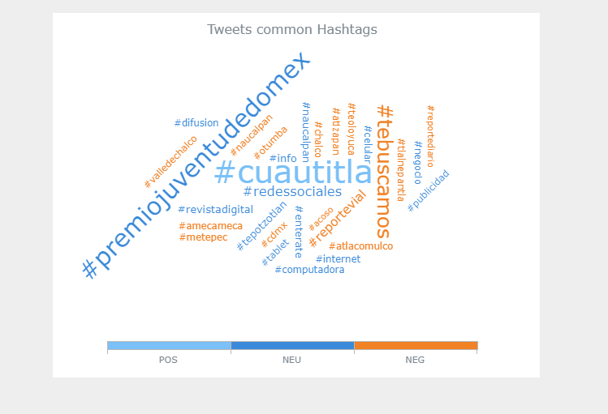

# Explore APEX

## Introduction

In this lab, we will explore the APEX app installed from the previous lab.   
Estimated Time: 15 minutes

### Objectives

In this lab, you will complete the following tasks:

- Review Daily Report
- Review Map Dashboard
- Review Sentiment Dashboard
- Explore additional considerations

### Prerequisites

This lab assumes you have:
- An Oracle Always Free/Free Tier, Paid or LiveLabs Cloud Account

## Task 1: Review Daily Report

1. Log back in to the APEX app (if timed out). This should bring you to the homepage.

   - This provides quick links to access the Daily Report, Map Dashboard, and Sentiment Dashboard.
   - You can also access these from the hamburger menu in the top left of the page.

     

2. Select the **Daily Report** option.

3. Notice the daily report is already adjusted for today's date. 

     

4. Notice the total number of tweets. This Tweet Count will increase depending on how long the script was run for. 

5. Notice the other categories:
    - Time of day most and least tweets were made
    - Most common hashtag with negative, neutral, and positive sentiment and overall (first, second, and third)
    - Most common hashtag for the expression of joy

6. Notice you can download this report as a csv or pdf.

7. Notice the option to send an email; however, this is not enabled as it requires additional configuration. See [Link](https://docs.oracle.com/en/cloud/paas/autonomous-database/adbsa/apex-send-email.html) for more details.

## Task 2: Review Map Dashboard

1. Select the **hamburger menu** to click the link to the map dashboard.
   
     

1. Notice the map of Mexico City doesn't have any generated points of interest. This is because geographic metadata is less common for tweets; therefore, you will have to run the script a longer time to see results.

     

3. Notice you can adjust the number of tweets and the time of day. The number of tweets will adjust based on the amount accumulated within that time range. 

## Task 3: Review Sentiment Dashboard

1. Select the hamburger menu to click the link for the **Sentiment Analysis Dashboard.**

     

2. Notice the activity that is generated from the amount of tweets stored in the ATP.

     

3. Notice the word map that is color coded with positive, neutral, and negative sentiment. The larger the word means more common.  The second word map is generated for hashtags.

     

Thank you for completing this lab.

## Acknowledgements

- **Author**- Nicholas Cusato, Santa Monica Specialists Hub
- **Contributers**- Rodrigo Mendoza, Ethan Shmargad, Thea Lazarova
- **Last Updated By/Date** - Nicholas Cusato, September 2022